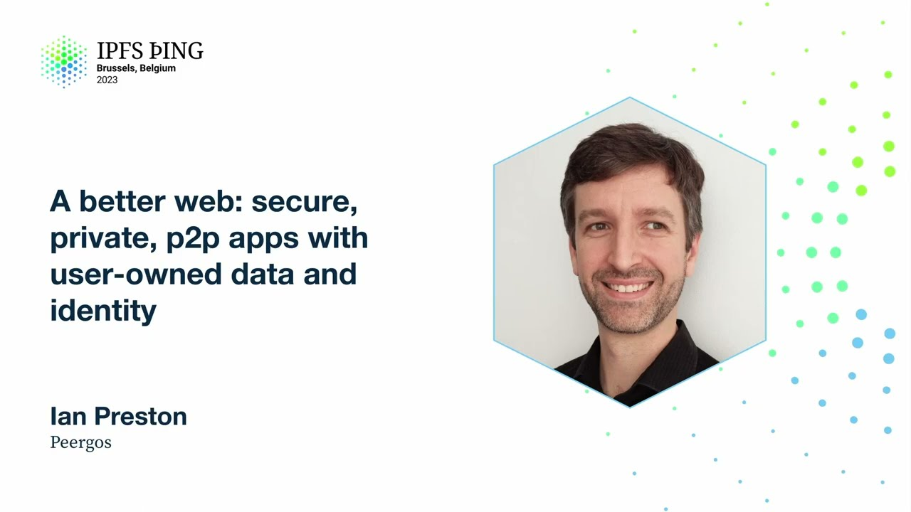

# A better web: secure, private, p2p apps with user-owned data and identity - Ian Preston

<https://youtube.com/watch?v=mSElk2jcFqY>

## Content

Hello, I'm Ian Preston from Pegos. I'm going to tell you about what a better web could be.

But first, what's wrong with the web today? So, in short, it's kind of become a bit of

a surveillance dystopia to our feudal overlords. It's basically every website you visit has

first-party surveillance, third-party surveillance. You don't own the data you create, and if
you have any kind of logins, then you don't own your identity either. But let's have a

look at what happens when you visit a website these days. So there's a lot of stuff that goes on. So the first thing is your browser will do a DNS lookup to find the IP address to connect to. Then you'll make a TLS connection to this IP address, which involves trusting

about 140 certificate authorities in your browser. Any one of those could man-in-the-middle
the connection if they wanted to. You don't have any direct relationship with any of these
CAs, typically, and most of the time the web host doesn't either. So now you've got your

TLS connection to the browser. You then load some arbitrary code. Now it's arbitrary. It
could be different for different people. It could be different on different devices or two seconds later. It's arbitrary code. And then you run it. So then this code will probably

load some third-party code. So then you're now talking to a bunch of other servers. So they know what website you've just visited and where you are, your IP address and all kinds of stuff. And then maybe it's not just a blog you're reading. Maybe it's a site you're
using to do stuff. And so then you would log in. So you put in whatever it is, your username and password, or you log in with some other, again, a third-party identity provider. And
then you start doing stuff. I'm going to make some posts or create some documents or whatever.
And so you're sending your personal data to the server. So they then own that data. And then if the site has any kind of social aspect, then there might be a social feed. And this

will be curated according to the algorithms that they choose to run, which is to protect

their incentives. So they want to maximize their revenue, which means maximizing your
attention. And so you end up with manipulation by AI-curated feeds. And the end result of

this is subverted democracy, compromised consensus. Society can't agree on what is an objective

truth. It's not a great state. So could a better design fix these problems, or at least

help? So I'm obviously here because I think the answer is yes. But what are the requirements?

So following on from the previous talk, these basically amount to user agency. So I don't

need to tell anyone here about the benefits of content address data. It should also be signed, content address data, because people don't normally remember hashes. And then probably
for the same reason, you need a mapping from something human memorable to a public key.

Because again, people don't remember public keys either. Now, the web is actually okay
at sandboxing stuff, because after all, it is a platform for running untrusted code.

But the sandboxes aren't really designed to protect you from the server you're talking
to. They're mainly designed to protect the rest of your machine. What else would be cool

in terms of user agency would be if we could grant permissions to these web apps to do
stuff that we want them to do. And in terms of any data that we create, that should be

stored in something that we own and control. And to ensure that we own and control it, it should be end-to-end encrypted. Ideally, you'd be able to take your data between apps
and somehow all of this should work in existing browsers. So this is where Pyrgos comes in.

So Pyrgos is a global private file system. It has signed content address data, human

readable paths, and it works in existing browsers. But we didn't have a safe way to run apps

or HTML5 apps or a permission system for them. So we built an application sandbox. Basically,

it allows you to run untrusted code over private data such that the app can't steal your data

and the app can't read anything it's not granted access to. And the app itself has a simple

REST API, but there isn't a server. We'll get to that. So this is how the sandbox is

designed. So you log into Pyrgos on the main domain, in this case, pyrgos.net. It also

works on localhost. All of this works on localhost. So you don't actually have to rely on DNS
if you don't want to. Then you tell Pyrgos, I want to open this app. And an app, as I

mentioned, is just a folder of HTML5, which is stored into and encrypted itself in Pyrgos.

And we load that on a hash domain, which we sandbox in such a way. So there's a different

sandbox for every page. The hash is basically the path, which is unique because it's a file

file. And what the server actually does for all these subdomains, it serves up exactly

the same static content. And what that all that does, that small static content, is set

up a service worker, which then communicates with the main Pyrgos tab via post messages.

And then in the main Pyrgos tab, there's the thing that is basically the trusted code, which enforces the app permissions. And then once the service worker has that post messaging

system working, it then loads a sub iframe for itself, which is where the app gets to

render itself. And the CSP firewall around the app is, as I mentioned, is designed to

prevent exfiltrating data. So you have to worry about things like DNS prefetch and any
other mechanism that could be used to talk to the external world.

So we have a browser app, which is kind of a special app that it doesn't just have one
fixed domain that it runs on. It has another parameter which goes into the hash so it can
isolate different things that it's trying to render. So then you can just open any folder
in Pyrgos as a HTML site. You can have internal links, which are relative links, or you can

have external links to anything in the global Pyrgos file system. It works in secret links

and markdown pages work. They're rendered natively as well. I'll have a demo of this
later. But more generally, what is a custom app in this context? So I've said it's a folder

of HTML5 assets. An app, you can install it. It can be upgraded. Installing it basically

just means copying that folder into your Pyrgos space. And by default, an app can read its

own assets. So that's the minimum it can do with no permissions. And that might be enough
for some things. If it's like a single player game or something like that, that could be
enough. Or it can request more permissions from the user. An app could, say, be an editor

for some kind of file. So it can register for viewing or editing certain file types
or MIME types. So we've got some examples of apps that we've written which can do things.

Most of these are pre-existing web apps. We've just done a minor modification to work in Pyrgos. So we haven't actually written these from scratch. So the first one is a word processor. So a viewer for Microsoft documents. Spreadsheets, viewing and editing. An image editor. What

you see is what you get. Markdown editor. TiddlyWiki notebooks. Or more advanced things

for apps. You could have a media player. That's more. So it needs access to more than one file in theory. Multiplayer games. Chat. How do you do chat? We'll get to that. So the

app structure I mentioned has a folder of assets. There's a JSON file in the root, which

is the manifest. So that has a bunch of stuff we'll see in a second. And one of the permissions

is to store app data. And what that lets the app do is to read and write to an app-specific

private folder, but in your space. So that could be settings or save games or whatever.

So this is what an app manifest looks like. Roughly what you'd expect. Things like name,
description, version, author. Launchable is just whether or not you can run it on its
own without opening a file per se or folder. Icons. So I mentioned file extensions, file

types. There's also MIME types. And then just a list of permissions. And we support wildcards
as well in the file types and extensions. So at the moment there's only four permissions,

but the idea is to add more when we see good use cases. So I've talked about store app
data. There's edit chosen files. So when an app says I can edit, I can open whatever,

image files, then this allows you that the app, when you open a file with a particular
app, that it can then overwrite that file. There's read folder for apps that can view

folders. So like a gallery app or something like that. And then the first three are all kind of single player permissions. The last one starts to get interesting, which is exchange

messages with friends. Seems a bit left field. So we have a protocol in Pyrgos, which is

a very simple chat protocol. It's peer to peer. It's eventually consistent and end to

end encrypted. And all this does is allow an app to send messages to people you're already

friends with who have the same app installed or who you want to install that app. And so

you can imagine asynchronous things like multiplayer games like chess or whatever, something like

that. It's not really real time yet. One day we'd love to have a permission which is real
time stream to my friends over a libp2p stream. And then you could do things like network

doom. There are a couple of parameters which apps get. If you're opening a file or a directory,

you get the path and whether or not it's writable. And just the theme, whether it's a dark theme
or not, which can be useful. So this REST API, basically the REST API is in that service

worker. So the service worker in the OS process 2, that's the thing that intercepts the API

requests from the app and then translates them to post messages which are sent to the main tab and then handled there. The other thing I forgot to mention here is the subdomain

is run in a separate operating system level process to guard against side channel attacks.

So the REST API. So anything under the data path, if you have that permission, that's

the app specific folder which you can read and write to. An app without any permissions

can ask you to save a file to your space. So it's a bit like a browser asking you to save a file except it ends up in your peer-got space. That doesn't need a permission because the user has to choose a file name and a place for it. And that's just, yeah, you just post to save. You can post a HTML form and store the results in a file. And then there's the

chat API. In terms of the files, so you can just basically get a path to get a file. You

can do, because Pagos has native thumbnails for files that we can do a thumbnail for,

you can add a preview equals true query to get a thumbnail. And yeah, post will create

a file, put will update a file, delete will delete a file, and patch will append. So it's

all just standard classic REST stuff. The chat API is quite simple. You can basically

list the chats that this app has created. So you can't see, obviously, chats created by other apps. You can create a chat. You can get the messages by index. A chat is basically

your view of it is an append only log of messages. So everything has an index. And you can obviously

send messages. Right. I'm going to try some demos. Right. So let's just see. Where are

we? So there's, let's see, there's a PDF viewer. So viewing this PDF is totally sandboxed from

the rest of the process. You can view spreadsheets. So here's an Excel spreadsheet. We can view

it. Oh, sorry. That's the hex view. Less useful. We need to disable that. Yeah. Edit that in

lucky sheet. So there we go. So we can't edit Microsoft Office directly. We have to save

it to a more open format. Thanks, Microsoft. Which is a sheet file here. So you can edit

those. There's a document viewer. It's in Microsoft Office. So here's a document. Again,

totally sandboxed. So that's probably actually a good, probably one of the safest ways to

view Word docs if you're worried about macros and all that nonsense. Let's see. We have

a Winamp app or clone. See if the sound works. And so the other cool thing with apps is they're,

I mean, they're just folders in PairGlass basically. So apps don't have to be public. So you can have a private app that only you know about, or you can share it with your friends and so on. So it's kind of an additional permissioning system to the web. Let's see

what else we got. There's a text editor. With syntax highlighting. These are all still single

player stuff. So the website viewer, I mentioned that. So this is just a folder with some HTML.

I'm going to view it. There it is rendered as a webpage. I can open that in the text

editor, the other app, and add something. And then reopen it. There it is. Hey-ya. And

the thing I mentioned about browsing Markdown natively. So here's a folder with some Markdown.

So index.md. Let's view that. So that's rendered the Markdown. It's got links to other files,

which again, just files in PairGlass. So what is that? That's a to-do thing. This is a presentation.

So that's a PDF file. So you can click on that link and it will open that in whatever app we have installed for it. The images are again, you can view them full size. This is

a sub-directories Markdown document with some stuff. Go back. If I want to edit it, I can

just edit it here in place. And then just close it. And there we are. Five. So that's

the Markdown browser. In terms of apps themselves, this is the source code, shall we say, of

some of the apps. Here's another one, actually. Let's show this one. Let's go in here. So

if you want to run an app in place, this is Doom. So we just go run app down here. This

is the manifest here. Let me show you the manifest first. So yeah, this is very simple.

Some metadata, display names, and the only important one here is the fact that it's launchable.

So this is running Doom in an emulator, which one of our team members wrote.

This is the shareware version, so there's no copyright issues here. The cheat still works, so that's cool.

And it's totally playable, as you can see. Anyway, that's enough of that.

And yeah, okay, what else is there? Let's go to the images. So there's a bunch of images here.

I'm going to try editing this one in PaintZ. Doesn't look like that got the image, not sure why.

I think PaintZ might... There we go, okay. So let's try something. Hi. Where's the save book in this app?

There it is. Coolio. So now if we open this in the Note Viewer, there it is. Hi.

Yeah, I'm definitely an artist. One of the other things I guess I didn't show in the Web Viewer is videos.

You can play videos just like in any other website. One of the cool things I'll talk more about in a talk later today

is fast seeking within large files. So this allows you to do seeking within videos.

So this is not a huge video, it's 120 meg, but it's big enough. And so we can skip ahead and seek forward relatively quickly.

And you can go backwards as well. And the seeking there is O of 1 in IO, in round trips to the server,

independent of the file size. Which is interesting. Right. What haven't I done? So I guess we saw...

So if you want to create an app, it's super easy. Just go down here, go New App, pick a name, choose the permissions you want.

Okidoki. And it will create a little template app for you. What do I call it? Fred. Where's Fred gone?

What's going on there? There we go. So Fred's there. So we've got our manifest, which...

What did I ask for? I asked for store app data, so that's there. Some other defaults.

And basically an assets folder with an index HTML. I'm not sure what's actually in this HTML. Let's run it and see.

Fred. Ok. Cool. Makes sense.

Another app we have is a calendar. So this is one of the more useful ones, potentially.

So the model here is you can have multiple calendars. Each calendar is a folder.
And events are standard iCal files within that folder. There's a little hierarchy for the date, but that's about it.

And so that gives you... You can use the native access control to share access to individual events.
So we've got an event here, which is the IPFS thing closing party.

And we can share that via a secret link with anyone.

And if I go to anyone, aka an incognito tab, and paste that...

So there we go. We've got a link we can share with anyone to view the event.
You can also share entire calendars. That just shares the folder that the calendar is in.

Cool. That's probably enough on the demo side. Let's go back to full screen. Yep.

So Safari. Unfortunately custom apps don't work. There are two... Well, two-ish reasons for this.

One is service workers and routable streams inside an iframe doesn't work in Safari.
It works in all other browsers. I don't think there's a good reason for that. I think they just haven't done it.

If you know a Safari developer, then please put us in touch.

The other one is local host subdomains don't work on Safari. I know PL is pushing on that independently, so that's cool.

But yeah, it's almost there. But it works in all the other browsers.
So yeah, get building. There's a book.peargos.org with an app section you can have a look at.

All those example apps I showed are in a repo here in Peargos example apps.
And I showed you, yeah, you can get started and create an app super easily.

Any questions? Come on, if it's hot. One minute. Bingo.
I have a question about building an app and keeping the code isolated if I were to try to sell an application inside of Peargos.

Is that possible today and be profitable but also secretive of my source?
Yeah, so you control the access to the app. There's no in-band charging or anything like that.
But if you have your own charging mechanism, you can give people access to it. And grant or remove permissions based on some other. Okay, cool. Once they've installed it, they've got a copy of it, but you can still get updates. Yeah, they have the source at that point, right? You can stop them getting updates after that. Okay, cool. Thanks.

