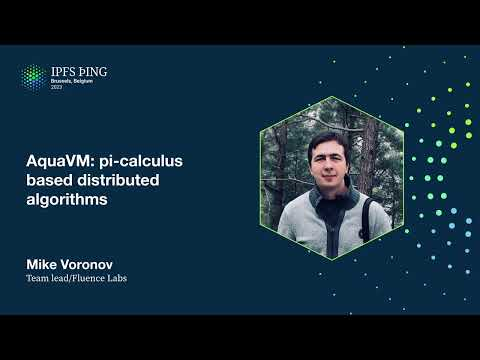

# AquaVM: pi-calculus based distributed algorithms - Mike Voronov

<https://youtube.com/watch?v=PxOFMriqyUQ>

## Content

Hi guys, nice to meet you here. So I'm Mike, I'm doing engineering for Fluence Labs. And

today I'm going to tell you about our way to approach complex project or complex problem of coordination web 3 computing workloads. In particular, the agenda is as follows. So
first of all, we will talk a bit about like the problem itself, about what's the difficulty
with algorithms and distributed networks. Then I will show you how we approach this problem with AquaVM. Then I will talk a bit about our implementation of our proposal for

AquaVM. And finally, I will show you, I will talk a bit about our new group devoted to

distributed choreography and composition. And like where we want to share our experience

on the problem and probably unite some forces to solve some difficult problems and tasks
in this area. So let's start with the algorithms and the like assumptions and questions. So

okay, let's say that we have like a way to run computation locally on a peer, like in
the form of function or service. And let's say that this is a function from some inputs
to arguments, some outputs. Here I denoted by CID, but it doesn't matter. It's just a
way how you can type arguments and outputs. Okay, let's say that we can solve this problem.

Yeah, for example, we can use WebAssembly, we can use Docker, whatever. But there is
a much more complex problem. Okay, let's say that we have now distributed environments
and we have a lot of such functions. How we can compose them? How we can build this F
system that is composition of different function located on different peers? And actually for

this particular question, particular problems, there are a lot of questions. Yeah, for example,

how to put this function where it should be? Like how to advertise services in this network?
How to discover them? And a lot of questions. And humanity now came up with three approaches

for the problem. The first one is centralized computing. Those Web2, like usual clouds,

like Google clouds, IBM clouds, and so on. A lot of Web2 clouds. On the other side, there

is an on-chain computing. Blockchains and all the stuff, all DOT technologies. But there

is also decentralized computing. Yeah, I'm sure that every one of you know what it is.

And what is the benefit of each approach there, so I won't cover all of them. But there is

a, okay, let's say that we stick with this approach with decentralized computing. And
there are actually a lot of models to express and orchestrate decentralized computing. But

actually, like almost all of them are expressed with the so-called fork-join pattern. In other

words, let's say that we can express this rhombus somehow with our language, runtime,

stack, whatever. Sorry. Whatever. And if we can do that, so actually we can express almost

all problem that we can map and distribute with algorithms. It's very, very essence of

a problem. But okay, if you have this observation, now how we can find a theory that we can use

as a theory behind our stack, like runtime or whatever. And there is a natural answer

to this question called PyCalculus. PyCalculus is a kind of... So there are actually a lot

of branches of PyCalculus, a lot of types. But what's the same is all different variety

is that it has this core, as I call it core. For example, this one is about calling functions.

In PyCalculus, it called like sending some values to some channel or to some name and
receive it back from this name or channel. But the most important in this task to express
fork-join pattern is the combinators. In PyCalculus, there are three combinators, sequential execution,

parallel execution, and like so-called execution with errors. It's a bit more complex topic,
but it's presentation not about that. But we can consider it as an execution with errors,

with catching errors. Also, there is a branch and there is a restriction. Restriction could be considered as a scoping in the usual programming languages. And of course, replication. Replication

makes this PyCalculus to incomplete. But okay, it's a theory, but what about practice? Okay,

let's say that we have a real problem. We want to call different set of oracles, get

prices for some symbol from this oracles, and then compute average of these prices.
Or for example, have a BFT consensus or whatever on a lot of values there. And then transmit

result back to our peer. How we should do that? So on the last part of the slide, you
could see six lines of code that solves this problem. It's written on our language called
Aqua. That's built on PyCalculus. So actually, under the scenes, PyCalculus and actually

there is a kind of more general calculus code, like some other type system that doesn't measure

what was the code. But from a practice, it's simple. If you provide a way to make it like

a six line of code, it's really useful. Okay, and now let's see how we actually approach

that. But first of all, let's talk a bit about how we think about these problems, how we

think about our research ideas, and how we approach complexity of development. For that,

we use idea of similarity. In most terms, it's a homomorphic mapping. Let's say that

we have this mapping where domain X is our Aqua VM, or our approach, and codomain is

Y, and Y is some different topics. And the homomorphic mapping idea is idea of this equation.

It's really simple one, and it's a practice in the common words. It's just idea of similarity between different areas. And what's about Y? So our approach based on different calculus,

namely PyCalculus, LambdaCalculus, and a bunch of other theories, as well as, for example,

like compiler theory. Okay, one way to consider Aqua VM is to consider it as a finite state

machine. This finite state machine takes two states, like so-called current state, the
previous state, and produces a new state and a list of peers where the state should be sent by some runtime. We don't care here about networking, about all the stuff, but we just

care only about algorithms there on this level. And this function is a pure function. It's

compiled to WebAssembly. It doesn't have any inputs. So because of that, it's really simple
to port it anywhere. For example, now we are working to run it on a FileCoin virtual machine
because we want to use FileCoin layer payments. And it's really simple. But it's not all.

To make this function really pure, we need to provide a way to extract call requests

from Aqua VM and pass call results for those call requests. Why does it need it? Because it provides a way to make this as a pure function. It allows asynchronous service execution in

peer. Let's say that we don't have this scheme, and we have an import function from Aqua VM.

Now it would require a lot of moving parts here. Because, for example, it could be made

synchronous, it would take a lot of time, and it wouldn't allow asynchronous service
calls and whatever. And also in this, the last process of the scheme, execution takes

a fixed time. There are only two ways how Aqua VM could be triggered. The first one

is when a new network packet came from a network here. And then Aqua VM should be run with
this current state. Current state is a new state obtained from network. And the second

case is a handle call result when it's ready, when some service provided the result, then

it should be passed into Aqua VM. Now let's consider Aqua VM instructions. There are 14

instructions. And one of the most powerful is the call instruction. Call instructions
allows you to call this peer function, a function located on a particular peer. These three

instructions came directly from PyCalculus, allows you to express this rhombus pattern,
frog-join pattern. We can, for example, do sequential execution, parallel execution,
execution in this case in years. And this combination of them, we can express almost
any distributed algorithm. And there are a bunch of other instructions. For example,

we have match and mismatch for branching. We have some iteration with fault and next

that could be considered as a fixed combinator in terms of calculus. We have instructions

that are inspired by category theory, like this instruction to apply some lambdas to
values, apply functors and all the stuff. And a bunch of instructions that are just

useful for code generation, like now that simply does nothing, yeah, never stops execution
of a particular branch and fail to throw an error. There is 14 instructions and the set

is a fool, it's a complete insolvency because PyCalculus is insolvency. Now let's consider

a simple example of frog-join pattern and how AquaVM executes this. Let's say that we
have this script, the simple script, yeah, and now we will pass through details, through

instruction by instruction. But first of all, I need to say something more about how AquaVM
works. So in AquaVM, there is no safe entry point. Every time the execution starts from

the very beginning, from the first instruction. And finally, when a new result is obtained,

this result contains linearized execution trace of each of these instructions that were

executed. Okay, let's say that we start the script on the peer with peer ID user, for
example. Now we can see on this part of the slide that we have that peer ID now is a user,

is important. And the first instruction here is a seek. And seek basically takes two instructions

and executes them one by one. It executes the second instruction, here is a seek, another

seek instruction. Only if the first instruction was executed successfully. The first instruction
is a par. So okay, we should go next, further to the par. And par differs from seek, that

is, it executes two instructions simultaneously. Here are the two instructions there to calls,

to provider one and provider two. So, but we started on a peer with peer ID user. So

we count, and AquaVM obtains here peer ID from this part here. So basically signature

of call with a peer ID, service name, function name, arguments, and where results should be bound. And AquaVM obtains it, so like, okay, it's provider one and provider two,

it's not user, not user peer ID. Then we should put in the next peers that's produced by AquaVM

as a result, just the providers, provider one and provider two, and a new state. And
this state, I won't cover that because I won't have much time for that, but in this state there would be like some values that represent that these calls were actually called, and

the result was sent to these peers with the signatures. Okay, and now it's how RamboSER

works. Now by some runtime, so some runtime that executes AquaVM obtains these next peers,

these two next peers, and should send this data to these two peers simultaneously. Or
whatever, AquaVM doesn't consider it, it's kind of on the next level of abstraction.
And then on each of these peers of provider one and provider two, the same code will be executed. So AquaVM starts with the very beginning, like with the C-Cue again, like pass through

this block, and this par treated as a completed when only one instruction is completed. And

okay, let's say that we run on the provider one, then this code will be completed. There
are some details, but I won't cover them. If you are interested in how exactly it will
be executed, please find me after my talk, or ask a question after that. So let's say

that on peer one, we like called successfully service prices and obtained result in the

price one variable. And then executes on this provider one, falls into this call instruction.

And this call instruction called service average, oh sorry, should call service average service

on the peer average. And this peer ID is not as we have, it's not provider one or provider
two. Then in the next peers, there will be average in a new state. And it's the same

for provider two. Okay, what now should be done on this average

peer? Average peer, like execute starts again from the very beginning, all this instruction
passed until we met this average, this call average service. And now we can see that in

arguments there are two variables, price one and price two. And for this variables, we
have so-called join behavior. And this call actually will be executed only if these, all

these two variables should be ready. All these two results will came to our peer, like somehow,

some moment of time. It doesn't matter for Aquavium because Aquavium doesn't consider about networks, about all this stuff. And finally, when all these results are ready
and they came to our service, to our average service, then the result will be produced
and then will pass to user back, to user peers that want to see this result. Okay, and that was a simple example of how Rombus pattern could be expressed with Aquavium

and how Aquavium executes this particular small script. Of course, doing the job manually

by hands, it's not possible. And for that, we have high-level language called Aqua that
allows you to compile to this intermediate presentation. And we call this as intermediate
presentation. And what about data types in Aqua, in Aquavium?

Actually we have three types of data types. First one is the scalars. They are fully consistent.
So like when you run one script on the same peers that the script like triggers, then

the scalars will be the same. On opposite side, there is a CRDT-like structures called
stream and map. They are CRDT-like. By CRDT-like, I mean that they're CRDT-like forces merge

function to be commutative. In our way, it's non-commutative. That's why I call it CRDT-like.

And so actually, yes, also regarding these properties, there's specified properties of

idempotence and some other monolithic properties. And there is a third value type that's called

canonicalized. So regarding the right side, so to this CRDT, now it's only possible to

write values. But if you want to read, you need to fix stream or map on a particular
peer. You need to kind of obtain the result, obtain a particular copy that you want to
read from. And with this value type, it's possible to do this kind of instruction. But

why is it a different value type? Because it has mixed algebra between scalars and streams.

If you want more details, please ask me questions, because it's so much for one talk.

OK, now let's see three slides about how we implemented AQVM in our stack. So on Fluence

Labs, we have a network, and every network consists of peer. And peer actually is a layer structure that started with a leap P2P, is a networking layer. And the next layer is

with a peer core. Peer core actually is a manager of queues. Actually, there are more than three queues in a peer, but it doesn't matter for high-level of architecture. And

there are two pools, pools of AQVMs. That's the kind of compute engine, orchestration
engine. And a pool of services. And services is a computation layer. Services basically
is all we are using interface types. And service basically is a bunch of modules combined together.

We use interface types as model linking. Services is a bunch of modules combined together with
a shared nested linking scheme. And they're run in our runtime called Marine. And both
AQVM also run in our runtime. This runtime allows you to run this multi-modal setup even in browser. So in the clients, so for example, we can think about our network as a kind of

P2P network with Kademlia. And the browser could also serve services, for example. But

actually, it's not, but it's possible. It's not really handy, but it's possible.
And on each peer in our network, there is an AQVM run in our Marine runtime. Or WebAssembly,
whatever, it doesn't matter. So actually, AQVM could be compiled to native because it's
a peer function. And it's not really, it's kind of like algorithmic code and not so many
dependencies on that. So now, network is permissionless and incentivized. I will show next slide how
exactly. It's auditable. And we're now making it provable. Every node is a coordinator or

in other words, we can say that it's coordinator-free. There is no particular set of coordinators.
There is no consensus between set, like for example, in Blackglass solution. Every node
runs AQVM and every node coordinates requests. And that's why no implicit consensus required.

And so we're now working on incentivization layer. And for that, we came up with the idea of golden particle. Every node mines network packet. And when it satisfies some condition,

one then node submitted to on-chain part and for chain part, we like now wanted to use

Filecoin virtual machine. And on on-chain part, there is also AQVM that's run on VVM
instead of Marine. And this on-chain part verifies that all topological holes are in
сколькоÿÿÿÿÿÿÿÿÿÿÿÿÿÿÿÿ bisc espí Նֆար quickly with illegible multiple slip. So what we're basically going to push to they'll like out 6,000 language help. On 1 restore those 2,000 language in ֆ evacuate different languages, it becomesable

logical hops. And we know each peer, each service that participated in this packet, we call it particle actually. And all of these peers will be rewarded. For example, these three peers and client, for example. Okay, now let's talk a bit about our GCC working group. So we are working on the problem more than three years, and we're working on WebAssembly and all this distributed stuff more than five years. And we have kind of a lot of experience on that area. And also there is a lot of like, a lot more problems that should be solved there. And we believe that our approach could be used in different companies, and if we unite together developers, researchers, and people who cares about that, then it would be really huge. And we are thrilled to announce that we start, we established distributed choreography and composition working group. So it will be, so I will show you on the last slide, so links to our resources. But there is some motivation, yeah? But the main motivation is to build great tooling, is to build great algorithms, is to move progress further.
It's the main, for example, my motivation. It's really, a lot of really beautiful problems. For example, like, the reason category theory, so like, yesterday we, so I prepared this presentation, and for example, I thought about, oh, there is a monad in category theory, and we have this commutative diagram, and you have this commutative diagram follows rhombus pattern. Can we obtain some other patterns and apply it in our pattern? So there's a lot of beautiful problems there. And a lot of minds required to discuss them, to solve them. And on this slide, it's actually last slide of my presentation, you could see two QR codes. Left side is for Telegram group. It's DCC working group, and the right one is for GitHub,
where all material will be located. So we are thinking now that the next call will be in two or three weeks. We'll have discussion on the working group and established time. So please, everyone who are interested in that, who want to participate, who want to like, move progress further, then please join. If you have any questions, so please ask me, please find me there, or for example, contact me with my email, my Telegram, or whatever. So you show this forked-chain diagram. How many tasks can you have in one time in this system? So it depends, it depends on, like, so actually,
I can't say any particular numbers now, but like we have a network team and I can contact them, and you came up with the question, with the answer. Okay, but there's like more than one task at one time? Of course, of course, yeah. Okay, and how do you handle, so I assume there are heterogeneous servers, right? How do you handle these, the rest of tasks are waiting for their peers to finish?
So for that, we have this, so we are using Tokyo Runtime. So our peer, so we have actually two peer implementation in JavaScript and Rust, and for this two-peer implementation, we have a pool of services, and this execution of services, they're absolutely asynchronous. When the result is ready, then this result is, came to the queue, and by peer core, it's transmitted to proper AQUA VM. AQUA VM, thanks to their, to their interface, gets this core result as an input
with the previous state, previous state located somewhere on a disk, on database, somewhere locally, and it merges this core result into this previous state. And for example, for this particular core result, there will be kind of new, like, sorry, new new state, and a new list of peers provided, for example, or not, it depends. Like, in this particular example that we, that I missed, yeah, this one, that I said that, okay, I just, we just assume that it's executed somehow. In particular, this call not executed synchronously, so AQUA VM captures all arguments. Here it's empty list, but okay, let's consider this example. All arguments, and provided this call request is output of AQUA VM. And then it's through queues, came to the marine services, and provides back, yeah. Okay, how do you handle that there is no kind of cache overflow where too many unfinished tasks are waiting? We have a pattern timeout. And pattern timeout naturally expressed with PyCalculus, with the par instruction. Okay. Okay, thank you so much. Yeah, thank you for questions, really great. Thank you.
