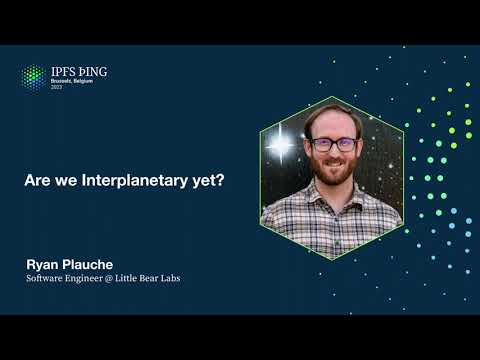

# Are We Interplanetary Yet? - Ryan Plauche

<https://youtube.com/watch?v=SCrnJ8fdCQo>

## Content

So this is like a will be a follow-up to the brief talk I gave on that was Saturday. Yeah,

Saturday. So are we interplanetary yet? Building an IPFS implementation for space. So I think we

have to start with understanding that this is kind of like a tale of two almost different projects that are connected to each other. So the first project is really this idea of like a demonstration

of IPFS in space. This thing that Foghorn Foundation has announced that they're trying to do.
Then there's sort of another project sitting underneath it, which is more like a long-term how do we build an SDK for using IPFS in space. And the demo mission builds on top of this SDK,

like they're linked together, but in some ways they are separate in that they have slightly
different objectives and timelines. One is much more long-reaching than the other. Hopefully we'll

see happen this year. So we'll start with the first one, which I think initially is a lot more

interesting to people, like how do we get IPFS into space? What is the timeline? So this is like
a rough timeline of kind of how things have come to be. So in May of last year, Filecoin announced

this intent to work with Lockheed Martin to put IPFS in space. And then in November of last year,

development on the software side of this began. And around that time, there was still talk between

Filecoin and Lockheed on how IPFS would actually get into space, like what mission it would go on
and those sorts of things. And around the end of 2022, a mission was selected. That's the LM400

demonstration mission. So that was publicly announced in January of 2023, so this past
January. So that was really like the kickoff of like, all right, the software can now be more

tuned to this hardware and meetings can begin with the folks at Lockheed to make sure we're doing

everything we need to do to get this up into space. So sometime this summer, there will be

ground testing of the software. And that's like a pretty big milestone of showing, hey, we have

IPFS in a form that will work on satellite hardware and will run on a ground station. And

we're running it through all of its paces here on the ground and doing all the things we would do
in space, but in a more controlled setting. So that will really prove that this does work in a

less conceptual way. And then sometime late this year, that hardware will get launched on a rocket

into space and we'll actually get to run a few tests while it's in orbit and actually prove, hey,

we can use IPFS to transfer data to and from space. So that will be a huge check, a huge win

for IPFS to be able to say that, to be able to finally claim like, yes, we are interplanetary.
So what does this demonstration like actually mean? What does that look like? This is like a
very rough, high-level diagram of what we're going to do on this demonstration mission. So on

the ground, you see my cursor a little bit, yeah. So on the ground, IPFS there will send up a CID

to a satellite, to the IPFS running on the satellite and say, hey, here's a CID. Do you
have any data? That satellite will hopefully recognize that CID and get the data associated

with it and send it back down. Yes, data is on its way from space to ground. And then I think

the gold ring we're reaching for is that once that data reaches the ground, we will take that data
and send it off to Kibo and the broader IPFS network and say, hey, here's some fresh data from space. I know that sounds really simple and it is simple, but simple, I think is good here.

It allows us to really work on the fundamental pieces of IPFS adapted to this environment and

not get too caught up in some of the more complexities associated with like peer-to-peer,

which is what you would get into if you're dealing with like a satellite constellation or a ground station network. In this case, we're dealing with one satellite and one ground station. So we can
begin with the fundamentals of IPFS, apply those to this scenario, and then slowly build our way up

as there are opportunities with more complex hardware configurations or more complex satellite

configurations. We can then bring in some of the more interesting pieces of IPFS and begin to see

what we can leverage out of there. So pulling back to like the SDK view and the broader software that

we're building, this is like an overview of all the different pieces required to pull off this

sort of ground-to-space, back-to-ground IPFS integration. So starting on the satellite,

we have this MySelli, which is the IPFS implementation for space. And within the

satellite, all we really care about right now is that we have MySelli running on there and then we have a radio. And MySelli kind of talks roughly directly to the radio, sending data back and

forth. That radio obviously is our link to the ground. So somewhere there's a ground station with
a giant antenna and a radio attached to it. And that radio is also connected in some way to MySelli
on the ground. And it's sending commands, data back and forth. There's also a controller, which

could be a human, could be ground station software. We don't really care what it is as long as it
knows how to speak to MySelli using the protocol that we've developed. So it will send commands

like, hey, what DAGs do you have? What blocks do you have? Can you fetch this DAG from space?

Can you send this DAG up? Those sorts of things. And it could be sending those commands directly
up to space via the radio or be commanding MySelli on the ground and then it knows how to talk over

the radio to MySelli in space. Another important piece here is what we call Hyphy. And this is

sort of a bridge process between MySelli and Qubo. Think of it as like a block sinker. So it's

sinking blocks in MySelli over to Qubo and then Qubo is able to take those and spread them out

to the broader IPFS network. So at a very high level, these are all the pieces that exist right

now. We may build out more in the future, but this is all that's really required to use content

addressable data in space and manipulate that in a meaningful way. So taking a deeper look,

so the current features of MySelli, I should say first this is a Rust-based program. I'm a big

fan of Rust and I think for embedded software, it's a pretty good choice. Um, the cross-compiling story is so nice. The tooling there is so good, it just makes it very

easy for this sort of application. So right now MySelli can import files and it will break them

up into blocks and it has a block store internally so it keeps all those there and can also take a

DAG and export that out to a file on the file system. It's able to send and receive blocks and

then by association DAGs. Those commands are essentially the same within MySelli right now and

then it primarily communicates over UDP. So when it comes to like data transfer or the control API,

sort of all of that is stuffed into UDP. I realize this is really simple, but again you have to
remember we're like at the beginning stages of adapting IPFS into space. So I went for the

simplest feature set possible to accomplish what we need to accomplish and tried to stay away from
bringing in any of the more complex pieces of IPFS. I do want to say on the Rust front, thank you to

the Iroh folks. I borrowed pretty heavily of the file builder and chunker code. It was very helpful.

I think that was another good reason for me to go with Rust is there's a lot of good IPFS code out
there in Rust which allowed me to move very quickly and I really appreciate that. So this UDP

messaging, I wanted to get into this a little more. So why did we go with UDP? Well the first

reason is that we're assuming that communication is going to be unreliable and we're assuming that
we can't make a lot of assumptions about what the radio will look like or what we even get from it.

In some cases we will get a network interface to a radio and that radio will already be like pretty

reliable and robust. I think when we deal with like bigger commercial partners that will be the
case, but if there's like a university that wants to put IPFS on their satellite and they are
building like a CubeSat, they may not have this nicety. It may be a pretty unreliable radio link.

I thought it was important that our native language, our network protocol kind of like reflected

the communication reliability between space and ground. So radio is spelled UDP. What I mean by

this is I took the approach of abstracting away the radio behind the UDP interface. So in the

system what happens is whoever's like building this satellite, they're responsible for understanding

the radio and knowing how to talk to it. And they give me a UDP bridge that just takes in UDP packets,

sends those over the radio, just sends the payload over the radio, and then reads payloads over their
radio and sends me UDP packets with the payload inside. They don't need to know about the
application protocol or the data protocol. They don't need to know about any of that. They just
need to know how to send and receive UDP packets. And then on the um the IPFS side, my celly doesn't

need to know about the radio and how it works. It just needs to know where to send and receive UDP
packets from. So by creating this layer of abstraction at the network level, um kind of able

to separate concerns really well, keep the radio concerns on the hardware side and keep the IPFS

protocol concerns within IPFS. Um another piece that was built out here was a data transfer

protocol. So obviously we're not using bitswap, um we can't handle all the the traffic and noise

that bitswap creates and it's not really even appropriate for this particular point to point

scenario where we're not even dealing with peers. We kind of always know where our peer will be located. We just need to send and receive blocks. So a uh request and response ish protocol was

created. I say ish because um it's not always request and response. It sometimes is but there

are assumptions made particularly when sending blocks that maybe I'm not in a position to receive

a response or maybe I'm like at the tail end of a pass. So I'm sending a bunch of blocks and then

I'm gonna lose communication so I don't need to be like waiting for a response. Um I need to wait

until I know I can communicate the sat with the satellite again and then query for a response
when I'm ready. Rather than always assuming like okay I'm always in a good place to get a response.

So there are some places where it's request and response and some places where it's more like streaming data over. Um right now the protocol primarily deals in blocks. Um there is some

notion of like transmitting DAGs but really it's just transmitting a sequence of blocks not like

a car file or a whole DAG packaged up that way. Um there's also MTU specific fragmentation built

into the protocol. Um I was kind of forced to do this because in the lab setup the radio that I
have has a 60 byte MTU and uh if you think about like how big a CID is like making blocks that are

60 bytes large is not really going to work right. The overhead of just the CID is ridiculous.

So a dean pointed out really helpfully that hey maybe if you just have larger blocks and you break

them up into chunks that are tuned to your MTU you know you'll get better throughput. Um that was
the path that I went down and that's been very helpful. So the MTU is a is a tunable parameter
within the protocol. Um I'm not assuming that every radio will have a 60 byte MTU. I hope that

they will have multiples of 60 bytes um to work with. Um yeah and there are a few other parameters

that we can expose as tunable. Um the plan is to make the protocol a little more flexible so that

as someone is integrating it in with their system they can really tune it for what the system needs.
So as far as areas for improvement or what's coming up next, the data transfer itself could be

a lot more robust. I'm missing some somewhat fundamental features like the ability to
resume a transfer and only send the blocks that are required. Um something I didn't put on here
but that would be really helpful is the ability to query for missing blocks in a more concise way.

Right now when the protocol is asking for blocks that are missing it's literally a list of CIDs

and um in the case of my lab radio with the 60 byte MTU that means I can only really send like

one missing CID at a time. Beyond that I have to chunk up my missing block um commands. So a more

concise way to query for those would be really helpful. Um yeah and deals and blocks and MTU

specific fragmentation those are definitely from the previous slide. Not areas of improvement
necessarily. All right so talking about Hyphy which is like the bridge between um Myceli and

Qubo. Hyphy is actually really simple right now. So it uses the standard Myceli API. Um there's no

special commands that it uses which is great. It speaks to Myceli the same way that Myceli speaks
to itself in the same way that like a mission controller would speak to it. And then it speaks
to Qubo over the standard RPC API which is really nice to have. Really easy to integrate with. So

it essentially just queries Myceli for what blocks are available and then queries um Qubo for what

blocks are in the local store and kind of diffs those and sees what blocks does Myceli have
available that Qubo doesn't currently have and then syncs them over one by one. So how could this

be improved? Um right now every block in Myceli is synced over which is probably not ideal long

term. Um that was enough to really prove out that we can do this end to end integration but I think
we want to be a little more specific about what exactly we are syncing over to Qubo. So probably

the ability to specify which DAGs we want to sync to Qubo would be something we'd add. Um right now

Hyphy also pulls Myceli and it probably would be better if we could have Myceli ping out hey I

have new blocks that are available come and get them. Um and then another thing that um I was
thinking about yesterday is integrating BitSwap or other protocols directly into Hyphy. That way

it's not limited to Qubo and what Qubo can do but is really able to take full advantage of all the
different IPFS implementations out there and talk to them. Um instead of being yeah tied to just

what the Qubo RPC API allows it to do. Alright so looking at like the broader road map. Um what's

coming up next is first incorporating past data into uh specifically Myceli. So a pass is the

time period when a satellite is able to communicate with its ground station. Um satellites cannot

always communicate. There's usually a limited window of time. So we need to bring that in so
that Myceli specifically on the ground isn't always trying to communicate with the satellite
but rather is making intelligent decisions on when it knows it can communicate. Um we also want
to incorporate some baseline metrics. I think many people this weekend have already said that if we
can't measure it we can't really improve it. So we need to to incorporate those measurements in
here that way we can know what to improve and what our performance is actually like. And then in

general more robust data transfer and file handling. Right now in my lab setup I'm kinda limited on

how large of files I can send. I found that file transfer scales at about 1 kilobyte per minute. So

you know a multi megabyte file is not really realistic for me to transfer over the radio that I have. But in the real world uh Myceli will need to handle probably multi megabyte possibly even

gigabyte files depending on what the payload is and what the scenario is. So we need to do more

testing with larger files. Um and if anyone knows of any good unlicensed radios of high

bandwidth let me know so I can go get one and test uh you know higher throughput file transfers

with it. And then looking beyond the road map. So this is really looking beyond this initial

first mission. Um the thing that we want to start thinking about is how do we handle satellite
constellations and how do we handle ground station networks. I think this is really where IPFS will

shine and where you guys will get some really good leverage out of IPFS features in space. For the

point to point um it's probably going to be a wash honestly between IPFS and a lot of other
data transfer protocols. And it's really in this like more mesh peer to peer world that IPFS makes

a lot of sense and can be most useful. So that's kind of what I think we would look at probably

beyond this year is how do we start to tackle those things and find opportunities to address
and work in these types of scenarios. Alright demo time. We're gonna try to do a demo. I had a

physical failure this morning so we'll see we'll see what happens. So my uh my radio for my laptop the antenna fell off this morning which is always good.

if you want to do radio communications. So I've got it taped back on right now. We'll see see if that works.

Okay so let's see the first thing that we're gonna do is we're gonna start our Hyphy

um and so it's gonna try to connect a Kibo and my Myceli. We can see it was not able to do either of those things. So now it's found Kibo. It's connected to that. So now we're gonna start off our Myceli. Okay so now we have both of these things running. Sorry in our ground context. So that's all

good and well. So now we need like something to talk to right. We have our little IPFS in space prop right here. This is a Raspberry Pi with a radio attached to it

and this is like what I use at home in my office to develop on. Obviously not with this whole setup

but the Raspberry Pi itself is the the same one that I use. So this will take about 40-ish seconds

to turn on and start talking to us. What we can see happening while we're waiting is um you can

see over here in Hyphy about like every I think 10 seconds it's um querying for blocks on the Myceli

side and then syncing those over to Kibo and finding that all the blocks are synced which is

appropriate because there's no blocks over on the Myceli side and yeah it's a little noisy over here

because all those messages but that's okay. That is just part of the part of where we're at right now.

All right hopefully soon we'll start to see some traffic from the the satellite.

I'm gonna put the radios like right by each other just in case this antenna didn't make it.
I think Matt maybe sent his uh all his demo gremlins over here to come and get me.

Oh well this would be really important so I actually never turned on the radio service so

that would be a big deal that would be part of why this is not working. Okay so we're gonna restart Myceli real quick and see okay cool this worked. So whenever

Myceli turns on it like pings the radio to see if there's anything on the other side and um we can see here that uh the the radio is not working. So we're gonna restart

and it like pings the radio to see if there's anything on the other side and um we can see here that

it found a dag from a node named Artemis which is what this um Raspberry Pi is called. Artemis. So

it found a payload.jpg with this CID. So what we're gonna do now is

is yep so we have this controller and we're gonna ask Myceli which is running at this IP address to

fetch the dag with this CID. So we'll send that over and yeah so it sent this transmit dag message

up to the Raspberry Pi and asked it to do that with five retries. So now if you look yeah so we

can see this block got imported so we're starting to see traffic come over and we can see on the

hyphy side it's syncing the blocks as they come in over to Qubo. We can all cross our fingers that

all the blocks actually make it over. Um sometimes this has trouble with the root block because it

has a little more metadata attached to it. We'll see if it makes it through this time hopefully.

Yeah this process will just kind of continue of importing blocks and syncing them over and you

see this message right here missing dag box. So what happened here is Myceli on the Raspberry Pi

asked Myceli on the ground like hey what blocks are you missing associated with this dag? And then

on the ground we responded like hey I'm missing this particular block which is the root block

which is not surprising to me at all that would be the one missing. Yep it still didn't get it.
All right that's fine you know if you want to see a more extended demo where we can wait this thing
out and see how long it actually takes to get all the blocks or this final block transferred um
we can set up some time at the uconf to uncomf to do that. So back to the presentation um

so are you interested in helping? What are different ways that you can help if you are? So first of all just having people like clone this repo and try the software out locally and see if you can break it that alone is would be super helpful. Um software is still in like a

relatively early state so I think there are going to be a lot of rough edges and more eyes would be
helpful for um pointing those out. Um if you have hardware that you want to try to port this onto

whether it's a another microcontroller or a radio it would be great to go through the paces of that

with someone else. I've only integrated it with one set of hardware right now so the more

integrations we can have the more we can understand better how well the integration process works or

doesn't work. Um and then thinking through the peer-to-peer story that's still far away but I

think the more ideas we have about how to address peer-to-peer in space the better chance we have of

really doing that successfully. And then I haven't put down a time in the uncomf yet but I think it's

worthwhile to set aside some time there so that will either be tomorrow or Wednesday. Um so you
use UDP and what do you use like on top of UDP for like application level like how much packet loss
do you have and how do you recover especially because you decide to fragment your UDP packets because otherwise like yeah yeah how does that part work? Yeah so there are two ways that I'm
approaching that right now. Um at the data transfer level I have a retry timeout base retry bait

bait baked into the data transfer protocol so it's configurable like let's say every 30 seconds it
will ask you like hey which blocks are you missing and retry transmitting all those blocks. So that's
how we account for fragment loss on that side. When it comes to the actual application API though

right now I keep like a short-lived cache of all the messages that I've sent and I'm able to like

re-request specific fragments of those messages to try to recover them that way. Um it's kind of like

a crude method but seems to be working somewhat well over this radio but I think there's a lot
of room for improvement there and making that robust without also overwhelming the radio link.

So are you also creating DAGs on the satellite or are they for now just being placed there
beforehand and is hashing a problem in terms of performance on the satellite hardware?
So I think hashing could be a problem dealing with bigger files and thinking about um what

hardware we may have but I haven't like scaled up enough yet to hit that ceiling. Um as far as where

the DAGs come from they could be created on the satellite or they could be created on the ground. The mycelli software has the ability to turn a file into a DAG and it runs the same way in space

and on the ground. So I think what would happen realistically is let's say you have a imagery
satellite and it's taking pictures some process is asking mycelli to import those pictures and
create DAGs out of them so that they can be sent down to the ground. When the satellite creates a
DAG it also creates the hash I guess. How do you do you have any discovery of like what how do you

know because your very first slide or somewhere you showed that the ground station asks for a CID.

Mm-hmm. How does it know what CIDs to ask for basically do you have any discovery for that?
Yeah so right now well when a mycelli node boots it broadcasts what DAGs it has and then

when it imports a file it also broadcasts those DAGs out to the network. Um and I think there's

room also to create a specific discovery command. I don't have one quite yet. I have something

kind of like discovery command that pings out and gets a little bit of that metadata back from
whoever's listening on the other side. But I think that that's definitely a room for improvement. An area that we could build more in. Awesome we can call it there then. Thanks y'all.

