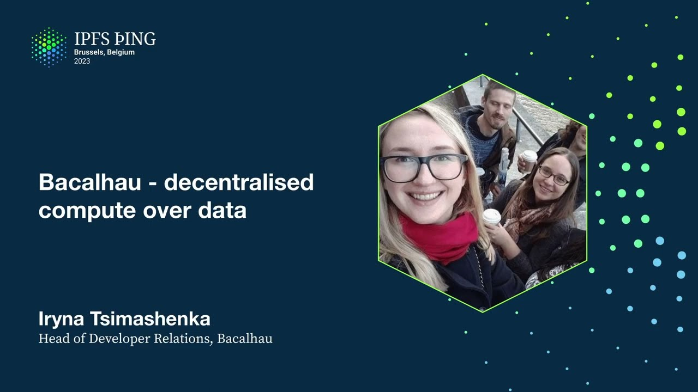

# Bacalhau - decentralised compute over data - Iryna Tsimashenka

<https://youtube.com/watch?v=eaz7bhdY918>

## Content

Hello everyone, so the next talk is about Bakayao which is a low-cost compute. And this

is Bakayao and FEM forms the third pillar of Filecoin masterplan. So let's start with

this presentation about Bakayao. So Bakayao is a compute-over-data project and Bakayao

translated from Portuguese as code and code stands for compute-over-data.
So what is Bakayao? And it's called Bakayao is a centralized compute network that provides an efficient and cost-effective way to process off-chain computations. Unlike traditional

computing systems, Bakayao leverages the power of distributed network of nodes to perform complex

tasks that process data, that process next to data.

And why we need this Bakayao? So first of all, very large data has a gravity, so it means that

it's really expensive to move data around, to copy it for processing, and then you need to

store it somewhere. So it means that you have to pay for storage local services. And then the source

code size is relatively small, so that's why Bakayao is really efficient of running jobs over data,

especially over data that is stored on a PFS. So instead of sending data where the source code is,

we send a source code where the data lives. So this sets Bakayao apart from other decentralized compute networks because it's
efficient computing architecture and fault-tolerant design. Bakayao ensures that computations are
completely accurate and on time, even in the face of network failures and other disruptions.

So it has four main advantages. It has reduced complexity because Bakayao simplifies the process

of managing compute jobs by providing this uniform platform for managing jobs across different smart

contracts, where results of one computation can be input for other off-chain computations.

It also provides fault tolerance because if nodes fail during the compute process,

then it will trigger the network to find another executor node to execute this job correctly.

And it also increases reliability because Bakayao provides reliable network partitioning
and resistant orchestration. And this ensures that your job is complete, even if there are
network disruptions. And the last one is enhanced security. This comes from the fact that instead of

bringing data to compute, you bring compute over data and you minimize the data movement

of that compute. And that's the four main advantages of Bakayao.

So from the developer experience, what developers need to do, they need to send the data where it

is and it performs the best when the data is stored on IPFS or Filecoin.

It also, like, your compute needs to be dockerized or you need to compile

voice binaries, which means that there is language-agnostic computations that are accepted

by Bakayao. And also there is heterogeneous hardware. This means that it runs any GPUs,

it runs GPUs, it has also machines with high memory and whatever other hardware that

usually people don't have at home. So the last thing is, like, this is batch data processing

via easy-to-use CLI or Lilliput interface that will be, Wes will be speaking in a minute.

And these are the commands that you need to use to run it via CLI. So the main applications is

AI, ML, and financial modeling. It's because it's designed to be very highly scalable,

meaning that it can handle large volumes of data and extensive computations. So this is

what makes Bakayao the valuable tool to a wide range of applications in any industry that has

applications of AI and ML. And lastly, the vision of Bakayao is to transform data collection and

processing by giving developers very simple and first-class distributed tools and locating new
collaborations in the ecosystem. So this is the first part of the talk, and the next will be

about Lilliput that will be run by Wes Floyd, who is a product manager for Bakayao. So please let me

know if you have any questions, and he'll also be covering a demo of Lilliput and other use cases.

