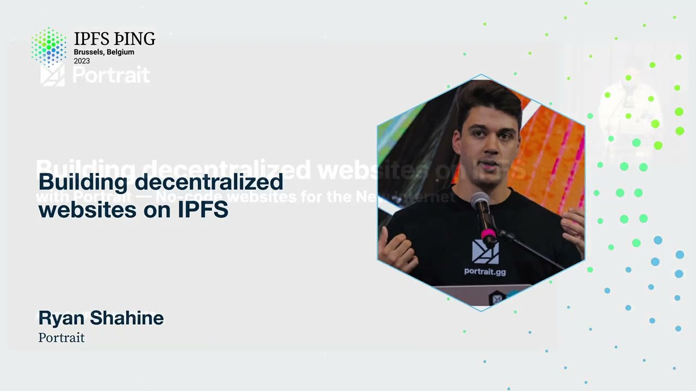

# Building decentralized websites on IPFS - Ryan Shahine

<https://youtube.com/watch?v=TeFAHmzvIdg>

## Content

Right, good afternoon everyone. This is Ryan, co-founder of Portrait, and today I'll be

talking about how we're using IPFS to build decentralized websites. So, the IPFS ecosystem

offers opportunities for data ownership, for privacy and for control, and when you're building

decentralized websites or creating tools to build decentralized websites, you have to

face certain challenges which you don't really discover or see in web2. So, we're talking
about storage and content distribution and also about user experience and identity. So,

I'm happy that I will be talking about that today, and let's dive a bit more deeper in

like user apps being built on top of IPFS. So, this talk will be a bit technical, but

also a bit more on the side of production. So, we are building an app out there that's
actually running on top of IPFS. Today, Portrait has over 10,000 users and we have a lot of

learnings from that, and there are a lot of small design challenges you're facing, and

we'll talk a bit more about those. So, first off, we'll kick off with Portrait, why Portrait,
how Portrait works as well, and then we'll kind of jump into IPFS. So, why IPFS, why

is Portrait building on top of IPFS, and then we'll talk about solving design challenges.

And there are a few design challenges out there we haven't solved yet, and we are very like eager to fix them ourselves, but obviously today we're a team of two, by the way, so
it's quite hard to balance 10,000 users and trying to come up with new solutions to certain problems, right? So, also putting those out there, and some stuff we're excited about
and a short recap. So, the new internet is about self-sovereign identity, right? So,

you should be able to control your identity, express who you are in the way you'd like to do that. And if we look at how Web3 does that today, there are a few things that quite

concerned us at the time. So, let's say you'd like to write a blog, then you should probably

use Mirror or Paragraph or any of the many solutions out there. There are a lot of solutions

out there to write your blog. And what if you're an artist and you'd like to kind of publish your new NFT release or release your new collection, then Alchemy says that there

are 135 solutions out there to do so. But what if you'd like to do both? What if you'd

like to kind of write your blog and release NFTs, then, and like, those are two things,

but what if you add a third one, a fourth one, or a fifth one? And for every solution out there, there's a DApp. But at the end of the day, let's take Joe for an example
here, you have kind of one identity. So, let's say that Joe owns Joe.eth and that's one identity. And Joe doesn't want to have all of his data or all of his creations and his expressions
scattered around the web, right? Because he has Joe.eth and Joe.eth is more than a textual
representation of your Ethereum address. Joe.eth is also a visual representation of his Ethereum

address. And we can actually do that by going to the ENS domain manager and using the power

of IPFS to kind of link a SID, an IPFS SID, an IPFS hash to his identity. And we have

already been working on implementing this into several browsers, not us as portrait,
obviously, but us in the space. So, if you head over to gilliam.eth, which is my co-founder,

by the way, if you head over to gilliam.eth in Oprah or Brave, it natively resolves. You
don't even have to install an extension or anything. And in Google Chrome, if you installed

MetaMask, which I think every one of us here who uses MetaMask in Chrome as well, like,

all right, there's a few hands there, but if you actually use MetaMask in Chrome or
any other browser, by the way, that doesn't really matter, you can head over to your ETH
domain. So, let's say gilliam.eth in Chrome as well. So, it's not natively built in there,
but you can use MetaMask, which kind of, I don't know if anyone even was aware of that.
So, what's happening then is that you can actually, again, it's a single content hash

to a single source, but Joe or Gilliam would like to bring all those kind of sources into

one kind of visual representation. And if you'd like to do that today, the only way

to do that is actually building your own website. And let's say you're a Web3 creator and you

take the entire set of Web3 creators, then only the technical subset of those creators

are able to actually design and code their own website and then use either Fleek or 3rd
Web to publish their website. And that's where Portrait comes in. So, we are the visual expression
layer of Web3. We offer a decentralized website builder and protocol that allows Web3 creators

to truly express themselves and create, control, and govern their own visual identity. So,

your portrait is, again, fully controlled and owned by you and requires no coding or design experience. It's your kind of visual representation of your Ethereum address for

the new internet. So, we're actually live today. We have a private beta. And, again,

we have over 10,000 users right now. So, I'll try to give a live demo. I know that the previous
demo, there was kind of like the Wi-Fi can be quite bad. So, let's hope it works. So,

this is our builder. You can actually... There it is. So, essentially, anyone should be able

to create their own portrait, their own decentralized website. This is kind of a pain for me because

I'm having to look on that screen to actually build a portrait. But let's try anyways. So,

you can select any of these components, which kind of look similar to any conventional website

builder. But it's actually much more than that. So, let's... So, let's say we have an

avatar. Which should go in here. And there's the avatar. And what's happening right now,

everything is being stored, is pinned on IPFS. And we've partnered up with Asteroid to actually offload these files onto the Filecoin network as well. All right. So, I'll just add Joe

here and then I'll call it a day for now. Otherwise, it'll hurt my neck too much. So,

what we also do is we're adding tags. And these tags are stored on chain as well. So,
that we can kind of create recommendations for other users to find and connect with like-minded
individuals. So, I'm publishing this right now. You're actually signing with your Ethereum

address the contents of the website. And when we're signing it, we're actually attestating

the transaction or kind of we are delegating the authority of updating your portrait to

another party. Which in this case is us. I'll dive a bit deeper into the contract in a bit.

And then once the transaction itself has settled, the portrait is updated. Right now, it's a

bit obviously empty, but we can actually showcase how it works in Brave. So, for example, this

is the DNS domain link to the specific portrait. And this natively resolves. And this is all

on IPFS and Filecoin. So, I think, yeah. So, yeah, again, this is a very easy, like low-level

example. We have some private invite codes. So, Gilliam is in the back. And if you'd like
an invite code, reach out. He'll give you an invite code. So, I'll actually dive a bit

into the protocol. This is a very early implementation of the protocol as well. We're in beta. But

I'll dive a bit deeper into a pretty cool design challenge we have solved. So, this

is the actual contract itself. And one of the design challenges we face is that on one
side you don't want to have the user or make the user pay for every transaction to update

the state. Especially if you're kind of releasing the protocol on a very cheap network. So,

let's say you're just updating the state of a portrait through Polygon or any like very
cheap one to update the state, right? You kind of are able to cover those costs by yourself
quite easily. So, why go out and about to make the user pay for that? So, from one angle,

you have the fact that if we kind of are the one that updates the state of your portrait,

then who's actually governing portrait itself? The one that is able to kind of update the

state. And if you're always delegating authority to us, then it's basically you're always relying on us. So, it's kind of we have two functions right now, which is set personal IPFS by proof,

which is kind of delegating authority to us and kind of gives us a proof to update the state of your portrait within the contract. And the other one is kind of the fallback, where you're always able to update the hash by yourself if you'd like to. So, let's say

the kind of backend of portrait today or our provider that kind of does all the transactions

is falling away today, will fall away, then we always have this catch. And that means

that the user is always able to do so, kind of update the portrait by himself. In addition,

a lot of people are building portraits and you can either do one or two things. You can
either upload the entirety of the website, or you can kind of create two separate processes

where on one side you have a renderer, which kind of takes an information and then creates a website from it. So, what we've done is we actually separated the data from the website
renderer itself and the website renderer itself can actually easily be deployed on IPFS. And
that by itself saves quite some storage if you're looking at storage protocols beyond

Filecoin, because Filecoin tends to be really cheap for like low level storage, but other

protocols out there can become quite expensive if you're uploading multiple MBs, right? So,

on this note, this by itself resulted in another design challenge, which we haven't solved
yet. So, if any, I'll tell that in retrospect. So, this is a quick example, quick demo. I

can actually show a bit more right now because I'm not actually having to turn my neck all

the time. So, you can add different types of components and really like make your decentralized

website feel and experience kind of like Web 2.0. So, not only are creators able to build

a portrait, but my grandma, my mom should be able to create a portrait too. So, we really

focus on the UX there. Yeah, you can customize it the way you want. We have teams as well.

And tomorrow, I'll be actually giving a talk about how we kind of use AI, we use OpenAI's

chat GPT to fetch data, map to your Ethereum address, and then create a portrait, which

can be kind of scarily accurate. And we had people reach out to us and ask, how do you

actually know this about me? So, from that angle, it will be more a talk about the ethical

side and kind of should we share all this or should we openly put all this personal
data on chain? But that's a talk for tomorrow. So, let's head back into... Yeah, that sounds

good. So, yeah. We just like scratched the surface of how Portrait uses IPFS. And let's
dive a bit deeper into that. So, when building kind of products, you approach it with a certain

design philosophy. And when building products in Web3, you always have this trade off between
UX on one side and decentralization on the other side. But kind of in a Web3 world, we

tend to map decentralization to blockchain governance. If a single entity governs a network,

it's centralized. And we kind of view or look at this from like this binary thing where

it's either true or false. And we have to wonder if that actually applies for the web

as well. And that isn't really the case. Because when we're building dApps, we're often relying

on an infura or an alchemy to be kind of either the RPC endpoint or to provide us on-chain

information. And that by itself, relying on a single API provider is centralized. But

that doesn't really matter. And that's actually pretty okay to do. Because anyone at any given
time can verify whether either alchemy or infura is actually sending the correct information

out. So on top of that, it kind of leads to the panopticon principle. It's a psychology

principle where because of the fact we can verify the chain at any given time, we actually

have to do it less. So this kind of originates from a prison principle where you kind of

had a guard tower in the middle, and then you'd have all the inmates in a circular form

around the guard tower, so to speak. And as a result, you had to hire less guards because

the guard in the tower could look into any specific prison cell at any given time. And

on top of that, for bad actors, or not necessarily intentionally bad actors, but for incorrect

data, so to speak, it's kind of a one-way street where, let's say, a certain API provider

provides incorrect information, which kind of does harm to the network or to the community and the ecosystem. Then it's easy for us to kind of shift from A to B or from B to C.

So that's really interesting. But if we compare kind of how we accept kind of the infuriating

alchemies within the depths, no one ever considers that decentralized. There's a few things we

really underestimate here. One is that it might take a few minutes for the guard to

actually visit the cell of, let's say, the bad actor. The second one is... So that results

in there's a certain time period, a certain epoch, in which a bad actor can actually do harm to the network. The second one is, unlike shining a flashlight into a cell, which is

quite an easy process, actually verifying the data on-chain requires quite some work.

So let's say you're starting from a zero state, then you actually have to sync the entire chain or, in terms of bandwidth storage, that's quite some work. With IPFS, that's much easier.

However, we're still doing it in the same fashion. So we can fetch data from a centralized

gateway and if the gateway is compromised or a bad actor, we can actually shift to another

gateway and then that specific gateway that served incorrect content is now kind of losing

its reputation. However, if you're comparing the work it takes with Ethereum and IPFS,

IPFS is much, much easier because with IPFS, you can use packages such as multi-formats

to actually practically instantly verify whether data which comes from a gateway is correct

or not. That's one of the design challenges we face at Portrait. That's also the main

reason why IPFS is the backbone of Portrait. Our approach to Portrait and I think an approach

to building Web3 products in general is to be agnostic to protocols or solutions out
there as much as possible. However, we're still in a foundation built on top of IPFS.

So it's easy to shift from one gateway to another and it's also easy to actually validate

the content that's being served. This is actually a strange one. With the power of

IPLD, IPFS is designed in such a way that you can even go as far as creating these trustless

dApps that mostly rely on a single centrally governed AWS S3 instance, which by itself

Amazon, which by itself is governed by a single global conglomerate named Amazon. That would

by itself be more trustless and more easily verifiable than running a decentralized dApp

that mostly relies on a centralized blockchain RPC endpoint or API provider. When you think

about it, that's kind of, well, you have AWS on the other side, how can it be more decentralized

and more trustless than Ethereum or at least an Ethereum API provider? We kind of adopted

this philosophy of decentralization is not mutually exclusive. It's kind of this spectrum

where you have trade-offs between UX and trade-offs between decentralization and your aim should

always be to create a product which is...

as trustless as possible while still having a great UX. So in the end, relying on if you run out for reading and writing data to your dApp, it's actually a good thing,

good thing and better than running a centralized MongoDB instance. So what kind of challenges have we solved and are we working on today? One of those challenges is

working, kind of dealing with bad actors and compromised gateways, which we just spoke about.
We solve those issues by doing client-side verification of actually the content that's

being served. Second one is we're combining content addressing with location-based addressing,

kind of to improve loading speed but still keep the kind of trustless level of portrait

pretty high, pretty strong. So the third one is how we are improving the speed of serving
decentralized web content by using IPFS with other on-chain storage protocols.

And this one actually... So the first thing we're looking at is content addressing
combined with location-based addressing and we got inspired by the HTML integrity attribute

and that's basically... That's like in the standards of HTML and it's quite underestimated.

I will dive a bit deeper into it right now because we started off with using a mix

of location-based and content addressing by actually using a gateway and then pretty much

adding the IPFS hash to it, right? Then we kind of moved to using the IPFS prefix

and then letting either the browser or an extension kind of work out which gateway would be the best

possible. The third step would be what if we kind of shift things around? What if we kind of use

my IPFS hash as a second kind of layer to a location-based address? So what you can do is

you can actually use Amazon S3 to improve loading speed and improve getting the actual data

onto the client but you can still kind of verify whether or not that data is actually somewhere on

IPFS and basically if it's not you can also get it on IP... Put it on IPFS because you can still

fetch it from S3. But in this way you kind of improve the UX where you can kick off with loading

the actual website and if resolving the data from IPFS takes a while that's okay but at least you

can still kind of serve content until... Like you can serve untrusted content and kind of notify

the user that in the background you're still trying to fetch everything from IPFS and actually
verify whether the content is valid or not but in this way you're at least serving something and not letting the user wait for content. So in addition, obviously Portrait is built on top

of Filecoin but at Portrait we also take the design philosophy of... Generally speaking you

don't want to rely on a single provider and we're also aiming to do that with storage protocols as
well. So IPFS truly empowers beyond Filecoin and IPFS empowers kind of to go broader and

I think every storage protocol has its trade-offs and one of the solutions we're working on is

actually looking at other protocols such as R-Reef where we are kind of attestating the data from

IPFS onto R-Reef itself where we kind of... So you can take that from two perspectives where one

you're using S3, the other one would be using another decentralized storage protocol and then

you're actually stacking multiple storage protocols together and using GraphQL you can

actually fetch the data. So these are kind of thinking... This way of thinking is kind of in a

storage agnostic design where you have trade-offs on all levels where you kind of have to take that

into account. So challenges to be solved, hopefully. The first one is really interesting. I'm not sure

if someone is working on this already but we kind of have... Our main challenge today is kind of

getting authentication use-off on kind of multiple instances of Portrait, whether that's a different

IPFS gateway or a different protocol and that's mostly because authentication today kind of works

in a similar fashion to location-based versus... Not necessarily versus but in a location-based

way where authentication is mapped to a domain name and that's location-based. So what if we
can kind of create a similar system in which we also can create content-based authentication

and kind of derive a certain hash or a certain proof from a DAP and if that's all fine we can kind

of base authentication on top of that. I'm sure there are some security issues there but that's

something we're kind of... We hope that there will be upcoming solutions there that you can kind of
move authentication away from a single entity governing authentication as well. So yeah.

A second one and that's kind of more related to ENS today is in the beginning I spoke about how
we kind of separate data from the renderer to kind of save space, storage space, and as a result you

kind of need to add a query parameter to an IPFS hash to kind of load a user conditionally into

the app. So above you can see what doesn't work within IPFS and that's app and adding the query

parameter for a conditionally rendered portrait which is a certain user and below you can see

what works which is just a simple IPFS hash and that means that today at Portrait we have to
generate, store, and offload separate files to actually create individual portraits and it would

be great if we can kind of load logic conditionally from a single source. So to round this off and

something which I already covered, at Portrait we believe that decentralization is not mutually

exclusive, rather it's a spectrum. It's not something to... It's not a light switch which

is on or off and as an app developer and designer you kind of have to take a lot of things into
account. Today we're at 10,000 users. If you'd like to be part of a few like 10,000... One,

two, three... You can head over to Gilliam to ask for an invite code and he'll be happy to
onboard you guys. Thank you very much. So can you go back to the last slide really quick? The one with the query parameters? So I'm just trying to understand what you're trying to gain out of this. So that query parameter, are you thinking that you want that to be passed into the page,
into that wherever that CID lives? And are you trying to make a template there where you'd like

to pass that information into it and then fill it out? What's the goal from that one? Yeah, so this is not something we're working on but we'd like to see that being solved. Let's say

you run a DAP which takes in any arbitrary information conditionally through, let's say,

a query parameter. Then if you'd like to do that today, that's simply impossible because that's
not within the standards of ENS. So in order for us to actually generate portraits or map them to

an ENS domain, we have to create or publish the actual website for every user, right? And that

takes up unnecessary space. And with Filecoin, obviously, that's really cheap but there are
other protocols out there where that gets quite expensive. So keeping stuff into a tiny JSON

object would be very, like, I mean, in terms of scalability, that would be the best,
even for Filecoin in the long term. Okay, thank you.
But you mentioned that you split apart renders and data models. So couldn't you just

request the renderer and then just give a CID to the data model? So that's what we're doing right now. But that's still, like, really hacky because then you still have to create individual CIDs for every single user. So in the worst case, like, if you're looking

at the worst possible solution out there, you'll actually offload the data itself. But let's say you're writing a, like, you're using JS to kind of fetch the renderer from one place and fetch
the data from another place, you'd still have to create a file which actually does that, right?
You still have to create the logic and link that to an ENS domain to actually do that.
Yeah, but I mean, like, the blocks of the renders could be, like, deduplicated in IPFS. And then you

could just, like, people might have the same, like, similar CIDs. Well, they might have different

CIDs for their renders, because maybe they have different combination of, like, components. But
the base components would still be stored in IPFS as deduplicated blocks. And then the data models

should change because they're specific to a user. So I don't know. It's just a thought.

Yeah. So this solution just results into having to create one file, one app for every single user,

and then conditionally load any data into it. And that's kind of the way we're looking at it,

potentially. But in terms of storage capacity, so to speak, I think creating new CIDs for every

user doesn't take up that much space. But generally speaking, if we could kind of approach it in this

way, why even generate new CIDs for every single user, right? But that's just our take on it.
I'm still very curious if someone else creates logic which still kind of generates a new CID

for every individual, but does it in a more efficient way than we're doing today, because I'm sure there will be people out there who are able to create that process in a more, like,
efficient way. So just within the context of Portrait, it'd be great. But I think also

in the context of the entire ecosystem where you have a lot of dApps that likely will render stuff conditionally, a solution which is efficient would probably be great, yeah.

