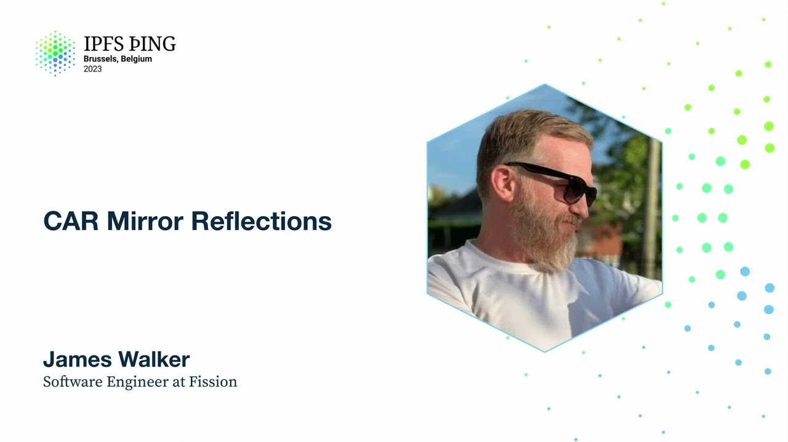

# CAR Mirror Reflections - James Walker

<https://youtube.com/watch?v=UeSb7vC0K7Y>

## Content

Hi guys, I'm James. I work at Fission, which is important because Fission is awesome. But

also it's going to give a little context to why CarMirror and what we're trying to do
with CarMirror. Before I get rolling though, I want to give a very quick acknowledgement.

I didn't do any of this. So I do primarily engineering management at Fission, which means
I build nothing. So special shout out to Justin, who wrote most of the code, has been running
this project. And of course, Brooklyn, who is here to make sure I don't say things wrong,
who of course designed the spec. Okay, how many people know what we're trying to do at
Fission? Fission people at least should have their hands up. All right, so at Fission,

our high-level goal, so we have a lot of talks this week about some of the lower-level protocols
and things we're working on, but it's all in support of this larger vision where we're trying to redefine how apps are built. And particularly, we want things like user-owned

and user-controlled data. So what that means is we have an architecture right now that
looks a little bit like this. So a user has maybe a couple of devices, a phone, a laptop.

They have their collection of files. So think like a Dropbox folder or something like that.
They have their files. They want to be able to sync them between devices, right? So currently,

that routes through some servers that rerun, and then all of that backed by IPFS. So their
content's actually available broadly on the IPFS network. Of course, because we're Fission,
these files are actually stored as a WinFS directory. So if you're interested in actually
having private files on IPFS, see the talks to learn more about WinFS.

But one of the things, so in the apps that we build, they're primarily, or to start at
least, they are web-based apps, which means we're operating in a browser. We also have
an app publishing platform that you can use from things like GitHub Actions. All of this
means we are doing IPFS in hard mode. So almost none of the people using our apps are directly

network dialable, right? So in our best case scenario, we are relying on hole punching,

which continues to advance, but not quite a perfect scenario. We also, of course, particularly
on mobile devices, we have potential network traffic interruptions, all kinds of limitations

there. And if you're trying to do something in a GitHub Action, you are time constrained,
right? You have a short-lived thing that is spinning up, trying to push some files, trying

to send some data, and then getting killed off at the end. None of these are the way that Kubo likes to work, or in JSIPFS's case, in the browser.

We are already, in the browser JSIPFS, we're doing bit swap over web sockets. We are dialing

into our servers and sending data via bit swap. Makes sense so far? Cool. So that sort

of sets the stage. Basically, all that means, we've had a hard time moving the bytes across

that dotted line, right? So, you know, once it gets to our servers and out into the IPFS
network, things get a little bit better. We have big, more powerful, more reliable servers that can send the bytes around. But it's that sort of last mile, if you want to call it,
right? Getting it from our users' devices to their other devices and other things on
the network. Right? A couple more things about the context
we're sort of operating in. So, with WinFS file systems, we do have deeply nested DAGs

that get incremental updates. So this is user's data. So every time they take a picture of their cat and add it to their file system, that is a new entry. It is a mutable file
system that we then want to sync across the network. Right? Yeah. We want to do sync bidirectionally.

So if we have an update on one device, we want to make sure that that update is reflected

on their other devices. Yeah. We have, again, like, our sort of baseline is always can we

do this in a user's mobile browser? And in that environment, right, we want to minimize

the number of network round trips and the latency. So a big thing with BitSwap, right, is there's a lot of network chatter back and forth as we're fetching blocks and trying

to add them to the local block store. Right? We'd also like to ideally minimize the data

transfer as best we can. Right? So we don't want to send, again, particularly from a mobile
device, but in general, we don't want to send an entire car file, for example, of the user's
whole file system. Right? Chances are their other devices probably already have some subset

of the data. Right? Because it's being updated incrementally over time. You know, the phone has most of it, but probably not the most recent stuff that's happened on their other devices. So we don't want to have to send the entire thing every time.

So what is CarMirror? So I'm going to go pretty briefly through the spec itself. Largely because

the aforementioned Brooklyn gave this talk at IPFS thing last summer. And she dives a
lot more into the details of the spec and how the protocol works. I would encourage
you to type in the YouTube URL really quickly before I go to the next slide and watch that.

All right. So CarMirror, again, the main goal is to balance the round trips. Right? So minimize

the network latency while also not sending duplicate blocks. Right? So we want to send

just the data that's needed for the new device in a minimal number of steps.

One of the, I think, unique concessions or like a concession that we've made, again,

looking back at our current sort of network diagram, we do have servers here. So we do
have a trusted endpoint that we can point this at. So that's an important thing. Right?
Like we've limited our scope. This is not a general purpose transfer protocol, although
we have some ideas for that. But in the initial CarMirror implementation, we are relying on
the trusted dialable endpoint. So the transfers themselves consist of three

things. So the first is the Bloom filter. Everybody familiar with Bloom filters? A little

bit? Yeah? So as we know, it's a probabilistic data structure. We use the Bloom filters to

send hints about data we already know about. Right? So rather than sending a full list
of SIDs saying, you know, I have all of these SIDs already. You don't need to send me those.

We send a Bloom filter representation and save 92, 93% data storage. So it's a small,

concise representation of the things that we have. Now, it is probabilistic. So we can have false positives. Right? We can, the other side can

say, oh, I think you have this. And we don't, actually. So that's why the protocol works

in rounds. So we will send a Bloom filter, a CID root, or roots, potentially, of the

structure that we want. And then we will receive we will send or receive Car files of the actual

blocks. And the last thing is CarMirror works in two

modes. There's both a push and a pull mode. So again, in our general sort of operation,
we have a user on a device who will want to pull in their latest data. Right? Sort of

like a Git model. So pull in their latest data. Make whatever updates. Do whatever operations

they want. And then push that back, potentially. All right. So very high level.

Quickly, this is the general diagram of how pull works. So one important note. It is a

stateless protocol happening over HTTP. So on our first round of pulling, we may not

have we may not know anything about what the other side does or doesn't have. So we request

a CID root. The Bloom here on the first pass is optional. So the purple on the left is

the requester side. Green on the right is the responder. So the requester makes a request and says, I want this SID. I want this graph. This DAG. The responder will walk its local

graph building up a response Car file saying here are the blocks that you've asked for

and send those back over the wire. The local store on the requester will update. Say, okay,

now I've got these blocks and check to see if there are further rounds necessary. There's still more data that they need. The push side is basically the same thing in reverse, more

or less. Right? So if I am pushing things, I am going to generate the Car file with its

matching Bloom filter, send that across the wire. The responder side receives those blocks,

add them to the local store, updates its Bloom with now the new SIDs that it is aware of

and sends that back. And again, in both of these cases, this will happen in a couple rounds until the transfer is complete. So quick overview of sort of where we are.

So we have the spec that has sort of defines the operation as specs do. We have a GoCarmir

library which does the sort of core implementation, the Bloom calculations, et cetera. And then

we've implemented this as a Kubo plugin so that you can add it to your Kubo installation

and run this, which I'm gonna do. Who doesn't love a live demo? All right. Let's do a little

bit of font size here so we can see. Okay. So I am going to do it live, as they say.

So we've got IPTB fresh. So we've done a couple wrappers around the IPTB testbed library,

basically so that we can run multiple Kubo instances. So you can see I've just launched
two instances here running. So we're gonna go over here and say... Just see some log

output. All right. So those are our two Kubo nodes. You can see part of our wrapper scripts

have also turned on some debugging. So you can see the Carmir plugin is actually enabled in both of those. All right. So just so we can see what's happening. So this little helper

script. So we've actually spun up HTTP endpoints on both instances at points on local host.

And now we get to do the fun part. Are we ready? Oh, wait. You guys ready for the fun

part? This is the part where I can go horribly wrong. So let's see. Okay. So using a tool

called random files written by this guy, Juan Benet, generated a directory full of random

data. So we can just have a look at this. This is 2.4 megabytes. So not huge. But also

we're doing this live on a time constraint. Okay. So if I... IPFS. I want to add... So

I'm just gonna load these into one of the Kubo nodes. Right? So in this scenario, the bottom right is gonna be node one. We'll consider it our server in the cloud. Node zero in the

top right is our client. All right. There we go. So we've added just simple IPFS add

command. These blocks are now in the bottom right. But if I just do this here... So if

I try to get that offline, right? So we won't let bit swap or any discovery happen. And

I don't actually want to grab these. Right? So you can see IPFS zero, right? So top right

doesn't have this. Sid doesn't know about it, which makes sense because this is a new

node. Okay. So we are going to now pull... Right? From... So dash A is the address we're

pulling from. And dash C is the Sid. Okay. Moment of truth. Drum roll, please. Amazing.

You guys do anything I say? So we can see some activity now happening back and forth.

So go through a couple rounds. Right? So you can see there's some block store walking,

bloom filter calculating. And it completed successfully. Phew. Now... Okay. So just to

verify... Let's see. We'll go... IPFS zero now should have this Sid. Again, offline.

All right. Whew. All right. So we've successfully transferred the full thing. So this is what

we refer to as a cold start. Right? So IPFS zero didn't have any of these files. Right?

And it didn't actually know what was going to be in. All it knew was it wanted this particular
Sid. So in Fission's use case, if we're talking about something like a user's file system,
we use currently DNS and DNS link to store the hash of the current root of a user's file

system. Right? So we know we're able to get that as a starting data. I know I want this.
I don't know how much of it you have. I don't know anything about what's in it. So that's our cold start scenario. All right. So if I generate some more files into this... And

we'll dial this down just a little bit. Add a couple files. Right? So now on my client

device, I've made some updates. It's probably a cat picture. And I'm going to add this back

into... So this time I'm going to actually add it into the node zero. Right? So I fetched

a bunch of data. I'm adding some new data. I get a new root Sid for that file system.

And I should be able to push this back up. So I'm going to copy that new Sid. Right?

So CarMirror from node zero is going to push up to node one this new Sid. And we'll see

a bunch of stuff. Holy cow. So much faster. Right?

So what's happened here is now I already have some of the blocks. And I have some context
about the blocks that the other end has. Right? So I don't need to send all of that data back.

Right? So now this directory full of files is up to a whopping 2.5 megs. But I don't

need to send that full 2.5 megs back. Right? I have the context. I know it probably only needs this new stuff. So I can batch that up and send it. And we go much, much faster.

Just to give a little more detail. So if I look at the stats output, obviously some refining

possible here in terms of what's interesting. But we do sort of instrument all of this activity.

I don't want to insert an emoji here. So if we look through here, I think some of the

important ones. So right now the protocol happens... Oh, boy. In batches. There we go.

So you can see we had... This would be the second run down here where it says begin batch.

Right? So we had two batches in that quick send back. The other batch was probably a

little bit more than that. Yeah. It looks like it was three. There we go. So three rounds

for the first one. And only two going back. All right. Cool. Back to the presentation.

So just real quickly to wrap up. So next thing. So like I said, we've got some instrumentation.
We're working on putting together better benchmarks. There is a fair bit of potential tuning in

CarMirror. Right? Both around the size of the bloom filters we have. One of the other
things is in the sort of cold start scenario. Right? Because we don't know necessarily what's

on the other end, we don't send the full DAG on the first try. Right? Because that may

be duplicate. Right? So there's some tuning in there. Like, well, how much if I don't know, how much do I send at the start? Again, trying to find that balance between duplicate
data sent and the rounds. Next up in the next up category is TS or JS

CarMirror. Again, our primary sort of target is in browser. We started with Go so that
we could add it to Kubo and other Go-based implementations. Next up is the JavaScript
end and then we'll deploy and profit. Other future things for CarMirror. So we've

specified but not yet implemented. So the code that I just showed you was in what we
call batch mode. So that's straight, like, traditional HTTP request response. I send
you a Bloom filter, car file, potentially. And I wait until you send me back. And then

we repeat our rounds. The spec actually outlines a streaming version of that. Right? Where
this would just be a single connection over WebSockets or what have you that does... Yeah.

Just streaming back and forth. Also, still in a bit of a...

of research, I think, is the safe way to say this, would be the carpool full spec. So the full GrandVision.

So CarMirror right now is this one-to-one point-to-point, which actually works really well for what we're trying to do.

But of course, does mean that you are looking at a specific predefined endpoint. Right? So also, much like Bao, no discovery here. Right?

Discovery would be at a different layer. So in CarMirror, we know, right? So a fission, we know where our endpoints are most days.

And so we're able to point directly at those carpool would break this away from that one-on-one.
The other future thing we've talked a lot about as a company, we are shifting to Rust as our sort of primary language.

So a Rust implementation is likely in the future, particularly if some of you all help build it.

And that's that.

