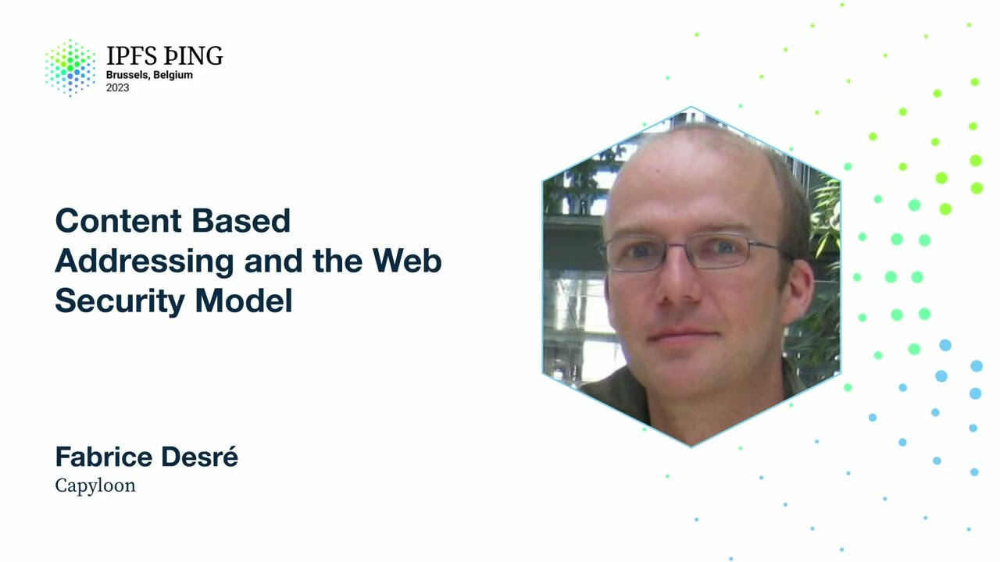

# Content Based Addressing and the Web Security Model - Fabrice Desré

<https://youtube.com/watch?v=H_1JVGDnctI>

## Content

Fabrice, I've been working on the web for probably too long. I want to talk today about

some challenges that come from the current security and privacy model of the web and

how content-based addressing can provide us some solutions to come up with something better.

So I'm going to introduce some principles of web security, web privacy, describe some

solutions we thought about, well, mostly Robin, and the implementation that I started to do

in the context of Capilune. And based on these experiments, some initial thought about is

that a good idea, is that something we should push forward with.

So the web security model, a quick intro, I mean, the web is like almost 30 years old

now, and that's a pretty amazing platform in terms of like, you can still load content
that was created back then, in the 90s. And so it has evolved to be ready for new use

cases, new kind of apps, new APIs, and all that has been done while maintaining some
kind of pretty good backward compatibility, which is quite amazing. If you think about it, I think the only other platform that can pretend to do as well is Win32, which is kind

of amazing because that's a very polar opposite in terms of openness overall, but they've
been doing a good job at backward compatibility. So when you think about web security, people

always think, oh, it's very complicated, it's not done the right way, and so on, but keep
in mind that it keeps running the thing that was done in the 90s. So that obviously comes

with a bunch of constraints. And one of the most important principles for

web security is what's called the same origin policy. So it's a set of rules that describes

what happens when you want to mix and match content that comes from different origins, an origin being, roughly speaking, a different server or a different host name. And this

principle states that only the site that stores some information in the browser may later
read or modify that information. So it's not just like fetching content from some other
places. It's like what happens once you've fetched some content. So for instance, if

you load an image, you can load cross-origin images. You do that all the time on the web.

But if you load an image from a different origin, you cannot read the pixels of this
image. You'd get a security error if you try to do that.
Scripts are also very interesting in that regard. You can load scripts from various

origins on the same page. And all the code ends up being in the same namespace, which

is kind of good sides and bad sides. So obviously that makes it easier to combine libraries

together. But that also means that you can have conflicts. And without the same origin
policies, that would mean that a site from a malicious origin could exfilter information

to its own origin. With some APIs, you can just not retrieve

content cross-origins, like with XMLHTTP request or fetch. We'll see how we can actually do

it later. And from iframes, you can use postMessage if you're cross-origin, which means that both

sides can verify who's sending messages. So one issue that you can run into when you

load scripts from different origins is that you have no real control over what is being

sent to you by the server. And same for images. There are countless examples of people replacing

some image that was used by other websites, like for fun or just to show that you should

maybe not use content that is not under your control. But for scripts, it can be pretty bad if you end up with some malicious script instead

of what you expected. One way to work around that is to use what is called sub-resource
integrity, which is basically specifying the hash of the script that you expect to load.

And the browser will load the script, verify the hash, and only actually instantiate the
script if the hash matches. I guess that looks fairly close to CIDs for

people in this room. And that's pretty close. You get a hash, and you describe what kind

of hash it is. It's all in plain text, right? But it's very similar. That means that the

browser can actually do integrity checks in some situations.

Of course, you have the issue of bootstrapping that because of the page that contains this
integrity value needs to be safe. But that's a first good step.

So we've seen that the same origin policy prevents you from, in general, loading cross-origin
data. And sometimes it's that use case is where it's legitimate that you want to do
that or that the third-party API is actually a site you trust or you want to trust. So

there's a mechanism to allow that. It's called cross-origin resource sharing. It's something

that people are usually pretty wary of. The rules describe how it works as a bit complex

if you look at the specs. But overall, it means that in some situations,

the browser will not fetch directly the content. It will first send what is called a preflight

request, which is a special HTTP options request. And the server can respond with a list of

origins that are allowed to load content from this server. So on the server side, it's relatively easy now to set up. I think all the server-side

frameworks have support for that in some way. So you can configure your server to accept

cross-sharing. I think the main difficulty is to know how granular you want to be. It's

very easy to allow everyone to fetch. It's a bit more tricky when you want to do something
more specific. Then you have a bunch of security issues

that can come from side-channel attacks. And it's both interesting and very tricky. It's

everything that can happen without using an explicit API. It's stuff that we have to defend

against. It's like finding ways to extract information based on indirect observation

of behavior of the browser, basically. And usually, that's something that people try
to do to learn about user navigation, about data that has been loaded from other sites.

There are a bunch of various classes of attacks. In the old days, there was cache timing attacks

because you could try to fetch content. And if it was coming back very fast, it was very
likely to be in the browser cache, which meant that you had visited this website before.

That has been mitigated by all the runtimes by using a technique called double-keying
of cache entries. So, instead of using just the URL of the resource when you put it in

the cache, the key that you use for the cache is the URL of the page, the referrer, and

the resource itself. Which means that you end up with multiple copies, potentially in
the cache of the same resource, but at least you cannot guess that much.

There were attacks for the history stuff or looking at CSS computing values. Because when

you have a link in a page, you can use CSS to style it differently based on whether the
user visited the page before or not. And so, an attacker could just create a page, put

links in it, and guess if you had been visiting these sites before. That has been mitigated

also by a bunch of different techniques, like lying, basically, by sending back fake information

as computed values, and by preventing some CSS selector from having any effect.

There's a very good write-up about that by David Barron. He implemented the fix initially.

And it's really very interesting. There are even craziest ways to do stuff, like data

extraction, like using SVG filters and figuring out how long they run. So it's a constant

cat and mouse game between attackers and browser vendors that try to find ways to prevent that
from happening. It looks very much like in the cryptography world, where you want your

algorithm to run in constant time, if possible. If not, you use some other techniques.

So one way to have more control over your website security is to use content security

policies, CSPs. And that's something that a site developer can use to prevent third-party

attacks by reinforcing rules about what kind of URLs can be used for loading scripts or

style sheets, or basically anything you can load, even fonts, workers, any media file,

and so on. You can also define navigation patterns, like preventing a site to navigate
to some third-party origin. You can decide what kind of form actions are allowed. You

can control mixed content blocking. You can add sandboxing, similar to what we can do
on iFrames. So that's a pretty comprehensive list of capabilities that you can turn on

or off, mostly with CSPs. This is configured by either a HTTP header, or you can use a

meta tag in your HTML page. That has the same meaning as a HTTP header.
And one very useful feature there is that you can enable some reporting of CSP variations.

So you basically specify the URL of a server, and when something is happening, the browser

will post content describing the policy variation to your server. So if you run a site that

accepts third-party content, like user-generated content, it's a good idea to turn on reporting

to know if anything is happening. So a quick recap. I think overall, it's a

pretty good situation. I mean, it's a pretty comprehensive suite of mechanisms for web

security. And so that was mostly what I described before, a set of designs and APIs that we

can use. Browser vendors can add more implementation-specific measures. Site isolation is... Jan talked a

bit about it. It's making sure that every origin runs in its own OS process. And that's

mostly the push for that happened when we've seen CPU bugs that led to data leaks across

processes. So yeah, Blink, Gecko have site isolation. I'm not sure about WebKit. But

that's coming everywhere. That causes a lot of complexity in web run times, especially

when you do navigation or when you have multiple origins loaded in the same page because of iframes or workers and so on. There's also OS-level sandboxing with SEPCOMP, BPF, various

secured IPC mechanism, address space layout randomization. All that kind of things are

used to mitigate code execution attacks mostly. Browser tends also to use different processes

to run code that we know is a bit more subject to attacks. Typically, like now, any media

decoding usually happens in its own process because we know that media decoders are good
at a fairly high attack surface level. And GPU code also now. So all that is to make

sure that you can run untrusted code safely. So that's good for the users. And also that

ensures that sites are sandboxed from each other so that if you run a site, you're protected

against some malicious third-party website getting data from your origin. But that doesn't

tell anything about how a given site protects their own users. Because that part is mostly

privacy. It's not much security. And privacy and security, they go together, but they're

not the same. Of course, you cannot have privacy without security because once your security
is broken, everything is off. But even if you have very, very good security, you may
have absolutely no privacy. I'm honestly sure that Google has probably the best security

on their servers and so on. But you don't have much privacy with them because they don't

consider themselves part of the privacy threat model. So privacy is mostly about user agency,

which means like individual autonomy, making sure that people can make choices that they
understand. And that means that you should not ask users stuff that they cannot give
meaningful answers for themselves. That's kind of limiting in some ways. At a broader

level, there are some features like tracking protection, fingerprint protection, that you

can ask people to make choices. It's kind of like usually you see the results of your

actions there. So like some sites will break and you can help them saying, hey, try to

disable tracking protection and see if it works better. Permission prompts are another
example. So permission prompts are actually very interesting. You can ask people and prompt

them if the prompt leads to something that is really meaningful, that is like something
that you can clearly understand. So here's a classic example of you're using a video

chat service and you can be prompted to decide whether you give camera access and microphone

access and which one you choose. It's very clear what's going to happen. Same for geolocation.
If Google Maps asks you, do you want to give your geolocation access, it's very clear what
can be the consequences. But for some situations, it's not really usable.

When we were working on Firefox OS, we had a lot of new APIs and I would like to consider

Powerful slash Dangerous that were useful to bring web capabilities a bit more up to

par with what's called native. And that's a bunch of capabilities you don't want to
run by default to the web at large. But you cannot either ask user for consent because

it's too technical or it just doesn't make sense. Like we have a TCP socket API. What

does that mean to ask a user, do you want to let this page use TCP sockets? What is
it going to do with this socket? Where are you going to connect to? It makes no sense.
You cannot make a decision. Even us that are very technical, we would not know what to
answer. So people have been thinking about solutions
about to solve that problem for a while. In Firefox OS, we decided to go with signed code

and signed package code, basically. So these Powerful APIs were only usable for code that

was signed by Mozilla, basically, and packaged. Then you would install your package and locally

we randomized origin to this code. So you can locally link to it. It solves the problem

of not granting API access to random untrusted code. But we lost linkability overall because

you could not link to an app from the open web because you first need to install it.

And anyway, you cannot get CUL. So that was kind of a problem. But at the time, we didn't

really figure out a better solution. Around the same time, our partners at Google
couldn't actually find solve a more board Later Goog s started what somepped like projects. It's

employerA fixture Of  Burtonantee 52 50 Weil foundation were very Puerto Rico on 여기에 electrolink 53 portfolio ưa when that kind ec Burgdorfer is w And we always disagreed with that on the Firefox side.
And mostly because we disagreed on the threat model. We always ask them, what happens if the server is attacked by, and compromised,
and it starts to serve malicious code? How do you protect your users against that? Usually the only answer they had is like, well, we have the safe browsing service, so it should catch that. But it's catch stuff after the fact. And at the same time, they were pushing for something like WebUSB, where you can do something like refreshing your phone with it. I mean, if it takes a week to detect that someone has compromised the server, serving new Android images, there's some real damage done. So they would say, yeah, it's a trade-off, we know, blah, blah. Well, last year, or yeah, probably last year,
Google started to push something called isolated web apps. And it's actually just a Firefox security model. We visited to just use web bundles instead of zip packages. But apart from that, it's exactly the same thing. Yeah, so you have signed code that is packaged in a web bundle with a CSP. Very, very similar. Yeah, so web bundles, they come with their own challenges. I think this effort by Google is a bit tainted by their previous AMP work. So I'm a bit cautious about what they are doing there. And so, once you add this signed code,
one issue with the signing mechanism is that the signature is used for both verifying the package integrity, you could verify that the code has not been changed, but also as a trust on code. Like you would say, okay, it's been signed by Dietrich, or it will be, yeah, and so you trust your code. Anyway, you have the same, you use the same mechanism for two different purposes.
That are integrity and trust chain, which is not great.
So we need something a bit better there. And a full trust chain is very complicated. Like if you go up your software and hardware tool chains,
hardware supply chain, it's very hard to trust everything.
So you have to make a choice, decide what your threat model is. And I think for like everyday people, if you're not the target of some state agency, you can consider that you can trust your device at the hardware level, trust the OS vendor and the web runtime founder. They probably are not malicious against you. But you still want to make sure that no malicious code is being served, executed, and no private data is being leaked. So that's still difficult. We, I don't think the current model of the web has any good solution for that. So, yeah. A few months ago, Robin sent a proposal
about something in this space called web tiles. And honestly, when I read it, I was like, why didn't we think about that sooner? That looks pretty obviously a good solution, at least for some of these problems. So I'm gonna introduce a bit what this is about. So it's a different approach to this permission packaging problem. Instead of starting with a state where we are kind of unsafe
and we want to close the gaps, we start with a very safe by default state.
Okay? So that means that like a web tile is safe by default. You know that we are gonna use mechanism to ensure that it provides you privacy.
We also, because they cannot leak data, we can then count them very powerful APIs. They can access anything on your device. If they cannot leak it out to the world, it's fine to let them access stuff. There are some nuances to that, like user consent still can be required to prevent like fooling your device with data or so on.
But it's much easier to figure out than with the open web.
Content traceability, that gives you integrity guarantees. So that's very nice. That doesn't solve the trust issue. I think we need to figure out the trust part independently.
And mostly because for me, trust is as much a social issue as a technical one. So we can do that in a very different way. Maybe you can use just your address book to see like if several people in your address book trust some app you can trust it to, and other signals that you could use for that. The web tiles, they are bundled and linkable. So we can use stable URLs thanks to content-based addressing. And we know that we need a set of resources. So even if we don't create a package like a zip file, we need some way to describe that we have a set of resources that are linked together and that make a bundle. So the way that really works, I don't think you need to create a zip as long as you have like the list of resources and you're unsure that they are pinned properly.
So what that could look like is very similar to IPFS, column slash slash URLs.
We can create a tile protocol in there. And we use a very strict CSP so that we make sure that all documents using this tile URLs won't be able to access remote content.
We can install them or restore them in the user agent. The demo I will talk about for that, we just leverage the PWA, Progressive Web Apps manifest with some extensions. So that means that we are very much reusing a lot of the existing web stack. It's a fairly minimal addition. It's kind of a customization. We have a custom protocol handler, dedicated CSP, but we use the CSP mechanism as it is. So it's very much into progressive improvement. It's not like a radical departure saying we are throwing everything out. It's what can we do to improve the current stack with this new mechanism? So yeah, it's important to consider what kind of capabilities you can provide with that. Because once you have something that is limited in a way to local content, you have to think about how does that fit into the web at large still. So Robin talked a bit about web activities
and a key piece for that, like activities are similar to Android intents. That means that you register some capability saying, oh, I'm an app that can, or I'm some kind of code that can provide some function.
And several of these apps can be installed and if some other piece of code requires this capability,
we will let the system or the user choose which app can be used for that. So it's very open because you don't have to bake the list of capabilities in the runtime itself. It's very flexible. You can define them as you go. Tiles also can be run without a user visible UI, or you can have a UI. And that's possible, we'll see later,
because of the way it is implemented. Discovery is important. I think it's a bit tricky to do in a way that is not centralized, but that's still something that needs to happen. Inserting, sharing tiles is important too. So based on these ideas, I started to prototype
around the tile protocol handler in Capilune. So just a quick recap about Capilune. It's a very experimental web-based OS. It's based on the Firefox OS code base, but with additional support for distributed web protocols
and mechanisms, so we have support for IPFS,
IPNS protocol handlers. For that, we use a local IPFS node on device that is based on number zero, previously called IRO,
now called Betel code. So that's all the Unix FS, basically, IPFS code.
We use the IDs and UCANs for permissions,
and the IDs mostly for user IDs.
We can pin content to third-party providers. We started with SQRE, but we could do web-free storage or anything else as easily. We can exchange locally content using the local node,
and usually you just create a QR code that has the IPFS URL, and you can exchange locally
content like that. And now we have tiles. If you want to try it, we have builds available for some Android devices, some Linux phones, like the Pine phone and the Librem. And the easiest way to try it, actually, is on desktop. For Linux, Mac, it's very easy to set up a test environment.
So the tiles in Capilion, what we did is that we added a tile protocol handler in Gecko, and it's configured to use a default CSP, which is very, very strict, very restrictive in terms of you can do no outside network access,
except for some WebRTC things that we need still.
The installation is very similar to a PWA installation.
The only difference is that we have an additional step at the end of the installation, where in the manifest, we added the list of resources that are part of a tile. And so we will make sure that we fetch not just the manifest but all the resources that are needed to run that app, so that we ensure that the app is pinned locally in the block store of the IPFS node. And we leverage the web activity support that we already had in Capilion. So there are three, nothing specific to tiles there.
The interesting thing is for headless support is that when you call a web activity, the provider actually gets an event dispatched to a service worker. So at this level, you can decide if you need a UI or not. And if you don't need a UI, you just have a headless service worker running and returning data if needed. To help with all creation and installation flow, there's a tiles app now in Capilion where you can choose existing tiles that are already installed on your device or some sample ones
that we created and do some fairly basic editing
and changes locally before you publish them or that you try them. What? So yeah, a few use cases quickly. The first one is that it's a headless one. So in Capilion's home screen, when you use a search field that pulls data from various sources internally, from the navigation history, from your contacts, from apps installed and so on. Now we also can use a tile to provide results there.
So here, the sample use a universal calculator converter
that can do a bunch of things. So here I'm just converting Celsius to Fahrenheit
to do some baking, and that's pretty useful. It shows that you really don't have to do any UI-specific work, and you can embed any code as such. Yeah, it's compiled to us. The second one is showing more like document editing, processing, all the media files in Capilion
are exposed through a virtual file system. And in the file manager, now when you have an image, for instance, you can use a tile to edit the image. So here I just opened the logo in what we call an inline activity. So the size is a bit smaller than full screen. And I just inverted the image color, and you end up with the updated version of the image. Here also, yeah, it's done using mostly Wasm code for the image processing. But you could plug in whatever you want. And everything is done on device. Nothing leaves the device. The last one, I think it's a bit more involved,
but it's very interesting. So it shows what you can do with two devices. So we have capability in Capilion to do device discovery and pairing. So it's just using MDNS to do the device discovery. So here I have a scenario with a phone and something that is more like a media center. So the device, we can consider that on the first
that we paired the two devices. And then in your contacts, if you have a contact matching the other device, you can see that you have this green button that says Launch App. And that means that you can launch an app that will work on both devices at the same time. So the target device will accept it. And then the SDK helps with setting up
just a communication channel between both devices. And here I use that to, first we send the tile to the remote device. Remote device doesn't even know initially which app really will run. So the phone that has published the tile sends the tile URL to the media center. The media center fetches everything, install locally, launch the app, and we set up the communication. And it's like 10 lines of JS for the app author because the SDK does most of the setup behind the scenes.
And then once you have this communication channel, you can do whatever you want between both instances. In this case, it's a very basic remote media player. So I can pick up a local video file
on the phone side. I just expose it using the new IRL to test the streaming capabilities. And technically I send a ticket representing this media stream to the remote side, and it just plays it. And that's pretty amazing. That's something I want to do just to replace my Android TV. And it looks like it's very promising in this regard.
It should work. But it's just one sample. Once you have two devices paired and a channel established, you can do multiplayer games, whatever you want. So what we should do next, there's still a lot of exploration to do around what kind of content or what kind of apps you can build with that. Games, content archives. You could even embed indexes with your tiles so you can get them being searchable easily. You could do mashup with local data. You could do filtering or recommendation algorithm for social feed applications. Like I would love to have a way to customize my Mastodon feed. Right now it's very limited. If we could embed something like that, that would be nice. And I guess, yeah, I'm sure people will have a lot more ideas. On my side, I still have some questions that are not answered yet. That's the question of discovery. Yeah, we need a way to find tiles. But do we want to have a centralized search engine kind of directory? That doesn't look great, but is there anything better right now? We also need to be able to provide updates to tiles. And that means that we need some kind of mutability story,
but we also need some pretty stable naming. So yeah, that's it.

whole problem around mutability. But it's very important to get updates. You cannot think that shipping software that cannot be updated, even just for bug fixes, that's not acceptable. And I wonder if there's something to do in the computable data in general with tiles, because it's very much a different way of bringing data and code together. So maybe there's something to explore around that.

And yeah, that's it. Thank you.

