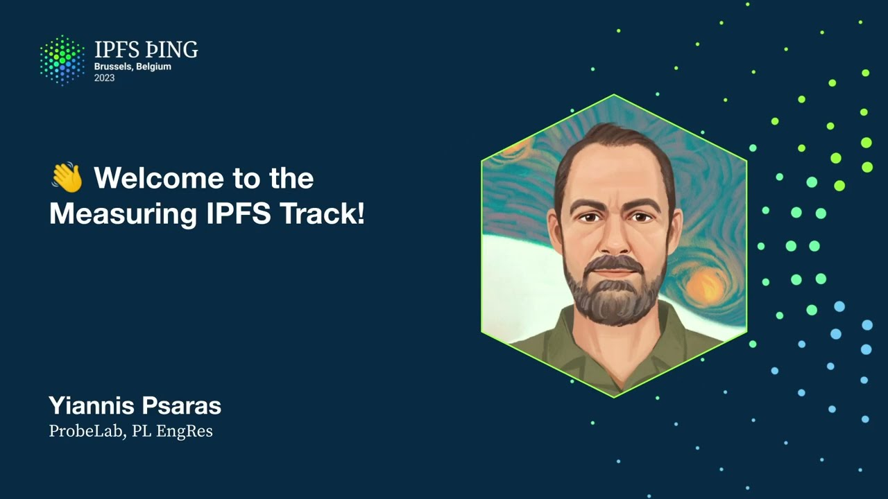

# Data Driven Protocol Design and Optimisation - Yiannis Psaras

<https://youtube.com/watch?v=O8Nk1FN04Q8>

## Content

Hello, everyone! Welcome to the Measure IPFS Talk! I am Janiš, I lead the ProBeLab effort

in PL Engeres, which is composed of a few people within PL, but also a very exciting

and vibrant community of outside collaborators, which is great to have worked with us.

Yn y cyfres cyntaf y diwrnod,
byddwn yn rhoi'r cyfathrebu o'r hyn rydyn ni'n ei wneud a'r pethau rydyn ni wedi'u gwneud yn y diwethaf, yn y diwethaf ddeg o'r cyfartal. Ac ar gyfer llawer o'r pethau rydyn ni'n eu cyfathrebu, yn un sglaen, bydd cyfres cyfan ar ôl. Dyna pam na fyddaf i ddim yn mynd i'r deunydd. Ond, wrth gwrs, gallwn ei ddibynnu ar y Q&A. Yn y diwedd, rydyn ni'n mynd i gyfro'r rest o'r sgwrs
a gwneud ychydig o siaradwyr. Fel y sboniodais yn y sesiwn cyntaf,
mae'r broblem yn ddatrys dylunio a chynllunio ysgrifennol.
Dyma'r cymorth sydd gennym ar y gyd, a dyna'r hyn rydyn ni'n ei ystyriedu. Mae'n ffordd arall i ddweud ein bod ni'n cymryd a chynnal
data protygol o rhai rhaglenau sy'n gwneud y gweithle APFS.
Nid oes un system rhwydweithredol, nid oes un protygol, mae llawer. Rydyn ni'n ceisio edrych i'r deunydd o'r holl rhain.
Iawn, efallai y bydd pethau'n gweithio. Yn aml o gyfansoddiadau, rydyn ni wedi deall bod pethau'n dweud nad ydynt yn gweithio yn y ffordd rydych chi'n ei gobeithio eu gweithio neu'n y ffordd rydych chi eisiau eu gweithio. Felly dyna pam mae cyfnodau i ystyriedu cyfnod a edrych
i ddata yn bwysig iawn. Nawr, nid yw cyfnod ysgrifennol yn cyfaddef rhaglenau a protygol yn unig am y cyfnod, ond yn y bôn, mae'n unig ffyrdd i'w gysylltu, a dyna i ddifrinio'r gwyrdd, gweld pa bethau ddim yn gweithio fel y dywedwch iddyn nhw gweithio, a chynllunio optymeseg protygol. Dyna pam mae ein tîm yn gwneud nid dim ond y cyfnodau, sy'n ymdrech i'r bwysig cyntaf, ond hefyd rydym yn cymryd optymeseg ar gyfer yr hyn rydym wedi'i weld.

Felly mae'r gweithlo yn gweithio fel hynny. Efallai y byddwn yn cael hypothesiad ymchwil, a gallai fod yn dylunio'r cyfnod o ymgyrchu, neu yn gyffredinol, hypothesiad am sut mae pethau'n gweithio a sut yw'r protygol yn ei dylunio. Gallai fod yn ffactau neu gweithwyr sy'n digwydd yn y gweithle IPFS. Yna, dyma'r cyflwyniad i dylunio'r methodoleg ymchwil,

sy'n cael ei ddatblygu. Mae'r cyflwyniad yn cael ei ddysgu, yn fwy o bryd na allan yn y byd, yn y gweithle IPFS cyhoeddus. Mae gennym ychydig o gyfleoedd lle rydyn ni wedi defnyddio ymchwilion hefyd, i ddysgu a ydy'n tebygu a yw ein meddwl yn ddifrwyddiol.

Yna, rydym yn analysu'r cyfnod, ac yn aml, wrth gwrs, fel y gwyddwch, yn y cesau hyn, mae angen i chi ddod yn ôl i'r stadeion cynnig er mwyn sicrhau bod chi'n cyflawni'r gagweddau, ac yn ymwneud â'r gweithle IPFS. Yn y bobl, mae'r methodolegion rydyn ni wedi'u defnyddio yn ymwneud â'r tri hynny. Rydyn ni'n croen y gweithle, y gweithle IPFS, yn y bryd, y DHD, ond rydyn ni'n mynd i ddatblygu ar gyfer eraill. Mae gennym ychydig o gyfleoedd o brobes, sy'n nodau, yn y bôn, sy'n rhan o'r gweithle IPFS cyhoeddus, ond rydyn ni'n eu cyflawni. Rydyn ni wedi'u gynnal, efallai y maen nhw'n rhannu rhai sgriptau, maen nhw'n gwneud mwy o logi, neu maen nhw'n gartrelu data yn ogystal â'r hyn rydyn ni eisiau ei wneud. Mae hyn yn bwysig iawn, a'n angen, rydw i'n dweud, yn y sefydliad cyflawniadwy. Mae'n fwy angen i chi ddod o hyd i beth sydd y byddwch chi eisiau ei ddod o hyd yn y gweithle cyflawniadwy, lle nid ydych chi'n cyfathrebu'r nodau neu'r llyfrgell
sy'n mynd allan yno. Mae'n fwy angen i chi logi popeth sy'n digwydd yn y gweithle. Ac mae'r trwyloedd yn drwy logi. Felly mae cynlluniaeth yma nad ydyn ni'n gweithredu fel tîm, ond os ydyn ni'n cael logi allan o hynny, gallwn fynd i analu a chynllunio beth yw'r rhifau llyfrgell mewn gweithle cyhoeddus IPFS, er enghraifft. Mae'r wybodaeth pwysig yw hynny a allai ni ddweud llawer am y cyflawniad o'r gweithleau a'r gweithle yn gyfan. Rydyn ni'n adeiladu eraill, felly mae cyfnodau eraill fach. Mae hyn yn ystod y methodolegau o sut y gwnewn ni'r gwaith, ond mae cyfnodau eraill arall sydd gennym, a fyddwn yn eu hysbysu i fynd ymlaen i'r cyfnod o'r gweithle.
Er bod cyfnodau ar y rhan o'r meddyliad, fel y dywedais, mae cyfnod a chynllunio. Felly ar y rhan o'r meddyliad, ar gyfer y chwmniau diwethaf ers 22 o'r cyfnod, rydyn ni wedi gwneud ychydig o bethau. Roedd y cyfnod o ddiflannu'r hydrach os oeddech chi'n dilyn hynny. Roedd ym Mhoblithu'r Pwyllgor 2022 yng Nghymru, roedd gennym gyfnod sy'n dangos bod y cyfnod o hydrach, y cyfnod o gyflwyno'r hydrach sy'n cael eu rhoi i'r gweithle, nid yn eithaf fawr fel yr oeddem ni'n gobeithio ei fod. Felly roedd hyn yn mynd i'r hyn y byddai hydrach yn cael eu hadeu a'u datblygu. Felly rydyn ni wedi penderfynu eu rhoi i'r cyfnod a gweld a oedd pethau'n mynd i'r hyn neu bod gennym ymdrechion anerbennol. Nid yw'n siarad cyfan, ond rydw i'n mynd i fynd i'r hyn yn fwy o ddetail yn siarad rydw i wedi ei gael hwnnw hwnnw. Ond yn y bôn, er bod hydrach yn rhan o'r gweithle, nid ydyn nhw'n darparu y ffynoniaeth o ddiflannu'r cyfnod sydd eu defnyddio, felly nid ydyn nhw'n darparu a rhannu eu recordiau. Un peth arall y gwnes i oedd campeiniad o ffynoniaeth ar ddiflannu'r cyfnod. Os wnaethoch chi'r hyn ar eich cyfrifiadur, mae'n dda oherwydd y gwnaethoch chi rhanio yn y swyddi, felly diolch yn fawr. Ie, diolch os nad ydych chi. Roedden ni'n cael llawer o bobl yn rhanio. Mae yna siarad yn y ddiwedd gan Max yma ac roedd yna siaradau eraill am y cyfnodau hwn. Rydw i'n mynd i gwneud ychydig o'r rhain i Max i ddweud ein bod ni wedi cymryd mwy na 6 miliwn, roedd mwy na 6 miliwn o ddiflannu cyfnodau cyfnodol wedi'u ceisio ac roedd y cyfnodau cyffredin rydyn ni'n ceisio cydweithio i gael yn y bôn ar y byd, fel sy'n dangos ar y map hon. Ond ie, os ydych chi eisiau gwybod mwy am yr ystafell cyfnodol a phosib, roedd y cyfnod hwnnw yn gweithio ac os ydych chi eisiau gwybod nad oedd, yna edrychwch ymlaen, rwy'n credu bod e'n ar ôl gynhyrch ar unrhyw bryd. Yna, mae cyfnodau sy'n digwydd yn y cyfnodau, fel y gwyddwch, ac yn 23 Mawrth 2023 ddodd gennym o'r gwasanaeth Christmas i ddod o hyd i bod mwy na 50% o nodau IPFS-DHT oedd yn y bôn anadlawd, sy'n cyfrifol iawn, cyfrifol iawn i'r unrhyw gweithred, fel unrhyw gweithred neu system rydych chi'n ei ddarlunio, os ydych chi, os oes gennych mwy na 50% o nodau yn cael eu cael yna, yn y bôn, rydych chi'n allan o ddyn, sydd nid yr hyn sy'n digwydd gyda IPFS, sy'n meddwl o sôn i'r gwnaethau'n llwyrdoeddol a'r gwaith y system a'i gweithredu. Nawr, eto, rydw i'n mynd i roi, yn unrhyw ddathl heddiw, rydw i'n mynd i fynd i'r deunyddau
am sut y gydag y sefyllfa a beth oedd y gweithredu yn ystod a'r hyn ymdrechon hwn. Nawr, un o'r eitemau ar y rhaglenau recordio'r rhaglenau recordio yw'r ffiliau byd sy'n dod yn nodau'r dynol dynol ar y gweithredu IPFS, a'r ffordd yw pwy ydych chi'n gofyn, dyna'r ffiliau y mae angen i chi ddod os ydych chi eisiau mynd i gael rhyw fath o cynnydd. Felly mae'n gadael wybodaeth am, mae'n cysylltu â CAD i'r cyd-cynnydd o'r gynnydd cynnydd, iawn, felly mae angen i chi mynd a ddod i'r hyn er mwyn gallu cysylltu â'r rhaglen o'r cynnydd. Nawr, wnaethom astudio i weld os yw'r rhaglenau cynnydd yn dal yn y rhaglen ar gyfer amser. Fel y gwyddoch, os yw'r rhaglenau cynnydd

hynny'n ddisapur o'r rhaglen, yna ydych chi'n edrych ar gynnydd, ond nid yw'r cynnydd ganddofodol oherwydd nid yw un yn gwybod amdanyn nhw. Felly roeddem am weld, wnaethom, gyda'r gysylltiadau cynnyddol, bod rhaglenau cynnydd yn rhaid i gynnydd eu rhaglenau bob 12 awr. Felly, roedd ein cwestiwn sylfaenol oedd, beth os yna oedd pob cymorth sy'n gadael rhaglen cynnydd i gynnydd
yn mynd allan o fewn mwy na 12 awr, byddai'r cynnydd yn ddigon ddifrifol. Ac rydyn ni wedi ddod o hyd yw, mewn gwirionedd, bod cynnydd yn dod, fel bod cynnydd yn dod yn byw am mwy o ddwylo. Mae rhaglen cynnydd yn dod yn y rhaglen, rhai ddau ddau o'u rhaglen, fel y gwelwn ni yn y ffigur hon yw o ran 15 i 17 gadewch i'r rhai yma, 30, 38 awr yn unig. Ac mae'n mynd ar am mwy fel roedd y brofiad wedi'i cyflawni am mwy. Felly beth mae'r hyn yn golygu yn wir yw bod eto, dydyn ni ddim yn cael siarad am hwn ym mhob ond roedd yn y camp IPFS yr hyn rydw i eisiau ei ddweud yma yw bod hyn wedi bod nawr yn yn gwneud o ddysgwr 2022 ac mae'n golygu bod os ydych chi'n darparu cynnydd i'r nifer IPFS i'r IPFS DHT
yna mae gennych 50% o rhannu mewn trafig record arweinwyr, sy'n yn ychydig o nifer. Gwynym fod cynnyddau cynnydd yn anodd i darparu y recordau darparu oherwydd maen nhw'n ffiliau fach ond wrth gwrs wyt ti'n gwybod os ydych chi'n darparu miliwn o CAD yna mae angen i chi darparu ar gyfer yr holl hyn. Iawn, nawr yr holl hyn, un o'r targedau o i ni oherwydd y peth IPFS ymlaen yn wir oedd ein bod yn gwneud llawer o'r cyfnodau hyn ond roeddent yn anodd iawn i'w ddod o hyd. Roeddent yn fel gwyndoddom lle roedden nhw, ond roedden nhw yn gweithgareddau gwahanol gwasanaethau gwahanol, roeddwn yn gartref pethau nid yw'n gwahaniaeth, ond doedd gennym ffordd da i mynd allan i'r cymuned neu'r datblygiadwyr neu unrhyw un sydd wedi bod yn ddiddorol i um i i'w gwybod beth rydym wedi'i ddod o hyd. Felly rydyn ni wedi dod â probe.lab.io sydd ar gael heddiw mewn modd ymhellach, felly mae'n ffordd o gwaith gwaith anodd rydw i'n dweud um amser perffaith i roi cyngor rydyn ni'n adeiladu hynny, ac yr hyn rydyn ni eisiau ei fod yn ymwneud â'r ffordd o gysylltiad am cynhyrchion ymhellach o'r ymgeisyddion rydyn ni'n ei wneud. Dyma ddim yn cyfnod i ni, nid ydym yn mynd i cyhoeddi yno unig ein ymgeisyddion ein hunain, felly os ydych chi yn rhywbeth y byddwch chi'n meddwl yn ddiddorol arwain, rydych chi'n gwybod, mae'n rhoi lle a yn cynhyrchu cynhyrchion, rydyn ni eisiau, ie, byddwn yn hoffi gwybod amdano
yn cyfathrebu ein sefydliad, fel y byddwn yn ei gael wedi'i

gwneud ac nid yw prosesau manwl fel y byddwn yn ei gynhyrchu yno, ac mae pawb yn gallu mynd a edrych. Nawr, yr hyn yr ydym am ei gael yno yw, rydych chi'n gwybod, fel o'n dweud yn gyntaf, gallwch ddod o'r cyflwyniad look-up hyn o gwahanol, nifer o rhanau gwahanol, ymgeisyddio i'r graffau i ddod o'r cyflwyniad a'r lle y mae angen iddo chi, ond mae'r peth pwysig yma yw bod gennych y cyfathrebu, nid yw unig am plôd, ond bydd yna gysylltiadau am beth mae'r brofiad yn edrych fel sut oedd sefydliad a, wyt ti'n gwybod, beth a oedd yr gollwng diweddar. Bydd yna hefyd, wrth gwrs, gysylltiadau i'r brofiad, lle mae'r deunyddau a'r codi rydyn ni'n eu defnyddio ar gyfer y lluniau hyn, ac mae hynny'n gwneud eu gwahanol i rhai fel daith gwaith graffana neu pethau eraill. Felly, bydd yn ysgol i ffwrdd ymddisgwyr lle, wyt ti'n gwybod, rydym am glywed o unrhyw un sy'n ddiddorol i gofyn cwestiwn, pam mae hyn yn edrych fel hyn? Ac, wyt ti'n gwybod, mae gennym hefyd cwestiynau ein hunain, felly bydd yn ddiddorol iawn i gael sgwrs agos amdano. Rydym hefyd yn cynhyrchu adroddiadau nebulaidd sy'n dechrau o adroddiadau diwydiannol nebulaidd, o nebulaidd crawler. Nawr, mae'n cynnwys llawer mwy o gynhyrchau nad yw'n unig cyfnod o crawlo'r gweithwyr. Mae gennym bethau eraill yn eu cynnwys yno. Mae llawer o... felly, byddwch yn mynd yno, byddwch yn dod yno o stats.ipfs.network ac mae llawer o gynhyrchau ar hyn o bryd. Mae angen i ni ystyried hynny a ddangos gwahaniaeth, gwahaniaeth ddiwydiannol o iechyd a chyfnod a'r stats o'r newydd, ond nid yn unig, rwy'n siŵr eich bod yn mynd i ddod o gynhyrchu gynhyrchu gwych yno. Felly, rydyn ni'n cyfweliadu gwefanau. Rydyn ni wedi cyfweliadu'r mwyaf o gwefanau ar gyfer PL, ond rydyn ni'n cynllunio i fynd allan o'n wefanau. Rydym yn cymryd y cyfnod o ein wefanau trwy'r llwybr trwy Kubo yn ymwneud â HTTP. Mae'n ddiddorol gweld bod y gwefanau mwy o ffyrdd yn llwybr mwyaf drwy Kubo ym mis hwn yn hytrach na drwy HTTP, yn unig o ran cyfnod cyntaf. Mae'n gwella cymryd i'r misoedd diwethaf a rydyn ni'n edrych ar gyfer gwella'r SLAau a gael gwasanaeth a dim oedranion yn 99% o amserau. Ie, felly mae hwn yn cyfnod o'r newidion o'r ddau blynedd diwethaf o'r tîm o ran y cyfnodau. A dw i'n mynd i'n gyflym drwy'r gwaith optymeseg yr ydym wedi ei wneud y ddau blynedd diwethaf. Nawr, fel rhan o'r rhan gyntaf a'r cynnydd, efallai yw cymorth fawr i gael prifatiaeth ddifrifol DHD. Mae sbeg, un IPIP, IPIP 373, sydd hefyd yn ei gynnal ddwylo'r DHD, oherwydd y mecanigau o sut mae'n gweithio, a yw'n enwog yn unigol iawn neu ddim, dw i'n mynd i'w gosod ar gyfer sesiynau eraill. Felly mae ysgolion hwn wedi bod gan Guillaume yma, a mae wedi bod yn mynd ar y tro, fel y gwelwch, ymgyrchau byr, llawer o gweithredoedd, llawer o argyfwng, llawer o adroddiadau, ond ddatblygiad pwysig iawn ar gyfer y cymunedau IPFS a LLPTP. Felly, mae cymorth fawr o'r cymorth, sydd, fel y dweudais, yn golygu cymorth client, pan fyddwch chi'n gofyn rhywbeth o'r rhwydwaith, ar hyn o bryd, mae pawb yn gallu gwybod pa fyddwch chi a'ch gofyn. Yn y dyfodol, dyma ddim, fel pan fydd hwn yn dod yn y bryd, dyma ddim yn mynd i fod yn gallu arall, trwy gysylltiad o bethau gwahanol. Nawr, cyfrifiadwr, sydd pan fyddwch chi'n host cynnydd, pan fyddwch chi'n cyflwyno cynnydd i'r rhwydwaith, ac, fel ar hyn o bryd, yn y dyfodol, efallai, gyda'r cyfnod hwn, bydd yn gallu gysylltu cyllid cyd-gynhyrchol eich hun fel cyflwynor gyda'r cynnig rydych chi'n cyflwyno. Felly, mae cyfrifiadwr wedi bod allan o sgob y gwaith hon, ac, ie, bydd yn cael ei gynnig i gwaith dyfodol. Wrth gwrs, os oes gennych syniadau a eisiau gweithio ar hyn, rydych chi'n fwy na ddim yn welcom, mae'n gwahanol gwahanol gwahanol gwahanol gwaith y mae angen i ni ei roi ar y rhodd map ar unrhyw le. Ie, felly, nid yw hwn yn cael siarad yn y diwedd hwn ond mae'n rhaid i ni fynd i'r deunyddau. Fel y dywedais, mae'r sbeg yn yn ddiweddar a'n ddiweddar iawn. Mae ganddo siaradau yn IPFS-CAM 2022 a IPFS-THINK 2022. Efallai bod rhai ohonom yn ymwneud â'r dydd, ond mae'r syniad cyffredin yno a'r un fel y cyfarfodau cynnig, felly gallwch eu gael ar Youtube. Beth fydd yn mynd i fod yn y diwedd hon yna? Yn ddiweddar, rydyn ni'n mynd i roi rhyfau newid ar y myfyrwyr o'r DHD ar hyn o bryd i'r ddwyrydd neu'r un sy'n mynd i roi gwirionedd ar y cyfarfod. Yn amlwg, mae'n newid cyffredin, felly nid yw'n un peth llawn. Rydyn ni'n mynd i'w gysylltu ac mae'n gweithio. Nid yw'n mynd i fod fel hynny. Un newid arall yw 'r cyflwynod optimistig, sy'n cael ei gyflwyno yn ystod y cyfnodau cynnwys. Rwy'n credu ei fod ar gael gyda'r cyflwynod experimentol. Felly rydyn ni'n mynd i ddechrau ei ddefnyddio. Mae gennym gweithdredu cyfrifol i weld pa ffynonellau bydd yn eu cynnig. Yn ystod y cyfnod, mae'r cyflwynod optimistig yn gwneud yn fwy gyflym y gwnaethon ni cyflwyno cynnwys i'r rhwydwaith. Rwy'n credu bod rhai gweithdredu yn y cyfnodau cynnwys lle mae'r amser cyflwyno gan gyfnod Cubo ar hyn o bryd yn cyfrif llawer o weithdredu, tynedd o gyfrif, sy'n, wrth gwrs, yn fwy cyfrifol na'r cyflwynod cyfrifol, sy'r hyn y mae'r defnyddwr yn ei gobeithio pan ydyn nhw yn ymhell ar eu sgrin, ond yn dal i roi cynnwys a'u rhoi i'w gwarthu am ddwy fwy o fuddydd nid yw'n dda. Felly mae'r cyflwynod cyfrifol yn gwneud hynny yn fwy cyflym a gobeithio y bydd hynny'n cael ei ddod o'r i'n llai na chyd-dwyrain. Mae'n dal i roi cyfnod, mae'n rhaid i ni gael cynnwys, mae'n rhaid i ni gynnal ystyried hyn a gweld os yw'n gweithio, ond nawr mae'n cysylltiad, felly rydym i gyd yn hapus.

So, yeah, a quick check-in from, like, you know, while putting these slides together, I thought, okay, we had IPFS Thing 2022 and we promised some stuff at the end of the event in the road mapping session or whatever it was called, and I was very happy to figure out that we covered actually most of them.

So this is a slide from last year, what I presented at the closing sessions as to kind of what we are committing to as a ProBlob team to deliver in the next couple of quarters.

Of course, in some cases, it took us a little bit longer, but now all these green, all the things marked in green are basically done.

There are a couple that have been left out, either intentionally or because we just didn't get to them. But yeah, overall, I think we did pretty well. So well done to everyone that contributed.

Now, in terms of the road ahead, we have this starmap.site new tool that is a road mapping tool of much of the PLN Dress team, and that's the snapshot of where we are.

We've covered several things, as I said, like we wanted to quantify the high-dress performance contribution. We didn't only do that, but we managed to turn off the high-dress and see what the performance is afterwards.

We measured the not-hole-punching success rate, and we had all the infrastructure set up before that. We're building the continuous measurement infrastructure, which is basically materializing with ProBlob.io, and eventually everything is going to be kind of under the umbrella of stats.ipfs.network.

So we're making huge progress there. We want to integrate all of the tools. Yeah, I'll reiterate, if you've got tools as well that you would like to see included there, come talk to us.

We have an ongoing effort on IPFS magic numbers, which is what it says, basically fixed hard-coded parameters into the IPFS code base, and we're doing a big effort to see if those parameters are correctly set or if they need to be set differently.

If we can make them be dynamic to avoid having hard-coded stuff in there, and generally provide, through doing this process, we want to do optimizations primarily to the DHT, which we found a few.

One central thing that we are going to be focusing on in the coming quarters is measuring and evaluating the performance of GossipSub. GossipSub is the PubSub network of LibP2P, and it's used very widely in the Filecoin network to transfer blocks and messages, but also nowadays in the Ethereum 2.0.

So very central protocol with high utility across the board. So we want to go deeper into it and figure out if it does what we expect it to do. And I hope we're not going to see this broken pipe there. Everything should be in place.

So a quick summary. To summarize, IPFS has got lots of content routing subsystems. We don't have the capacity to focus on all of them, not now and not in the near future.

But we do plan to expand and go and look into other systems. But of course, help is welcome, so we should work together with other teams to get closer to covering the whole spectrum.

Again, two places to monitor right now if you're interested in those results. Stats.ipfs.network links to weekly snapshots of the health and performance of the network. Problab.io will go much deeper into lots of the details of the protocol design.

Soon everything is going to be under one, and that is going to be stats.ipfs.network, and from there you're going to be able to link and go elsewhere.

Here are some pointers. I'll post my slides in the Slack channel. And yeah, we've got a notion page where we track and we keep it as a place to talk about the project, have design documents, have comments around it.

Everything is public, of course. The roadmap that I talked about, we've got a couple of GitHub repositories, one under network measurements, the other under PL Problab, which is our infrastructure mainly, so maybe not of that much interest.

And we hang around the Problab channel at the IPFS Discord and Filecoin Slack. I am JanisBot there, so if you want to reach out to me, yeah. And that's it. Thank you for coming to this talk.

We've got lots of exciting talks, but yeah, happy to take any questions until then.
Thank you.

