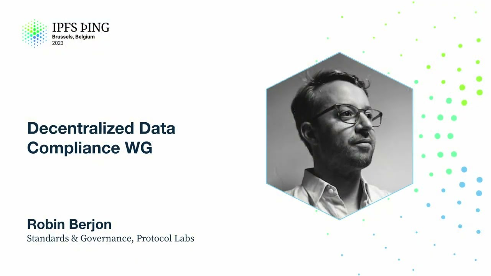

# Decentralized Data Compliance WG - Robin Berjon

<https://youtube.com/watch?v=bIlji91KEFQ>

## Content

Who wants to talk about compliance? Yay! I'm glad that people are excited. So we have this

little thing that's been going on for a couple of months, I would say. Not super actively

yet, it's basically been ramping up. That's called the Decentralized Data Compliance Working Group. It's one of those working groups that we've been talking about that are sprouting up all over the place and that no one knows where to find or what to do with them. It's

been chaired by Juan Cabanero, and the purpose is basically anyone who's interested in this

set of issues, which I'm going to describe in greater detail afterwards, is absolutely welcome to join us. It's been started by a bunch of IPFS Filecoin people, but it's open

to a much broader ecosystem. So what exactly does this working group work on? Well, it's

primarily focused on finding solutions to the problems that emerge once you start to

introduce decentralization into typical compliance problems. So if you're a regular Web2 or even

not Web company, you will have issues with privacy compliance and you might have issues

with... I mean, you would have to be probably a Web1 to have issues with DDPR, with takedown

and the such. But essentially, these are classic issues, but that are made more, let's say,

more interesting by their intersection with decentralized technologies. And so, for instance,
if someone starts storing personal data on IPFS and people replicate that content, who

is the data controller? What kind of encryption and controls might you need to have around
it? What kind of GDPR obligations or CPRA obligations? And there's a shit ton of privacy

regimes out there that we might need to think about. If you run a public gateway, I think

this is a problem that Boris is quite familiar with. How do you handle your copyright takedown
notices when it's not even your content to start with? Or how can you run a gateway such that you won't have that problem? And yeah, I decided to just arbitrarily name the public
network slash DHT because we've been talking about it all day. So I figured it needed a
name there. I didn't know what logo was born. I don't even have an acronym for it. And this whole set of issues like CSAM and terrorist

content and one thing that came up in the meeting yesterday is that, have you thought about libel, which is a horrendously complicated area that I don't want to handle, but that

we probably need to be thinking about. And so, this all ties to the technical mechanisms

that we can use to support some of this. And so, it also has to impact how we govern the

bad bit system in general. There was a meeting of this working group earlier this week here. A bunch of us got
together in the short term. We're going to work on primarily developing an overview of
the issues because what we've been doing over the past few weeks has been mostly like, have
you thought also of that other problem? And, oh, I spoke to my DPO and they think that
could blow up in our face. And so, we have a DPO, sorry, a data privacy officer. Sorry

for the jargon. What, you don't know what a DPO is and you're in a compliance session?
This is a compliance track, right? So yeah, we basically have a big pile of issues on the floor and we want to sort them into
buckets such that we can put our arms around it and start producing solutions or at least

recommendations to it. And so, part of that is figuring out what the problems face is.

Part of that is also understanding how to explain our space to regulators or people,

lawyers, experts in that domain who want to understand and want to help and are often

like glad that we're thinking about it in the first place. But as you know, it's not
always that easy to explain what we do. And I'm going to try to reach out to a number

of people who have faced these issues, but who are like large companies with like, you

know, an army of small army of lawyers to see if they're willing to also support. And
there's a bunch of people who are interested. The group has been steadily growing. Every time someone hears about it, they go like, oh yeah, we should probably be thinking about that as well. And so, you know, then the next steps that
we're going to take is like, so, you know, as Cade recommended that we should be doing

anti-user research. And so basically figuring out ways in which we can make it painful to misuse things. As I said, we're going to build this overview of the problem space so that

we can like chunk it down into smaller issues to fix and also advocate for this. There's

a number of actors who are really YOLO about how to approach these problems. But I really

think that a lot of the companies in PLN and in the broader space want to address this

or at least would be willing to contribute a bit of time to helping address this. And

beyond that, once we figured out what we want to do, they'll depend on where we land, but

I think we will probably try to build things like shared legal notices that people can reuse so that way you're an operator, you know, you need to have this special text in the terms of service. You know, you need to have this specific like privacy process, things

that can be replicated easily, trying to build out best practices. One option on the table,

this is Europe only, but these things tend to have like international influence as well, is that there's a process under the GDPR where an industry can come together and say for these specific problems, that is how we address them and how we enforce the solutions. And

so that could be one outcome. And that's basically it. You know, if you want to come play, the

links are here. It's a friendly bunch and we talk about compliance. It's a lot of fun.

Are there any questions? Yep. Wait, wait, wait for the mic.

There's a lot of infrastructure already out there that can be leveraged today. A lot of NGOs doing a lot of good work that you can work with. I happen to be a technical regulator,

so I'm offering to help your working group and help you move into compliance wherever you want. I'll come out right to you and we can move forward. That would be wonderful. Thank you. Yeah. So for the record, you're with Ofcom, right?
Yep. Yeah. No, that would be absolutely wonderful. Yeah. We actually talked about you a couple
of times at the meeting and we're really excited that you are participating, so we'd love to work with you. Can you post these slides in the shared channel? Yeah, of course. Yeah. Juan? I think this is great. I think there's going to be I think

we were able to close by with a lot of work on this while protocols were smaller and younger
and so on. But with a lot of the data coming into things like Filecoin and so on and the
distribution of network participants around the world in jurisdictions that disagree a
lot about what content should be distributed, it's going to become more and more and more
important. And so I think finding like solutions that work earlier on, even if they're not

like the good long-term thing to do, and then just incrementally improving them, I think will be really valuable. And one other idea that has been looking around the community for a long time is to just separate into like different sets of bad bits that

different communities can subscribe to so that the people that care about DMCA can follow the DMCA list. The people that care about right to be forgotten can do that and so on.

So you can create like different clusters of self-governance around what a deny list

and whatnot should contain. And that might extend all the way into how you implemented
both like the groups, like the oversight over those lists, the technologies that you use
to distribute those lists and whatnot. Yep. Yeah, no, absolutely. I mean, I've had

to intersect a certain amount with safety teams from large platforms over the past few
years. And I mean, I respect what they're trying to do. They're really trying to keep people safe, but I really cringe at the way in which they do it. I mean, their assumption
is you should have no privacy because otherwise we can't protect you. And so that's what I
listed as we want to avoid like becoming a renter cop model. And so yeah, absolutely.

We can't have just one bad bits list, but we should have expectations of each bad bits list that we can always know if it's being kept up to date, for instance, what went into

it, how the sausage was made so that people can then be informed in picking which ones they want. And we don't want operators going like, oh, I'll take all the bad bits lists because that way I'm safe. And appeals. So often the most common thing

that happens, or not the most common, but one of the big common things that happens is things get dragged into that list that should have never been there in the first place and you need a good process for how do you get things out of that list. Yeah, yeah, yeah. Yes. It's going to be fun. Are there any other questions? Well, thank

you very much. Let's move on to the next session then.

