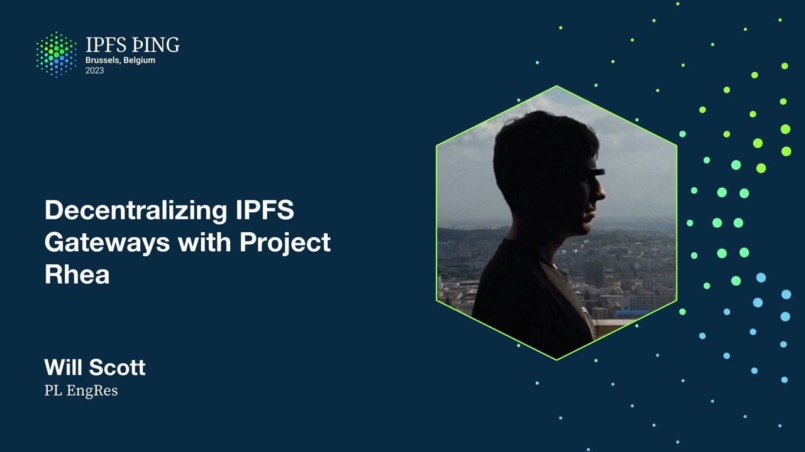

# Decentralizing IPFS Gateways with Project Rhea - @willscott

<https://youtube.com/watch?v=0eJd2aqqSy8>

## Content

So I'm going to be talking about the HTTP gateways, which is an aspect of IPFS that

everyone has probably interacted with, right? You go to ipfs.io and we have a lot of traffic

from web browsers, from current web2 interactions that aren't running a full IPFS client but

need to interact with IPFS. So this is a bridge that currently is operated by a set of centralized
operators and depending on which URL you go to, you'll get a specific operator. So one

of the efforts that a relatively large group of people across a number of teams at PL has
been working on over the last months has been to think about how do we decentralize and improve what that bridging looks like and how do we make the gateways better, what should the next iteration of these gateways look like? To that end, I'm going to start by giving
you a little bit more view into what the gateways look like today so that we can see how do we do better. So when you go to the gateways, you're making requests largely of the form
slash IPFS slash SID maybe slash path after that to get a file or a collection of files

and those requests first go to a load balancer and then the load balancer sends it to an

IPFS node that looks like the IPFS node that you might run on your own computer. It's tuned
differently, it has different configuration, but it is an IPFS node that then goes and gets the content when it doesn't already have it from the broad public IPFS network. And

so when we think about how are we going to do better here, what are our opportunities?
Well one thing that is, well where are these? Can we make it faster? That's a natural thing that we might say is, you know, are there limitations in this current setup? And when

we look at IPFS.io or dweb.link specifically, there are seven locations around the world
where those are. So if I was to access IPFS.io today, I would be going up to the Amsterdam
location. You can see that we're down in Brussels. And when we look at that topology of where
things are, there actually is an interconnect and a data center about six blocks from us.

The Belgian commercial data center is there. Our traffic goes through it on the way up to Amsterdam. And a lot of other CDN-like things that you have, like Cloudflare or Netflix,

are terminating in Belgium and have lower latency than going to one of seven. We can

think about sort of these classes of latency. And so we've got a couple options. We would need to either have a lot more points of presence to terminate these connections closer to users.

And if we want to do that, that's going to cost money, right? Like there needs to be these servers in not just seven places, but in hundreds of places. If we're going to be

able to get that final hop to users faster, we need to figure out how do we get this not

just in these specific data centers. The good news is Protocol Labs already has
one of these CDNs with lots of locations. Last fall, project Saturn launched. Saturn

has almost 2,000 nodes currently. And you can see that it has nodes both in Belgium
and in Amsterdam, or in the Netherlands, along with nodes scattered through many countries

at this point. And so we've already incentivized people to be running servers in most metro

areas. And so there's this question then of can we leverage that to get these final hops,

to get IPFS data and perform this bridge faster for users and make a better experience.

And so with that, project Rhea launched. It has three sort of concurrent goals overall.

We want to be able to retrieve not just from IPFS, but also from Filecoin and have sort

of a broader set of retrievals of content address data and think about how we iterate there. We want to validate Saturn as a CDN so that we're eating our own dog food, but

also validating that this CDN and in practice a decentralized CDN is an effective way to

serve traffic. And we want to reduce the centralization that has ended up occurring of most of the

most traffic going through a PL run entity. That IPFS.io as a website that people have

sort of gotten in their heads is like the place that you could type in and put as a URL. That means you're sort of going to some DNS that Protocol Labs runs. And for many

of the requests, you're trusting Protocol Labs to validate the content that you're getting.
And so from this, we've ended up I think with two outcomes that are worth socializing to

the broad IPFS community. The first is we're going to have a series of iterations of shifting

the trust model. Right now, when the bulk of requests that go over the HTTP gateway

end up getting sort of a rendered file back, right? You want your image, you want your
HTML page, and what you get back from that IPFS.io slash IPFS slash Baffy whatever is

the final thing when you render it in your browser or follow the link today. And when that happens, that final rendering isn't your client revalidating that it's actually gotten
the hash that it asked for. That validation is happening currently on the servers. And
so we want to encourage more clients to get built and that the default should be that
you get back the blocks that you ask for and then locally reconstruct and render and build
the file. And there's a number of ways to do this. One is with service workers. Another is with sort of somewhat thicker clients or just JavaScript libraries depending on how you're integrating that. But if the client validates, there's suddenly a lot more flexibility and we can offer both better speed and cheaper access to content address data and more resilient.

And so that's going to sort of be an increasing carrot in some sense is that if you're willing
to expand your client experience so that you can do validation, you'll be able to get a much better experience. We're also building a lot of stuff to enable this. And so some
that I want to call out that we'll be diving into over the coming days. One is Bifrost

Gateway. So on the left diagram, you see the first sort of stage of how we're thinking

about this change in RIA is that inbound requests from the load balancer are going to go not
to a Kubo node, but to a new piece of software called Bifrost Gateway. And Bifrost Gateway

is a refactoring of the gateway's code that can do the same parsing and interpretation

of client requests. But instead of then being Kubo and taking that into a bit swap combination

with a local block store, it's going to pretend that it has a remote block store and it's going to understand how to make a more semantically meaningful request for the data that it needs

to serve those HTTP requests. So it's going to be able to say, in order to serve this
render directory, what I actually need is the car file with this set of blocks. And

so it's able to describe that in terms of a selector that describes the depth of how
many blocks and in what shape it wants back to some remote backend. And so that's the
request that then goes back to Saturn. This gateway is able to do the verification for clients that aren't verifying yet in the same way that the current gateway does. But it starts to define what we're going to need for the trustless HTTP spec for how a gateway
that isn't trusted is able to serve content. The second big piece that we'll hear about

later today in the data transfer track is a project called LASI, which then is just the fetching part. And so it gets these requests and is looking at how does it get it from the IPFS and from the Filecoin network. It uses IPNI as a primary way to find where content

is around the content addressed universe, and then is able to retrieve, construct into
cars and return the content that is being asked for. And so it's not saving stuff. It

doesn't have a block store. It doesn't have the interpretation of Merkle DAGs in the full
way. So in some ways it's a much lighter and it's able to be embedded as a library within
other pieces of software. And so by putting that into Saturn, we're able to then take

Saturn responses of cars, do the trust when we need to at the current gateways, but also
start to encourage people to talk to Saturn directly because that's how they get the thousands of points of presence instead of just the single one. So that's RIA. You'll hear a lot about it over the next couple of days. There's a lot of people in this room who have been working on it in various ways over the last months. And I'm excited to talk more about it.

