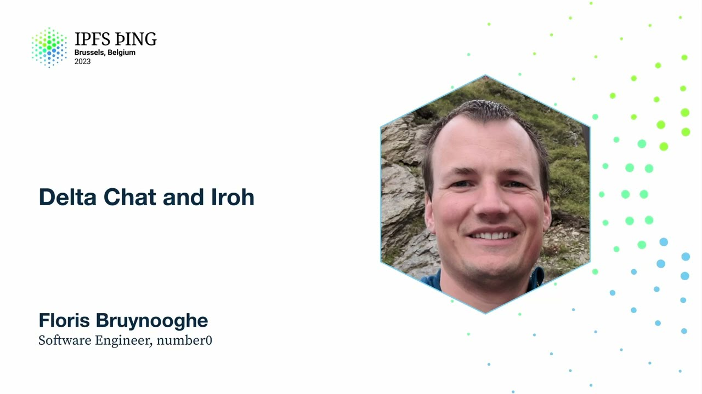

# Delta Chat and Iroh - Floris Bruynooghe

<https://youtube.com/watch?v=E-e758AYkmA>

## Content

I'm Floris, I'm on the Number Zero team. Basically we made IRO and we then managed

to put it into a real application and actually ship this. And that's kind of what I will be talking about here. So IRO, there have been several talks about it already, explaining
more detail on it. I won't go into too much detail here. But yeah, essentially for us

this was like our first prototype. It was really like where do we want to go with building

a content-addressable system that does all the verified streaming, etc. But also what
is like the very first minimal step we can make something useful with. And that's what
this is essentially. This is the first prototype and a step in that direction. So it basically

transfers data using verified streaming. If you missed those talks, they're probably recordings.

It's content-addressable, PHP, and importantly also for us here, it's authenticated.

And then what is DeltaChat? It's basically a messenger. It looks like in the middle of
the screen it's like any other messenger. But it has no infrastructure of its own. It
relies on email infrastructure and any kind of... Well, most people will initially think

like really? That was my reaction to it the first time. But yeah, it works remarkably
well. It really does. Because it has no infrastructure, you can use whatever email service you like.

You can configure your own island. It works pretty well and seems to be fairly popular.

The other thing is also like surprisingly censorship-resistant. It just turns out that

regimes that try and shut down messengers equationally don't shut down email. Because

they can't, presumably. Anyway, relevant to us, it uses opportunistic encryption. There

is also a way of forcing encryption on chats. But by default it's opportunistic. And also

it ships to the three main platforms in this case. It's like Android, iOS, desktop. There's

actually a ton of... The right-hand side of this is all the different downloads you can get, which is more than I even knew existed. So yeah, it gets shipped and it runs on a

lot of platforms. What we care about today for it is like multi-device. Because it just

connects to your email server. It connects to your SMTP and IMAP server. Your IMAP server usually stores your messages for you, at least until you delete them. You can configure Delta Chat to delete messages, et cetera, for you. But if you leave them on there for a little while, your second device already can see the same messages on the server. And IMAP

also already synchronizes the unread state, et cetera. So this kind of works remarkably well if you just configure a second device. Unfortunately, that encryption part kind of

plays a role now. Because when you first set up an account in Delta Chat, you just tell
it the login details to your email server. But then it also generates a private key.
If you do this independently on two different devices, you'll get different private keys and everything breaks. So if you want to use two devices, then you really need to transfer

your private key. The solution that Delta Chat don't for is, you know, is this kind of obvious export-import. It's usually recommended to not just export

the key, but the whole database, like the whole state of the messenger, essentially.
So you actually get all the history and et cetera easily.

So that's kind of what has worked for a long time. But this is very painful if you ask

a normal user, like, export a backup on your phone. Now, where is it? How do I get it to
my PC? No idea. So obvious solution for us, that's at IRO.

And because this is our first prototype, we limited the scope of this very much. We assume
we basically tell you only do this on the same local network. This is not too much of

restriction because usually you have your phone next to your desktop or something when you're doing this, or on your laptop or whatever. Also, it uses out-of-band communication using
QR codes. This is already an established thing. QR codes are already used by Delta Chat for

a couple of other things. Like, if you want to force encryption, et cetera, you do this
with QR codes already. So even though you already have a mixture of machines, like your desktop might not be able to scan QR codes, there are already workarounds for this. You
can copy-paste the text of the QR code and then move that across somehow. It can be annoying,

but it's possible, basically. And it's an established thing, so this shouldn't be anything new for Delta Chat. Another consequence of this is because we are IRO is a content addressable system, is that we essentially, the basic mechanism is

you need to create the backup first to be able to compute the hash. So it's one directional.
Like, you need to, the provider essentially provides a QR code, the new device has to

do the scan. Yeah. That's about the restrictions we set out.

So the other reason we thought this cooperation was really nice was basically the goals are

very aligned. Both projects were already written in Rust. Delta Chat is kind of architected
in a way that they try and do as much as they can in the core library, which is written

in Rust, and then they try and do as little as possible, I guess, in the UIs. So the UIs
are actually then written in Java, Swift, and Node.js, I think, for the desktop one.

And they already have bindings for that. They use, I think, the Java and iOS bindings are

using CFFI. Desktop has a mixture of that and JSON RPC now, I think.

And the interesting thing for us is also, like, Delta Chat has already figured out how to ship this code to all their platforms. Like, they support phones that are terribly old, like Android 4 still, and they already have figured out the tool chain, the compiling,

et cetera. So all the hard work, hopefully, has already happened. Should be easy.
So how to go about this? Iro's main concept is really about collections. So a collection

is just essentially a list of files, or a list of hashes. So currently, basically, it's

a name plus a hash, and then the hash is another blob, and that's then usually a file.
So the plan for the provider side here was to... The database in SQLite, where most of

the data is stored, is SQLite in Delta Chat. So to have something that we need to hash,

we first have to create a database export. Unfortunately, that is still duplicating data on the device's storage. If that's an SD card, that can be painful. But even so... And then

basically we add that to the collection. And then the other thing that's... Usually, if you have large accounts, you have lots of attachments to emails. They're basically like image videos. It's just a messenger. You get all these things like stickers. I don't know

what else. And they all get added to this collection, essentially. Then you start the server, essentially, Iro provider, which is just a network server,
listens for connections, and now you can create a QR code, basically, with all the information in it. So the QR code essentially contains the hash of the collection, so you know what

to ask. It contains where to reach the provider on the network, because you're supposed to

be on the same local network. It contains the peer ID, so you know you're connecting

to the right provider, and you can't be man-in-the-middle. And then it contains also an authentication

code, so again, because the provider is just listening on the local network and doesn't want to suggest everyone to start connecting to it.
So that's the provider side. The receiver side is basically the opposite direction, but fairly straightforward at this point. Gets the QR code, connects to your provider,
requests the hash. Then this whole bio-verified streaming happens, all the files arrive. At
the end of that, you need to import your database into your running SQLite system again, and
you have to start the system again. Start the system is like, because while you're doing this, also on the provider side, DeltaShed has to be a little careful that you're not at the same time going to modify the files. So it tries to stop the system as much as it can, so no files are being modified, because otherwise we get hash changes.
So going about this, we had IRO, basically implementation prepared and made a release.

We also created the DeltaShed PR, basically being what's fully reviewed, had tests, has

a little developer-oriented testing tool in there as well that a couple of people had

tried out, you transfer, et cetera. So everything worked perfectly fine. Transfers worked on real accounts of people with that testing tool. So time to ask the UI developers, the

app developers, to start implementing this on their side. And this is essentially the

QR code, how it kind of looks. I think this is the desktop version. Yeah, straightforward,

hopefully. Like, everything tested, everything works. Or not quite. Even though we kind of tried to do our very best to compile IRO on all

the platforms that we will care about, that still didn't catch everything. New dependencies,
new things breaks. So turns out our quick implementation didn't support explicit congestion

notification on all the, I think mostly Android phones, because the Linux kernel didn't implement

that yet, like send message. So basically figuring out what breaks, what
are the workarounds, and patch the upstreams. It's kind of, they were very nice, so that
was kind of, wasn't too difficult. But it's like hunting down what these versions, et
cetera, works. The next thing is kind of interesting, because how blind we were to this, in a way. So I said, like, initially we said, like, hey,
let's just do local network, right? We don't care about, we don't want to do this discovery yet where the peer is. But then it turned out that when we actually

really tried this on two devices, from a phone to a laptop, to the testing tool running on
your laptop, that all of a sudden we actually didn't do this at all. We were just connecting
to the local host, and we completely forgot about this.
Solution to this is kind of easy enough, in a way. You can bind to anything, but you still
don't know which of your local networks is actually the one you need to connect to. The problem is, if you're on a laptop on your Wi-Fi, you probably have several interfaces.
Your phone will have, like, a radio interface and a Wi-Fi interface and a couple of other things. If you're running VMs on your laptop, you will have other network interfaces probably
for those. So we ended up having to stuff all the IP addresses that we found your local

machine has into the QR code to send over, and then essentially just try all of them

at the same time and see which one connects. Still, the peer ID is verified, so there's
no concerns about that. Shouldn't be too hard. There is even an API

for this. But again, platforms, versions, this was very painful. At this point, we really

tried to actually test on real phones to check that permissions actually would work out.

Turns out, like, on some old version, you could use one technique. On a newer version,
you had to use another technique because the old technique didn't work anymore. And even though we tried this, we ran tests, like, on real phones, when we actually shipped this

when we actually built this on real applications, we still had permission problems with this
in the final application. So that was just a very painful trial and error, kind of, like,
figuring out which techniques work. And yeah, it was surprising that to the best efforts

of our testing, we still couldn't, like, fix these things ahead of time.
Another interesting thing was, like, users cancel operations. That's not too bad. Like, we knew that they would cancel operations. But they, like, go, like, cancel, and then start again. Oh, no, it's canceled again. Oh, no, it starts anyway. Like, really quickly after each other. And then, like, you know, you're in the middle of a transaction, or you're writing a file, or I don't know what. This wasn't so bad. This was mostly a bug

in the integration code. Because DeltaShared actually has, already has a mechanism for
this, like, where when it cancels it, it still allows you, the mechanism that is supposed

to communicate between the core and the UIs still kind of allows for the cancellation, like you're actually supposed to wait until the operation actually managed to be canceled.
But the UIs still have to handle this somehow. They have to, like, be nice to the user. And

then they have to add some delays, et cetera. But yeah, it's this, like, you know, cancellation
isn't, it's really annoying. They just go really quickly between the two.

Last thing is, like, users like progress. And we initially, we built Iroh, like, the
internal Iroh demo tool, I guess, also had progress bars, and they work really nicely.

And the progress is kind of very smooth. Unfortunately, on the sender side, we didn't really think

of that until the applications were kind of using this. And there, it is, like, much rougher.

It's basically, like, on per file, it moves forward, rather than, like, during a large file. And users are really bothered by this. Like, if, like, one of the devices, especially
if you have them next to each other, if one of the devices is showing a progress bar, showing moving, and the other one is, like, stuttering, they're like, oh, maybe it's broken, and they'll go and cancel it again. It's, yeah, progress matters, basically, to

users. And it needs to be a really nice experience. Even though both devices are doing something

different, you really need to try and show them the same progress, which is kind of annoying.

But anyways, at the end of this, like, before we actually managed to make this work, we

were three IRO releases further. We also had, like, two releases from some upstream that we had to ask for. But eventually, it worked. The interesting thing was, like, most bugs

were actually in the integration code. IRO itself, apart from the part where we were completely blind to, you know, we don't provide actually enough features for the users to do what they need, was actually all right. But also, even though the integration code

was mostly to blame, like, this was done by me, and I knew both projects very well. So
this was not, like, it's still, even though you know these things, it was still remarkably

easy to avoid any errors, I guess, in getting it right entirely. So what other things that

I saw, like, kind of feedback from the DeltaShed side, I guess, is sort of, obviously, connectivity

across networks. Like, it would be nice to not be limited to this local network. And also having to send this, like, all these addresses in the QR code is not the nicest.

That is something that we're actively working on right now. But it's, like, this bidirectional
thing is also kind of interesting. Like, users are surprisingly uncomfortable about having
a single scan, like, and that gives them all your data, including their private key. There

is some resistance to this, and their first reaction is, like, why can't I scan the other way around? Apart from, you know, the obvious thing, if the other way around, you don't have cameras the right way around, I guess. There are other ways to solve this as well, instead of scanning the other way around. You could, like, add a confirmation code or something, like how Bluetooth setup does. But that would also need a modification in
the IRO protocol. Like, right now, you couldn't implement that.
But, like, one of the recurring friction points, I guess, is, like, why content addressing?

In a way, like, DeltaShed, even though, like, from our point of view, this seems like a fairly nice solution, but there was also always this, like, well, content addressing doesn't
really help us. Like, we just need to transfer this back up. You already, we already verify,
authenticate people both ways. So when we have an established connection, we already know, like, we trust this other device to give us the right data. And the network connection

isn't going to flip bits on us, because our transport protocol takes care of this.

So why bother with this? Maybe the solution is something IP and S-like, where you can say, like, just give me most recent backup. Maybe the solution is we actually want to

also give users, like, basically the raw stream. Like, just give them a quick connection, and
they can run things as they like. We don't know. We still have to figure those things

out, I guess. What libraries and tools and, like, prior art did you look at for solving these network things, especially on the local network? And, you know, are any of them still, like, in
the running for solving the hole punching? Or is it stuff that's going to be, like, written just for your project? So what did we look at? Obviously, lipay2pay. That's also where we initially looked for,
like, give us all your local addresses. Although we didn't end up, we ended up using a different
dependency than the lipay2pay one. Regarding the hole punching part of that, like, that's

going on now, I guess. What we're looking at there is the...

the model that, what's the name, Tailscale uses, and also ZeroTier as well.

Like, they essentially also have these hole punching problems and nut traversals, etc.

So we're looking at them to, like, figure out what our solution should look like, I guess.

I mean, yeah. Thank you for the talk, really interesting. I have two questions. First one is,

how fast is interaction with mail servers when we're talking about chat, like, I'm talking live chat, for example?

Depends on your mail server. But as I said, remarkably good. Like, it's, if you have two users on the same server,

the chat messages are sub-second. Like, yeah.

Second question, you touched on anti-censorship as a side effect of this.

Am I right that right now Deltashet only operates on a single mail server as a user?
Like, imagine if I wanted to work around censorship, can I use multiple mail servers to store my data?

Yeah, totally. Like, Deltashet is just a normal mail client, essentially, under the hood. And the email system publicly is federated. So most mail servers that I know of are not islands,

and they just participate in the normal network. Like, also, because of this, I can just see my Deltashet client

chat to your normal email address, and you will just receive it as an email, and you'll respond, and I'll get the message, like, looking like a normal response. Different service, all just fine.

