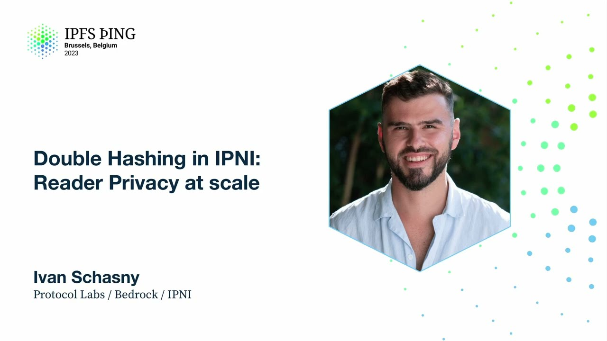

# Double Hashing in IPNI: Reader Privacy at scale - Ivan Schasny

<https://youtube.com/watch?v=Q46zJ_mai2c>

## Content

Hey everyone, so by that point you already heard a lot probably about double hashing.

So what I want to tell you about is how we added double hashing to IPNI.

So also I'm a software engineer in Bedrock team in the IPNI part of it and we not just

like maintain a specification, we're also running a service that Masi told about which is called SID.contact which has, I don't know, like trillion CIDs indexed by that point,

a bit more, and we needed to also migrate this whole dataset to double hashing at scale
without causing any service disruption to the users. So I will touch a bit on the specification, how it's compatible with the DHT and then talk a bit about how we dealt with it in SID.contact.
So just to recap how data gets into IPNI, so that happens in four simple steps.

So step number one is storage providers when they have some new data, they announce it

onto libp2p pubsub topic. So IPNI is listening to this libp2p pubsub and when it sees a new advertisement of content

being available, it would reach out to that storage provider directly and fetch the new

advertisements. So that's essentially the right path. Then on the lookup path, when a user wants to find something, they would send a request

to IPNI with a seed or multi-hash. IPNI would return a bunch of providers where the data can be fetched from and then the
user would go and fetch the cut picture from the provider of their choice. So that's essentially the flow. So IPNI is used across both IPFS and Filecoin networks.
It has been default content router alongside DHT since Coupa version 18, as far as I remember.

So also about the privacy, so we kind of separate two main topics here.
So there is a reader privacy and writer privacy. So this specific presentation is focused on the reader privacy. So reader privacy, this means that as a user, I don't want neither IPNI like other content

router or some man in the middle who's observing the traffic to be able to figure out what data I'm looking for or where this... Just continue. Yeah, and where the data can be fetched from. So on the other hand, the writer privacy, this means as a content publisher, I don't
want the content router system to be able to spy on me. So both of the topics are equally important and we will address both of them eventually.
But right now, our primary focus is the reader privacy and that's what this presentation
is focused on. So let's see what the IPNI results look like. So you can just check it in your browser if you want, but I can go through it here.
So at the top, you've got a multi-hash. So multi-hash is an inner component of the CID. So that's the digest of the data. So here it's base 58 formaters. So and then we send a lookup and the IPNI returns you zero or many provider results.

So and provider results has a few fields. So let's start from the bottom. So at the bottom, there is a provider info. So it consists of the libptp identity of the provider and the addresses where the data can be fetched from. So the next one is the metadata. So metadata defines protocols that the data can be fetched over.
It can be like bit swap, file coin, graph sync, HTTP, and et cetera. In the future, there is no special formats into it. It's just a binary field. And the last one is the context ID. context ID is the internal provider specific field.
So it's not very interesting in the context of that presentation, but that's something that providers can use as an identify internally.

So if to simplify IPNI, basically, we can imagine that this is just like two endpoints.

So one endpoint is get and get you send multi-hash and results your list of peer IDs and put

you put multi-hash and with a list of peer IDs assigned to it, like a big patch map.

So with the breeder privacy implemented, we don't want neither IPNI, no passive observer,
like spying over the traffic to be able to understand what we are looking for. So before going forward, I just wanted to explain a bit of the notation that is going
to be used going forward. So hash over data means obviously hash over data.
Anc means encryption, that the data is encrypted with a key. Derived key means the key, cryptographic key derived from the data. Nonce is a cryptographic nonce. MH stands for multi-hash. Double vertical line stands for double pipe says for concatenation. So cat concatenated dog equals cat dog. And peer ID is the identity of the provider. Multi-hash is twice. Okay. So in context, this provider specific identify that it's not really interesting in the context

of that presentation. Metadata is IPNI metadata. So let's see like for our cat picture, what we can do. So first of all, like as a step one, so you kind of in order for data to be discoverable,

you need to put it on ping on some IPFS node, as well as you need to make the routing system
aware that that content is located at that node. So you would get a CAD of that content first, get a multi-hash of it.
So then you would do two things. You would calculate a hash over multi-hash. And that's where the name double hashing comes from, but as was explained before, so because multi-hash is already a hash over the content. And at the same time, you would derive key from that multi-hash cryptographic key. And then you would take the identity of the provider that has that content and you would
encrypt that identity with the key derived from the original multi-hash. So then you would take the pair of the hashed multi-hash and the encrypted payload and put

it into IPNI and you would put the CAD picture onto IPFS nodes.
So this is pretty simple. So also IPNI has some extra data associated with the provider record, not just identity
of the provider. So let's see how the full flow works on the IPNI side.
There are a few steps there. So essentially the main punchline is that we want IPNI to be really fast.
It to be like just a single lookup request. And after that lookup request, you can get the results and start reaching out to the providers. So, and even with a writer privacy, reader privacy implemented, we want that to be continued

to be true. So basically when a user wants to look up something, they would calculate a hash, they would send the hash to IPNI. So IPNI would do like a quick index lookup and find the disencrypted records that have been put into it. Hash them, send them back to user. So at that point, user can decrypt them using the original multi-hash value and can start reaching out to the providers. So they can use, for example, lippity-p, what's the stream, multi-stream select, and basically

reach out and negotiate protocol. So additionally, so as we mentioned, one of the previous slides, IPNI has some metadata.
And metadata, but we also don't store it in open in IPNI. We also encrypt them, encrypt it in exactly the same way as we do it with the provider

identities. So now instead of deriving key from multi-hash, we derive key from the provider identity, can get in it with a context ID and encrypt metadata with it. So if user wants to basically fetch metadata, they can do that and they would do like another

round trip to IPNI and would fetch that metadata. And by doing that, like a few times, they would assemble the full resulting IPNI payload.

So having said all of that, so the whole, we can see what essentially are the indexes that are stored in IPNI. There's just like two indexes. One is like hash of the multi-hash map to nonce, concatenated with the encrypted peer
IDs. And second one is hash over the peer ID concatenated with context ID, mapped to nonce with, and

concatenated with encrypted metadata. So this essentially the two indexes that we store. We use exactly the same functions across both DHT and IPNI, the same for encryption, same
magic values, same hashing. So these are the functions that we use like shard 256 for hashing, ASGCM with 12 byte
nodes, nonce for encryption. So with the multi-hashes, when we double hash them, we always make sure that it has the
correct context. That's what tells the indexer that this is a double hash and double hash can be treated

differently. And as I mentioned, DHT and IPNI have like fully compatible formats. So in fact, if you look into DHT and IPNI record, so DHT has some more data in it.

So I want to go like through what the fields mean, but basically the IPNI, the IPNI record

is subset of the DHT. So basically we can take the records, for example, from DHT, put them into IPNI, and that's what would just walk out of the box. So this is it from the specification point of view. Are there any questions at this point? Okay, cool. So now I want to talk about the seed.contact. So seed.contact, I hope the data about how much stuff we ingest is accurate.
So basically we ingest about like 5 billion multi-hashes per day, about 2,500 requests
per second, 100% uptime. We use it for both IPFS and Filecoin. So we do have some IPFS nodes advertising into IPNI and basically Kuber uses seed.contact

for lookups and it's default contact router since Kuber version 18.

So again, our goal when introducing the IPNI was to, when introducing double hashing, was

to not to cause any service disruption and continue serving users for both double hashed

and not double hashed paths. So this is how simplified version of seed.contact looks under the hood.

So if we start from the right, these are the storage providers.
Then in the middle, basically seed.contact is based on the IPNI implementation called
store the index. And we have like a few instances running, so we call them with Viking names.
So there are three of them at the minute in production. So Kep, Hadido, and Odin. So each of these instances is backed by the key value data store.
We use Pebble. So Pebble is the inner component of the commercial product called CockroachDB. So it's basically the key value store that's used there under the hood. So we have like running multiple instances of indexer for two purposes.

It's basically, one is experimentation. So for example, if you want to introduce a new data store, we would set up a new instance and see how this data store performs or like tune parameters and et cetera.
And we also do sharding. So we shard by providers so we can tell which indexer would be processing which provider.

So this is done by the assigner service. So basically, assigner service, when it sees a new announcement on libpwpubsub topic, it
would pick it up. It then would check, okay, is this a new provider? I already know about it. If I already know about it, that's fine. If it's new, it would just explicitly assign this provider to one of the indexes. So this is essentially the write path. On the read path, when the request comes in, it hits our proxy server, which is called indexer, and the sole responsibility of it to do a scatter gather request across all
the instances. So indexer would just scatter the request, gather the results, compose them over and
send it back. So all read requests are going through the indexer. So basically, when moving to double hashing, we want to take that opportunity to re-architect
stuff a bit with scalability in mind, because we see increased amount of the traffic coming

to std.contact. We expect it to be even more requests, more writes. So we want to make sure that we are scalable. So we've done a few changes. So they're highlighted with the red color. So let me start with the DHStore. So we introduced the service called DHStore. So essentially what it means, DHStore stands for double hash store. So essentially what now store the index is not backed by a local database, but instead it writes into the remote service. And DHStore is so simple, it just stores binary keys mapped to binary values without knowing

any context about it. So store the index now becomes a service that traverses the chains and writes them into

the remote store. But also unhooked store the index from the lookup path. So now the request from the index star, the read requests won't be routed into store the

index. So it's not on the read path anymore. So also we introduced, we hooked up DHStore directly to index star.
So as I mentioned before, so when we double hash the multi hash, we add the special codex
to it. So when a double hash request hits index star, we know that it's been double hashed and then we can route it straight to the DHStore and a result straight from it, which is going

to be like instant. And we also want to support regular queries and we introduced a new service DHFind.
So DHFind stands for obviously double hash find. And when a regular request comes in, DHFind would take it, would implement the whole like

reader privacy workflow. It would go to DHStore, it would fetch all the data, decrypt it, assemble the payload

and return to the user. And in fact, if you hit DHFind, so basically the result you see is exactly similar to what
you would have seen if you hit the not double hashed indexer.

So if you get results from DHStore directly, so now instead of like seeing open results,

like playing payload, you would see something like that. So basically you would see a multi hash and then you would see a number of binary blobs and the re-specification, how you decrypt them and convert them into provider identities.

What eventually we want to do? We want to get rid of the not double hash path completely.
So we want all the requests to be privacy preserving, but that would take some time.

That's why at the minute we are going to be supporting this service DHFind. It's super simple. It's essentially just a wrapper around a client and it scales really well.

So if we see more demand for regular queries, we would scale it up. If not, scale it down until we retire it completely. We also, with the writer privacy upgrade, we want to remove the right now store the
index it does encryption on behalf of the client because advertisement chains, they still contain the raw data, but we don't want to be the case like in the future.

Basically once we introduce the protocol upgrade for the right, we would also remove the encryption
on behalf of the client. And that's basically it. If we look into the future, this is how simplified architecture could look like.

That store the index, traverses chains of advertisements that are encrypted, it writes
them into DHStore. DHStore is super simple and it can be sharded very well, so we can scale it up to the demand.

And then indexed arguments would scatter across multiple DHStore instances.

So like spoiler alert, so we have not migrated this in production yet.

Our indexes are still catching up. So in the migration strategy, basically we've chosen to re-ingest everything from a scratch.
So basically instead of migrating the existing data, we just redone it from scratch.
So indexes are currently running, double-hatched indexes are currently running in production.

However the results from it are not hooked up to the output of IndexStar, but instead we use it to collect some metrics about double-hatched coverage. So that would tell us when actually we are ready to move to production.
And we collect a few metrics, so we have huge dashboards, and this is some of the double-hatching

specific metrics. So our criteria is to be able to provide similar coverage, similar or better coverage, and

latencies that we are currently getting from the unhatched seed.contact.

So we measure a few things. So the first thing is provider coverage. So provider coverage tells how many providers that are known by our double-hatched indexer

versus how many providers are known by seed.contact.
Like run up a seed.contact knows about 600-ish active providers, I think. So basically we are almost double-hatched indexer knows like 99% of them. So the second thing is called distance. So distance tells how many advertisements need to be ingested by double-hatched indexer

in order to catch up with the regular indexer. So at the moment this kind of number fluctuates, and at the moment it's like a million, but
that's kind of fluctuates, and it should be like lower than a million, maybe like a few hundred thousand ideally. Then the read coverage. So this one is the most, I think the most important one. So what we do, so we have this service called dhfind running, and it's hooked up to production

traffic, but it doesn't return any results. Instead of returning like real payloads, it immediately returns 404. But under the hood in the background, it still performs the lookup and reports metric about it. So it doesn't affect any kind of like latency, it doesn't affect the results returned to the user, but we can...

can collect data about how many find requests can be satisfied by hasht� encrypted data. So and obviously that needs to be like as close to 100% as possible. So as indexes still catching up, so this number also fluctuates a bit,
but I captured that screenshots today and it was like 32% of the lookup requests

can be satisfied by double hasht� indexes. We kind of expect it to catch up. I

don't want to be overly optimistic, but like very, very soon, within like a few
weeks maybe. And the final one is obviously not found requests. This is the

amount of requests that we cannot find in the double hasht� index. We've had

quite a few bumps on the road while introducing that, so double hashting to

seed.contact. Some of them were a bit embarrassing, but still, so we've done
like a few improvements. So first of all, we use Pebble a lot and Pebble is

underlying key-value storage for CockroachDB. So CockroachDB is a commercial product. It comes with a bunch of stuff available out of the box, a bunch of metrics, guidances, and etc. But for Pebble it's not the case. So we had to instrument it and when we ingest the data, we kind of, we sometimes see like

horrible latencies. Some writes could take, I don't know, randomly like tens of seconds to complete. We are not sure what's going on, so we instrumented a database, started collecting a bunch of database-specific metrics such as like
read amplification and a bunch of others. And we tuned it up and now it forms

really well for our workloads. So this is one of the improvements we've done. So we
introduced the S3 mirroring. This is something my colleague Andrew is going to be talking about today. So the punchline is one of the embarrassing
bugs that we've hit. Instead of calculating two hashes, we've been calculating three hashes and over the multi-hash. And when we discovered that,
obviously there is no way back. There is no way to unhash the stuff that we already done. And the most kind of like, the thing that takes the most time is to
actually fetch the advertisement chains from the providers. So we introduced like S3 mirroring. This means that advertisements now can be stored on S3 and instead of like reaching out to remote storage provider, you would just go and fetch it from the S3 like storage bucket. So that's significantly improved the speed that we can like bootstrap a new indexer. The thing that

Masi talked about is a very important update, the nd.json. So with double

hashing in APNI, you might require to do like a multiple round trips in order to
assemble the full payload. And for example, some multi-hashes which are
specifically hot, they can have like hundreds of records associated with them. And like decrypting each record and then doing a round trip fetching metadata for each record might take like a long time. That's why like nd.json specifically is a must-have for reader privacy. So now instead of like waiting for all for decrypting all the records, we can just decrypt them as they come in. And basically that significantly reduces time to first byte for the
users. And yeah, so we've done like a number of other optimizations to like

the whole store the index implementation. Like we've, I don't know, download speed improved like from 2 to 20x. Writer output includes improved around like

5x. And yeah, we've done like a lot of things to the latest versions of store
the index. Also like I want to like quickly mention what kind of like

configuration we're running on. So these two services that we introduced, we like

DHStore, we're running at the minute just a single instance of it. So it's a memory optimized instance in AWS, 60 gigs RAM, 6 vCPUs. We like at the minute

10 terabytes GP3 volume is enough for us. And we found a sweet spot with
GP3 volume configuration. So that allows us to like ingest the amounts of data that needs to be ingested. So in for DHFinds it's like super, it's super lightweight. At the moment we're running five of them, which seems to be enough. But kind of we can scale it up or down. So and they're super tiny, just one gigabyte from and one and a half vCPUs. So but again we can scale them up and

scale them down. So and obviously but just want to reiterate we are not in the end of our journey yet. So the current digestion speeds looks promising but we still have not not still fully connected it to production. But we kind of like
roughly there not to be super optimistic. And yeah basically all services, all

not just store the index, but the whole thing is open source and we also open source not just the services themselves, but also all the Terraform configurations, all the all customization and etc that we used to bootstrap
seed.contact. So if someone can just bootstrap like mirror from it by just
running our Terraform and applying the customization and just yeah it's it's very doable. So if you want to get in touch it's IP and I Slack channel and

go up IP and I GitHub. Yeah I think that's it so any any questions?

Yeah so why are you using Pebble instead of a real database like I know like

something like FoundationDB or you know whatever is like a big big data store?

So it's a great question. It's not our first kind of iteration it's like I think it's a third or fourth database that we tried with and Pebble is like
super simple and also it offers it has a merge function basically it doesn't

flush to the disk for every write as far as I remember. You can specify the kind of like a merge technique so when you perform so the it has very very good write throughput. So we've done some testing against other data stores that
we use and Pebble performed like on magnitude better than than others and
yeah I think it was Masi who discovered it first and specifically because it's
used as a key value search for CockroachDB and we've done some testing it's the results were really good. Just a quick thing to add the storage in IP and

I just uses vanilla key value store. We don't need any SQL engine nothing like

that right. No matter how fast a real database implementation is the overhead

of a SQL engine is non-zero. Yeah so that is why you mentioned FoundationDB

specifically because it's a key value store just distributed so it's also very

fast. There's like others like TKV so it's just things to try I guess.

Cool thank you great question so yeah so that's the one we tried and we're really happy with performance maybe we can find a better one in the future. This is a more forward-looking question but how do we think about like

debug ability in the future so like we might write bugs how do we know if we've
made a mistake if everything's encrypted and we can't see the providers or the
or know what SIDs are being looked up if we get bug reports. That's a great
question and so depends where the bug is so the worst ones are in the bugs encrypted code. If you get the cryptography wrong or messed up the record format somewhere I guess you would have to just rebuild the index because it's you cannot decrypt stuff because encrypted and you don't have the original key so that's the worst kind of surface where you can could find a bug. If there is a bug in a service logic somewhere then it's we can just

can handle it as a normal bug so the main point is to not to have the bugs in the crypto codes like we had like for example three hashes instead of two and as long as there are no bugs there then it should be like similar to
the current debugging experience. Just relating to David's question would it

make sense to have endpoints or services in IPNI or in general even across the

DHT that allow a user to explicitly submit the original CID or you know the

key that we can then decrypt information with so that we can do debugging. Because when we have an encrypted world we have basically two sides of
the system one is just implementation bugs for that you know yep it's software

industry you write tests and whatever the other category of bugs are the

interaction bugs that we won't have any visibility into because the information is encrypted so I wonder if it would make sense to have a sort of endpoint a
sort of well-known protocol by which you can go and submit a CID which then reverses back to the current state which is I can use the CID look up the information see what you are getting and then debug the system as if I am sitting you know I was curious what's your take on it what do you think? Yeah it would make total sense in fact it's like what DHFind does right so you kind of submit thing and open it returns you like a payload. Also we do have a
client so if anyone ever used store the index so the index has like a client that they can take and then you create it you give it CID it returns you provider records we do have exactly the same one with the same API but they just does the implements a double hashing workflow so but we can use that for
debugging too so if you give it open CID and see where things get broken if

hopefully they don't. I wanted to ask real quick for other index providers or operators who are operating their own index instances do we have any
thoughts on how we help them to achieve having a reader privacy on their
instances? Oh there's a great question so the way we approach migration as I
mentioned we decided to re-ingest everything from scratch there were like a few few reasons for that so we switched to a new GP3 volume so we

wanted to find a sweet spot like basically what kind of how many IOPS

how many throughput is going to be satisfactory for our workload so we
wanted we knew that we can't implement migration code for every

possible type of storage so and when others need to migrate to we want to
provide like a simple path for them to do that and we also wanted to update the
index counts so if you look into the output of CID.context it returns you
like number of indexes for each of the providers and in order to have the
correct values basically you need to we had to re-ingest the whole thing
because we started counting them like halfway through the lifecycle and

yeah so and in order to speed up the whole ingestion process now we have like S3 mirror that's again Andrew is going to be talking about and the punchline is that you can have like if you don't have to go to the remote providers then you can like rebuild index from S3 like much much faster so I'm not ready to say
like how exactly how long is going to take but maybe like 5, 10 times faster depending where you're hosting your services so for others so maybe I don't know this is something we can open to others to to use as well
but Andrew is going to be talking about that later on today. Cool awesome thank you very much.

