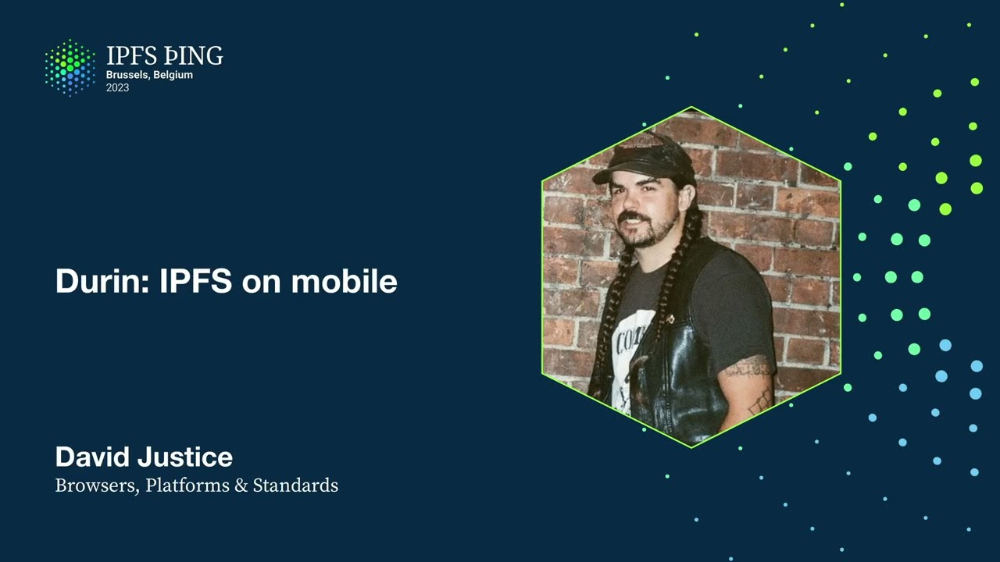

# Durin: IPFS on mobile - David Justice

<https://youtube.com/watch?v=QkhnKm-fCs4>

## Content

So today I'm going to tell you all about Durin. I announced this back at IPFS camp,

so we'll have some updates from then. We'll answer some questions about what it is, how
it's built, what we have in the future, and mostly like the purposes of it. So to start

out here, what is Durin? Dietrich really summed it up really well in this tweet here. He said,
Durin is an iOS and Android app for exploring IPFS use cases, initially with read and share
flows but with a place where we can experiment with like-client protocol implementation,
proximity transports, and the where's my stuff problem. So yeah, Android app, iOS app, we

support the uploading and we support IPFS colon slash slash links with protocol handling.

We're going to go ahead and convert those to HTTPS for share. This is like really simple stuff that we were doing already in like companion. We try and get your content as fast as possible
on mobile here. We use basically like a racing or caching gateway. I'll explain a little bit more of that in like the next slide. And we're really thinking of this as like a base for IPFS enabled apps, like a very, very like simple base for those. So we want people to,
we want to make this friendly enough, document it, put tutorials together so that people can just fork this and start building off of it. And lastly, it's a testing ground for
just as any experimental things we can come up with to try new things on mobile. So how
does it work? I mentioned the racing or caching gateway. Simplest way to explain this is we
wanted to put the most lightweight way to access IPFS on mobile. As we know, like Kubo
is not really built with mobile in mind initially. We have some new stuff coming in from Iro
and things, which I'll actually kind of touch on later in the talk also, which might be more efficient on battery and these things on mobile. So, but we weren't quite there
yet. So we wanted to do the lowest resource intensive thing that we can do. And so we
came up with was we're, we get a list of gateways basically, and we check them on an interval.

We rank them based on the speed and the health of the gateways. As you can see over here
on the right side of the screen, this is a screenshot of the settings page. So if you have auto selected there, that's the default, it's going to go ahead and rank these gateways and try and return you the fastest one from the fastest gateway. But we have the option

if you're having issues or anything like that, or you just want to, you really like a gateway specifically, you can just select that there. I want to mention there's an IPIP that was
work was a lot moving a lot faster in 2022. I'd like to pick up some of the momentum from

that. Mark Geiser was working on this. He was like heading it up mostly. And he's still

involved absolutely with it. But this is the multi-client gateway. This is the type of work that's really going to help these like light client nodes. If we can really define that and get everybody working together with that. So I have a link to it at the end of the talk. So I encourage you if you're interested to take a look at that, give some input on
the pull request. I'd like to get that moving. Like we mentioned, we do that transformation

of the IPFS to HTTPS, really simple transformation there. Same as companion, the browser extension.

Our uploads are done up to web3.storage. They've been really easy to work with. And then the

sharing, obviously we have the built-in sharing that any like iOS or Android app has. This

is like airdrop messaging, all that built-in stuff. We just get that for free. We also generate QR codes to make it really simple to pass files around. And then we are just added share targets. So now if you're actually in like the photos app or accessing these
photos like directly, you can open up the share button and Durin is actually one of those options to share to. And then it will auto upload and then you'll get your CID back,
share links, all those things. So what's new since IPFS camp? I just mentioned the share
target. This is a screenshot of it like sort of in action. You can see down at the bottom, the Durin is one of the things you can share directly to. This is a photo from Robin's talk yesterday. Should be shipping this week, next week. We're really close to it. We're

just working on some permissions issues with iOS. There's a new design. We cleaned up a
lot. Looking a little bit better for like a more mainstream release here. We got a couple

bug fixes, always adding more gateways. As more and more gateways show up on the public
gateway checker and just through word of mouth when I hear about them, because not everything is on there, we try and check and make sure that they have to have the subdomain support
and we like them to have the IP and S support so that it's just going to work the best with us here and that we can support everything. So if you run a gateway, we'd love for you to and you don't support the subdomain stuff, we'd love to talk to you and try and help you get that moving along. Because the more the better, especially for people that are
in different regions. We also added a featured apps list. These are simple things, but they

can go a long way, I think. I'll talk a little bit more about the featured apps later.

So what's happening next? Like we mentioned the featured apps, I have IPFS search is one
of those. We're basically looking for what are IPFS enabled apps or things that run on

IPFS that look really good and have a good experience on mobile. We're going to feature those and I think as we spend more time auditing these things and we get feedback of what people

like of these featured apps, we're looking at possibly doing integration with them. I talked to the IPFS search in Portugal and that was really exciting. After playing with

that on mobile, I was really impressed by how good the integration feels already, just
like linking to it. Talk about maybe doing some file encryption, file sharing of encrypted

files. After watching the Delta chat talk, obviously got me thinking about the Iro integration

stuff. I have that PR open in another browser tab right now, hoping to get time to dig into
that through the hack days. Talking about contacts API support, maybe with wallet integrations.

There's still probably too early to do a talk on that, but if you're interested, I'd love
to chat with you about it. We have some pretty interesting ideas there. And then we were talking about photo backups possibly using FVM and Filecoin. I think we could probably
do some interesting stuff there, probably also offer very competitive pricing to existing
cloud stuff. So what's for sure happening, that was the exploration share target. Want
to make it so people can use the web3.storage key directly so they can have all their stuff in one place. Right now we have a global key just to make it as easy as possible. I also want to talk with the web3.storage team and see if we can get specific flows for getting

your own API key for less technical users. Always trying to add those new gateways. Think

about adding this into the FDroid store. We want to do a tutorial on forking the project.

Like we mentioned before, we want this to be a really, really easy base for people to get started with IPFS on mobile in a very, very lightweight way. No crazy battery usage

or anything like that. But that's on us. We've got to document it. We've got to make it so it's really easy to do. We have a blog post. We're finally going to announce this in a
wider way on the IPFS blog. So keep an eye out for that probably in the next week or
so. And I'd like to add a little bit more metrics. We get a couple built in things, but would like to get a little bit more information there. So how do you get it? It's in the Google Play store. It's in the App Store. I'll be sharing that repo too if you feel like pulling it down, building it, giving us some feedback that way too. And how do you contribute? So I've added this QR code. It's actually like
a big link list, like link in bio thing, you know, like you'd see on Instagram or whatever. A lot of stuff on there. I want to say before I get into all the contributions, big shout out to Trigram. They've been working with us for a while on this. They're a contracting company. They build a lot of products of their own and stuff also. So they've done like wonderful,
wonderful work with this and we're looking to continue working with them. How can you contribute? More gateways with subdomain support. If you look at that public gateway checker, not that many actually have like the subdomain support. I want to keep

seeing how we can build that up. Check out that, the IPIP that we were talking about,

the multi gateways IPIP. There's a couple other IPIPs that link to that also. I got the GitHub repo right there. IPFS shipyard. We're always in browsers and platforms on

Slack. Any ideas you got, any, you know, bugs you see, come talk to me there about it. Fork

it. Try building it. Build your own IPFS app. Submit ideas. Hack with us this week.
Lastly, if you have a mobile or IPFS project, we definitely need to talk. I want to get

as much input as possible. I want to help other people with this. I think we should all sync up. And that's all I have today. Thank you. Super interesting. While you were talking, I downloaded the app and tried using it. So,
one thing I noticed was it's very gateway centric. Are you thinking down the road map
to do IPFS over other protocols like Bluetooth, LED, things like that? Maybe an Android, whatever

the Android version of AirDrop is for more like peer to peer local networks?

Totally. Yeah. That's something we've talked about. So, you can use AirDrop right now, but it's not within Duran. One of the things we talked about was having AirDrop, but then

when you receive it on the other end, actually trying to verify the CIDs. It's one of the things we talked about. We've also we looked into having local connectivity with MDNS.

We actually had a version of that working, but you had to change some of the default configs in Kubo nodes. And it was something that was like really not secure enough, we

would say, that we would want to recommend to people. So, there's still work to be done there. There's still exploration. We were getting like it was operating super fast. And it was really cool being able to see stuff directly from your node or the gateways and like racing them against each other. So, that's definitely a priority. Something I really want to see happen. Need to get a little bit more in touch with the Kubo team and see where
that's moving along. I don't know that it's like the highest priority right now for them.
They have a lot of stuff on their plate, but definitely something I want to check out. Hey, so I work at the Falcon Foundation with the decentralized web kind of gang of folks.

And there's a lot of them building or wanting to build tools for archiving and verification

on mobile. And I was just wondering if you were chatting to like the Guardian project people already. Good. You sort of looked a little like, oh, I don't think I am. Because

they also do FDroid. They also actually help run the FDroid. And they're the people working

on FDroid on IPFS. So, they're sort of super deep in it. And now I will... Your expression

has answered the question. So, I'll introduce you. So, yeah. Would love to chat with them. That sounds sick. And I will say, too, we love

archiving stuff. So, we have another project we did, Pintweet IPFS, where we're working with WebRecorder to get all that stuff archived. And obviously, this is such an experimental open app that can be forged and all these things. So, I mean, maybe one day we'll make one that's specifically for archiving things. And not just like photos and sharing like that. So... So great progress on the team since IPFS camp. This is amazing. Are there any plans to...

Like on Android, you can register an app as a system-wide VPN. So, can we register this

as a VPN and say... Can we start resolving IPFS content dynamically like Companion does

in the browser? That would be sick. Yeah. I hadn't even thought about that. So, let's talk about it. Yeah. I like that a lot. Okay. Okay. We'll talk. Okay. Thanks. Thank you.

