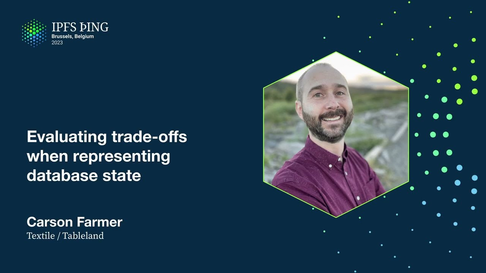

# Evaluating tradeoffs when representing database state - Carson Farmer

<https://youtube.com/watch?v=RuIUOKRVSK0>

## Content

Hi everybody, thanks for coming to my talk today about evaluating tradeoffs when representing

database state. So just a quick heads up, this is probably going to end up being one of those talks where I say there's no one-size-fits-all solution for databases. Every implementation needs to consider its use cases and access patterns and data storage requirements and in the end it is really all about tradeoffs. And that is pretty much what this talk is going to be about, but having said that, I do have some hopefully unique things to say about this based on my experience designing
and building things in the IPFS space with a bunch of passionate nerds at Textile for
a while now. So this talk is kind of going to be structured as a narrative or a historical narrative that
steps through things that me and my team learned along the way as we were building interplanetary

databases. But before I jump into that stuff, who am I? I'm Carson, as I mentioned I'm from the Textile and TableN teams and Textile has been building

in this space since about, somewhere around 2016. We started with mobile IPFS stuff and then we pretty quickly moved to building peer-to-peer databases when we realized that we needed to actually build that first. So we built something we called Threads or ThreadDB and some of you might have read the white paper or even played with it and it does drive some of the apps and tools that you see in and around the IPFS ecosystem. And so ThreadDB was this sort of peer-to-peer document style database that baked in a bunch of cool things like encryption, CRDTs, hash-linked data structures with IPLD and a bunch of other

stuff. A bunch of other stuff that we're talking about here today in this session. And so it was complicated but it wasn't all that complex, at least not at a high level.
But the things that made ThreadDB quite powerful also kind of made it hard to use.
So we use Merkle clocks to partially order events, we use CRDTs to manage conflicts, we use private keys to handle encryption. And all of these features ended up kind of requiring our users to learn new concepts,

rethink how they design apps and ultimately didn't really solve the core problems that they had. And by they, I'm talking about Web3 developers. So the problem they really had was they wanted to just store data using access patterns that they were familiar with. And so with ThreadDB, we ended up with this really slick solution to a problem that our users didn't quite have, which leads me to our first finding or our first trade-off,

which is database users want capabilities, not necessarily features.
So you can build the most powerful cutting-edge encryption or you can handle insane conflict

resolutions no matter what. But if it doesn't actually address the use cases that your users need, it's just a pretty

powerful database without a real clear use case. But we did get some pretty good traction with ThreadDB and lots of people were using it. And it was an event sourcing database that stored deltas on IPFS.
So that's how we dealt with changes over time and syncing and things like that. And honestly, it was a really nice design. And so when users asked us, cool, so my data is on IPFS, right? The answer from us was this super enthusiastic, like, yes, totally. And then they would say something like, awesome, can I see the data for like a key A in my database? And then our response would be like, oh, no, I'm sorry, no. You want to see the actual data? No, no, no. We just store deltas on IPFS. You need to run a node and materialize the view or state locally or have someone else do that for you. That's what you wanted, right? And that sort of leads me to our next finding, which is like, turns out, not really, no.
What they wanted was just a more traditional database with a database interface that was decentralized, mutable, and ideally, queryable from anywhere.
So database users, they did not want data structures. They just wanted their data. And so that's why we started building Tableland. And I'm not going to go into the specifics of Tableland here per se, because that's not really what this talk is about. This talk is about trade-offs. But I am going to say a little blurb about it to give you some context for the next couple of slides. Tableland is a Web3-native distributed database that combines things like on-chain access
control and sort of like procedural access control with off-chain data storage using
a network of database nodes. It uses SQLite as the query engine under the hood with a SQL language spec designed specifically

or tweaked specifically for Web3 use cases. OK, so back to some trade-offs here. As builders, we end up making trade-offs pretty much every time we design or implement anything
with any degree of complexity. So for example, when developing the SQL spec for Tableland, we wanted to support most standard

SQL functionality, right, as you would imagine, plus a bunch of extra Web3-native functions

like if this is a transaction, I want to be able to query the block number from within my SQL statement or I want to be able to do things with addresses that are relevant for
checking balances, et cetera. So OK, that's cool. It's pretty easy. We'll basically just adopt the SQLite spec and then we'll move on.
But you know, this is a talk about trade-offs, so it's obviously not that simple.

And why is that? Well, take a look at your favorite blockchain project and you'll notice right away that the types of data supported are pretty limited. So for instance, Solidity supports things like signed and unsigned integers, booleans,
bytes, and some things like addresses and that. But what it doesn't support is floating point values. Why is this? Well, because floating point values are literally by definition approximate. So I'm going to say that again. Floating point values are approximate. And we were actually reminded of this cold hard truth the hard way because we had implemented

the Tableland SQL spec based on SQLite and we had a bunch of node operators running Tableland

on different architectures. And these different architectures implemented floating point math differently.
This didn't really happen as much until we started having node operators run things on M1 chips and then we noticed. So what does this mean? I mean, honestly, the short answer meant that we had to make a trade-off between consistency
or determinism of our network and expressiveness or functionality.
So we literally had to drop support for floating point values in our SQL spec.
This was a bit of a bummer for SQL enthusiasts, but it isn't really entirely surprising because it turns out floating point math is hard. Lots of people know this and that's probably why you'll notice they aren't used for storing currencies or blockchains very often. So we've got this SQL spec with no floating point math support whatsoever.

So the finding there is maybe the cheeky one is floating point math is hard and so are
distributed systems. But the real take-home point here is like this actually has implications for pretty much all distributed systems where one might want to use floating point data. You basically just can't guarantee it's going to behave the way you expect it.

So this idea of non-determinism sort of brings me to my next trade-off, which is a more recent
one that we encountered when exploring designs for the underlying data representation for Tableland. So as a quick reminder, Tableland is designed to be a trustless and distributed network of nodes that support SQL tables. And for that to work, we need some way for our nodes to come to consensus on table state.
Now, again, I'm not going to go into the specifics here on how we do this because it's not totally
relevant to the topic here, but also because this is pretty active research, so we don't have all the answers. But we have a database and we want to have some way for the nodes of the network to agree on the state of the database. Pretty straightforward. That means that given the same set of updates, they all need to arrive at the same materialized state of the database. Now this actually isn't that hard on Tableland because these updates are all mediated by
a blockchain, so we actually do have global ordering. And that's really nice. It solves a ton of problems. It does have an impact on throughput, but actually with layer 2s, it's not as much as one might think. But now we need some way for our users themselves to actually interrogate this state to ensure
that it looks correct. They need to be able to convince themselves that the validators or the nodes running on
the network have actually materialized the state correctly. This is often done by proofs. To keep things simple, we'll say Merkle proofs are kind of nice to work with, so let's start there. Now, again, since my talk is at the end of the session about a bunch of interplanetary
databases and topics around that, I know that you all already know about things like Prolly
trees, and thanks, Mo for talking about that earlier, and maybe even Merkle search trees
if you're at all familiar with the cool stuff that they're doing over at BlueSky.
So these are Merkle data structures that have pretty nice database-like properties because they behave kind of like B trees. So cool, we're talking about databases and Merkle trees and proofs, and this is all kind
of nice. And so as any decent database person knows, B trees are generally the right tool for the job when it comes to indexing data. Great. And in fact, our underlying database engine that Tableland is built on, SQLite, also uses

B trees itself to index and organize data. So okay, that's great. We're just going to build Merkle trees over our B tree pages and be done with it. And that actually isn't totally crazy because, as I said, we've got a total ordering of events,

all the databases should kind of end up with the same set of pages. We could just block those up with IPFS and kind of be done with it.
Maybe a better way to do that would be let's relax the assumption that we have total ordering in case things do get out of order or we've got some sort of offline first type of scenario.
We could relax that, and then we use something like Prolly trees or Merkle search trees that end up with a deterministic layout no matter what order things come through.
And then we could use those when building our underlying state to drive our proofs. So that sounds pretty nice too, right? We're using the features of our database to sort of help us answer secondary questions.

So now all we need to do is create some inclusion proofs for rows or groups of rows, and we're all good. And if this wasn't to talk about tradeoffs, we might be done there, but it is a talk about tradeoffs. And so the thing that makes B-trees kind of great for indexing data and storage and all

of those things that we kind of do care about in the database world makes proofs harder. Because paging things into B-tree pages or Prolly tree blocks or whatever, it doesn't
actually reflect the access patterns of our modern Web3 database in this particular case.

So in fact, storing the underlying data representation in a structure designed to make access and

I-O more efficient actually ends up making our proofs and arbitrary data synchronization,

believe it or not, less efficient. And so to get some intuition for this, we can consider this kind of idea, right? A standard binary Merkle tree with n leafs as like a log sub 2 n sized groups.

And it can be even less if you stick actual data in the intermediary nodes of the tree
instead of doing them all in the leafs at the bottom, but it's somewhere around there. To try to reduce the size of the proofs, you know, a natural instinct is kind of like,
well, we'll just reduce the depth of the tree by giving it some branching factor bigger than two. And that will reduce the depth of the tree, which means there's fewer things to have to, you know, send through to prove. And so given our Merkle tree, you know, branching factor of K reduces the height of the tree

from like log base 2 n to log K n, that actually gives us like a log base 2 K factor decrease

in height. And so queries are faster, right? Because we can get to the data we need faster. But the proofs themselves are actually bigger because we end up having to include all of

the siblings within each group, within each K area section of the tree.

So we actually move from like, you know, a log sub log 2 n to K times log K n.

And this is just because in this K-ary Merkle tree, maybe it's like a Merkle search tree
or a Parley tree, whatever, the Merkle proof consists of like K minus one nodes at each
level. So now we have to send way more data to our users in order to be able to prove something about that. So, oops, that's, you know, like a bit of a mistake. So this is a perfect example of like a trade-off that we have to make.
And web, so a finding here maybe is web3 presents these unique access patterns, provable things
that don't always jive with traditional database knowledge, which is stick things in pages.

Now you might, you know, you could argue in this scenario, this is a sort of contrived one because like, you know, we're designing the structure based on storage, but then using
it for something else. But there are lots of examples where these types of trade-offs become relevant. And so for us, this was kind of a no-op, like we can't use trees like this if we want to be able to, you know, create proofs until we can do things like, you know, more efficient
snarks over Merkle trees, or we could use like Merkle trees or, or these other technologies, which do help to address this. But then someone is going to have to explain all that stuff to me and that's no fun for anybody. So ideally we just, you know, come up with a different way to handle this.
So now our team is working on some different solutions to sort of trade off storage efficiency with proof efficiency, or potentially just creating on-demand proofs that leverage a bunch of the new research that is coming out around data structures and proofs and things like that. Because the truth is, it doesn't even really stop there. Cause now when we're dealing with like IPLD and another sort of purely functional data

structures, we have to think about things like write amplification, you know, data cleaning

and all the intermediate data representations that we ended up creating and all the garbage

collection that we've got to do, because it's like inevitable to avoid sort of like write amplification when we're working with purely functional data structures like IPLD.
And you know, depending on the structure of the DAG that we're working on or the composition
of the nodes, we can end up like creating way more data than a traditional database might. So here's another quick example. In a content addressable world where we're using kind of like a block storage for fetching and retrieving parts of our indexing structure, standard tools like B-trees and cache-aware
data structures can in the worst case sometimes lead to higher write amplification than simpler
data structures like binary trees. So we've got another trade-off here where we have to decide if data and IO efficiency

is worth the trouble of all of the extra potentially garbage collectible data that we're going
to have to deal with later. And we can start to play around with, you know, the complexity of these and the size of the write amplification, and we can get a bunch of numbers to back this all up, which
we should do. But the point here is kind of like these trade-offs don't immediately become obvious until we actually have to start building things and realize like, oh, shoot, our database, you know, our underlying database storage is just blasted through the roof.

And maybe that's not so bad when we live in a world of, you know, Filecoin where we can just store things for cheap forever. That's one approach. Or maybe it's not so bad when, you know, users are primarily storing their own data. And so there isn't one giant source of all of the data. There are lots of these trade-offs, but that's kind of the point. So, you know, the example I gave is probably a pathological case where like B-trees lead
to way more write amplification. Maybe maybe not. The average case is probably fine, but it is a nice example of trade-offs that aren't obvious until you start thinking seriously about this kind of brave new world of interplanetary
databases and all of the things that this comes with.
And I think, you know, we're just kind of just starting to uncover all of these interesting,

you know, trade-offs that we need to evaluate now as we sort of implement more of these

different interplanetary databases. I mean, there's like, I don't know, five different approaches in this session alone.
So I think this is a really exciting time for the database community in general.
I hope that, you know, we in the IPFS and like, you know, peer-to-peer and distributed

database world are prepared to bring what we learn back to the broader database ecosystem

so that we can all share a lot of these new trade-offs that we're having to evaluate. And so that's pretty much it for me. Thanks a lot. I'm sorry that I couldn't be there in person. Thanks for listening. If you have questions, please hit me up, you know, at Carson Farber on pretty much all
the places. Carson at textile.io for email, usually in the discords and slacks of the world.

So hit me up and I hope you enjoy the rest of the sessions. Thanks. Great way to think about the trade-offs. I'm just sitting here considering what to do with my branch factor on my Prawley trees.

And you've motivated me to have a deeper understanding of one of the optimizations I've been considering
after talking with Michael Rogers is, say we deterministically decrease the branch factor

as we go down the tree. So your top nodes are cacheable and your bottom nodes are narrow. Totally, yeah. Just another trade-off. Yeah, exactly. And that's one where like that comes from knowing how your data structure in this case

is going to be used in a sort of like web three world where like you've got this like high contention at the top and you don't want to blast out a ton of like now you've only
got maybe binary at the top. So now you've only got two hashes. It's a tiny update every time that particular node gets updated. So that's cool, right? That's yeah, I think that's really nice example of a type of trade-off that you can deal with.
A real quick question on I haven't used or seen Tableland, but like what's the what's

the state?

Is it in a state where we can like we can play around with it or like is it out now or what's what's going on?

Yeah, yeah. Yeah. So Tableland is out now. It's running some. It's we're in testnet phase still.

So it's supporting several testnet apps that people are playing around with. So the way that it kind of works right now is Basically you pick a parent. Excuse me. Sorry. Basically, you pick a parent chain EVM chain at the moment that you want to interact with. And you pick that based on where you want your access control rules to flow from. So you can say like, okay, look, I only want people who own born apes to be able to insert rows into my table. Okay, so that means you have to deploy your access control on like mainnet Ethereum. So maybe this is a bad example because nobody wants to do that, but
you could do that. And then what you do is you send transactions to the
basically to the access control smart contract that you have on that chain. And these get routed to the Tableland network and the nodes on the Tableland network are sitting there listening to events from like mainnet, a bunch of testnets,
Polygon, a bunch of the rollups. So you can kind of pick and choose which sort of like throughput you want and trade that off with
like the access control features that you need. So maybe it's just like address based, in which case you might as well pick a cheap chain, like a ZK rollup or even Polygon or something like that. You submit transactions through there. They get materialized into the database by the nodes in the Tableland network. And then you can do cool things like you can query across tables across chains. So you can do things like host your NFT data via Polygon or Optimism,

but then use it to drive like state and the visual aspect of your NFT on like more expensive chain,

like Ethereum. So you can kind of like pick and choose and do things like that. But anyway, long story short, yes, it's available now. You can just use our SDK, which models the D3
like database API. If you're familiar with Cloudflare's D3, it's like basically a SQLite thing. And for the people, the Node.js folks in the room,

this is very similar to the like better, like the more advanced, similar to the like better SQLite 3 API. I think that's where Cloudflare kind of borrowed ideas from.

So this is kind of cool because you can use like your favorite ORM on top of Tableland.

And then you kind of even forget that you're using a Web3 database, which is quite nice. Anyway, so that's kind of the gist of it. That's how you would interact with it. And yeah, it's on testnet. It works right now. And we're in the process of sort of designing the final stages for our main net, which we're hopefully launching in the new
year. And so actually, if you get in there and start playing around and hate it or love it or

have some ideas, we'd love to hear from you. What was the motivation for SQLite specifically

in relation to like the grand scheme of, you know, underlying data stores and databases and
SQL or non-SQL or whatever? Yeah, yeah. That's a very good question. So when we first started building Table... Well, first of all, like SQL, the motivation there
was basically just let's find a database, like query interface that people are already familiar

with. That was a big one. But another, you know, some of it was also like a bunch of our team was already very intimately familiar with SQL. I mean, Andrew, our CEO, had already like gone through a

successful startup that was basically built entirely on top of Postgres. So we had a lot of experience there. We had a lot of users asking for that type of like interface. So that sort of
thing was just it's pure and simple. Let's just keep it to something people are familiar with. And then when we first started building Table, and we did actually start building it on top of Postgres, because like that's the world's most powerful SQL database. So obviously, we should go
there. And that worked great. It's a lovely database. But it made our node deployments a lot

more complicated. And it made it harder to kind of convince other teams to run a node deployment.

When we decided to switch to SQLite, there was also some talk about like, well, maybe SQLite's
like very standardized, simple data structure, the format, maybe we could actually leverage that,

like as part of our protocol more deeply. But also, it's just this super lightweight, but extremely powerful embedded database that like, if one of our node operators is having an
issue, we can slack them and be like, can you just send us the SQLite code? And we can just
like, can you just send us the SQLite file? We'll take a look. So it was like that simplicity
was a big bonus. And it's like the database structure, everything is just baked into this like really simple data structure. And so that was another big motivation. It's just like,

well, let's just keep it super simple. And it turns out it scales to like terabytes of data in one SQLite file. So, you know, we're not going to deal with, it's like, well, we'll deal with

that when that's a problem. And it'll be a nice problem to solve because we will have lots of people using Tableland. So, you know, that was a trade off we made there too. But I think so far,

we're pretty happy with it. Tangentially, is there a future in mind specifically for like threads and,

or threads DB or like not necessarily in lieu of SQLite, but in general?

Yeah. So we moved away from threads and like, I love the white paper. Every now and then I go

back to it. I'm like, man, you know what, there's some pretty good ideas in here. So I think there'll be an evolution of it maybe at some point. But also like there are other teams in the space that

are doing very similar things. But like with the hindsight of threads and like other things that

have happened since then. So maybe like there's just going to be better versions of what threads kind of could have been. And that's good too. But we do have some like, I know, and then I'll get

an email from some academic team saying like, why didn't you keep doing this? Because we were going to do something with it. And I think, oh, we could, but there's probably better. There's probably
better offerings now. Another one for you going back to the floating point thing. Did you spend

like serious cycles trying to be like, no, we're not getting rid of it. We're quantizing them. We're string encoding them. We're putting them behind a fence. Was any of that compelling? Yeah, we spent

so much time thinking like, cause you know, we're like, no, we can't take away like database people
expect this. And even if, even like if you go onto the SQLite website, there's like a giant bright

red disclaimer that says like, honestly, don't use floating point numbers, but here's how you use floating point numbers. And, you know, and so we were like, well, it's part of the SQL spec. Like

it'd be really nice to support it. And yeah, we thought about, you know, like, hiding floating

points in like its own like data structure under the hood. But like at the end of the day,

we just thought, look, this is a blockchain driven database and the blockchain doesn't have floating point. We can provide some utilities to let the users, you know, do the conversions in

user land, but it just gets so complicated. It's very hard to solve because even if you

change the data representation in your storage end, which in theory is fine, then you kind of
want to support at least like floating point math in queries. And then you have to be like,

now you're writing like an arbitrary precision math library to handle all that because you can't

interpret, like, let it, let them convert it to floating point values in the intermediate and do the calculation and convert back because their math is going to be different. So it's like,

it just is this cascading, you know, complexity when we can just be like, don't do it. And so

far, no one has been particularly upset. Funny thing with that is it was our tables that were

the biggest violators of the floating point, don't use floating points rule than any other teams,

because we were using doing some percentages for one of our NFT things. So, you know, it was sort

of like shame on us in the first place, I think, not thinking of that. But yeah, we thought about
it. We tried real hard. We might revisit it. But for now, I think it was the right move.
Yeah, the approach I'm taking in Fireproof is care wise string encoding, which means that
your conversion or your comparison is all going to be easy, but I'm not going to try and do the math part, right? Like JavaScript is ugly for a reason. Yeah, yeah, exactly. Right. And yeah,

exactly. There's a good, a good example of a trade off there. It's like, yeah, no, I'm not going to try and figure out what you Erlang loves, loves you some arbitrary precision. Well, that would be lovely, right? That would be lovely if we just had arbitrary precision math in in our database, but it's pretty complicated. Right? Well,

thanks, Carson, for giving us the inside view on all this and good look at the trade offs. Yeah, thanks. Thanks for having me and enjoy everybody. Sorry, everybody. Sorry, I can't be there in the hallway sections. But yeah, have fun.

