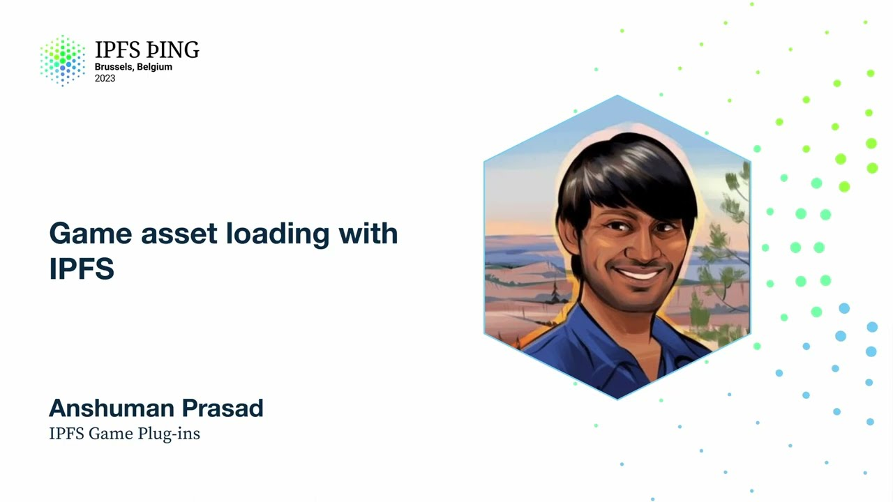

# Game asset loading with IPFS - Anshuman Prasad

<https://youtube.com/watch?v=VdS7zmJx2X8>

## Content

Hello. Can everyone hear me? Yeah. So I realize I'm in the awkward sandwich between break

and happy hour, so I'll try to be more enthusiastic than my jet-lagged self probably would normally
be. So I'm going to be talking about game asset loading on IPFS. A lot of unsexy words, but it's actually really cool. So this is an adaptation of a talk we actually gave at the Game Developers

Conference a few weeks ago. So I'm going to start with, instead of pitching IPFS to a room of gamers, pitching gaming to a room of IPFSers, I guess, is the word. Then get
into problem, how IPFS solved it, game engine integration, and then what's coming down the
pipe. So why gaming? I took this out of a World Economic Forum report. Interestingly, they

cover gaming. But there's really three things that stand out to me and that I really like about this chart. One is it shows the incredibly changing nature of how people game. There's

like arcade games to console, mobile, and then this tiny sliver of VR gaming on top,

and who knows what's next. The second is gaming is huge. It's like $180 billion a year revenue market. And the third

is it's growing really quickly. It's like, I think, 13% compound annual growth rate, which is a really good business to be in. So I think it sort of encompasses the why gaming question for me. And so why IPFS and gaming? We're not the first people to think this is a natural mind

meld. Not by any means. This is a little bit of a logo wall of partners who use IPFS for

some of their gaming use cases. But what we noticed was a lot of it is very centric around

NFTs or user created sharing art, things like that, which sort of artificially narrowed

the aperture of things IPFS was addressing. IPFS can do a lot more than that.
And that wasn't an insight we came to. I'm from PL, definitely not giving us credit for
that. That's actually something a few gaming studios came to the realization of. So we
partnered with one of them. They're called 3S Studio. So whenever I say we, I mean PL
and our gaming studio partners who actually know games in and out. They looked to see

how can IPFS be a core part of the game dev experience and improve actual delivery and

distribution of any game, web 3, web 2, console, arcade, whatever it be.

And so what is the problem? The main problem they went out to solve is solving the game
size versus storage size problem. The numbers on the right I just put up as an illustrative
example. I was not lucky enough to get a PS5, but for anyone who did, you probably have
around 600 gigs of usable space on there after OS installs and all that. And then if you

want to play Call of Duty Black Ops, which I hear you should if you have a PS5, that's a 280 gig game file. You have to download the entire thing or nearly the entire thing

to play and enjoy. That's not much. So the problem they solve is games are getting more

higher fidelity. They're getting more complex, but our storage size on consoles actually shrinking. So a lot of people have weird hacks where you like open up the PS5, gosh, and
then like shove in your custom USB stick into a port that Sony has helpfully provided there.

But basically you run into a lot of problems here. And so the time to fun metric is much

higher. You have to sit and wait for a download to happen before you click play. You have
to keep swapping games. I'm sure most folks with consoles have had this problem at some point, maybe on the Switch and the PS5. You have to choose what games you take with you.
And so they saw IPFS as a way to solve this. And so there's a question of where do you

solve this? Now, we wanted to meet game devs where they are. And where they are is in game

engines. The two biggest game engines are Unity and Unreal. They have pretty different

sort of models of how it's built up. But what they are is like that's where the game gets

built. It's not only the framework. It's like Ruby on Rails, but it's also the IDE. Everything

you do, design, art, it all ultimately goes in there. And so the nice thing about them

is they all have a plugin framework that not only allows things like textures and stuff
to be imported, but you can also import functionality. Similar to in Visual Studio when you want

to have your hotkey shortcut for something or anything like that. And so the idea 3S

Studio came up with was let's build IPFS plugins that allow game devs during the build process

to take any files, textures, assets, game files, entire levels, package that into a

way that can be shipped to any IPFS provider of their choice, and allow game devs to set
triggers for when these assets should be loaded and unloaded. And what that means is as a
game dev, I can just develop my game, and then right before hitting build, I say these

files should be downloaded when the user hits this level. It should be downloaded when the user does that action. And then after that, I don't have to care. That's a goal.

So benefits to that approach. So one, installation size. So 3S Studio built an example car racing

game that was initially two gigs, like everything, textures, maps, whatever. They managed to

shrink that down to 38 megs. And then depending on user actions in game, download assets.

For a game dev, a big problem is updates. So say I have my car racing game, and I update
my 911 Carrera skin. Traditionally, you have to do a full game rebuild and ship that giant

file to Steam, and then wait for all your clients to download it. If you're asynchronously
loading these packages, all you have to do is do an incremental build, ship it to IPFS. Whoever is making that call client-side will get the latest version. Cosmetics on demand. If folks have played Call of Duty, you know you're only playing against 10 other, there are five people on your team, five people on the opposing team, but there are a thousand different skins. You don't need those skins occupying disk space on your mobile. Single player lends itself really well to this modality. A lot
of games are linear, so you know if you finish level one, you're going to level two. If you finish level two, you're going to level three, and you're very unlikely to go back to the tutorial. And so that lends itself very well to basically setting triggers of, hey, I'm
in level one, download all the assets for level two, and maybe let's unload the tutorial.
Finally, you can allow players to decide. So maybe I have a top-end Samsung phone with

one terabyte expandable storage, and I don't care. I just want an offline game all the time. Sure. But maybe I don't. Maybe I have a low-end Oppo with 256 gigs. The first thing

I'm going to delete is your game whenever I get the memory full notification. And finally, user-driven content. I mean, anyone with kids here knows Roblox, Minecraft,

user-driven content is the future of gaming. IPFS, by nature of being peer-to-peer, lends

itself really well to distributing user-driven content as generated client-side that's viewed
in potentially hundreds of different computers. And so what was the first thing we did? Basic
use cases. How do you take text, images, binary data, or any files, and upload and download

them to and from IPFS? This very janky example on the right is actually running within Unity,

and it just shows we're putting in an IPFS gateway, putting in a CID, and we're able
to retrieve data in the game engine. And the example below does the opposite.

But that's not why we're here. We're here to talk about more advanced use cases. And when we say advanced, what we mean is taking advantage of the game engines themselves to

allow game devs to publish things to IPFS without really thinking about it.
And so there's this concept called modular features. Modular features, essentially think of them as a dev-driven way of packaging files. And so this could be as atomic as a texture,

or I could package everything required to run a level into one file. And so during the

build process, the game dev basically decides how to package those things together. And
then our plugin, when the developer hits build, builds those into chunks, uploads those into

IPFS, creates a manifest file, tracking CIDs to those package files. And then on the client

side, whenever the client downloads the minimal binary required to at least boot the game,
depending on user actions, can use the manifest file to look up a CID and start pulling in

those package files. And so the examples here you're seeing is the users interacting with these levels. And you can see there's sort of a waterfall UI

with an Unreal engine. They can actually use parts of the plugin to set download trigger
events. And so I'd be amiss if I didn't actually show a game during a gaming demo. So what

this is is actually we've downloaded basically a landing page for a game. You can see there

are three tiles here. This is about 30 megs of data. And what it's doing is allowing us
to play a game of two gigs. So I as a user might want to go into the hub level. And what
we just did is we loaded everything you see here, the player, the player actions, everything just came in via IPFS. It's all one root CID. And now that it's come in, the user can start

to interact with the world. And depending on interactions, we can start downloading other assets. So for example, here, we're just going to interact with this door here and start triggering a download of the gallery, which is another level in this game. But it could be something complex like you finish a quest, you battle with the robot, and you're almost going to win. And as you can see, it starts pulling this in via IPFS while I still
play the game. So it doesn't need to be so obvious that you're downloading resources, but it could be on the back end. And now I interact with the door. I go into the gallery.
And here, all of the art pieces on the wall are actually pulling in NFTs from using CID.

So all of that's in the manifest file that got published when we built this game. And
finally, there's another level that was downloading in the background here called Midnight Drifter.
And if I interact with this door here, it takes us to what looks like a completely different
game. This is the car racing game, but is actually part of the same game build. And
this is not something I shipped because I don't know if the user wants to play this.
But now I can let my user go in. And maybe in the background, I can unload the gallery. Maybe there's no way the user should go back there. And so now we can start playing the game. And this is really important for a lot of social and casual gaming. If you think
about your mobile, that time to fun metric is critically correlated with engagement and

revenue. If you're waiting around 15 minutes to download a game, you are orders of magnitude
more likely to just pause it and forget about it. And so this minimizes that metric.

And so the different use cases here, there's plug it into the CICD pipeline. There's faster

updates for patching. And the idea is if you see something wrong or you want to update
something, you should be able to do that in less than an hour. The standard right now, if you're going via Steam, is at best 24 hours, sometimes stretches into a week.

The second is multiplayer. So when a user builds an asset, it can be converted into
a DAG right there and then. You can ship that to IPFS. And then your server, your game server,
can asynchronously download that CID or download it via the CID and do validation and so on.

And so you can sort of have this optimistic approach to distributing content, depending on your approach as a game dev, to doing that without centralizing risk in one game server.

And third, asset sharing. I think the really exciting vision here is ultimately if anyone
starts playing FIFA with their friends and you have a Switch and the other person has a PS5, you can't. It sucks. But those assets are the same. Holland is Holland, no matter

where you play him. And so the point of that is if I'm on a computer and you're on a PS5,

we should be able to share assets. And if you have that CID tracking, you actually can. A lot of textures are reusable between game engines and between consoles.
And so what's next? One really unsexy automation. It needs to be actually baked into the build

pipeline. Critically important here is also IPNS, because versioning of these files is
really important. You might update the armor on an avatar. You might update the skin on
a car, whatever it may be. And so an IPNS-driven manifest file actually lends itself really

well here, because you could just have clients download the latest version, depending on that record. And the idea is if you have an existing game, you should be able to convert it in under an hour, because you're probably already using the modular game features built into a game engine. And the second is import anything, sort of having standard connectors
for often used data formats for textures, meshes, and so on. And then also do things

like maybe you want to publish low-fidelity versions of things in your minimal game build

so people can still play offline. But if you have a good enough connection, start downloading that high-res stuff. So you can have sort of different strategies around data import.

And yeah, I think that's us at our booth at GDC two weeks ago. And there's a lot of people

here, so when I say we, I'm very expensive. There's Adam, who leads 3S Studio, and then
a host of other folks from Filecoin Foundation and PL. But thank you.

Any questions? Yeah. So assets on demand is not a new technology, like Web 2 did that.

Wouldn't it be in the true spirit of Web 3 that a client can serve assets to other clients?

Like are you also shipping IPFS node with the game? Yeah, so that's not the current implementation. I think we're trying to get to like MVP right

now that Unity and Unreal will accept in their official stores. The idea is to do that, especially for user-driven content. And that's what one of the points here is like shipping with dedicated
servers. So a lot of, for example, like real-time strategy games and so on, the host of the

game actually is the dedicated server. And so for things like that, like should they
be running an IPFS node? Probably. And that way they can directly distribute without your game server getting in the middle and introducing a bunch of latency. So it depends on the type of game. And there are, we also thought about like why IPFS versus just an FTP server, right?

There's a lot of risks around DDoSing and attacks. And a lot of games are built by indie
studios who just don't want to run infra. They would rather use a much more robust,
unattackable network. When games go viral, the first thing people do is try to DDoS it. That's just like what teenagers do, apparently. There's also like an increasing number of games that are unplayable because the company

is trying to serve as offices. Right, exactly. And that was a big thing that I didn't realize going into this is like game preservation is a big topic. And so if you have, like if you're an indie game dev and
you might run out of funds to post all this infra, you can have users replicate a lot of that data, right? A lot of those CIDs and everything could be opened up. So that's another
angle that we heard from folks we met.

Thanks a lot for sharing. I think we were dancing around it. Maybe I missed it. But where, so where are the game assets actually getting pinned? So during the build process, you can set whichever IPFS provider you want. You could set that
to localhost. You could set that to Web3 storage or any Cloudflare servers, whatever the dev

wants really. So we talked to a few people who, for example, they serve lots and lots
of casual games. So like Think Candy Crush type games, but they don't know what users are going to like want to play. So they'll have a little mobile launcher where people go in, then see the games and then want to play. And so for things like that, they want

to run it on their own dedicated servers that are like, you know, strategically geocached
in certain places, depending on their user base. And they could just use Cloudflare's, you know, IPFS gateway or whatever, whatever it may be. So the idea is to be completely agnostic to delivery method. When you were at GDC, you're talking to game publishers and getting feedback, right? Yeah. Did they have any concerns about assets being permissioned or being encrypted or anything
like that? Yeah. We heard this from Unity specifically. I think they like, them and Steam like the

gatekeeping. There's obviously content moderation stuff around that, which makes complete sense.
You don't want, they don't necessarily want game devs to be able to push whatever asset
at any point in time after the review process is done. Similar to how Apple gets a lot of
its app store stuff. But they got behind the message. And so for the incremental build

pipeline stuff, they actually said that would make their life easier because it allows them

to review exactly the things that are updated versus the entire game file as a whole again.

And so they could just review individual pack files rather than the 200 gig build.

There are other gaming engines that are open source like Godot, for example. They were super into it because they don't have any gating mechanism whatsoever, even today. So
they're like, if this helps delivery, then sure.

Any other questions?

Given the pinpoints in running IPFS and broad that we just discussed, especially since these
are some game assets can be very large and unpopular games can be very highly requested.

What experiences have you had running systems like this in production? Have you put stuff like this in production or is it mostly just like data?
The plugins, so Unity, we're in talks with them literally next week to have it published
in the game store. Unreal is being updated in the next two weeks. So the short answer
to that question is no.

However, we did see an interesting use case where a game publisher was shipping game files over IPFS already.

This is Valis specifically. And so they're shipping 20 gig files and having a lot of trouble with it.
They are looking to do, to ship around diffs of DAGs rather than entire DAGs.

And I think there's a couple of PRs that have been open for a couple of years. And so they see that as a big solution for shipping things like this, like larger game files or larger files in general over IPFS.

Diffing, building a car file, shipping the car file off only the diffs and then rebuilding that client side.

So that's something we're in talks with them about to build. We think that will help individual games but also then game publishers deliver these larger files.
I think that's all. All right. Thank you. 