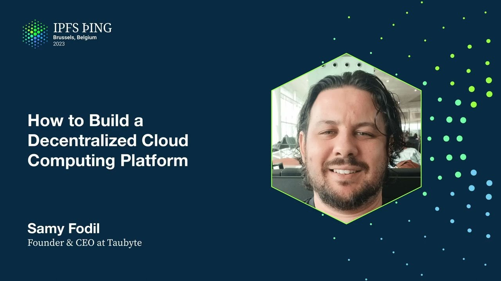

# How to Build a Decentralized Cloud Computing - Samy Fodil

<https://youtube.com/watch?v=tFTExuukQPk>

## Content

Hi, my name is Sami Fadil. Thanks you all for being here. Today I'm going to tell you

about how to build a decentralized cloud computing platform. So when you look at what happened

before with Web2, like the exceptional growth and innovation that happened, it was because
of cloud computing. And cloud computing is also enabling actually Web3, but with considerable

downsides. So we're enforcing, like most DApps and protocols are using hyperscalers clouds,

so we're enforcing their oligopoly. But also there is an inverse correlation between the

developer experience, so more abstraction developers are leveraging from these cloud
providers, more vendor lock-in they have, and more centralized their solutions are.

So when you look at cloud computing itself, it's actually neither centralized nor decentralized.

It's a model. So I'm quoting here Paul Matris, former CEO of VMware. So he said, cloud is

about how you do computing, not where you do computing. And when you look at the computing

capacity out there, there are like over a billion internet-facing servers. Major cloud
providers only use about 1% of all of that. So we have this huge capacity that can be

tapped into to decentralize the web. It's just missing one thing. It's missing a decentralized

cloud computing software or platform. That's the only thing we require. That's the mode
that the hyperscalers have. That's the mode that centralized cloud providers have.

So what do we need to build a decentralized cloud computing platform or actually implement

cloud in a decentralized way? So two main components. I'll go over more details there,

but we need a peer-to-peer network, obvious, right? And then we need to implement cloud
features as peer-to-peer protocols, right? So there is no central node that's responsible
of a specific feature. So this is how we kind of like implement it. So a couple, I put it

in kind of like a layer so it's easy to understand. So on the bottom layer, we have the decentralization

layer. So where we have the peer-to-peer network, and then that's the DAG and stuff from IPFS.

And then on top of that, we have cloud features implemented as protocols. So CICD is a protocol,

application registry is a protocol, and so on. I'll go over some of these. And then on top of that, we have the execution orchestration layer. So we have the TauBite WebAssembly virtual machine that runs WebAssembly. We use that to run two features, D-functions,

which are just serverless, decentralized WebAssembly functions, and then SmartOps, which are basically

D-functions, but are executed for provisioning. So you can say like, don't provision this storage or this function or website unless this node is taking, let's say, a Filecoin,

right, or has a GPU or something like that. So on top of that, it's all cloud-native.

So GitOps and serverless. So for example, if you want to change the state of the network

or something in your application, you have to push these changes as YAML files to GitHub.
It's not like an API, right? It's not like the best practice. So the best practice is
GitOps, and that's how we decided to go for it. And on top of that, we built tools. So WebConsole, so grandma can build software. Tau, so CLI

for developers to quickly spin up their projects. Dreamland and Audible. So I'll go over all

of these, but these are like tools so you can run a TauBite network cloud on your laptop
and test things locally. And TauCorder, so kind of like a tricorder, but for a TauBite

network. And then on the side, these are not developer tools, but more like administrators

or DevOps tools. So SportDrive, Odo and Q. So it's deploying a network, joining a network.

Odo is a node that can run all the protocols given a config, and Q is an observability

tool. So I mentioned serverless, right? So you might think, why aren't we executing

containers or virtual machines or anything like that? So the thing with serverless, it's

like content addressing. We can easily make it location independent, especially if the

D functions are actually CIDs. And that enables a lot of magic and enables decentralization,
but it also enables something very interesting that I call autonomous. Because at the end
of the day, we want to eliminate as much as DevOps as possible too. That's the goal of serverless. YWebAssembly, so it's portable, interoperable, it's secure, so we can control

how much is accessible from there. It's easy to store as a CID. It has a cold start. If

you guys know what cold start is, in serverless, we have this thing called cold start, how long or how much it takes to get the runtime ready to execute the functions. So with WebAssembly,

it's very slow. We can also do predictive runtime spin-ups, which can take it down to

zero. And then there are possibilities to verify the builds and execution.

So let's take an example. All of that is theory and diagrams and stuff. So let's look at an

example. This is a function, same thing, go rust. It does the same thing. It gets a HTTP

request and it replies with a bug. Very simple. What I want to demonstrate here is how this

is handled in a decentralized cloud using different protocols instead of how it will

be handled in a centralized cloud, a Kubernetes cloud, or whatnot.

The first thing that the client does is it will say, hey, what is example.com? So let's
say this function is on example.com and it needs to resolve that. So that's a DNS request.

Instead of going to a static DNS server, it goes to a node in the network that is listening

to DNS and is also connected to the network. So we call that SEER or we call it the SEER

protocol. So SEER will say, OK, I have specific nodes in the network that I know have capacity

and can handle this request. And you can see there it's returning three IPs to the client.

So the client is, OK, I'm going to take that IP, one of the IPs, out of time. I mean, there

is a failover round robin implemented in any browser. It's going to hit one of these nodes
and the node's going to execute the function and reply with a bug. But really, under the
hood, there is more happening. So let's look into that.

So the first thing that happens when that node gets the request is, what is example.com

slash ping? Because it doesn't really know what it is. So it's going to reach out to
a number of nodes that implement the Talbite name system protocol, which is like a registry

of applications, websites, and resources on the network. DNS is going to reply with a

definition of a function, which includes the Wasm module CID. And then the node is going

to grab the CID from the network. We don't have, like a Talbite network doesn't have
pin-in, because pin-in relies on a cluster. And we want Talbite to scale horizontally

and be age-native. So we implemented a protocol that we call hoarder that can keep specific copies of whatever you tell it to. So it can keep specific copies of a CID, or it can keep

specific copies of a storage, a distributed storage, which is one of the resources that can be used on a Talbite cloud. So it grabs that CID. TVM is going to load

the dependencies of the module. So it's going to read the headers of the Wasm module, load dependencies and dependencies of dependencies. Everything is in memory. There is execution,
and it returns the response to the client. Basically, like what's in this diagram. So

hits example dot, like resolves example dot com, gets the IPs of available nodes, send

a request to a node, the node resolves it using TNS if it's not cached or doesn't know the answer, and then runs the code, returns the answer. And it's blazing fast. So you

might think that's slow, but we actually did a benchmark, compared it to AWS Lambda. So
10 times faster cold start, and then 8 times faster execution. So delivering that, like,

you know, web 3 should be faster than web 2, right? So let's look at some of these tools. So web console is a tool that you can use to build

your project. So it's not like, like I said, like, it's Git operated. So actually, web
console is going to ask you to log into your GitHub. It's going to clone your repos in
the browser. It's going to work on your repos on the browser and then push to your repos.
Once you push, there is a protocol called Patrick. They'll grab that job and distribute
that job to another protocol that we call monkey, and they're going to bid and race
on who gets the build job. They're going to build, like, whatever you send there, like, could be config, front-end, web assembly, and deploy that to the network.

We also have a CLI. If I have time, I'll go through all of this live. So you can log in,

create a project. It's very easy to use. And it has prompts, but if you're going to play

it, like, badass, you can also use, like, options in the command and kind of, like, feed the command whatever you want. You can also edit YAML files. I mean, YAMLs
are meant also to be edited by humans, but it's up to you. I mean, command line makes
it easy. Dreamland, so it's a local Talbot network.
So you run it, like, here I run, like, Dream New Multiverse. You can create multiple universes,

like my universe is the default one is called Black Hole, but you can create multiple ones and then with Audible, which is the graphical web interface, you can interact with the network,

add nodes, delete nodes, inject fixtures, and stuff like that.

We have more tools. So like I said, support drive, deploy your own network, Talcorder, like you can play, you know, Scotty and inspect the network, and then Q, which is an observable

tool, so it tells you, like, what nodes are in the network, which ones are online, how much capacity, and stuff like that. Okay, so yesterday when we went to dinner,

I met some people from the IPFS gateway team, and we talked about DevOps and stuff like

that, and I had this idea. I was like, why don't I create a serverless IPFS gateway,

right? So it took me roughly 15 minutes, and the code looks like this, it's roughly like

40 lines of code, and I mean, you can grab a CID, so actually, let me see where that

is. Okay, here you go. So I grabbed the CID from the P2P documentation, and, you know,

basically it's grabbing the CID and returning it, right? And it's all serverless. So this

function can run on any location that the sandbox network is available in. So if I go

here, I don't know if you guys can see this, but we have nodes. Okay, internet is slightly

slow here. Let me refresh quickly. Okay, so these are the nodes that we have running around.

So that serverless function is scaling horizontally through all these locations, and it's only

41 lines of code. You can also do more than that, like you can do processing and way more
than that. I'll show you here. I'm sorry, like the screen resolution is very small.

So like this is like image processing, right? So this is all serverless and WebAssembly,

so it's actually grabbing the image from HTTP and then doing some processing on it, returning
the result. And like the code is also online, like this is like, what, like 70 lines of

code. We can do Rust too, just Go is my preferred language, so most of my examples are in Go.

I mean, another example here is support.2. So support.2 is a URL shortener. I actually

have a video on YouTube how to build it. I mean, I explain details and the video is like

roughly 40 minutes long, so it's pretty fast frontend and backend, and basically stores

whatever URL you give it in a distributed key value store. Everything is distributed,

even the frontend. So frontend is the CID, all the functions are CIDs, and the network
builds everything for you. So the user, like the developer experience is amazing.

C3 is a chat or a web3 chat that we've built. Same thing, like everything is like on a peer-to-peer

network, it's fully serverless. And then everything we have is run in there, like, you know, our
website, blog, like everything. So if I go to our blog here and I'll show you this one,

the avatar generator, which is like an example I built that for some reason people like.

So this is generated with a D function, right? And this is roughly 60 lines of code in Go.

Love Go. We support Rust too. And this is randomly generated, right? So none of this

is our images, they're actually computed. All right, let me go back to my presentation

here. Okay. So we have two SDKs that are fully developed, so Go SDK, my preferred one, and

then Rust SDK, which is also awesome. Documentation on Taohao, two examples that I showed on the

top, and then the little example I built last night to do like IPFS gateway. So what kind

of features we support? So our, like, TVM has a pretty rich set of features. I mean,

you can look at all of that if you look at the Taobite SDK crate or the Go package. So

we can do HTTP, DNS, IPFS, Ethereum, like, you can talk to a VM as well. You can do PubSub,

Storage, KV, like any resource that Taobite provides, you can communicate with that. From

WebAssembly, we're wrapping up CircComp. So we're, like, you can call, like, the WebAssembly

witness generator from a D function, and then you can also verify and generate proofs from

a D function as well. We're also working on serverless containers, which will enable things
like AI and stuff like that. So, yeah, I don't know. Do I have more time? Okay. All right.

So I'm going to just show off here a little bit of, like, Tau. So Tau is the CLI that

we have, and it's very simple to use. So if I do, like, Tau login, it's going to log me
in. Here I'm logged in already. It's really going to log me in in my GitHub. Like, a Taobite

network doesn't really require login. Like, there is no real, like, API there to do a
login, because the source of truth is Git, right? It's Git-operated. So I'm going to
just choose that and then do, like, a Tau select project, and this will list all my

projects, and I'm going to go for the IPFS gateway, and then I'm going to do, like, Tau

clone project. You can do it with Git, but we kind of, like, made it easy to do all of

that. So this will clone, like, my project. Now if I LS here, I have, like, IPFS gateway,

and then you can see that I have config, which is actually, like, YAML files, right? So,
for example, my function that I was running is this getYAML, and let me do a cat on it.

So it's very simple YAML, right? So it has an ID, description, and then trigger. It was

HTTP, right? We support P2P and PubSub right now, and we'll add more. And then the path

is get. Domains. So there is a generated domain that I tested with first. So, like, the

network can give you a generated domain, and then I added my own domain, and that's a
very easy thing. You just do, you know, a TXT entry that the network gives you, like,
it will give you, like, a token to add to your DNS for validation, and it takes, like,

two, three minutes to do. And then execution. So timeout, 10 seconds, memory, 10 megabyte,

and the function that we call is get, right? So that's what the WebAssembly module exports.

For the code side, I can go to code, and then you can see, I mean, this is, like, the reason

there are two repos, so.

The code repo has all the source of truth of the config of your project. Code repo is meant for inline coding, right? The reason we separated it, because, like, somebody who's changing the config might not be the same that's writing code, right? But also, you can also create other repos as libraries, right? The reason we did this code repo is for inline, so grandma can code, right? Or you can code on the floor, you know, like the IP address, right? And so you can

do a DFS gateway. I didn't have to do complicated things. It was just a few clicks, and I was done. And then, so this is my get function, and I mean, I use the templates. This is why it's called ping pong.

But if I cut it here, hold on. Ping pong. That's the code, right? So roughly 60 lines of code in Go, and that's, you know, planet scale or interplanetary scale IPFS gateway. And, like, 60 lines of code.

Yeah. Any questions? I'll use the rest of the time for questions.

Hi. So clearly you've got quite, like, deep integration with IPFS and the general kind of stack, so you're able to, you know, do a lot of IPFS things. You mentioned about FEM as well, and you could, you know, execute stuff on FEM. Is there a way you could have a TAU function, like, registered to listen to an event being emitted by a smart contract on FEM?

Because that'd be a really cool feature, so that a smart contract on FEM could call out to a TAU function to do some other stuff and then come back.

Yeah, so we don't have that yet, but, I mean, we can add it.
That'd be cool. Yeah, yeah, yeah. Let's, like, sit together and get that done. That'd be cool. Thanks. Yeah, that'd be awesome. What other projects do you have in your roadmap? Yeah, so what's next? So we're wrapping up, like, the SIRCOM support, so you can do, like, SIRCOM ZK proofs easily. And then the next thing is going to be, like, what we call serverless containers.

So we're thinking, like, embedding the containers with the WebAssembly module, so basically you can do things like Python or AI and stuff like that from WebAssembly, and, like, the whole package will be kind of, like, packaged as a CID.

And I also like that approach because, like, I was at Wasm.io, and the guys at Red Hat came up with this idea of putting a WebAssembly module inside a container. I think it should be the other way around.

The container should go inside the WebAssembly module, because WebAssembly is way cooler. Right?
Yeah. Makes sense, right? So another question. You mentioned ZK proofs with the SIRCOM. What use cases will it unlock?

Yeah, so some of the use cases there, so there are a few web3 companies that want to do, like, need to do, like, ZK proofs and avoid using oracles because they're expensive.

I mean, having a web3 cloud, you basically don't need oracles. You can build your own oracles, and ZK proof is one way to do that.

If I were to port an application to this that has existing databases and email servers that it calls out to, what is the security around having keys to those servers used in this system?

Yeah, so unfortunately, I don't have a slide for that, but we have a mechanism where the keys are, like, no node in the network really has access to the keys.

They are, like, when you want to store a secret, you reach out to a number of nodes in the network and ask for available, kind of, like, latest available generated public keys.

So what the network does in a regular manner, they generate public keys, and then shards goes to nodes running the vault protocol. Right?

So none of the vault protocols can decrypt anything encrypted with the public key by themselves. They need, like, a threshold. Right?

So you say, like, okay, give me, like, what's available. You figure out the one that's the best that's shared between, like, let's say, three vault nodes because you don't trust just one. Right?

And then you encrypt your secret with that public key, and you send it to one of the vault nodes. It's stored in the database, which is replicated, but none of them has full access to it. Right?

So you need, like, a threshold of nodes to come together and agree to the, like, well, actually, you need a threshold of nodes to give you their partial decryption, and then you regroup everything to get your key.

So that's how we do it. Okay, but the running machine still has temporary access to the private keys.

Yes. So if you want to avoid that, so we're working. It's not, like, an immediate kind of, like, urgency because nobody is asking for that urgently.

But we know that there is, like, something called Ego, which runs, like, Go in an enclave, and that's kind of, like, one of the things that we are thinking about adding.

So when you gather that secret, like, still nobody has access to it.
Okay. Thank you. What's the cost or the revenue model? I mean, you're probably looking for more nodes in your network. Do you have an incentive layer for nodes to join? And as a user, to run code, or do you have, is there a subscription model or you pay per execution?

Yeah, so Talbot is not a service provider, so we're kind of, like, building the Kubernetes for Web3 to some extent. So the network where everything is running, all of my examples, is what we call a sandbox network.

So people can build on it, but, I mean, it's free, but we don't also guarantee capacity or anything like that.

But we're working with specific providers that are looking to spin up their own networks, and anybody can spin up their own networks super easy with Support Drive.

Like, you can spin up a network in a few minutes, and we gather counters on what's going on on the network, like running off the functions and everything, and we generate proofs for that,

and it's up to the provider to ingest that. So they can ingest it in a smart contract if they wish, or they can ingest it in a billing system. That's really up to them.

Okay, thank you so much, Sami. It was a great presentation. Thank you.

