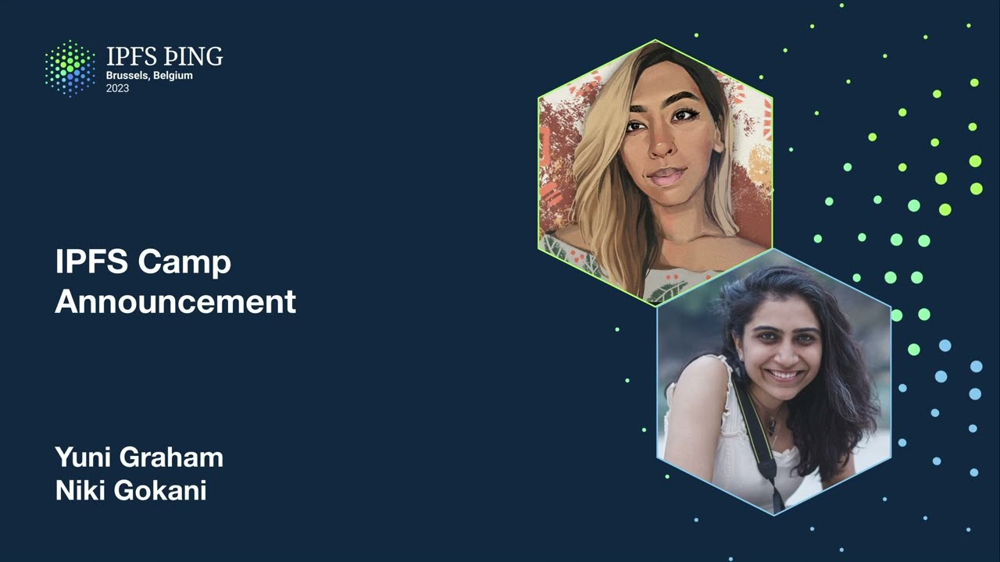

# Overview

In this video, Yuni Graham and Niki Gokani share an announcement about IPFS Camp 2023, which will be held in Bangalore, India, from November 3rd to 5th. Nikki shares some background on why India is an ideal location for the event, highlighting the country's large population, high smartphone ownership rate, and strong developer community. She also talks about successful events held in India in the past and invites others to get involved in initiatives leading up to IPFS Camp. The presenters encourage viewers to pre-register for the event and stay up to date on news and updates.

# IPFS Camp Announcement: Yuni Graham & Niki Gokani

Hi everyone! I'm Yuni Graham, and I'm here with Niki Gokani to share some exciting news about IPFS Camp 2023. The event will be held in Bangalore, India, from November 3rd to 5th, and we can't wait for all of you to join us there.

We chose India as the location for IPFS Camp 2023 for several reasons, as Nikki will explain. According to GitHub, India has a growing developer community, with 2.5 million out of 20 million new developers in 2022 coming from that country. India is projected to have 10 million developers by 2025, and it is expected that the highest number of web 3.0 developers globally will be in India in the next one to two years.

India also has a large population of 1.4 billion people, and 60% of them own smartphones, providing a huge audience for scaling IPFS and distributed web. Our experience at India Blockchain Week in 2022 was amazing, and we saw first-hand the enthusiasm and skills of the developer community in India.

We're excited to work with our community in India to build initiatives leading up to IPFS Camp, and Nikki invites anyone interested to find her and talk about getting involved.

If you want to stay up to date on all the news and updates leading up to IPFS Camp 2023, scan the QR code in the video to pre-register. We hope to see you there!