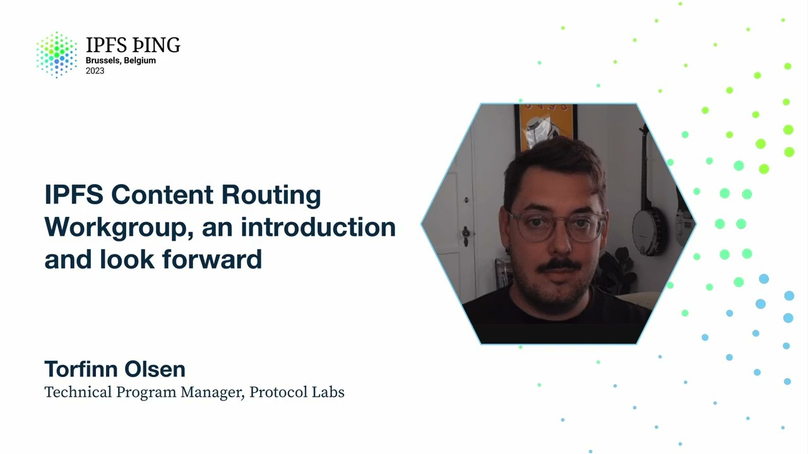

# IPFS Content Routing Workgroup, an introduction - Torfinn Olsen

<https://youtube.com/watch?v=MagS8ly_YXE>

## Content

Content routing is an incredibly complex problem. You've heard about the DHT a little bit earlier

and some of the optimizations that we're working on there from Gi, and also you've heard about this IPNI solution that you couldn't be blamed for recognizing our extremely disparate approaches

to kind of solving this problem that doesn't exist in traditional location-based networks.

And so I'd like to refer to this quote from Richard Feynman from an interview that he did,

basically the idea being, there's such a lot in the world, there's so much distance between
the fundamental rules of everything that the final phenomenon that results is actually

just astoundingly hard to connect to the simple operations that actually result in that end outcome.

And content routing is very much like that. We have a very, very complex set of networks

with the need to look up these content identifiers, and the way that we do that seems very complicated

because there's so many ways to look at it, but truly it's actually a very, very simple operation

that's just happening at a very large scale. And so what is the IPFS Content Routing Workgroup?

We're kind of a dialogue-driven focal point for discussing these problems and looking at both

simultaneously the immediate execution of all of these things that we've talked about today,

getting these out into potentially Kubo or addressing content routing discussions for

DHT optimizations, delegated content routing, API design, all of these immediate executions

that are ongoing. And then simultaneously we're addressing this future problem of
how do we get to this federated network of indexer nodes, interplanetary network indexer nodes,

which results in a decentralized solution to what is a highly centralized immediate

kind of result that we're working on. So we're the place to talk about these things.
Who makes up this content routing workgroup presently? So I've kind of got a group of folks

here that are consistent contributors to it. It's the IPNI team, the IPFS stewards,

ProbeLab, and the Bifrost team who does a lot of testing support for us, but also who enables us

to actually roll a lot of these changes out or test them in the Kubo nodes or their clusters.
And then we occasionally have guests that visit from IRO, the general public, or just generally

like independent contributors that are interested from the IPFS side of the house. But ultimately,
these meetings are actually open to the public. They're all recorded on YouTube. So if you'd like
to go back through historical ones and kind of see the things that we've discussed or understand
a little bit of context and how we approach these problems, you can go back and recreate all those
discussions as well as all of our notes, which are shared publicly on Notion. So why should you care?

And what is the current state of content routing today as we discuss it? I think Mossi's already

really covered a lot of that in his earlier talk, but I'll just kind of recapture that just for
context here. We've got the DHT, which is old reliable. It's chugging along, and you can count

on it to persistently be there and do what it's intended to do. We can always rely on it. This is

one content routing system that provides a peer-to-peer functionality. The HydroBoosters

still exist presently. They're operating as a bridging function right now, so they're passing
content. And then you've got the Interplanetary Network Indexer, which exists as a standalone

instance, SID.contact, which you can refer to. But additionally, there are actually seven of

these instances running globally. I'll show you a map in a little bit, which highlights where those actually physically are right now, that you could theoretically refer to to be performing

lookups. So they are available. I look forward for the SID.contact instance of the

Interplanetary Network Indexer. We're presently working immediately on our double-hash value
store, so we're going to get an in-depth look at that with Yvonne's talk a little bit later today.
Something we're really excited about, this presents a use case for privacy that we'll actually be
able to obscure a bit. What exactly people are doing on our network, we don't want that to be

necessarily externally visible. We want people to have the option to choose whether or not they

want their traffic essentially monitored. And we've got some monitoring of index operator

instances. So I mentioned these six other instances that are publicly available. Right now, they're all going through the process independently of synchronizing the ad chain that

we use to provide lookups at SID.contact. So all of these indexer instances are currently at varying

states of the ingestion process. Some of them are very close behind us, and some of them are
further away. But I wouldn't blame any of you for not knowing what the state of any of those is,

because we're not advertising that to the broader community. You can't see what the state of synchronization is across these instances. And so a next big step for us as we approach this

longer-term goal of having a federated, distributed mesh of network indexers that you could refer to

for lookups is to understand exactly what the state of all these are. And then only then could

we actually approach solving these problems of weighting or reliability or what the different

responses are that you might get from one of these. And then additionally, we're working on this
edge node service. Masi mentioned the caching problem. The idea that the closer we can get

a reflection of this index, this key value store that we present for you to be able to perform

lookups, the faster those lookups might be. And so we have the Saturn network. The CDN is

really broad. It's a deep network. And we have the opportunity to deploy an edge node service

to that network and take advantage of the fact that we have this highly distributed network to

get lookups as close as possible to reduce network traffic across this entire network.

And then so what does this look like? That's the IPNI in relation to this broader, more disparate

problem of content routing. Content routing crosses several teams. And so we've got, I mentioned

ProbeLab, Bifrost, the IPFS stewards. But really, the problems that we're solving actually affect

almost everybody. Everybody that's using the network is impacted by the decisions that are being made during these discussions of the content routing process. So some of the closer

term stuff, I think Guy mentioned he's working on this DHT refactoring. Maybe a broader way to look

at that is the optimizations of the DHT, because you also heard Masi kind of discuss a little bit

of optimizing the speed and the efficiency with which the IPNI can leverage the DHT.
There's a broader conclusion there that if we take all of these sources and we're able to optimize
them, that ultimately we can leverage the DHT even better than the way that we do now.

There's also the concept of delegated content routing puts. So another thing you might have
heard Masi mention was that we've highly optimized this pathway for ingestion. But ultimately,

we really want to get to the point where we can delegate the function of putting information into the system. And so that's work associated with that that we would like to address as a group.

And then there's BitSwap provider search delays and peer routing optimization.

There are other opportunities that have nothing necessarily immediately to do with the IPNI,

but ultimately result in a better content routing experience across the network. These are the types of discussions that you're going to find happening in this content routing workgroup. And then ultimately, kind of at the tail end of this, the direction that we're really going as a group with all of these teams is that we want ambient discovery of

these indexer instances so that we have this federated network of indexers that exists to

serve the purpose of the whole network so that you always consistently have a place to very speedily and efficiently look up information anywhere on the network. So what does it look like right now? These are actually the instances of the IPNI

that are running. They're all in different states, as I mentioned. So we have a very heavy presence

here in North America. Probably it's good. But really, ultimately, what we want is we want this

map to be broken down into zones that service the lookup frequency. And so we will be making a very

intentional push to find folks that are interested in operating an indexer instance in South America,

Africa, the Middle East, Europe, so that we have more representation closer to where the lookups happen, as well as we have both Australia, which we recently added. We're very excited about that.

They're actually pretty close to ingesting the ad chain. And then our friends in China here.

So what kind of discussions can you expect to find in the content routing workgroup in the future?

This is my pitch to you to actually potentially join this workgroup, listen in, contribute your
ideas. I think the elephant in the room that I would point out is that when you take the

decentralized nature of the DHT and this concept of pure routing, when you look at something like

the interplanetary network indexer, the immediate conclusion that you're likely to come to is that
one of these is a highly centralized lookup solution in relation to a highly decentralized,

kind of independently operated solution. And so we have a goal of trying to get this now very fast,

very highly scalable solution to be decentralized and to take those values that were used in the

implementation of the DHT and spread them out into this solution that is highly adaptable and

extensible and can be potentially evolved into even further content routing methods in the future

that we haven't even imagined yet. So there are a few things that in the immediate future will
contribute towards that discussion. We've got index operator discussions and feedback.
So we have all these folks running IP and I instances right now. We need to build those

relationships in a way where we're able to start handling traffic with them, that we figure out
what our incentive solutions are going to be to justify them running these instances. I'm sure

everybody's doing everything out of the kindness of their own heart, but ultimately there's some traffic involved with this and the good of the network alone may not drive these behaviors as

much as we might like it to. So there are some incentive solutions that need to be discussed,
designed and worked out, and how we ultimately achieve this. Juan did a talk last year at IPFS

Thing. I highly recommend looking at where he discussed potentially like L2 or L1 solutions

to this type of problem, but we're at a point in time where we're basically setting the stage
for that design discussion to result in an actually distributed mesh network of these instances.

And then we've got Rhea and Lassie ultimately as a kind of a potential staging ground for a lot of

the work that we're doing. So we now have this super powerful tool available to us to try things
out. And so when the group's meeting, we're kind of talking about these things that we can potentially do. And then I kind of put down these client agnostic interfaces, but I think Guy brought

a really important solution to the group recently to talk about looking at our interfaces and how we
deal with like Reprovide, for instance. There's a lot of discussion that's going to be happening, I think, around that in the near term future. And then I just want to say again, this is a sales

pitch. We really want to encourage your participation in this group, at least in the Slack.
But if you join the calls, we'd be happy to have you there as well. I put some links in this presentation to share with you. There's a Luma that has all the future discussions that are coming up.
I hear in about two weeks will be the next one. There's a YouTube channel with our playlist, which includes all of the historic discussions that you're welcome to join. And then additionally,
the notion for the content routing work group has an aggregation of all the information, decisions we're making, discussions we're having on this topic. You're welcome to go look around

in there. And then ultimately, if you join our Slack IPFS content routing work group or message
me directly, I would absolutely be happy to talk to you about any of this stuff that we're working on
and future solutions for this whole problem. Can you walk through the process of how a deal or a SID gets advertised on the network?

And I know you were calling for people to be running these indexer nodes to cache these

associations between SIDs and where they exist on the network. Are there frameworks in place

that I don't have to cache the entirety of the network or I can just cache SIDs that I'm
interested in from maybe a certain agent or deal maker or from a certain provider?

It's a pretty good question. If you think about the way a SID ends up in the key value store

on the network indexer, you have to right now run a provider instance. And that provider instance

usually is happening in the case of Boost or it's happening on the networks in Filecoin.

As part of the dealmaking process, that SID gets announced as an advertisement
to the network indexer. And so there's actually some metadata associated with it beyond just the
key value pair of the SID and the provider ID, but that's what we represent, the end result,
to be able to perform lookups. The idea of delegating puts as a content routing,

that's the idea of creating an API that's an interface that potentially you could perform these advertisements through an HTTP payload, for instance. And so that's part of

the process that we're working towards is how do we disaggregate these solutions that we have to

get your content onto the network indexer. And so in the future, it should be much easier to do.

Another work stream that we're approaching right now is, and we need a lot of help from

our partners on the IPFS side of the house, is to ultimately get IPFS nodes to potentially,

or some iteration of IPFS nodes to be able to perform these advertisements explicitly on their

own without necessarily needing to run a provider instance independently. And so this is a work

stream that is not presently underway, I would say, but it's in the design decision process where

we're talking about ways that we might go about this. And then another, I would say, novel approach

that you can take, so just kind of a few layers potentially, is through the eIPFS implementation.

Just by virtue of leveraging that specific eIPFS version, you can advertise through that method.

So that is actually how the folks at NFT Storage and Web3.storage are presently announcing their

IPFS additions to the network to the indexer. Did that answer your question?
Are you looking at anything in the FVM to help implement some of this? Because this sounds very

similar to subgraphs in ETH. And I don't know how, off the top of my head, I don't really know

I don't really have a good idea of how well it would scale to log SIDs in FVM logs. But is that

like something you're thinking about? I won't pontificate on that. It's not immediately in
the zone of discussion topics. We're actually, I would say, pretty heavily iterating on immediate

problems with content routing. However, these types of ideas are really great. And I think

FVM is very fresh. Join the content routing workgroup and come and discuss these topics
with us. You know we'd love to have you, Ben. Hannah. Hypothetically, if I were someone who was

not fully bought into the IP&I approach, I maybe were a group that was researching how to do the

DHT better. Would I still be someone who should show up at the content routing group?
Yeah. You're the perfect person. This is exactly who we want to join this workgroup. I will say

that the IP&I is a solution which ultimately gets us much closer to some state where potentially we

can have a, like Masi said several times, smash Web 2.0 performance. We are making tradeoffs

in the process of attempting to do that.

we recognize that we're making those tradeoffs. We're doing it to get to an immediate state where we can get that performance in place and then disaggregate the problem of how do we decentralize now that we're able to do the thing, how do we deal with this very critical topic of representing our values through decentralized services and also obviously privacy is a big function of that. But we want that.

Contention to result in actual action. And so you would find yourself in very good company.

If I had a great algorithm. Which I don't. That's okay. That's okay. I mean, like the process of these discussions ultimately often is to design said algorithms by virtue of kind of the community discussion and to lead to those actions. And so your voice would be very appreciated. Absolutely.

I wanted to add two things to two other questions that was mentioned. So the first one, Torfin mentioned that we're looking for other people to run network indexers. I wanted to make it absolutely clear that this is not an all or nothing protocol. You can absolutely run a network indexer that only indexes your stuff. That is perfectly welcome.

On the provider side, in IP and IP protocol, you always store the information that you only provide. Which is the slight distinction to make there. For me, two words to highlight in that title is just content routing. And I wanted to connect it to the intro slides, which is this concept of content routing. We have some idea of the boundaries, but it is still loosely defined.

What's there that unites us is the easiest way by which you can discover information and make it discoverable. And that is a value that is independent of protocol. And success for me would be a future where that is made true and the protocol or implementation becomes irrelevant to the end user.

That's why this working group exists. So please don't let the three letters of IP and I scare you. This is not IP and I. IP and I is not necessarily the future. It's just a implementation of a routing system and hopefully many, many more. I hope that makes sense.

Thanks, Masi. I was thinking more about what you said about if people can run indexers that don't have copies of everything, then as a client, you're going to need to know which indexer to talk to to find a particular piece of data. How is that any different from conceptually from location addressing? You have to know who to talk to in order to find the data that you're looking for.

The short answer is I don't know. There's a lot of similarities for sure. I think the first thing to enable is to just make the content easier to discover. We haven't even touched this discoverer discovery problem.

We have scratched the surface. There is a draft design by Will sitting in the back, ambient discovery stuff. This is something that we absolutely need to solve. It is slightly different in the case of IP and I because of the way it works.

I totally see multiple discovery mechanisms through the DHT to then pass you on into nodes that then have the content. The fundamental idea there is that you play into the heterogeneity of the nodes where you have nodes that have more resources, are willing to do more for whatever benefit, and the rest of it is just figuring out how it's going to work together.

That is different from the purist view of the DHT, which is everybody's flat, nobody's more important than anybody else. That's fantastic for resilience, but there's just more different use cases.

It occurs to me that there is room for alternative solutions to then satisfy the different use cases. The trick, of course, is to make it all work together.

I think the double hashing stuff is a great intro into making sure that all the systems actually do work together because we do not want to break routing from DHT to IP and I as a result of making it more private. To me, that is a really great exercise to make sure we've got the interfaces right.

I know there are talks later on about what the interfaces are going to look like. It's the beginning.

I think there's also, with content addressable data, we have all these unique possible outcomes where we can get outside of our heads a little bit.

There's definitely a huge parallel, and I wouldn't blame you for recognizing it, with location-based addressing, typical networking, IP routing. But we also have all these functionalities available to us that aren't available in traditional IP-based routing.

I think what we continue to explore in the future is where are the places where we can displace those traditional limitations of location-based networking, and what are these new paradigms that we can uncover and discover?

I think these are the really exciting topics that we get to have in the content routing workgroup and through the discussions will surface. It feels like there's a lot of opportunities.

I wanted to be clear that I'm not criticizing. I actually like location addressing. That's the thing that enables scalability. It's basically like sharding and stuff like that.

Learning how to deal with it, I think, is an important problem.
I'm with you there. Thank you. My understanding, I get why IPNS makes sense for large sets of CIDs, but also I think the DHT makes a lot of sense when it's a small set of CIDs.

Say it's an IoT network or it's a private network, but also discovering the IPNS providers, IPNI providers that could be done through DHT.

My understanding is we're not dropping the DHT, but just adding something else, right?
Yeah, we want, ultimately, for the benefits of a distributed network like we have, we want accessible content routing methods to exist.

We want people to explore this concept of content routing, potentially even think of solutions that we're not immediately having.

But with the volume and scale of Filecoin, we're not at 1.3 trillion CIDs anymore. We're ingesting 30 to 40 billion a week right now.

I'm persistently looking at these numbers in between talks, even. We actually are at 1.4 trillion right now, probably creeping up on 1.5.
The rate of ingestion that's happening right now is massive. The network's massive.

We expect that that's only going to continue to take off. The solution, the strategy that we're taking here is let's get this fundamental system in place which can handle this type of scale.

We have to leverage a semi-centralized solution to do that.
But then we approach all these other methods should operate in parallel.
Solutions can come along that are completely, potentially contradictory in their solution to this problem that plug right into the network.

But we're offering a solution in place. Maybe even leverage both. Oh, yeah. Like use the DHT to find the IP and AI providers and then use the IP and AI providers to find CRDs in, let's say, Filecoin or something like that.

There's absolutely a world where these systems are entirely complementary. Yeah. Cool. I'll be haunting you in that work group. Join us. Yeah. Yeah. I think at the same time that we imagine, and there is this reality of many different content routing things, that there also are user desires where end product systems are going to move towards the latency in order to compete with Web 2 and so forth.

And so there is a pretty strong push that we'll get from applications that resists these cascade-like things and having the location service or the I'm going to have my index of my own content.

Where I think in the same way that we've seen with cassette currently, it leads to then decisions of are we waiting for that, and those things will end up as lower tiers if nothing else.

So there is this pushback towards, you know, how much can you get where you push it left, I think was the metaphor that Masi used earlier, into the immediate systems that users are querying.

And so I think there's a couple things there. One is if you're running instances of or an instance of IPNI, one of the things that IPNI is doing for you is making car archives of the processed index and so forth, such that it becomes easier to share that and push it left to other instances rather than just having your own content routed thing.

Although you get that now very quickly within your domain. But it lowers the barrier, hopefully, for that becoming just part of the broader network.

And so I guess I'm still hoping that we don't end up with lots of location addressed subnetworks, but rather can design systems that allow for the true content addressing where stuff is that is going to be public, where a user that wants it is close to them.

And that you don't have to go back to a growing and unbounded number of potential providers.

Thanks, Will. This is a really important point. And this is something that we will deliberate on continuously in this workgroup.
That's what this workgroup exists for, is to have these types of discussions and to define the pathways that we take.

All right. Well, thank you, everybody, for listening to me talk. Thank you.
