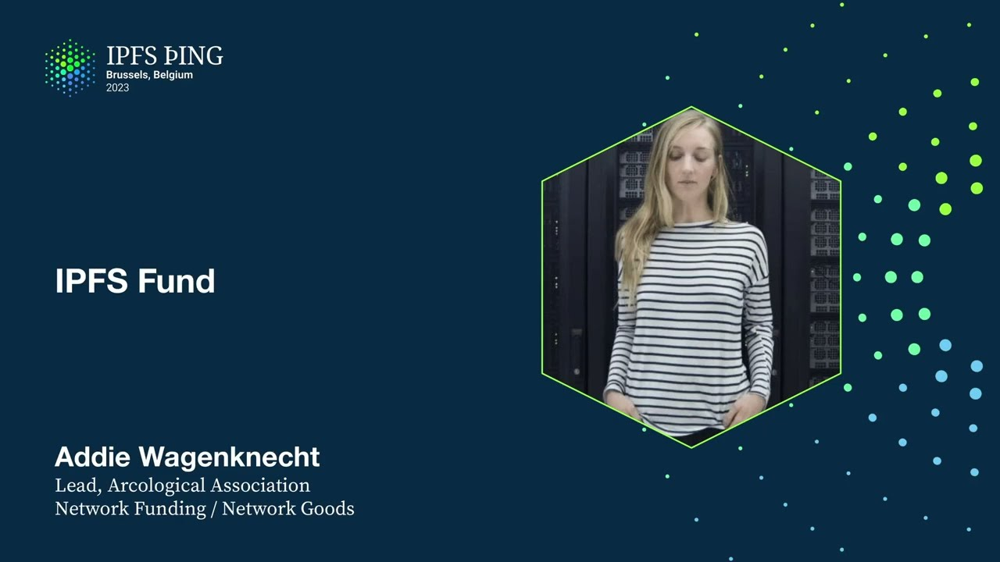

# IPFS Impact Awards - Addie Wagenknecht

<https://youtube.com/watch?v=Njsi9tKIv8w>

## Content

Hey everyone, I'm Addy Wagenicht, I'm one of the co-leads of Archaeological Association

and I'm also in the Network Goods Network funding team for Protocol Labs.
So I'm here to talk briefly about the IPFS fund. For those of you that aren't familiar, for the last two years the IPFS fund has been actively working to drive transformation of the IPFS infrastructure, kind of from the

reliance of primary implementations to implementations that meet the needs of the growing and scaling
community. So artists, people in InfoSec, developers, people developing in IoT space, Raspberry
Pi, that sort of stuff. The fund looks basically to catalyze and accelerate the development of IPFS implementation and
ensure high impact teams working with IPFS build and grow. So we are like a really high risk, high return for developers, artists, InfoSec infrastructure,
so on and so forth. We've already committed a significant amount of money and tokens to raising and building

out the IPFS community. And we're looking for additional funding for the following years, so if any of you are bored and rich, feel free to reach out to me or say hi.

Our cohort, with a special thanks to Dietrich, Mosh, Juan, and Molly for their inputs and expertise, this is sort of where we were focusing for our initial build out, was like large
infrastructure, new infrastructure, building out communities. So we have things like Chromium integration, peer-to-peer secure storage, integration of

IPFS to Unreal and Unity, Go implementation, Rust, and so on and so forth.

And then just to look at kind of deciphering or looking at kind of a larger project, one

is 3S. I don't think they're here right now, but if you're not familiar with them, they're a game development studio. They built basically an Unreal Unity plugin. So the cool thing about this is that you can generate pack files with the pack loader automation,

run them, mount them dynamically in runtime, which means you can basically organize any of your games by assets. Like folder types, it allows you to make a super centralized distribution build.
And with IPFS, obviously, you can share content just by sharing the CIDs, so there's a massive potential for gaming to be built interoperably in the sense that you can have a full stack

of say buildings or morphing characters stored as JSON data on IPFS.

So this is something that really allows people to share basically by the render target allows

people to share things like textures or complex models, so on and so forth, between games that are being developed. And this is a really major thing for people that have worked in game development, as we all kind of know this is one of the hard things to solve, and they've been trying to solve that. And so when they built this plugin, they were building this because they needed the infrastructure for their own game development, and it didn't exist. And so IPFS Fund, along with Dietrich and Mosh, Juan, Molly, we were sort of looking at ways to increase adoption, and we thought this was a really interesting way to go about that. IPFS is obviously something that's really important in the gaming future of gaming, and so they built this plugin because they needed it for their own game development,

and in the last two months alone, they've had about 15,000 installations.

And then just a little bit about our team before we start going into awards. Archaeological is basically leading the IPFS Fund, OPEX, financial, legal needs, and the
concept of Archaeological was basically built out so that there's no central point of ownership.
So it's sort of like a DAO, but it's actually recognized by governments and financial institutions,
and so it makes it easier for us to navigate those complex hierarchies and systems. Because we have no one that controls the ownership, we basically look to deploy optimized tooling
and infrastructure for funding with strong feedback loops. So Dietrich and Mosh, Juan and Molly, have been really the drivers of the IPFS Fund,

helping us make those decisions. And then the core team is myself, Evan, Mauro, who have been tweaking and structuring the mechanics for the last year, dealing with things like banking collapses and exchange collapses. And so our background is like a mix of research, open hardware. I was in open hardware for about 10 years, developing out a lot of open hardware systems, protocols, anything that you need around Raspberry Pi or Arduino, I'm happy to build that out for you. Evan's obviously been leading out research, and Mauro was the head of CEO for blockchain

at Crypto Bitcoin Swiss.
And then before we announce the winners, this is something that we've all been sort of working on on the side. It's a little bit of alpha before we get into the rest of this. So one of the things I've been wanting to work on is solving, essentially, in 2023,
blockchain mechanisms for proactive real-time distribution of funding allocation.
Having worked in open hardware and open source, one of the major issues is retroactive funding, because you still need a runway to basically build out your ideas, and no one wants to necessarily fund open source, although there are some, like, key angels in there. So I was looking at ways that we could have people who are already doing things with their tokens. Phil, for example, is what we're looking and using right now with GILF. This allows you to allocate some of the return you get on staking or different pooling mechanisms

into public goods in things like IPFS and the Filecoin FEM community.
And so I started working on this. It's on the Hyperspace testnet. If anyone wants to, like, hammer break a smart contract, I would love to put you on the multisig
and just send you some faucet fill and see if we can break it together. But we're looking at sort of making this so it proactively funds all of your projects and allows you to get distributions automatically, transparently on chain, because I think that's the future of funding. I'm also working on things like governance mechanisms with quadratic voting and introducing
impact certificates and impact evaluators on chain so that all of that can be transparently tracked, and there's a lot less bureaucracy and red tape and delays and all that stuff that isn't sexy and no one wants to talk about. So that's all stuff that I've been working on for this year and hopefully for next year.
This is a little screenshot of it on testnet. Once again, if you want to test it, I'm thrilled to have you do that. Bonus points if you break it. And then I want to switch really quickly, because I think I'm already out of time, on the IPFS community impact awards. I don't know if, Dietrich, you want to come up here and jazz it up also with me, but these are awards that are every six months. They're projects that are crowdsourced by the community and voted. So we want to say congratulations to the 28 winners.
Really, special thanks to all the people that submitted projects.

So this fund only goes to projects that are submitted, so thank you for finding the projects

that matter to you and adding them. These were not curated by this team or Protocol Labs or the fund. These were projects submitted by you. Some of these projects are you. So thank you for submitting. Thank you also to everybody who voted. We're going to be doing this regularly. Yeah, we'll release them every six months, and we'll do it. I'll try to really spray the news across every channel we've got, so just check out Discord,
Slack, Telegram, Twitter, whatever you've got. We'll let you know about the voting and submissions, because the more of you that contribute, the more exciting this will get. So thanks, everybody, and congratulations. And thank you for working on this and building the things that you build, because it gives us something to reward so you can do more of it.

