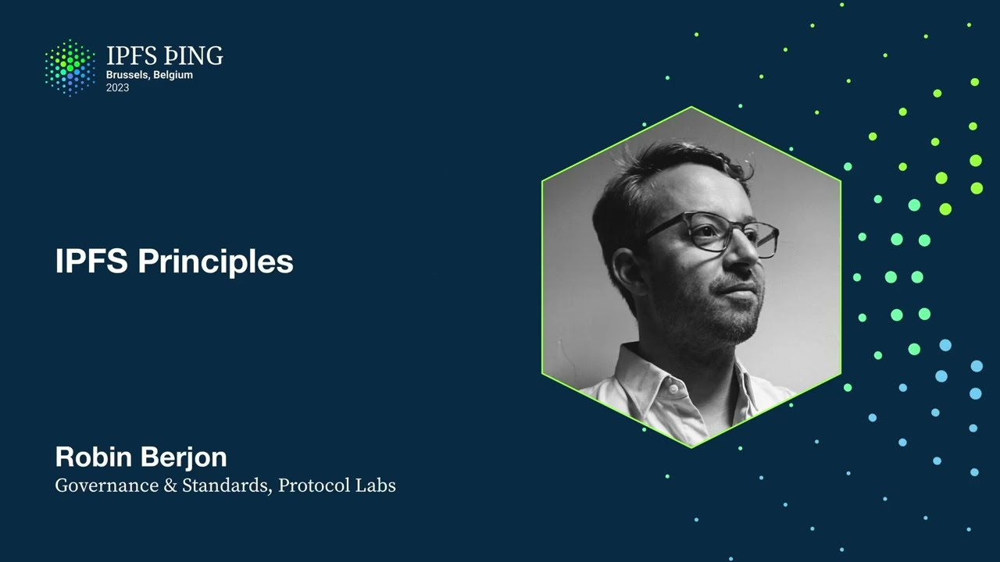

# IPFS Principles - Robin Berjon

<https://youtube.com/watch?v=FI-2SNxz1Gk>

## Content

As you know, and as we're going to see right after this, there's a whole small Cambrian

explosion of IPFS implementations happening. And that comes with the risk that we could

lose cohesion in terms of what IPFS is and how the entire ecosystem fits together. And

so in order to prevent that from happening, we've been working on a set of core principles

that all of IPFS can share. Because if we have a shared foundation, a shared set of principles, then everyone can go and play and invent crazy things, and the entire system

retains its cohesion and can work together. A part of that, one thing that's important
to understand is that we tend to think of principles as the first thing you do. You
want to build something, and first you do the principles, and then you lay the foundations, and then you start building. But in practice, what actually happens is that we build things,

and then we figure out why we got it right, or what we got wrong, and what's wrong about it, and how we have to change it. And that's why the idea here is that this principle document is meant to be a living document. On the internet, on the web, these things have been built and

rebuilt for decades, and we're still finding new principles and documenting new principles. And the idea is that we really should be doing the same here. And so the first batch landed, and it's actually pretty straightforward. If you have basically

two primary characteristics, you can have something that's IPFS-like. First, you need

content that is content-addressed with verifiability at the endpoints. And second, which is tied

to the first, if you have that, then you can use arbitrary transports. And so that's basically
everything you need to guarantee that something can be IPFS-like in principle. And in a sense,

you could have a song saying, all you need is SIDS.

Based on those two very basic characteristics, we can already see outcomes that are positive

in terms of the results. So first, just from that, you get self-certified addressability.

If you think of the way that addressing works on the web, we tend to always say, oh, but there's a problem because we delegate to DNS. But it's not just delegation to DNS. Authority is also delegated to the server itself. And that's actually how it was designed. The idea
is that you go to DNS, DNS tells you where the server is, and then as a user, you are
effectively on someone's property. And anything you get is something that they have validated
for you, that they promise is what they're supposed to be giving you, and that's all you can find out about it. The idea is that this creates an asymmetry of power between
you as a user and the person running the server. Basically, everything becomes a benevolent dictatorship, or at least the best you can get is a benevolent dictatorship. It's always a dictatorship anyway. With self-certified addressability, you don't need to rely on
anyone else's authority. You can just get it and verify it yourself. And this makes

CIDs the trust model of IPFS. And the second outcome of these very two basic principles

is that you get better robustness from it. We've all heard this principle that you're
supposed to be liberal in what you accept and conservative in what you send when you're writing network protocols. And it sounds nice. It sounds like the kind of person you want to be. You're open to anything that other people might do, but you're careful about
what you do yourself. But in practice, it turns out when you run that over decades and

decades, it actually creates a big mess. It was a huge effort to clean up HTTP after doing

that kind of stuff for a while. It was a massive effort just to get the HTML parsing algorithm
right after a couple decades of doing it this way. And so basically, if you look at those

core principles, those two characteristics, we get something that is a new robustness

principle that is specific to IPFS. And that's actually better. It's being strict about the outcomes. You want to be strict at the endpoints. And this allows you to be completely tolerant about anything in the middle. You could have a carrier pigeon. So long as you have a CID, it doesn't matter. You can just put the content in it. It doesn't matter where it transfers or what goes through, what happens to it in the middle. You can still check that it's there. And this creates a level of robustness that enables experimentation and any kind
of wild implementation design that anyone might come up with so that IPFS can work in

all kinds of situations, any kind of device, any kind of network topology. And with that,

that's it. Thank you.
