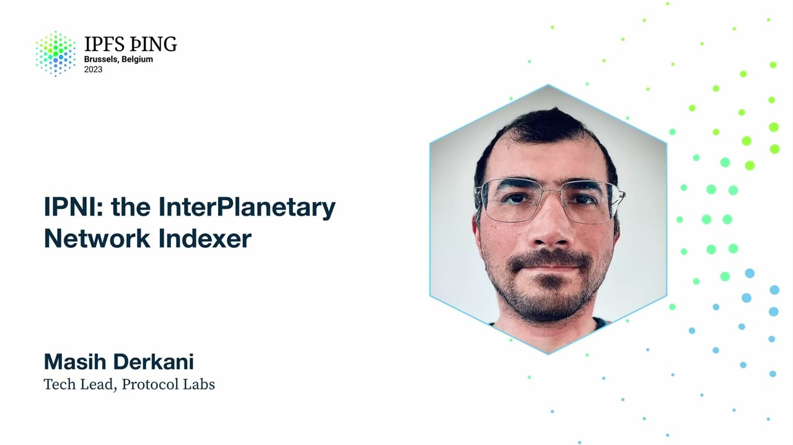

# IPNI: the InterPlanetary Network Indexer - Masih Derkani

<https://youtube.com/watch?v=_EDJXeDtcX4>

## Content

Next up, we're going to talk about IPNI and what it actually is. This is an acronym that

came up a number of times yesterday in data transfer track, in the opening talks. It is

not something new. The chances are you have already heard about it. It's just a bit of
rename and a bit of restructuring, which I thought it deserves a separate talk to crystallize

what is a protocol, increasingly becoming a protocol, and what is an implementation.

So I put together this talk to talk about that specific protocol versus its implementations,

other plans in terms of protocol perspective, and then walk you through probably the most

developed instance of IPNI, which is SID.contact, that comes after that. So with that in mind,

let's get started. What is IPNI? It's an alternative routing system which is designed to provide

SIDs by the billion, by the bucket load, while maintaining sub-10 millisecond latency-ish.

It is a protocol that is totally different from the way by which DHT, for example, advertises

content and looks up information, and it makes very distinct design decisions to make this

statement become true. Because the fact remains that right now, we cannot provide content

at the rate that is being generated in the DHT. So we need some sort of other mechanism

to enable implementers, enable people that are building stuff on top of this simple yet

extremely powerful ecosystem we call content address data to find their information. And
that's where IPNI comes in. So why is it needed? I sort of touched on that a little bit earlier.

We really need to understand why we need something like IPNI when there's already a routing system.

As I touched on in my opening talk, there is a gap in the networks. There was a gap
in the networks. There was Filecoin and there was IPFS. The amount of information on Filecoin

is significantly larger than the amount of information on IPFS. Even ignoring that, in

the IPFS world, we see sort of optimizations that are a result of a routing system not

sort of being able to handle it, which is I'm only going to advertise my root CID, for

example. I'm not going to advertise the rest of it. So we are starting to see this type of optimization on the IPFS world, which is pragmatic, but really in the long run is going

to impact the user experience. And it's going to impact this idea of parallelism when it

comes to retrieval, the idea of replication, the idea of caching. It has a huge ripple

effect if we don't provide alternatives that truly allow us to advertise all the CIDs and

you know, so it is pretty important. Large-scale content providers have totally different requirements

than me running an IPFS node on my laptop, traveling to work on the train and back. Their

addresses might change. The large-scale content providers, they do not want to re-advertise

content every time they redeploy a node, for example. They want to be able to horizontally

scale as the traffic for looking up information goes up and down because they want to be as

efficient as possible, both in terms of performance as well as cost. And at the same time, they

want to provide fast lookup. And when we are talking about content address data and content

address data, looking up content address data, we're not really talking about matching the
web2 performance. We absolutely talk about smashing it. Because when we are talking about

a peer-to-peer network, on the paper, it has to be much, much faster than a centralized network. So what can we do to enable this type of interaction? And the last one, but

not least, let's ignore scaling issues with existing content routing systems. Let's assume

that the cost of connection is zero and we have unlimited connections to everybody. We

are talking about, right now, we have about 10 to the 12th number of CIDs. That's in trillions.

Where we want to get to is 10 to the 15th. Two orders of magnitude larger than that.
Even at 10 to the 12th, if we do the rough calculation, with the size of network that
we have now, which is about 20,000 nodes-ish, assuming all of them are well-connected and

well-behaved, we're talking about gigabytes of data stored on each of these nodes for

content routing alone. And as a person who is running IPFS on his machine on the way
to work, sitting on a train, that's a bit of a, you know, I'm not sure if I really want
to do this. So, this is another motivation here. The other one is the storage space,

the cost of storage keeps going down. So, if we have an alternative solution that just
has a simple machine, has a simple protocol, connects terabytes of data to this server-like
thing, and, you know, hopefully over time this is not going to cost as much running

because storage prices keep going down. And what we can do when the storage prices go

down means we can reduce this notion of having to trust a central party by simply replicating

the data. So, there are ways there. So, just to backtrack, there's a few design decisions

here. The need to enable content routing for the rate of growth in content addressable

data, the need for faster lookup, the need for flexibility on how you handle this content

address data for the large-scale providers that have totally different requirements than a typical, you know, small node in an IPFS network. And more importantly, as the storage

gets cheaper, we can replicate these and reduce this notion of single point of trust, which

is something that we all strive for in this community. So, that is why IPNI exists.

There's been a number of words in the past year or so that sort of use for explaining

IPNI or pointing at IPNI interchangeably. I wanted to clarify that a little bit. So,
IPNI really isn't network indexer. IPNI isn't a stored index, nor C.contact, nor an index

provider. Great. A lot of information, but what is it really? So, if I want to restructure

this, I want to say that all these things are members of IPNI. So, if you can think
of network indexers as the serving nodes in the IPNI ecosystem, these are the nodes that

are big nodes with lots of storage attached, and their job is to just provide a lookup

fast and ingest by the bucket load. Stored index is just an implementation, and hopefully

not the only one soon, of index providers. This is the server-side implementation.

SID.contact, we're going to cover that in the next talk in a minute. And index providers.
Index providers are just nodes that are implementing the protocol by which to provide information

to the IPNI. So, in the Kubo world, you have the DHT client, for example, or its extensions

that Guy kindly covered for us today. And in the IPNI world, you have the index providers,

which are following a specific protocol in order to advertise content into the interplanetary

network indexer. What does the protocol look like? So, let's

dive a little bit deeper. We've got indexer nodes in the middle that are ingesting advertisements.

The story begins on the left-hand side, where you have the index providers that are structuring
their data in a specific way that is made to be super-efficient for ingestion, super-efficient

for change, may it be address, may it be retrieval protocol, and may it be change in the subset

of CIDs that are provided. So, this is important. We'll get back to that in a minute.

And then these index providers, once they structure their data into this special way,

they make an announcement to the network to say, hey, I have something. That announcement
is just a message to say, there is something new, come get it. That's totally different from the way that DHT works. So, here you have this triggered passive interaction. I

trigger something, and the network indexer comes and gets it at its own leisure, wherever
it sees fit. So, then once the announcements are published into a network or explicitly,

network indexers are going to reach to the provider, assuming they haven't seen the advertisement
before, and they say, give me the data. They get the data, they structure it in a two-layer

data store. We'll talk about that in a bit, some more, and then expose a simple REST API,

which is just get CID or multi-hash. You call this endpoint, and you get the results back.

So I want to talk a little bit about that structure on the left, because I think it's important to understand why and how it is different from the DHT. And then I'm going
to talk internally about how this is structured inside the network indexer, though outside

the specification, this is outside the specification, but this is typically how we see the data
being structured on the nodes for scalability reasons. So on the left-hand side, the structure

by which the content is advertised by the providers looks a lot like a blockchain. You

have an advertisement, which is a root node. That advertisement has very simple fields

like what is the peer ID, what is the address, information about how the data can be retrieved,

which is a new thing that doesn't exist in DHT. And then it has a pointer or a link to

a series of chunks or entry chunks, which actually contain the multi-hashes themselves.

This entire structure is IPLD data. So we are using content address representation for

advertising the content address information. And I think that is quite nice, because just

having the advertisements as content address data just allows you to reuse the existing ecosystem for looking up other things, which we will talk about later a little bit. But

I want you to imagine looking up other copies of an advertisement using the same content

address network that enables looking up the information in the first place. I think there's something beautiful about that. The advertisements themselves never directly contain the entries

that are removed from the chain. That is an important optimization. So if I have advertised
millions of multi-hashes for me to say, I no longer have this, this is a very small

data, very small advertisement just to say, you know, the things that I told you in the past with this ID, scratch them. Don't have them anymore. You never republish multi-hashes.

You never republish any of these entries. If you want to change addresses from provider's
perspective, again, this is a single advertisement that just changes the address. You literally
publish a new thing, you say, I changed the address, that's it. Address gets changed for all the advertisements that happened in the past. There is another mechanism, which we
call extended providers, which allows you to have a cluster of nodes that are providing

the same information. This is typical of a large-scale content provider. And have a way

of conveying that through advertisements to say, you know, all the advertisements that are published in the past, now I have three nodes in front of it that serve the same data.
Again, you do not publish all the multi-hashes again. All you're doing is, please extend

the addresses by which this can be retrieved by these extra nodes. And this is really nice.

So far, I think this is probably as efficient as you can get when it comes to advertising content. The one thing I wanted to cover here... Yeah, we can get back to it. On the indexer

side, this passive fetching allows the indexers to identify or think about what information

they have before they reach out to the client. Because remember, all of this is content address data. What we're exchanging is CIDs and DAGs here. CIDs are pointing to immutable data.

Network indexer can see whether a CID has been seen before or not. And therefore, it

does not need to reach out and fetch data every time.
So what does that really mean in practice? It means great things. An advertisement could

be pointing to an entry that has been published weeks before. And there is a way for indexers

to infer that. So you will never have to get the same data twice. That's pretty nice.

On the indexer side, the data is structured in such a way that it is optimized for changes
in the information that we store for each of these records. And by changes, I mean things like the address changes, the retrieval protocols, and so on that I touched on earlier. And that

is done simply by having a foreign key-like mechanism, if you like, in RDBS relational

database design. So what we have is a multi-hash that points to something that remains constant.

And then that constant thing then points to other things that may change all the time. And that then allows us to efficiently handle things like change of protocol as well as
change of addresses. The thing that I wanted to talk about that I couldn't remember earlier, advertisements are chained together and signed at every step
of the way. That allows the whole ecosystem to prove that a peer indeed claimed to provide

a multi-hash because everything is signed here. And this is a small window into a whole

body of work that we haven't even started scratching the surface of, and that is reputation.

Right there, you have a way by which you can prove that you told me you have this information.

Where is it? Because you have an advertise that is removed, right? Imagine, like a scenario,
some note that just publishes stuff, right? And this is the concept of accountability that is built into the advertisement chain, typical of a blockchain-like data structure.

So the most recent extensions to the IP&I protocol, remember this talk is going to only
talk about the protocol itself. We're going to dive into the implementation in a bit. Extended provider families. I touched on that a little bit earlier. If you're a large-scale
provider and you're providing information across multiple nodes, typical setup in a

large-scale provider, these nodes are probably elastic. They go small and they go big. More

importantly, the protocols by which the data could be retrieved might change over time.
Today you might be supporting BitSwap. Tomorrow you want to support GraphSync. The day after,

tomorrow, day after tomorrow, insert your favorite protocol here, right? Should you
really have to re-advertise all your content every time you change a protocol? Really not, right? So that's where IP&I has built-in levers to allow you to really express this. And these

two levers are kind of combined together, both in terms of the node addresses as well
as the protocols over which they can be retrieved. A really good example of this being used today
is Boost. Boost is a new Filecoin market implementation which offers extensions in terms of retrieval

of data as well as much, much simpler interface to interact with the data. Boost today supports

BitSwap, supports HTTP, I think is in the making, almost there. From day one it didn't

support BitSwap. It didn't support HTTP. And there are nodes out there in Filecoin network

that are publishing, making deals all the time. So when the BitSwap and HTTP was added,

for them to tell the world that, hey, all the millions of multi-ashes that I've published over the last few months now is retrievable over BitSwap, it was a single advertisement

that was added to the chain and that is it. That is pretty nice.

Reader privacy. We're going to cover that in depth by the talk by Ivan later on today,
and we're going to cover what it means for the DHT itself. Reader privacy is something
that is cross-cutting across multiple content routing systems, and it affects the way by

which we exchange information fundamentally, but not necessarily the lookup algorithm itself.
So it's quite a neat improvement, which is user-centric, and I think it's very welcome.
we're going to cover that deeply today. Advertisement mirroring is another new extension in the IPNI. It is yet to be formalized in the specifications. I'll point you to the specifications later today, but the main idea there is that for other nodes to provide the same information, if we go back to the previous slide, for other nodes to provide the same information, indexer nodes, they need to have the ground truth. They need to have the

advertisement chain. They need to have the entries, right? And it would be a real shame if every time they want that information, they have to go back to the original provider, because that means that every time IPNI network expands, providers get the punishment of, oh, I have to reserve this again, right? Also, it would be a real shame if we are talking about this content address network without CDNs, because data is immutable, right? This is highly

cacheable information, right? So the idea of advertisement mirroring is to provide caches of this chain of advertisements across the network such that it enables, first of all, fast catch-up of new indexer nodes to the information, and second of all, lays the foundation for a world in which you can verify and assert that a node actually provides the information they claim, right? Because remember, at the end of

the day, what we really, really, really want is for people to find their data and for them to get it, right? Really get what they asked for, okay?

We have streaming lookup. So this is a work that started in the HTTP delegated routing by the stewards team. Very welcome. Basically, all the IPNI APIs now support NDJSON streaming responses back.

The way that it works is extremely simple. Rather than having a giant body of JSON which has an array in it that has many, many records, you just write the records with new lines separated as soon as you find them.

And this is quite powerful, yet simple. I'll go over the benefits of that in the SID.contact specifically. But the long story here is that it makes the chaining of this routing systems together much, much easier because you don't have to wait for...

Because at the start of the chain, you can trickle the information up as you find them rather than having to wait for the aggregator latency of all these chain systems to get the results back.

So it is pretty simple, a pretty fundamental advancement in terms of making this lookup faster while making it swappable. Yeah, so I'll cover the SID.contact stuff.

The lookup that just works. So this is another advancement in the IPNI protocol. Originally, IPNI was only focused on the information that is explicitly published the way that the IPNI speaks.

This meant that if there was an alternative routing system like BitSwap or the DHT, you need to go and run your own router, right? You go and run your own BitSwap client and find the information.

Now we are moving towards a world... We have already delivered this extensions to the IPNI lookup protocol that allows you to specify cascading of lookup. So in the APIs, you can specify to which alternative routing system the lookup should be cascaded.

And then the aggregated results are returned back to the client. There is this concept of cascade label, which right now supports two variations, IPFS, DHT, and what we call legacy.

This is the mechanism by which LASI, for example, delegates the problem of content discovery and content routing to an external system and keeps its system boundaries crisp and firm to do one thing very, very well, and that is retrieval.

So this is, I think, an interesting advancement because, again, we are keeping ourselves true to this promise of give me the set, I'll find it for you.

Diving a little bit into cascading lookup, cascading lookup will always return the IPNI information, so it is just a complementary lookup over multiple routing systems. Like I mentioned, two ones are supported today.

There's a label that you specify, so literally there is a query parameter called cascade. You add it to the end of the get request for the CID, and you insert IPFS-DHT.

If you want the legacy, you add another one. It calls legacy, and that's all you have to do.

We have built in a mechanism by which users can discover these labels as they appear because you really shouldn't have to watch the specification or read the specification every time you need to read the system.

We also want to enable programmatic ways by which you can discover these cascading mechanisms.
If you send a HTTP options request to an IPNI node, in the headers, you get back two extra headers, which is IPNI allow cascade, which contains a comma-separated list of those labels that you could specify.

It's quite neat. In the case of legacy, it will tell you where you need to appear in order to make your content discoverable.

Let me talk a little bit about this legacy thing. The context behind this was to enable Project Rhea, just make the Project Rhea work.

We just want to delegate content discovery, so that's where all this came from.
I have a whole bunch of numbers to present to you in the CID.contact presentation, but the main thing about the word legacy here is that right now it basically includes bits of gossip.

We are very specific about how we are making the content that is only discoverable over bits of available, and that is by explicit peering.

If you're a user, if you're a node out there that has this content only discoverable over bits of, for whatever reason, you could explicitly peer to an address in IPNI to then make that content discoverable.

If you do not, then we won't be going out looking for it, because remember, IPNI is in the ballgame of mass discovery, large scale, buy the bucket sort of thing,

and the bits of gossip is not something that scales in that type of environment, because it's sort of inefficient by design.

Streaming responses. All you need to add to your responses is this accept header application xndjson. Just works. Please give it a try today, CID.contact.

If you haven't switched to streaming responses, please do. There's numbers to specifically do some more in the CID.contact presentation.

What's on the making in the IPNI roadmap? We plan to make the lookups private by default. Right now we store the information on encrypted on the back end.

From observability perspective, an IPNI instance, for example, could collect analytics data on how popular CID is or what a specific user is looking at.

That's not great. We really don't want to enable another Google Analytics when we are making Web3 World.
What we want to do instead is we want to roll out reader privacy, the stuff that Ivan is going to cover.

Then what we're going to do is, even for the unencrypted advertisements out there, we're going to do the encryption on client's behalf,

and the value store on the back end will only contain encrypted information.

We are making the lookup encrypted by default. As part of that, we're going to optimize the read path.

So far we've done a lot of work in optimizing the write path, i.e. publication of information.

We are going to make the read path even faster by the way of leveraging the double-hashed information,

because double-hashed information opens the opportunity by which you get the data effectively pre-processed.
I'll get into that a little bit more later. We want to enable more adoption of IPNI. What we are looking at is what does it look like if we want to enable that long tail of content providers to also publish to IPNI.

That long tail is, remember, my laptop on the train going to work and back.
How can we reduce barriers of adoption there? A whole body of work around federation, which has already started with the advertisement mirroring,

but we're going to formalize that a little bit more. We're going to have protocols that reason about how consistency across multiple IPNI instances can be guaranteed as long as they follow the same protocol.

This also includes things like caching, for example, as a natural way of reducing the need of trust for a single entry.

So exciting stuff coming up. Who is working on all this awesome stuff? We have a team of five. Four people in this team are in IPFS thing today.

Please reach out to us. Andrew, unfortunately, couldn't be with us today. He's based on West Coast, US. Ivan, sitting over there, is going to give us a talk. Yours truly, Torfin, who is the product manager in IPNI team.

If you're interested or curious about running your own IPNI instance, please come talk to us.

Torfin would love to give you a walkthrough. And we've got Will sitting right at the back that is basically shepherding all this work through integration with other systems across the interplanetary network.

We have a brand new GitHub organization, IPNI.
This is all things IPNI. Please go and visit it. We will have a shiny website coming up soon, so look out for that.
If there's one repo you check out in the IPNI organization, it's specs.
We already have three extensions merged. We've got three waiting. There is an open API, HTTP specification for all the APIs that I talked about. You can generate your own client and whatnot. If you're looking for changes on the IPNI protocol, that is the repo to watch.

And I just wanted to point out the really nice work done by Andrew recently, which consolidated all these little improvements and functionalities into a single reusable Go library called GoLibIPNI.

That allows you to kind of slice and dice functionalities and sort of build your own client the way you like it.
We would love contributions there. We would love to understand how this looks from the developer experience perspective.
Give it a try. Comments are more than welcome. Capture an issue. We are very quick in responding. There is a CLI to check out that allows you to verify interaction in IPNI network.

For example, have I advertised the right thing as a provider? Has an indexer network seen the information that I've advertised?
This CLI allows you to verify these things and actually check that you are an IPNI provider or consumable by an indexer.

It is in that repo. Please check it out. Two main commands to remember, verifying just and list at. These are the commands that are heavily used inside Bedrock, if not the PL network, just for testing our own stuff.

These are the tools we have built to make sure that systems work, such as, for example, Boost and other providers.

There is a new CLI coming up, which looks much, much shinier. Watch out for that. We have four blog posts that talk about what is IPNI. That QR code takes you to the latest published by Ivan that walks you through extended providers.
But there is more. Please check them out. And finally, Filecoin, Slack, IPNI. That's where you find all the community interaction. Please reach out to us if there is anything that we can help you with.
I'm going to pause for questions and then walk you through SID.contact after that.

How do you guys find that? Any questions I can answer? Great work, Massih. Just one question. In theory, if Kubo nodes start publishing these advertisements, there is nothing stopping from all that IPFS content getting indexed directly on IPNI, right?

Could you integrate an IPNI client directly into a Kubo node and get them to start publishing advertising instead of using the DHT, for example?

Absolutely. This exists today. It is actually integrated into Colab IPFS clusters.
The data from Colab IPFS clusters is discoverable on SID.contact right now.
And the way that that works is by integrating the index provider library that I pointed to earlier.

The main thing to point out there is that the barrier for adoption right now means that you have to have a publicly accessible endpoint for advertisements to get fetched.

And that is okay for long-running IPFS clusters. But if I'm on a train use case, running a publicly accessible thing is not really desirable.

So what we want to do is make that a little bit better. Just talk about what we can do there to enable this long tail of publication.
Sorry, just which instance do the Kubo nodes use? So they get to configure which IPNI instance to talk to? Right. So there are two ways by which you can announce the IPNI network. One is not directly configured. It works through GossipSub. So it gets propagated over the network. The other one is explicit HTTP announcements, which goes to SID.contact. I believe Colab clusters are using GossipSub. Are they? Or are they using direct connection? But anyway, so you have both options, right? So for example, Filecoin uses the GossipSub thing. And NFC.storage uses explicit HTTP, which you need an endpoint.

Thanks. This is great. And this might be a question that sort of contextually should be in the CID.contact presentation.

But what does it take for someone like the average user of Kubo to advertise onto this network right now?

Does it happen by default? Are we actually filling the IPNI system with the existing CIDs out there?

Or is there something that the average user has to flip a switch? So the lookup side right now, the reading content, is built into Kubo.

You don't have to do anything about that. I think it's enabled by default. But publication, providing content, is not. What we do have, however, is extensions to the integration layers in Kubo, which is HTTP-delegated routing,

for you to then use that interface to publish information. And that is the very same interface that is used by IPFS callout clusters to provide information.

In that case, it would become a hands-on keyboard integration of a library.

So you don't have to implement everything from scratch. It's just a bit of glue-making in terms of connecting things. But eventually, what we would like to look at is just reason about what the world would look like if providing was also made default behavior

that was configurable without the need for implementation. But early days there, there is a need for some protocol changes just to reduce barriers for adoption, like I mentioned.

But we are certainly thinking about it. One thing I hear from providers a lot is that they want to only provide the data that their customers are giving them, basically.

Is that a use case that IP&I is considering?
What sort of filtering are they exactly looking for? Would you mind repeating that for me?
Imagine you're a provider and you have customers giving you data to provide.

You only want to spend money providing that data and not any other data, right?
Absolutely. Filtering is an interesting topic. This is something that came up in the Boost discussion as well.
When the Boost started, it was all or nothing. By default, it always provides everything.

And then there was a callout from community, like, I need to be able to configure this. So right now there's a specific flag. You can specify whether a deal information could be published to IP&I or not.

Absolutely. It already exists, but it's on the Filecoin site.
If this is a concern that's big enough, totally, we can certainly introduce it in the IPFS world as well.

