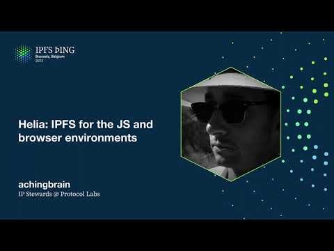

# Implementations Showcase: Helia - IPFS for the JS and Browser Environments - achingbrain

<https://youtube.com/watch?v=mqpMR7bbkgg>

## Content

Hi everyone, my name is Alex, I am aching brain on the internet, I am on the IP Stewards

team at Protocol Labs, I look after JSIPFS and JSLibP2P, but today I'm here to talk to

you about Helia. Helia is the new implementation of IPFS, all written in JavaScript, we are

trying to basically apply the learnings of the last five years or so to what a new implementation

could look like. It shares a lot of components with the existing JSIPFS, the lower level

stuff so libp2p, bitswap, UnixFS and so on, but the top level APIs have all been completely

redesigned to just be more ergonomic, more usable, try to think like what would a user

want when they are trying to integrate IPFS with their application and the output of that

is Helia. So it's a lot smaller, there's a lot less duplication, one of the big challenges

with JSIPFS was always trying to chase Qubo for features and implementation details and

that kind of thing, without really thinking like is it actually the best thing for JavaScript given the use cases and the deployment environments and that kind of thing. So this is like a
completely new blue sky thinking, everything is off the table, what could it be to make

it just smaller, more composable, more observable, because we want people to be able to dig deep

into it and understand what's happening when something isn't working and which component
is the one that has the problem because your typical IPFS implementation has an awful lot
of moving parts and if they aren't aligned perfectly then things tend not to work properly
and so the question is like what isn't aligned, why isn't it working, so we definitely want that to be a focus just to make it more usable. The environments it targets are Node, browsers,

Electron, hopefully Deno, still waiting for a few APIs to be implemented, all of these

things, it's going to be amazing. I have two talks tomorrow which you should come to if you want to find out more, they're in the IPFS on the web track, the first is Hello
Helia at 1.30 I think and then 2 o'clock is going to be the one about performance considerations,

they're straight after lunch, they'll be in one of the rooms over there somewhere and you should come and find me to talk about it afterwards, I want to know the use cases, the problems that you have, like please open issues, we have two interesting repos, there's

the Helia repo where all the source code lives and you can find links to documentation there
and how to do common tasks and that kind of thing and then there's the examples repo which

contains a few examples now, we're adding to them of how to integrate Helia with different
bundlers, different technologies, how to do common tasks, please open issues and come

and talk to me. Thank you very much, this is Helia.

