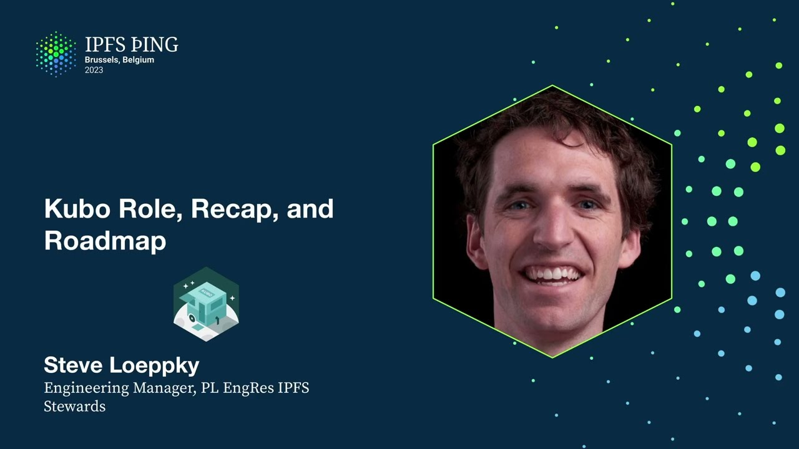

# Implementations Showcase: Kubo - Steve Loeppky

<https://youtube.com/watch?v=vuXi9pT_Zdk>

## Content

Well, hello. I'm Steve Lepke. I'm one of the engineering managers with the Protocol

Labs Engineering Research Group and get to work with our IPFS team. And I'll be kicking us off here in the implementation track here just talking about Kubo. And so with that,

I think many may know that Kubo is IPFS's first implementation. It was also the main
implementation for many years and as a result has grown with the IPFS project. As a result,
it is versatile in the way that it has been bent and contorted to meet various needs.
But stepping back, I believe Kubo is really best suited for the independent self-hoster.

And that's what we're trying to emphasize here with the new logo that we're showing here with a camper, right? That you've got that independence and versatility that we

believe Kubo can bring. But in practice, Kubo as an implementation is in a lot of ways the
fallback implementation if there isn't something else for you. But it does power some really
marquee use cases in onboarding for the IPFS community. One of those is Brave, which probably
many are aware of. It's admittedly a bit of an awkward marriage, sticking a Go binary in a browser. But it's working for now. We do presume that a Rust or JS implementation
will end up winning there, which would be great. It does power many of the HTTP gateways

that are out there, including IPFS currently, although that will be shifting with the Saturn RIA project that Will was mentioning. But again, most of that traffic is all happening

through Kubo today. And even that Bifrost gateway part is extracted out Kubo code. And

side plug in, that'll be getting talked about more here on Monday during the HTTP gateways track where I'll be talking about the Bifrost gateway. And then two, there's the IPFS desktop, which is oftentimes the entryway or lobby way, or it's a lobby for someone's IPFS journey. And that's all Kubo behind the scenes. It may be unexpected, but Kubo is often used for experimentation and validation of IPFS specs. Again, while not necessarily optimized for it, the fact that it has high network prevalence, which I'll be talking about shortly, and auto update mechanisms through IPFS desktop and Brave, it makes it a great place to get
code out there that you need a large scale network deployment to validate. That said,

Kubo is not suited for many things, including large infrastructure. Oftentimes, large infrastructure providers want more control or introspection than what Kubo provides. And they're looking
for things like bounds on resource utilization or per ID or IP or peer ID throttling, performant

garbage collection on large pin sets, policies around specific content. Kubo doesn't provide all those things, nor is it ideal for limited platforms like IoT or mobile or things like
your CI runs. But it's filling the gap. In terms of what's underneath the covers, it

is multi-platform. We distribute binaries across those platforms. And also, the Docker images are very popular. Last time I looked, about almost 50% of the nodes that use Kubo are actually using our Docker images. It's a daemon architecture written in Go. It has a few different interaction models, a CLI, a home brewed RPC interface, HTTP RPC interface.

One where it's particularly strict is around the HTTP gateway interface that's been well specified. And to control it, it has a ton of configuration knobs, which can be a blessing
or a curse. Its prevalence, it's still right now the dominant implementation. About 80%

of the nodes that store DHT provider records on the public IPv6 DHT are all using Kubo.

And when I looked at the bootstrappers operated by PL, about 80% of the 125,000 unique peer

IDs were all Kubo. So it's still very much out there. In terms of accomplishments since we last gathered in Iceland, one was around configurable
content routing. The HT routing V1 API is implemented and supported. And that enabled

us in the network indexers, including CID.contact, to implement that. And so CID.contact is queried
in parallel by default now in Kubo. We did a soft launch of Boxo. And this is where we

extracted out and consolidated reusable Kubo functionality into a library to enable spawning

of other Go-based implementations like the Bifrost gateway. This is used in Kubo, Bifrost
gateway, IPv6 cluster, even in Lotus currently. And you can learn more about that later today.
Gus is giving a talk about building your own adventure with Boxo. Maybe not the most exciting, but we wrangled the Golub P2P resource manager into Kubo.

Adding in resource accounting eight years after the fact is not easy or fun. So thanks to those who endured that with us, because it did take multiple releases to iron it out. The gateway saw a steady trickle of improvements, all of which were specified publicly, and

particularly leaning in on verifiability now with IPNS records. And we're really trying
to take advantage of all the connectivity work that the LibP2P team has been doing with getting web transport deployed so that Chromium and now nightly Firefox browsers can connect
directly to a Kubo node, even if it's publicly edible, even if its setup doesn't have a CA

cert. Yeah, so in terms of some of what's coming and Q1, we want to update the content routing within Kubo with reader privacy. So this is both on the DHT and network indexer front.
And there are going to be talks happening on that on Sunday in the content routing track, both with Yanis for DHT and Yann with the network indexers. Also, there were various

network events that happened over the last six months, and there's some improvements to make, particularly around routing table resiliency, guiding folks in their providing operations, and around bit swap in terms of adding metrics, timeouts, and back pressure. So those will be some of the work that's happening at the end of Q1. And you can learn more about what happened with the DHT with Yanis' talk later today in the measuring IPFS track. Again, we're going to be pushing to test and validate the hypothesis around Boxo and seeing
if we can get more customized implementations out there that aren't living under the constraints of Kubo. And, oh, sorry, my bad. Wrong way. Last thing, too, is we want to do for data transfer what

we did for data, sorry, for content routing within Kubo to enable configurability of having different data transfer protocols within it. And yes, we want to be able to support multiple
in parallel for both getting blocks and graphs, and also take advantage of all the work that
the Move With The Bytes group has been doing on the data transfer stack. Yeah, so in terms of the team, all these folks are here. The core maintainers, Lytle, Ladeen,

Gus, Henrik, and Jaropo. They love to chat and connect. We also want to say big thanks to the over 350 direct contributors that have contributed to Kubo over the last eight years, and the many more who have or do provide support, insight, and guidance along the way.
And in terms of closing, in terms of how we talk about how to help, the team wants to acknowledge that what got us to this point in IPFS may not be what's ultimately needed to get us where the project is going in the future. Kubo is a linchpin in the ecosystem
today. But the maintainers really feel the tension around supporting the current users
and use cases while really wanting to enable others to own their destiny and not be limited by what Kubo can do. So in that sense, please share your use cases and feedback with us. We would love to be collaborating, particularly on some examples, to empower others to own their destiny. And so yeah, please hit us up in the hallway, on different channels, or create a GitHub issue and look forward to connecting. Thanks a lot.

