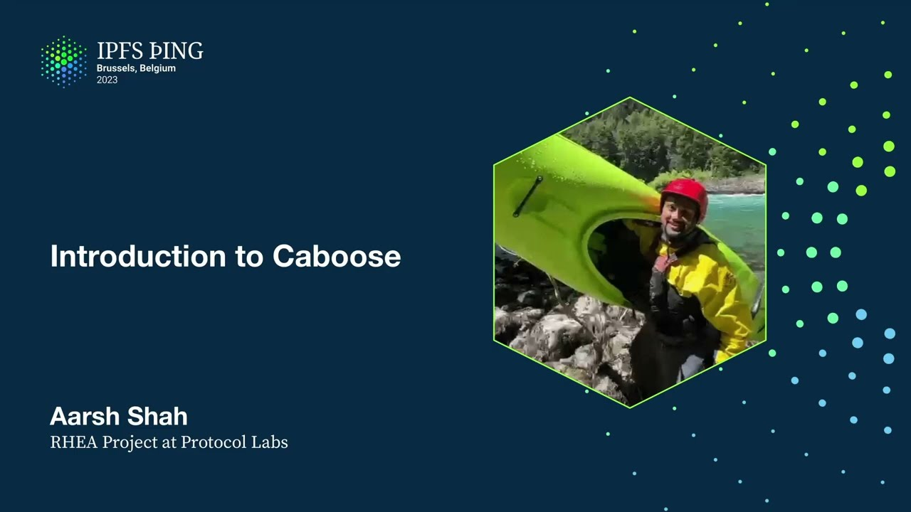

# Introduction to Caboose - Aarsh Shah

<https://youtube.com/watch?v=z7a9E735l3Y>

## Content

and a few other things. Thank you. Hello, everyone. Good afternoon. My name is Arsh Shah. Three years at PL and this is my first talk in the conference. I'm a bit scared to a room of big people, but you've got to start somewhere. We'll see how it goes. So today I'm going to talk about project kaboos. We started this project a month ago. It's been a month and a half of active development, so there's not a lot, but there's still some that I want to talk about and hopefully get feedback on how we can improve it. So what is kaboos? It is a library

that can be used as a retrieval client for server applications that want to retrieve content from the satin DCDN network.
Alex Kinsler here already talked about what satin is. It's a pretty cool tool that allows you to do a lot of things. It allows you to do a lot of things into retrieving content from that network and kaboos does the heavy lifting for you to enable speedy and reliable downloads from the satin network. It allows fetching both blocks and cars, so it supports both the graph as a car API and block fetch API from satin. And it

can also, as we'll see, be used as a pretty cool satin network for a lot of things. So I think that's it. So I think that's it. I think that's everything that makes it very easy to understand what kaboos is. Sorry. Just learning the tricks of the trade. But, yeah. So say you have, like, a normal application, right, and you want to retrieve content from satin. What is all the stuff that you need to do? First of all, you need to get a list of L1s, a list of satin nodes that you want to talk to from the satin orchestrator service. After that, you start sending fetch requests to them because you still don't know anything about who's the good guy, who's the bad guy, et cetera, who's fast, who's slow, who's slow, who's fast, who's slow, who's fast, who's slow, who's fast, who's fast, who's slow, who's fast, who's fast, who's fast, who's fast, who's fast, who's fast, who's fast, who's fast, who's fast, who's not. So you fetch your blocks, you fetch your cards. Maybe you need to submit some sort of signed token or signed Ukin, so that satin can later then bill you for the amount of retrieval that you've done from the network. So you also need to generate and sign those tokens. After you fetch the content, you measure, like, observe latency, observe throughput, observe correctness, and then start ranking the nodes based on those parameters. You need to put those nodes on some sort of consistent hashing ring for cache affinity. So think of it this way, like if you talk to different Saturn nodes every time for the same content, you're not gonna get the benefit of caching that Saturn provides. So you need some sort of cache affinity as well. You probably want to build some measurements and metrics around how your retrievals from Saturn are doing so later you can then go complain to the Saturn guys if things are not working out and you already have proof in the form of dashboards. And then you need to submit retrieval logs to the Saturn network back so that Saturn can use those logs to detect like fraudulent Saturn nodes, pay them out if they're acting fair, et cetera. So as you can see, like it's a bunch of work, right? And you probably don't want to build this every time into an application if you want to download content from Saturn. So anyone wants to take a guess on what the solution is? Yeah, it's Caboose. So yeah, I mean, Caboose is the library that does all this for you and you can just have a good night's rest. You big Z. The idea is Caboose is a library that will fetch content from Saturn. It has an internal reputation and ranking algorithm that considers a whole bunch of parameters such as P95 latency, correctness, throughput, et cetera to rank the nodes internally. It can generate these signed UCANs for you down the line. It doesn't do so so far because there's no need but it can do so if needed. It submits this Prometheus matrix. It does all the consistent hashing for you. It submits retrieval logs to Saturn for you. So the idea is for it to be like a plug and play library so that it's very easy to retrieve content from Saturn. Yeah. So that's the idea of Caboose. Now, yeah, where are we today? Like I said, we started work in late February so we have a Golang beta implementation so you can run Caboose on servers. The Bifrost gateway is already using it for Project Rhea to retrieve content from Saturn. So we actually have Caboose running inside like Bifrost gateway instances right now as we speak. You can find it on GitHub, Filecoin, Saturn, Caboose. Yeah, I mean, I was told that you shouldn't have too much text on slides so sorry about this. I need to up my meme game is what I've learned from this conference. But for now, yeah, for now, assume there's a couple of cute, I don't know, cats in there and yeah, so what does the beta implementation do? You have like, it does all the consistent hashing of L1s, the ranking for L1 based on observed retrieval latency and correctness. It gives some form of failure recovery and backup by like doing fetch attempts to multiple L1 nodes that it knows about. Comprehensive matrix collection, both card and block fetches, sorry. Yeah, I mean, this is stuff that I already talked about, but these are the features we have right now. The thing is like building this client on top of
a distributed system where nodes come and go, nodes are reliable, nodes might be slow, is not exactly trivial. There's like a lot of like, we're constantly tuning the ranking algorithm to get like optimal performance out of it. Like consistent hashing, et cetera, works well when there's reliably, like there's low churn in the network. But if there's like high churn in the network, some of those nodes are not as performant as other nodes, et cetera. There's no like perfect algorithm out there today that can like nail this down for you. So with that caveat, like I'm just giving a high level overview of what we have today and then just show some numbers on how it's going. And if you feel like part of what I'm saying is incorrect, like feel free to like give feedback later on how we can improve it. And if there is an algorithm out there that can do this for us. Yeah, so the way it works today is we group nodes into different tiers. Each tier is its own consistent hashing ring. Yeah, so imagine like tier one, tier two, tier three of nodes, and each tier is a consistent hashing ring of certain nodes in that tier. We define tiers based on observed latency. So like a tier, one tier is P95 less than 20, another is P95 less than 50, et cetera. We always, in order to retrieve, we always try nodes from higher tiers before falling back to lower tiers. We also have a parking tier, which is where we like put certain nodes that we still don't know much about. We haven't talked to them much. We don't know about their throughput, latency, et cetera. And we do these performance measurements for the tiers based on like a rolling window of one hour to only consider like recent performance so that the P95 values don't get skewed. You know, if you've done well yesterday, but you're not doing well today, we don't wanna talk to you today. And the way, as of today, the way we promote these parking tier nodes to like the higher tiers is by sending 20% of production traffic to these nodes to see how they are performing. The problem with that is that that means that 20% of your production traffic is going to nodes you don't know much about, which hurts performance. So what we are doing to do in the next iteration, I know Will wants this ASAP. We'll just have some patience. We'll get it done ASAP. So it's like we're gonna mirror X percent of, we are going to mirror X percent of production traffic to these parking tier nodes. So they're not on the critical path to serving like by-frost traffic, but as we gradually find out more about them, we can either kick them out or we can promote them to the tier they really belong to. Earlier, we tried this thing of like just having one consistent hashing ring without any tiers and just putting all nodes on it and then assigning them a weight. The thing is it's very hard to figure out like what weighing algorithm to use, how to change those weights. And if you don't get it right, it causes a lot of pool churn because these nodes then move around a lot on the ring, which then means that it hits your cache affinity because for the same content, if a node gets moved around the ring, you end up talking to a different node because you didn't get your weighing algorithm right, which means that the cache hit rates again go down. And we're seeing like better numbers with this algorithm. The problem here is still like we haven't figured out a good way. There's no inherent load balancing here. You know, so if you only have a bunch of good nodes, all your requests will just go to those good nodes. And from by-frost point of view, it probably makes sense because we want as low latency as possible, but from certain point of view, it could end up blowing the bunch of nodes that are highly performant or end up skewing request flow to only those nodes, which means that they then get paid more than other nodes. So like there is an healthy tension between certain wanting some sort of load balancing and fairness in terms of traffic and by-frost wanting as low latency as possible. And this is a story that we're still going to work on. You know, if we have a bunch of node operators complaining to us saying, I'm getting bombed just because I'm good, we'll have to look into it. Yeah, so just like I said, you know, it also acts as a good network measurement tool because now suddenly I'm sending this fire hose of by-frost traffic to the certain network and I'm collecting a bunch of metrics and observing how these nodes are behaving. So like for example, this is the per-peer TTFB today for a block fetch for L1 cache hits. P95 is 90 milliseconds, sorry, P50 is 90 milliseconds, P95 is 386. It's still not great, but we are working on number one, improving the ranking algo. And number two, we also working on certain side to figure out what the bottlenecks are and how we can fix them. These are like, for example, the peer latency distribution from New York by-frost instance, and I mean the peer latency distribution for certain instances as observed by the New York by-frost instance. As you can see, we do have like, we do have like 28 nodes, for example, whose P95 is less than 200. We have like 50 nodes whose P90 is less than 200. So like gathering data like this then allows us to, that number one, tune our ranking algorithm. Number two, if there are gaps in Saturn, like say there is not enough geographical coverage for a particular region in Saturn, we can then go and fix that as well.

Sorry, I think this is like all I have for you. If there's something you think didn't make sense, like let me know. If there's any feedback, let me know. Any questions? Yeah, thank you. Thank you.

So did I understand correctly that this caboose is running inside the by-frost gateway? It's not running on the endpoints that are actually requesting the data. No, it's running, it's used as a library by the by-frost gateway instance. Yeah, it's a Golang library today that runs inside the by-frost binary. Okay, and that's the intention. Like it's not, if I built a decentralized app that runs on consumer hardware, where would caboose live? Yeah, so look, as of today, we have a Go implementation, but if there's a demand saying, I want to start running it in browsers, I want a Rust implementation, we can definitely build it. If there are clients who need a Rust caboose, if our clients who need a JavaScript caboose so they can run it in the browser, we can build it. Okay, but that would mean that you would have to duplicate a lot of requests because you're, you would issue, for one resource, you would issue a request to multiple Saturn nodes, right? Not concurrently, like right now we go, like I issue a request, if it fails, I go to another node. Okay, I see. And then a second question is, so you showed the latencies. If you can go back one slide. And that's from, I assume, a pretty well-connected by-frost node. It's a BFrost staging New York instance. Yeah, I would have expected millisecond latencies and not like 100 milliseconds. What's going on there? Can you repeat? I would have expected on the order of milliseconds and not 100 milliseconds. Do you have any explanation for that? Yeah, the explanation is, there are two. One is, I think we probably need to do more work on the ranking algorithm in caboose to ensure that we like talking to the lowest latency nodes and recording these. So, and second is like, there is a possibility that we still don't have the required network coverage in Saturn to have like low numbers here. Like maybe there's no Saturn instance that close enough to the New York instance, but we're digging into it right now. Like if I give the same talk after a month, you'll see better numbers here because this is what we are aggressively working on right now. You already know everything, man. Like. Yeah. Yeah. Yeah. Yeah. Yeah. So the only other point I was gonna make on that graph is, so this is just observe time to first byte. So this is not how far away is that, but when we're making HTTP requests, how long does it take to get the response? And so that may be a combination of several factors, not just the actual latency to the Saturn nodes. So, I think there's also things looking into the NGINX running on those nodes to see if that is introducing latency that leads to these being higher than you might expect.
I'm just curious if I were, so to follow up on Martin's request, if I were running a JavaScript client to get to do some sort of like trustless request against Saturn, am I correct that I wouldn't need Kaboose because they have their own sort of like orchestration or something? So I wouldn't necessarily need to replicate Kaboose in JavaScript, I think, I'm not sure. Does anyone know the answer to that question? Yeah. Yeah, so look, the thing is like, the Saturn orchestration does have its own ranking logic, but like if you look up, if you do a DNS lookup on Saturn, you're just gonna get back one pop. And you say you talk to that pop and that request fails, then what do you do? It could be that nodes that are getting tested by the orchestrator are behaving well with the orchestrator, but they're not gonna behave with your client well with your client, for example. So in my mind, like, and this is just my personal opinion, I think like building something like Kaboose into the browser that can do all this heavy lifting will be a more reliable way for faster downloads from Saturn. But we've gotta see, yeah. Okay, to pick, sorry, Hannah, were you done? I'm done, yeah. Okay, to piggyback off that question, thanks, Hannah. Do these peers speak WebTransport? No, no, they have TLS certificates, so you can use HTTPS from the browser to talk to them. Ah, got it, okay, cool. All right, thank you. Thank you.
