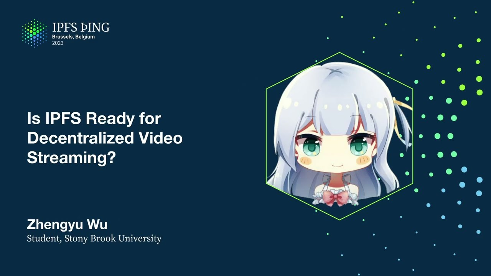

# Is IPFS Ready for Decentralized Video Streaming? - Zhengyu Wu

<https://youtube.com/watch?v=MuBFNnZeH08>

## Content

Hello everyone, my name is Zhenyu, thanks for the intro.

I'm a little bit background for myself, I'm a PhD student, second year as a new PhD student
at Stony Brook University. Today I will be present, our work will be appears in the web conference 2023 which happens
in May. The work is about video streaming on IPFS, so is IPFS ready for decentralized streaming?
So I will briefly give everyone knows here, knows that IPFS is a decentralized storage

and delivery network, it builds on top to peer-to-peer network structure and uses content addressing.
And thanks for the probe lab, here's the stats from IPFS and we can see IPFS has gained significant

popularity over the time and it has a lot of apps built around with it, like popular

browsers have native support for IPFS and also such as CDN service Cluffer have supports
for IPFS. So why streaming on IPFS? So video is the most popular traffic on the internet and IPFS has a strong robustness
against failure and censorship, so with the gaining popularity we ask can video streaming

utilize the benefits of IPFS to achieve a better playback experience?

Well obvious we're not the first people thought about the idea, so Dtube exists. Dtube is a video streaming service with IPFS that utilize IPFS as its video storage system.

It has seen quite a bit of popularity with one upload per minute and four million monthly
visitors. That's from the stats from Dtube. However upon our study there's a big problem with Dtube, is that Dtube uses its own private

cluster which means that the video on Dtube cannot be retrieved from the public IPFS network

which I think is defeat the purpose of IPFS where everyone can access the content and
can participate the network to share the content. So we don't know if truly decentralized video streaming is possible on IPFS. To answer the question we conduct first conduct a measurement study on how video performs
IPFS currently, then we introduce Telescope, a system that can improve video streaming
on IPFS and then we evaluate Telescope IPFS network.

So for the measurement setup we collect videos from IPFS search.

As we know IPFS use content address which means that the hash of content is identifying
the network. There is no human readable labels associated with the content. So therefore we cannot just simply Google videos IPFS and then retrieve the content.
To do this we use IPFS search. IPFS search solves the problem with content addressing by deploying multiple instances
in the network and sniff around the content that was being shared around the networks
and then they will download the file and index them. So we just ask the videos CID from them and they will give us the video CID.

For each video CID we contact the IPFS network and try to retrieve the video. Upon the retrieval we will measure the video resolution, video stall and RTT to the provider.

And also we will try to retrieve the video under different network conditions. So we collect our data from September 1st to October 4th of 2022. We retrieved over 39,000 unique CIDs from IPFS search and we were able to successfully
download over 28,000 of them. So our goal is to try to understand video streaming and performance in IPFS.

Therefore we in fact see a lot of videos being shared around the networks. So let's see some results to show how poor video streaming is in IPFS. So first we observe that we notice that video experience extremely high stall under poorer

network. As this figure shows for 8 Mbps 90% of video we stream has experienced stall and for 25

Mbps half of them experienced stall. More importantly for the video that stall the median stall rate for 8 Mbps is 9.
This means that the stream of video, the time to stream the video itself takes 10 times as the original duration of the video which is very, very bad.
Then for 25 Mbps it's slightly better but it's still high with the 5.
So what's the reason? So one reason we think is from the high RTT for the video providers. As this figure shows the median is around 67 milliseconds and the 90th percentile was
around 100 milliseconds. So why the video is so high? So one of the reasons we just mentioned before is probably because the high RTT for the video provider. This can be partitionally solved by caching which is closer to the user. The second more important reason is the single encoding of the video.
Video streaming cannot adapt to the quality according to the network condition. So let's say you have a 4K video and the user has 8 Mbps of network condition it will try
to stream that high 4K video and then causing the user to have stalls.

So one natural approach to streaming under that network is ABR.
I will briefly talk about how ABR works and why it doesn't work with FPFS.
So adaptive bit rate streaming works by first it breaks the video into different segments
as shown here. Then for each segment it will encode them into different quality from high to low.
Then all these video segments will be stored into a server and the server will pass down
a manifest file to a client. A manifest file essentially is a list of bandwidth requirements for retrieving that quality of
content. Then the client will estimate its network throughput from the server to the client. Based on that throughput you will pick the best affordable quality to stream.

So now let's see how ABR will work with FPFS. So everything will be the same. We have video segments. We have a user. We have a manifest file. And instead of storing all the segments into a server, now this can be stored into a FPFS
network. As many of you guys know, maybe know the issue here. So now the video can be stored into different instances on a FPFS network and also may be
cached in a cache node that was being cached. So then the ABR client will try to estimate the network throughput from the client to the FPFS network. Our ABR client cannot estimate the network throughput correctly because video can be retrieved from the cache or different instances from the FPFS network.

Now to see this inconsistent throughput, to see the effect of this inaccurate estimated throughput, we analyze the trace of ABR client's estimated throughput during a playback of video. Here we have a blue line which represents the client's estimated throughput at the time.

And we have a green line represents the actual throughput from the client to the FPFS network, which is the provider of the network. And then we have the orange line, which means the actual throughput from the client to the gateway. Here we assume that gateway has some part of cache of the segments.
Now let's see how the ABR client estimates itself. At the beginning, when the segments are retrieved from the gateway, which has a higher throughput,
the client estimates throughput closer to the orange line, which makes sense. It was retrieved from the gateway. And then the following segments are retrieved from the network, which has a significantly lower throughput. At the bottom we can see. But ABR client doesn't know this sudden change of throughput. It will overestimate its available throughput to be close to the cache.

And then it will pick a high quality to stream. And then the client will suffer from the bandwidth limitation causing stall.
And the ABR client realizes the issue. So it throttles back to its estimation. However, due to the algorithm of computing the estimation, the client still has overestimated

the throughput, which means the cycle of stall and then reduce, stall and then reduce continues

until the segments hit the cache again, which we can see it will bounce back the throughput.

This happened repeatedly throughout the playback and causing a very inconsistent streaming

experience. So to solve this inconsistent experience, we introduced Telescope.

Telescope works like a proxy between the client and the gateway.
It works normally when ABR client requests a video, it will forward this request to IPFS
gateway and the IPFS gateway will retrieve the content from the network. Then the IPFS gateway will return back to Telescope. But Telescope does not directly return to ABR client. Instead it will update a manifest file and sends that along with the video segments.

So why manifest file, right? So at this point, we know that ABR client has inaccurate estimation of throughput due

to the segments can come from different network peers or the different from the gateway.

So to help ABR to make the best decision, the natural way to do is to modify the manifest

file such that you will incorporate the throughput information from the cached or uncached.

This way, even the ABR client has inaccurate estimate throughput, it can still make a correct
decision based on the modified MPD file, which is the manifest file.
So to see how CloudScope modifies MPD file, let's first see how the MS file works with

traditional ABR without Telescope. For this example, we have a segment X, which is five seconds in duration. It has two quality, quality one and quality two. So quality one is 10 Mbp and quality two is 15 Mbp. And let's assume the quality one is uncached and quality two is cached. Now the generated manifest file will say that quality one need two Mbps of bandwidth and
quality two need three Mbps. This can be easily calculated by the size of the quality divided by the duration of the segments. In this case, it's 10 divided by five and 15 divided by five. Now this manifest file will pass to ABR client and the client estimate its throughput is
two Mbps. Therefore, it will pick quality one as quality two requires three Mbps, which is higher than
its estimation. However, we know that quality two is cached and then the cache throughput is four Mbps.

And then it required a bandwidth of three Mbps. So that cache segment is well satisfied and is a better option because it has higher quality.

However, ABR will not do that because the poor estimation we mentioned earlier.

Now let's see how Telescope will help this.
We have the same example where quality one is uncached and quality two is cached.

Now Telescope, instead of passing the manifest file directly to the client, now Telescope will use the cached information and throughput information to update the manifest file. So let's look at quality one. We know quality one is uncached and we know the throughput of uncached is one Mbps.
And then the client estimates the throughput is two Mbps. So therefore, we know that the client is overestimating the throughput by one Mbps.

Therefore we're adding one Mbps to the original manifest file to compensate that overestimation.

For quality two, it works similarly. We know it's cached. The cached segment is four Mbps and the client estimation is two Mbps.
So in this case, we know that ABR client underestimated by two Mbps. To compensate this underestimation, we reduce the two Mbps from the original manifest file.

Now it will be one Mbps. Now Telescope forward-backs this to ABR client. Now ABR client knows it has two Mbps and then the quality two only need one Mbps.

So it will pick the better choice, which is quality two. So Telescope directly works by first taking the original manifest file and it will take
the cached information from the gateway. And then the throughput information, which the Telescope itself estimated.
And then it will compute and compensate the inaccurate estimation to the updated manifest file and it helps the client to make a better decision. Now let's evaluate Telescope on the IPFS network. For the measurement setup, we have client, Telescope, IPFS gateway, and IPFS networks.

We deploy our videos into five IPFS instance across the globe, as shown here.

And then we'll also set up the cache hit rate of 80% and 60%.
A cache hit rate means that we prefetch the video from IPFS gateway such that the video

will be cached on the gateway. Then we will retrieve the video from Telescope, as the figure shows.
The Telescope and the client are co-located together at the deployed northeast of US.

Now let's see the metric we use to evaluate Telescope. Just for the baseline, we compare Telescope streaming performance over IPFS, which is

direct streaming IPFS without anything. We also compare it to traditional ABR and also which compare different algorithm ABR.
So ABR, as we mentioned before, it will estimate its throughput and make a decision.
And different algorithm can do differently. For ABR BOLA, it's a buffer-based algorithm, which means that it will not care about the

estimate throughput. Instead, it will care about the buffer of the video. For ABR Dynamic, I think it will use a combination of both throughput and the buffer.

For the metrics, we compare the video stops, which is how long the video will be stopped

and to buffer. And video quality and the video quality variation, which is the smoothness of the video.

Because we know that video can have different quality, between the playback, it can change quality dramatically or steadily. And lastly, we compare the quality of experience, which is a standard metric to compare video

streaming under ABR streaming. So it takes the following three together as one. And then finally, we evaluate Telescope under various network conditions.
Now let's see some results. So here is the result from Telescope QoE performance. As the highlight in yellow, that's Telescope average QoE. And it compares the QoE against direct video streaming, IPFS, and ABR video streaming.

We can see that Telescope outperformed the traditional ABR by 123%.
And outperformed the direct IPFS streaming by 94%. However, QoE does not tell the full story, because QoE takes the video stop, video quality,

and video variation together. So to see how Telescope truly performs, we compare Telescope's average quality against

ABR. As this figure shows, we evaluate Telescope under different cache settings. We can see under 60% cache, Telescope outperformed ABR by 48%.
Under 80% cache, Telescope outperformed ABR by 18%. Now let's see the stalls. So this figure compared the stall for Telescope and ABR. As we can see, in both cache settings, Telescope reduced the stall by 91%, which means that

Telescope can stream video with high quality while keep the stall rate low.

So conclusion. So video stream IPFS performs poorly, currently, due to the high RTT and the single encoding
of the video. And second is that existing video solution ABR performs poorly with IPFS, because it's
a peer-to-peer nature of it. And then Telescope improved video streaming with ABR IPFS significantly by incorporating video source information. And finally, Telescope introduced a new way to stream video that combined the benefits of distributed systems and deliver high quality of video streaming.

And for the reference, there's more detail you can find in the paper, which is on my website. Thank you. And any questions? Telescope is running on the gateway?

It's not run on a gateway. It's a proxy in between. But I think, based on today, they have some more advanced gateway. I think this can be corroborated, embedded into the new advanced gateway, where they
can directly, smartly detect, oh, the user is playing videos. Now let's make this algorithm in there, so that the user don't have to deploy another
telescope. Yeah. So, like, with the microphone. OK. It's on? No, no. Please, please. OK. So, well, streaming a video and assuming you're on a phone and in a car, the connection can

degrade or improve dramatically over time. Do you do any kind of like smoothing of that throughput estimations during the playback
or fetching the blocks? Or is it like, once you decide, you stick with it and go all the way? I'm sorry, can you like... You mentioned the quality can change throughout the video playback. Yes, yes. Do you do like further like adaptation on the fly, in terms of like off your bandwidth

link? Like, do you update your estimations during the whole duration? Or do you take the fixed values and then balance between those? So ABR itself, it will constantly estimate them. So ABR works by like estimate throughput by like based on the quality and the video it
was choosing. Right? So let's say if I'm very good at... Currently I have a good network condition. I'm able to retrieve the top quality. And then my network condition drops. And then I will fetch... The ABR client will fetch a lower one. It will realize it becomes lower. And then you update estimation over time. So is that the question you're trying to ask? For the most part, yes. I was also aiming at whether there's some sort of smoothing along the estimation.
Yes, there is. So that it's not just jumping around. But you actually smooth out the predictions that are out there. Yeah, so that was the very big reason. That was... Let me just try to find the... So that was the reason, right? So even though it's suffered, right? It suffered here. But it doesn't matter. It's still there. on IPFS right now, did you reach out to them? Because as they run a... Yes. ...to local cluster, not a local but a private cluster, they might participate in like testing this. So we... So yeah, so why I know we know it's a private cluster is that we actually contacted them. It's like, hey, I was wondering why we cannot get the video. Are you guys using a private cluster? And then they confirm that you use a private cluster. And then we didn't think about the collaboration at the time, but like we can't do that with them because in due to they don't have APR on them. And they would be the biggest beneficial. Yes. Yes. Yes. Good. You mentioned that there were three metrics that made up the overall quality of video experience. And you showed us two of them on their own. The final one, how much it moves between the quality levels. Was that very different for the solution? I didn't show this because I forgot for like timing and the size issue. So we observed that KaleScope have little variation compared to our traditional APR because you won't bounce back and forth because they know what is cache, what is not cache. And they will try to stay in that range so that they don't have to suffer from APRs. Cool. I'm just wondering, maybe I missed this in an earlier slide, but how do we use Telescope today? Like if I wanted to have my own video streaming node? Oh, yeah. So basically in our setup is that you can just deploy.
So instead of asking IPFS gateway, you will just ask Telescope. Is that what's the repo URL? I think it's here. It's here. It's slow. Let's just move. It's here. OK. Cool, thank you. Yeah, it's more about the software is to see if it works, proof of concept stage. We didn't actually fully write it very nicely. Yeah, it makes sense. Thanks. You mentioned in these, the whole blocks were either cached or uncached. Does it also adjust on the fly where some blocks are different quality or cached and uncached? Yes. We showed here, we simplified it. So in actual algorithm, we not only keep the cache on cache, we also will try to see if different provider is providing the block, because that couldn't happen. Let's say this block can be, like during the streaming session, two peers can be part of providing the whole video.
So we also keep a count down in the paper, try to make sure that even in this case, the instance changed,
we can still able to update the estimate throughput to help the client to make a better decision. Cool, thanks. So when the performance was very variable,

do you know whether that would be because there was a new request to go and find the content from another provider? So I'm trying to figure out whether the performance variation comes from the discovery of content or the transmission of content. OK, so we also tried the similar experiment under a very fixed, I guess, local networks, where we pre,

before, we did a simulation where we forced tell the client and gateway, everyone that you're provided will be that peer. So I think the content retrieval part is kind of not important in the sense that we already forced them, tell them, OK, you have this peer. So this has happened even with that. So I think there's even more, in the sense that I think there's more problem with the transmission part rather than the discovery part. Right, OK. So that's, I think, I don't know if you have next steps in this study. But one of the ones that I would identify is try to break down in steps what is happening
and then try to identify what to improve, basically. Is it the discovery part? So it could be, if it's an over-Kubo, it could be the DHT part. Or if it's only the transmission, as you say, you've got one kind of root CAD which you go and discover.
And then all of the rest come from the same content provider or the same session, then basically it's a bit swap issue that we're trying to solve here. So here is not the bit swap issue. So the issue is that even though we have the root CAD, we go straight. When we try to get that root CAD, the content of root, like the sub-content of that root CAD, we can still have different peer to provide it, right? Yeah. Yes. So essentially, here, the main problem is that with that sub-part of files, I can have, let's say, it's the first segment. Some gateway, let's say some gateway, someone already requested before, the gateway has the cache. So they can return very fast. And now, let's say next segment, it was like the gateway, no one has requests from the gateway before. And the gateway has to go find the content and then serve back to them. And then that provider have a different throughput from the client to the gateway, because it's a different actual different peer. So that's the differential between that sudden change. It's happening here, which traditional ABR doesn't assume that. Traditional ABR assume that it has a client, it has the server. It's fixed. And then even the change will be at the client side. It's really happening on the server side. But in this case, it can be happening on the both. Yeah. OK. So lots of issues to see. And do you have any next steps that you'd like to do with that? I think the next step, as we discussed, next step is how the cache, how can we help using caching to help the stream. Yeah. Yeah. Excellent. OK. Thank you very much. Any other? Hey there. So I guess just to be clear, with the comparison
with Telescope and the traditional way, or the other way was through the IPFS gateway, not directly to the IPFS network? Yes. OK. Yes. Yeah. OK. Have you considered connecting to the peers directly on the IPFS network? OK. So we thought about the idea, but I think as a usability side of it, it was IPFS gateway is more natural for the user. Like, they just type the URL, they start to stream the video. And we said this way because it's more convenient, like more practical than having a user to connect the peer directly. That's what our kind of motivation is. And also Telescope can, the reason we opted the manifest file, because that way we don't have to modify the client. A peer client works as everyone can plug in and pay. They don't have to modify their code. Any peer can work as it is. And that's another key part of that way we designed the system like this. Cool. Thank you.

