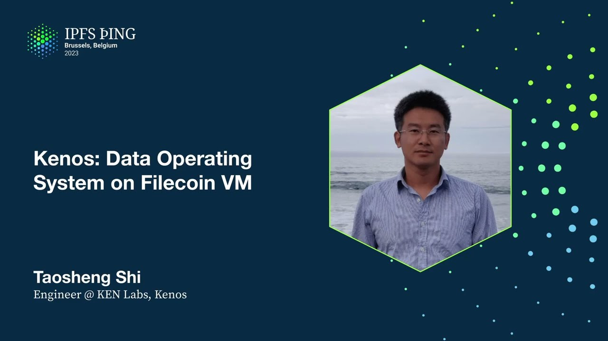

# Kenos: Data Operating System on Filecoin VM - Taosheng Shi

<https://youtube.com/watch?v=YLw93as5tOI>

## Content

Hello everyone, thank you for coming here. Let us get started on my topics.

K-Notes, Data Origin Systems on Filecoin Virtual Machine.

Let us get started from data economy with the launch of Filecoin VM.

You know, for the past month, with the launch of Filecoin virtual machines,

there are more than just a strategy opportunities, or you can explore in the Filecoin ecosystems.

Basically, there is a new economy have just been born, the data economy.

This will drive the industry disruption, lots of new business models,

and especially with China government have given many policy support for the Web3 data economy,

and like you know, the Web3 festival is happening in Hong Kong, it just finished in Hong Kong.

So that is a good opportunity with the Filecoin virtual machine launch.

As you know, data is a valuable resource, data has proven to be a valuable resource.

Many success stories are built on it. In 2020, YouTube reaped almost $7 billion from just revenue, ad revenue.

And the Internet, as we know, today hosts some of the most important data.

It is the together from the fabric of who you are, where you are, where you're from,
and where you are going, and what do you like, and what you don't like. But all this data currently is hosted by the central authorities,

and you can freely use the platform, but you use the data to exchange it,

a free service, but your data is exchanged as other revenues.

And Gartner has predicted that by 2022, information will be a critical asset to 90% of enterprise corporate strategies.

Data is increasingly acknowledged as a valuable resource, and this present is another issue organizations are incentivized to collect as much data as possible,

but become stalled out by the limits on how they can use it.

Okay, let us meet Kanos and the DataDos stack.
Kanos is the data operating system for DataDos, for Web3 DataDos. DataDos stack is an open source data-first stack, advancing the technology and adoption of Kanos.
Kanos takes the tank of interdependencies in the current state of art,

and make it more coherent and reliable and easier to deploy.
Basically, Kanos included these four key components, four important parts.

The first one is operating system for Web3 DataDos, and the combined smart contract, and distribute the compute and the field storage market into one package.

And the IPRD polytrace for handling the large amounts of structured data,

which could not be available otherwise. And easy to use front-end for creating DOS, managing their data size,
and running computation over their data. So that is the basic important part of the data operating system.

Okay, as you can see here, from the left part is maybe,

and currently ongoing there are a lot of DataDos are building Fairclone VM,
but there are many duplicate components and duplicate service, and the different dependency between these DataDos. We can synergy all these efforts together to build a data operating system,
just like the right part of the diagram.
You can see here we can have a call service in the data operating systems,

and different frameworks for different DataDos.

And all these service and framework are built on Fairclone VM.

The different DataDos could build their dedicated customized business logics on this data operating system.

Basically, if we look into the data operating system, there are three different planes.

From bottom to top, the first plane is the data plane, as you know,
Fairclone, IPFS, and other different storage solutions,
for example, Fairproof, yesterday in the database panel.

All these data solutions are using IPRD data format.

All these data storage solutions are data plane.
We can leverage the parity indexing and other indexing technologies
to indexing the big data of IPRD data.

In the middle of this stack, there is a control plane. The control plane, as I mentioned before, is the call service and the framework service.
The framework includes the contracts and provides the infrastructure to easily create and manage your DOS and your plugins.

The call primitives are intended to be used by users and implemented by developers of the DOS frameworks.

Maybe there are other service that could be used to bridge external services.

On top of the control plane, there is the application plane. You can use the frontend to easily create your DOS, scale your DOS, launch your DOS, and deploy your DOS, data DOS.

You can also do some experimental for data DOS.

Let us look at the data DOS stack.

Basically, this is a stack discussed much inside the protocol library.

You can see here is the IPRD data layer, the Faircoin VM layer, bridge layer, and the business logic layer.

But the most important is from bottom to top, the CAD is a very key important data.

I didn't identify from bottom to top. You can see here. CAD could be in Stardew providers and also could be in the smart contracts and also could be in Oracle service and other data DOS services.

The most important is we wanted to, you know, for Web3 data DOS, there are many big data of IPRD data size.

So we wanted to introduce the polytree for indexing.

Polytree basically is a possibility search tree just like a B-tree in the traditional database.

We have much discussion in the yesterday's database panel.

You can find many materials on the internet about the polytree and how to combine the content addressable properties with indexing properties.

I think that is all my introduction about the data operating systems.
Any questions? Hi, Daoshan, could you please tell me what's the main key features?

Okay. I think the key features here are just put on the slides. The first one is operating system for Web3 data DOS dedicated for Web3 data DOS.

That is different with other DOS, for example, for Ethereum, traditional, not traditional, I mean, just the DOS, not the data DOS.

The second is combined the smart contract distributed compute and the storage markets together in one package.

The third one is IPRD polytree for indexing. The third one is easy to use front-end to creating and deploying launch your data DOS.

That's all. Thank you. Thank you. Thank you.

