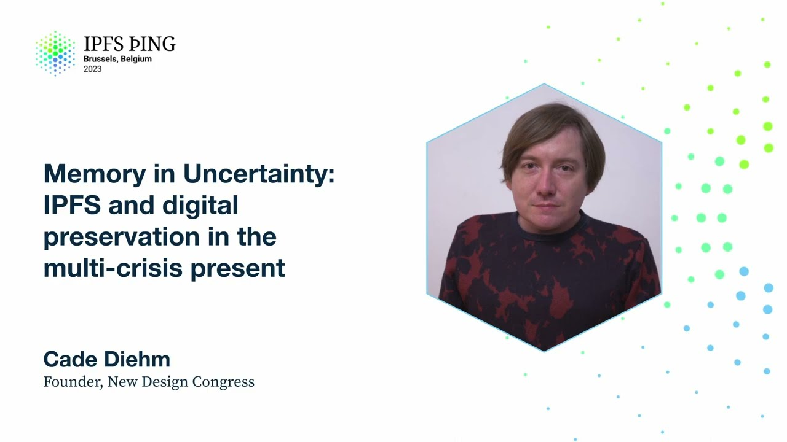

# Memory in Uncertainty: IPFS and digital preservation in the multi-crisis present - Cade Diehm

<https://youtube.com/watch?v=TdiQGXSZmCk>

## Content

Thank you everybody. Thank you Robin and Dietrich and everybody for inviting me to this event.

My name is Cade. I run a small research organization called the New Design Congress and today I
wanted to share a research project that we did with an IPFS aligned organization with the support of the Filecoin Foundation. It's going to be a bit deep. Let me get my stopwatch

going. Great. It's going to be pretty rich in content. I've erred on the side of caution

by putting a little bit too much information into the slides. We're not going to cover all of it today, but what I will say is that at the end of this presentation is a link to the research and to these slides. So please just let it all wash over you and then anything
that you don't get, either email me or come and check out the material because it's all going to be there for you. But before we get started, I'd like to set the scene with a brief video that will summarize a little bit about where I come from. Are you playing Roblox? Yeah. Explain to me what you're doing though. You're playing Roblox.

Yeah, I'm playing Roblox. I'm taking money from people. You're getting on the phone and then you're stealing money from people? Yeah. And you have this in your basement of your Roblox house. Don't do that. My intern Kay actually is helping.

She's your intern? Yeah. You have a whole office in your basement where you're scamming people?

So I love this video. Essentially, the reason why it's really funny is this is the perfect

example of what New Design Congress is all about. Essentially, while we build these rich technical systems, be it IPFS or Roblox, the ways in which they're used are often far beyond

the intent that we have for them. I love the idea that there's these tiny children basically

becoming the next chapos, basically scamming the hell out of people through these iPads.

It sort of makes me wonder after I saw that clip and did some diving into the kind of
economics and labor abuse of children, like getting other children to build stuff for

them in Roblox and get paid nothing for it. It made me really think about that child that
you see sitting across from you at another table in a restaurant that's on their iPad. We used to think they're just watching Frozen over and over, but maybe in fact they're actually scamming everybody. This is one of the stickers for New Design Congress, ethical design, no

thanks. Part of what this work is, part of the world that I come from and the foundation of New Design Congress is looking at the kinds of ways in which we see the world and then

how that's out of alignment as system designers with the way the world actually is. So we're an independent socio-technical research organization, which means that we confront the gap between what appears to be happening and what is actually happening in digitized societies. Now, the point here is to say that it's not about being some kind of elitist,

sort of everything that people are doing in systems design is wrong, but rather that the complexity combined with the shortcomings of tools and practices we have today often
lead to bad outcomes. And the kind of response that we have, which are things like ethical design, ethical AI, things like that, are not enough to overcome some of the problems that we have. So the way to think of New Design Congress itself in this room would be to think of a digital security firm that comes in and consults
or does research and finds vulnerabilities as red teamers, but we don't do it on a technical
level, we do it on a social or an ethical level. So we're like an ethical red teaming organization. And what we do is we follow that same process. So we do deep research,
such as what I'm going to present today. We then practice responsible disclosure, like
any other security organization. And then we publish everything in open access after
we complete that disclosure process. And so as part of that process, we engaged

with Filecoin and a Filecoin aligned project, funded project called WebRecorder, between
November 2021 and May 2022, which led to the project or the publication Memory and Uncertainty,

or as was talked about today, Are We All Fucked? The answer is kind of. But it didn't start
out that way. So the team, I want to throw this slide up
because these are the people who can be credited on this. There was the really tight collaboration

between WebRecorder and us at New Design Congress, myself and my co-conspirator, my co-defendant,

Benjamin Royer, who can't unfortunately be here today. But then of course, the other people from WebRecorder, Ilya, Lorena, Ed Summers, basically helping to fuel that work
and frame it for us. And then of course, Dietrich, who's here today, kind of acting as like the champion on the Filecoin slash Protocol Lab side. All of it came together to produce, I think, a piece of research that's really great. And this is where the slides... What's
up? Down a little bit. Okay, great. This is where the slides begin to get a little bit
dense. So I'm just going to riff a little bit on what we started to explore. And you
can either listen to me or look at the slides, or both if you have like a brain that can do that. But as I said at the beginning, all of this is available online, so you can come
back through it and read it. Essentially, what we did was we looked at the decentralization component of an emerging tool, in this case, the WebRecorder platform,

which is a... Unlike the Internet Archive, it's kind of the inverse. Rather than being
tied to an institution, WebRecorder allows you to take very high fidelity captures of
the web and faithfully reproduce them in a local context. It's a very impressive piece
of technology, and it's in its early stages. Of course, it's also gaining a lot of attention as it's very useful for researchers, everybody from cultural researchers all the way through
to journalists working in disinformation to produce very high quality records of things

on the Internet. But we were really looking broadly, when we were commissioned by Ilia and the team at WebRecorder, at the wider range of issues
that could then inform both the specification of their WAXI format, that's the Web Archive
Compressed Zip File archival format, and the interfaces of the tools that are then built
with the WAXI specification baked into it. So this covers everything from identity and
structures, what are the use cases, socio-technical security, what are the dangers and threats from not a device perspective, from a person-to-person perspective, integrity, how can archives be

manipulated, can people make changes to archives. This is a big thing, I think, in IPFS land
as well, the immutability and the kind of proof of record or the source of truth of different kinds of material that's stored in IPFS. Of course, permissions and connectivity, a lot of challenges with archives around how expensive they are to maintain indefinitely,

they're kind of a complete opposite of a capitalist service because archives don't make money usually, they're kind of just giant black holes for financial input, things like that.
But even going deeper into looking at how navigation affects the ways in which we relate to large collections of material and the agency questions, so what do the people whose material

is stored in a digital archive, how are those people, do they have a say, how does that
affect them, do they even know about it, what's the difference between someone who knows that they've been archived and somebody who doesn't, these sorts of things. And the point here is really to kind of look at this from a digital archiving perspective and understand that
by doing so, it acts as a very good starting point for the broader understanding of the

politics and the social conditions of data storage on a massive societal level. Your

iCloud account or your Google Gmail account, both of these are actually archives. Everything
that we have online, to quote Yokui, the Hong Kong philosopher, everything is an archive.

So as part of this project, we did a landscaping study and we also did a round of consultation
with WebRecorder, and then through WebRecorder's connections, we were very privileged enough
to get a series of interviews with a wide number of very, very established people from

various disciplines within the archival space, as a sort of large-scale qualitative first
round of interviews that lasted for 90 minutes or longer and culminated in a broad snapshot

of the conditions of archiving and how they relate to digitized structures, both from the emergence of open-source tooling such as WebRecorder, but also in the storage and
maintenance of these things, such as, in this case, IPFS. And so what we found is in this

research, and I think there aren't actually too many examples of a project that has this
kind of depth and breadth in terms of how it approaches these sorts of things, we found
like 10 key findings here that I'd like to share with you today. We're not going to spend equal amounts of time on all of them because, you know, time is a harsh, oppressive creature
and I only have a small amount of it. So instead, I'm going to really riff on a couple of these

that I think are extremely important for the people in this room today, and then again refer you to the slide deck and everything like that if you'd like to know more about the broader work. So number one, the definition of archiving is broad but flattened by digital tools. So what this meant is that in the process of archiving, whether people were from indigenous backgrounds as archivists or whether they were journalists or people working in institutions, like very big institutions, what we found

is that, broadly speaking, the tools that are used to both create archives and also
store them, including protocols, all of them had clashes with how different people in these
spaces understood what archiving meant and what was possible as a result of that. The
ways in which they could express their self-determination of their practice of collecting, categorizing,

and saving material for recall later was all deeply influenced by digital tools and there

were no two people that had the same kind of relationship or definition of archiving

despite it being a fairly well-known practice. And so we had people who saw these from a

perspective of political action, we saw things from people who came at it from a purely historical
context, there were people who, again, like investigative journalism, which isn't necessarily tied to political activism, things like that. But broadly speaking, even things like the

inability to conceptualize the kind of size of an archive, especially like a decentralized
archive, when compared to physical archives, had drastic effects on how people then maintained

or cultivated and curated those spaces. Two, web archives and, broadly speaking, decentralized storage is complex and overwhelming to the

people that make them. So I'm almost certain that everybody in this room kind of knows this already, but what the research kind of found for us was just how severe and independent

and individualized that was. So what we saw was the classic McLuhan, like Marshall McLuhan

kind of thing, we make, we build our tools, we shape our tools and thereafter our tools shape us. The differences between the tools and their outputs makes it difficult to provide
access that's universal. And so what archivists tend to do is like a grassroots kind of, in

this current moment where the tools have these shortcomings, basically either rely on multiple tooling, so getting like sort of different categorizations and very few standardized sort of collections of material into an archived container, or then create hacks and workarounds

to get into that. And what we also found is, you know, similar to things like content addressing
and other forms of like linkage between things, people tended to just either use timestamps
or the link itself as like the primary means for navigating large datasets. Like, and I
say, when I say large datasets, I mean web archiving, which is like, you know, three dimensions of complexity. One is like the generation of material on a platform that
can be, that's like infinite potentially just based entirely, the only limitation here is
storage. The second dimension is like the breadth of websites, so the availability of different websites rather than like, you know, just focusing on content creation on one particular platform. And then of course time and the idea of material changing over time and needing
to save all of that adds that third dimension. And so when you're looking at archives that have that level of complexity over time, then the ways in which people relate to those and
how it can then overwhelm them is extremely, it's very easy to do that.

So the third one, and this is one I want to touch on for a little bit longer, it's part of the broader work that we've done for the past few years at New Design Congress, is that we found that decentralized solutions such as IPFS are plagued with danger and much
of it is unknown or unaddressed. Now what this means is that in 2020 I wrote an essay
for New Design Congress called Optimism and Emergency in the Peer-to-Peer Network, which describes some of the historical context of how the utopian or the kind of, the optimism

that we share around the kind of goals of IPFS to become a planetary-wide protocol,

decentralization protocol, carries with it severe existential risk that to this day remains
essentially unaccounted for. And this is true not just for IPFS, I'm not singling that out,
it's relevant for this research because it's relationship to the work with WebRecorder
and the idea that WebRecorder would like to put all of their archives on IPFS. But it's
also true of Secure Scuttlebutt, the DAT Foundation. In the piece itself I went into detail about the historical context, which was how BitTorrent was weaponized against essentially anybody who was involved in like the distribution of copyright infringing material

and how that then essentially kneecapped the entire sort of free information movement in the early 21st century, which then gave birth to services like Spotify and the media conglomerate that we have today, which was piggybacked off the technological achievements of BitTorrent but sacrificed almost everybody involved in that as a process. So that sort of historical
context remains sort of forgotten and in the context of archival, whether or not it was
a sort of an indigenous archival effort or a more institutional one, what we found is

that there were differing levels of awareness of collective institutional power and how it's held and how the consolidation of custodianship in a decentralized system creates power imbalances

that kind of rival the things that we see today in centralized systems. So what we have is like this, and I was talking a bit with Robin about this last night, if we think about things like Web3 and how Web3 itself has sort of is yet to reach its potential, at the same

time I can't think of an industry that suffered more attacks, not just from hacking, but also
from like attempts at capital to consolidate that, like you know just almost bottomless
amounts of money being injected into the system with the goal of essentially maintaining control.
You know the 51% argument, right, just as a really simple example of that, the amount
of resources that go into attacking these systems is extremely high and so through this

work and through other kind of sort of related research, we found that like the broader defenses

that need to be there are just simply not. And so when we spoke to archivists, these
were things like really simple things, such as an archival team in an institution has a high degree of consolidated institutional power, they have legal protections, they might
have a full legal team that might help them to maintain their, they might live in a jurisdiction

that grants them immunity from holding certain types of material, but then because they work
alongside people who are freelancers and things like that, when those people then take a mirror
of their IPFS collection and start engaging with it, those people don't have the same legal resources because they're not a part of those institutions, they don't have, they might live in different jurisdictions that see certain types of information as not having the same immunity that the people in sort of institutions might have. And so you have immediately just through the interactions between different people, the injection of
IPFS or a similar decentralized system creates an entire sort of Merkle tree, if you like,

of potential legal fragility, just in that act of like collaborating between people in

this sort of decentralization first strategy. The fourth finding is that the shortcomings

of today's tools affect the quality of archives. So this is essentially that like we have a series of tooling that has, it excels in some ways and doesn't excel in other ways. Immutability

is part of this. It's also how the tools work and how quickly things can be retrieved, all these sorts of things. Over time, as people use them, they then form opinions around what's
possible and what's not possible, which then becomes assumptions on the user side, which then become culturally entrenched, which then leads to the narrowing of possibilities once
technology or interfaces, new systems have been developed and then people become familiar
with them. So this is important to the context of IPFS because it means that the kind of

historical custodianship that we might have today of like the internet archive being able to sort of shape or similar institutions being able to shape how these systems work. Once
that moves into a more decentralized space, there's an opportunity here to reset the expectation of what's possible with large scale storage and large scale archiving, but that is dependent
on the priorities and like the flexibility of everything from the protocol to the interfaces
themselves. The fifth finding is that we need new interfaces for navigating complex archives.

And I think this is related to a couple others, but deserves a special mention to itself. It also leads into a finding that's coming up in a second as well, which is that as we have, basically people were overwhelmed. We heard from large numbers of people who are
in some cases very highly technical people who understand how to set up crawlers and use Docker containers either locally or like spin up a digital ocean droplets, things like this, and just basically go at it and start like automatic crawling services. And when
people started to use those systems, they would then pull back from that when they started
to then either curate or otherwise navigate or manage their collections. And in many cases,
we saw working like practice of archivists, people who had been in these industries for
like 20 or 30 years, even longer using literally Excel spreadsheets to basically navigate massive

data sets that some, again, some of which were, you know, still using things like IPFS. So even with this idea of having like a navigation structure within the protocol or, you know,
a navigation structure or even searchable structures inside of tools like web recorder,
what we actually found on the ground is that all of those systems were not actually navigable.

þEuexactly meeting the needs of the complexities of how people were struggling to use these systems. And so, yeah, the most astonishing thing was finding people who had massive, you know, terabytes upon terabytes of archive material who use markups within the archive so they modify and add annotations inside the archives for themselves and then keep track of things through these signposts and a giant Excel spreadsheet that allows them to main, that basically acts as like a giant menu system.

And that, I think, remains one of the hardest and most interesting problems from a pure user side of dealing with this material.

Alongside that is another thing which I think is relevant to IPFS, which is that we found that tool design influences the effects of traumatic content. And what that meant is that in the discussion that we spoke, when we spoke to people, and this is covered in the report as well, because of the time frame of when we started doing the work, which was November 2021, the war in Ukraine basically started, you know, a few months into the work that we were doing.

And we actually lost a number of people who we wanted to interview because their commitments to, they're basically their entire priorities shifted in the first half of 2022.

At the same time, as everybody knows, we were coming out of the kind of deep lockdowns of COVID. And so we spoke to a number of people who had been doing work in some cases for decades and had been following material organizations, archiving, you know, groups or like movements and things.

And were then beginning to see, you know, the traumatic events of like large scale death emerging through the stories of the archives that they were basically curating. And what we found there is that as we reflected on that with the participants, there were participants who were very clearly able to show examples of how the decisions that had been made by a system design team and user experience research team to prioritize or create flows in which they could review content.

Or display large amounts of content, whether it was in grid, whether it was algorithmically surfaced for them, whether it was a tagging system, whatever it was, different ways in which interfaces worked to then surface kind of content, different types of content had the potential to amplify or deaden the potential traumatic effects of violent or traumatic, other forms of traumatic content.

And so in our landscape study, we kind of looked at this and we started to look into the idea of like, is there a lot of material? How much research is there into the idea of the psychological effects of traumatic content and the way that interfaces and systems can amplify that? And you'd be surprised, or maybe not, to learn that there's actually not that much out there about that.

And so this is another area that I think that once you then deploy something at scale, at a protocol level, that there's an opportunity here to explore that and see how the protocol can mitigate some of that.

Number seven, the colonial methodology and language has narrowed the potential for web preservation. This is a, I think, this was touched on a little bit earlier in some of the talks today. The idea here that like, differing perspectives are necessary in order to understand how computing can be, how we can transcend some of the limitations of computing today.

The ways in which we find that immediately is in the sort of seeding of power for indigenous or other non-Western perspectives. This is true for privacy. It's true for decentralization. And it's true for even things like what is a permanent record? What is the source of truth?

All of these, I think, can be challenged in a very healthy way by creating and amplifying those spaces and kind of de-centering the Western context from these conversations and also de-centering the kind of influence of the Western sort of explosion of computing and its computing culture that's sort of happened from the 1970s through to today.

And some of that even can be seen in language, right? So things like the term capture in archiving has direct connotations to the kind of, you know, the extremely racist kind of late 1800s, 1900s and beyond act of, you know, literally taking stuff out of indigenous societies and hauling it back to Western countries, things like that.

But that sort of like, that kind of language, which, you know, is deeply discussed as part of critique of archival in an academic sense and archival politics in an academic sense, doesn't translate into our sort of space.

And just to add an extra provocation to that, one thing that came up in the discussions with participants was how archive as a term has kind of come to mean half delete in like things like emails applications or in your chat apps where you have the ability to delete something, but you also have the ability to archive something, which is kind of sort of a delete.

And so even in these contexts of like the narrowing of the language of archival services as it's being archival practice as it's being used in other contexts has like potential dramatic effects in very subtle ways around how users and designers and systems people understand like what these actions actually mean, essentially.

How am I good for time? Okay, a couple minutes. All right. So, eight, digital archiving is vulnerable to political and ecological threats. We've been doing a lot of research. It was backed up in this particular work around things like the decoupling of the sort of global supply chain and the global connectivity networks and how the kind of volatility around that threatens the kind of maintenance and storage of archives.

We've looked at some of the ways in which things like the merging of the fusing of Filecoin alongside IPFS has like tremendous benefits, but also has tremendous drawbacks.

For example, it makes it more difficult to use in places like China because of the connotations of blockchains that are not controlled by the state, for example. And that is a discussion that's like the New Design Congress isn't interested in so much as how that can change rapidly for people on the ground based on the sort of mood of the day.

And that's sort of where we got into with the participants. This one here is a big, like if you're interested in this, then like there's a lot of work on New Design Congress that like delves into this.

But essentially, the broader kind of as the kind of present begins to sort of destabilize, the ways in which that can have an adverse effect is just not really understood very well. And no more is that really visible than in the context of like archive integrity.

So I touched on this at the beginning. Archive integrity is an interesting context because while we believe collectively that like there should be sources of truth and immutability, things like this, one of the challenges that come with that is that they introduce these new kinds of threats that aren't really dealt with.

The before like when we started this work back in 2021, Twitter had not yet been bought by Elon Musk. The just the sheer fact that something can change so rapidly in the custodianship of an archive, in this case, the entire historical archive of every tweet ever made can be basically put into private hands.

This is like a threat that we collectively haven't dealt with. And I talked about this a little bit when I talked about like the attacks of capital on Web3. This is an example of like something like what happened with Twitter could absolutely happen with a Web3 IPFS-backed service as well. Absolutely.

But the other thing too is that when people talked about in as archivists, they talked about archival systems and integrity. There's this huge issue of people collecting information such as on Facebook or Instagram or other services that require a login, which then leaks personal data into those archives, which then needs to be redacted.

And so what we have are these sort of this kind of this tension point between the desire for to create authenticity where we can say cryptographically that something hasn't been tampered with and the need, the real world today need of people to be able to redact any kind of personal information that leaks into an archive.

And those two needs, those two goals are fundamentally diametrically opposed to each other. And there is not that much discussion into how to actually begin to start to properly solve that.

Finally, the emerging tools such as WebRecorder, OpenArchive, these other tools that exist that are kind of the next generation, if you like, of open source tooling that would rely as the first adopters for services and protocols like IPFS are entering a field that desperately needs them but struggles with their shortcomings.

And so as part of the research, because it was done in conjunction with WebRecorder, was to look at how WebRecorder and its ecosystem is being received by its user base. And the struggle there is real.

The service is widely known to be quite good, but the ways in which the shortcomings affect people create a tension point there that goes from the interface level, which they're trying to solve now, all the way down to the protocol and deeper systems design.

And it's that stack that I think IPFS can go towards solving more broadly for its user base. And I mean, there's a lot of work going into this, but I think the depth of how important this is today is potentially not as well understood or not as surface as it could be.

Because essentially, overall, after 20 plus years of relative stability, the threats to large-scale data archive projects are now very, very suddenly here.

From the deteriorating political situation in the United States to the deployment of surveillance infrastructure disguised as pandemic response to the unjustified war in Ukraine, the political assumptions of the way in which we collect and store and retrieve large data sets as archives are being tested in real time.

And what concerns us as part of this research, as the sort of broader finding that comes out of this, is that there is no structure in place to kind of keep track of how that's happening.

And what needs to happen, I think, is like a coalition or some other set of entities that are keeping track of that collectively in an open-source way.

So, a couple minutes left. What can we do today? Because, you know, not everything is totally screwed.

The first one is the anti-user story, which is essentially if the user story, if we've got an x-y axis, x-axis is ease of use and y is user happiness.

A user story, which is a flawed way of doing design, but, you know, let's roll with it for anyway.

User story, you want in the top right there. Ease of use, you want it super easy to use and you want your users to be really happy.

An anti-user story is where you do the same sort of design system and design thinking, but where you want your user to be super sad and find the system really awful to use.

Which is essentially the same as saying that digital security and user experience design are actually the same thing, but with like diametrically opposed goals.

Whereas a user experience research team is working to make a system accessible, easy to use, frictionless. A digital security team is working to make that user, which is the attacker, as miserable as possible in the system.

And so the idea is to corrupt your designers. Use design to make horrible UX for your attackers.

And be aware of this concept of weaponized design, which is when a system harms users while behaving precisely as it's designed to.

There's a little bit more on this term. It's a term that we use a lot at New Design Congress. There's an essay called Unweaponized Design on the site. I don't have time to jump into it today.

The second is practicing alternative forking. So in the same way as we fork code, we need to fork concepts.

So on the right here, you see Do Not Fold, Mutilate, or Spindle a Cultural History of the Punch Card, which is an amazing 1994 paper that talks about the civil rights era critique of digital identity as we know it today.

And how close it got to basically dismantling what we understand of digital identity in this moment.

It started in UC Berkeley as people's academic records were serialized into punch cards, and the Do Not Fold, Mutilate, or Spindle was like the kind of political rallying cry against the punch card, which said, I am not a punch card.

I cannot be folded, mutilated, or spindled either. And so the idea here is to disconnect implementation from risk, looking to history and non-Western critical perspective as part of that not speculative but rather alternative forking of history.

So you take an idea that you have today, and you look into history, and you say, okay, so what critiques were there that weren't tried, and how do they apply to us today?

And then you fork that, and you go conceptually down that road. So a really good example that Robin and I talked about last night or shouted at each other at dinner last night was what if SMTP was invented after Web 3?

So the idea is, aside from the fact that this is a preposterous sort of thing because email is the absolute basic component of the Internet, if you put all of that limitation or implementation aside and think purely conceptually, if SMTP was invented after Web 3, everything we know of what happened with SMTP, how it was abused for spam and then consolidated into Google, Microsoft, and Apple,

as like the primary gatekeepers of the entire protocol, what would have happened if the Web 3 struggles of today, especially around fraud and attack from similar or higher levels of capital is what came after SMTP back in the day,

what would that look like if a similar protocol had that emerged in a landscape like this today?

And then it's that sort of thing and that kind of almost near-future science fiction thinking, but not quite, because you're firmly rooted in the things that exist today and then looking backwards into history to find the criticisms that are there.

These are the sorts of ways, I think, in which we can begin to kind of break down some of the biases that we have that are inherent in how we produce systems simply through the nature of the practices and tools that we use to design systems.

And the third thing would be to mitigate in documentation. We have excellent documentation for open source projects. We have no good documentation, I can't think of any single one, that openly embraces the ways in which tools can be abused.

So in this context setting for the work that we did with IPFS and WebRecorder, we looked at real examples of how these tools had been used in abusive circumstances. So we looked at things like harassment campaigns.

We looked at a series of different scenarios that have happened within the last five years that squarely centered the Internet Archive, IPFS, and WebRecorder as the tools that were flashpoints for these sorts of conflicts in the world.

And when people sort of talk about the role or responsibility of an open source project in being abused by bad actors, it's a very uncomfortable conversation. A lot of people kind of shift in their seats and are like, well, we don't condone it, but the nature of free software is anybody can use it, or we have a license that says you can't do this or that.

But what isn't there is the deep research into how to mitigate your own tools' bad effects, and then the documentation of that so that when someone is the target of a harassment campaign through a decentralized service or something similar, they can come to the documentation or reach out to an organization like Citizen Lab, Amnesty International, Torpopy, these kinds of crisis response for digital harassment or other sort of digital security risks,

and actually begin to, rather than making those people have to spend time researching and sort of assessing the tool set from the outside, if the documentation is there and it's like alongside how to spin up a Docker container for your new service, that I think goes a long way to proactively allowing people to effortlessly, and organizations to effortlessly produce mitigation strategies in the context that they are working in,

whether it's targeted journalists, whether it's employee, in the case of Torpopy, it's employees being harassed in sort of more civil context rather than governments going after journalists and things like that.

Finally, this is very deep. Thank you for staying with me. It's covered a lot just now. The future. Here's the report, Memory and Uncertainty, Web Preservation in the Poly Crisis.

It's a 94-page report. So if you've got a plane ride back to the United States, you should be able to read some of it. If you're bored and you've run out of movies to watch, the report is there, and it's pretty in-depth.

It's available at members.newdesigncongress.org. It's free. We are going to present this work at two academic conferences this year in greater detail. That's the IIPC and RESOAR, both of which are archival-based academic conferences.

RESOAR is actually peer-reviewed, and that got peer-reviewed, and it was very favorably peer-reviewed. I won a little gold star for that one. That was excellent.

Finally, working with IPFS-interested projects. Right now we're working with Open Archive. We worked with Web Recorder. We did anti-user story work with Web Recorder. You can go to the Waxy Specs GitHub issues and find how we did that with them.

Finally, and this is my call to action today, is that we need to broaden this research. Oh my god, right now is the time to be doing this work.

As I said, we're really interested in this idea of some sort of informal or formal coalition of tracking and maintaining a repository of information that gets to the depths of the intricacies of how these systems are going to be used in the future,

especially decentralization, especially within the goals that we have of a complete paradigm shift in terms of computing.

If you're an individual person and you find this work compelling or anything we do, you can become a New Design Congress member at members.newdesigncongress.org. It helps us stay independent.

We do have a fiscal sponsor, which is Super Bloom Design, which is a US Fiber 1C3 organization. It also does UX work, and if you need UX work for your project, they are excellent.

I'm not just saying that because they're my fiscal sponsor, but also because they're amazing people. More broadly, this is the work that we're interested in and the trajectory that we're working on, and I invite you to spend some time looking through the New Design Congress stuff, and I hope that you found this crash course in a very deep research project informative.

Thank you so much. Thank you very much.

I was reading your report earlier this week, and I think it was point three you mentioned up here was one of the ones that I struggled with a little bit. You talk about being aware of the risks of archiving either incriminating material or material that's linked to harassment campaigns and so on.

One of the things I had a hard time reconciling was the way that same material often ends up being useful as part of holding the state accountable for state violence or Kiwi Farms accountable for the harassment that they're subjecting people to and for your work.

purelySze in particular I'm reminded specifically of a report that came out this week out of a forensic architect I believe that used footage from the Portland protests to reconstruct the use of tear gas in those protests to try to

classify that Portland Police Department is having committed a war crime. So I was just wondering if you had any comment on kind of that dichotomy and how to navigate that? Sorry that's a dead question. Do I have a comment on that? There's like 20 things in my head. It comes down to

there's a mistake I think more broadly that we think that the ways in which we

have to respond is through some sort of, that's not something that we navigate
through technology, but at the same time like, again there's like

literally five things I want to say all at once and they're just coming out of my head at the same time. I guess the thing is that like one of the problems that we have is, and I think this is where New Design Congress kind of, I hope that this is like how people see us, is that on one side we have policy

or tech criticism that's actually become very publicly visible and very
accessible, but also tends to revel in the sort of the kind of conflict itself.

And on the other side we have sort of people who are building technology who either engage in the concepts of things like design ethics, which essentially changes nothing because it's the systems themselves that we've developed and the context in which we're building them that creates bad outcomes, not whether or not you are, you know, thinking of design justice as you're building something. It can help a little bit and it can make the spaces, like the conditions, the material conditions of people building stuff more equitable and better, but it doesn't necessarily lead to good outcomes. And so I think there's a big gap between like how tech in the 2020s, the 2020ns, how tech in the

2010s handled the kind of growing issues with, like that you've sort of talked
about here, the weaponization of the design of technology, but at the same time we've reached a point with like policy and criticism where
it's very reactive, it deals with things after they've arrived. I mean a really great example of this is like TikTok, right? I gave a talk last month in Amsterdam at the Institute of Network Cultures where I said the first half of it was literally like a bunch of people showing off their academic research into the TikTok algorithm, which is great and useful, but it's also not progressive because in order for it to be progressive it has to come before you can like see it on TikTok, because as everybody here knows, the version of TikTok that's in the public is at least six months old, maybe older,
right? It's been tested internally for however long and what you're seeing here is essentially like the platform equivalent of the past. And so while we have that disconnect, we're never going to fully grapple with, we're always going to be sort of blindsided in this kind of way, right? Where we're never really going to be able to properly grapple with the potential for harm or the potential for even just like what like just destabilization in
individual contexts, or then I think the other danger with that too is that there's a rising sense of, that starting with cybersecurity, a rising sense that

protocol designers must be responsible for the integrity of those systems. I mean there's an AI paper, like the draft legislation has come out from the Chinese government about artificial intelligence and the guidance around how Chinese companies can use consumer-facing artificial intelligence. One of the things they have there is if your AI lies to your user, you're responsible for that, right? And so like the kind of tide is sort of shifting towards this idea that like platforms are culpable, which is very different from like section 23 or these sorts of things, like the idea that like whatever happens on the platform is free speech in the United States, like that sort of thing might stay, but what will emerge in its place are things like you're responsible for the editorialization of your algorithm, or you're responsible for, you know, you
can be sued alongside someone who gets burned by a decentralized archive, these sorts of things. And so I don't know if that answers your question, I think the point I'm trying to make is that it's like super complicated. Yeah, I think it does, and just to summarize to make sure I'm understanding you, is kind of the
gist of what you're saying, that it's not necessarily about archiving less, but about being more proactive about understanding how what you're archiving can be weaponized, and trying to contextualize that information in ways that defends against that. And it comes down to, it comes really down to this idea of like the provocation of adding documentation. If you've got documentation for all of the ways in which you can troubleshoot an open source application, like why don't we have that but for like the kind of socio-technical issues that you might encounter, right? So like I can learn about how to fix my terrible Nextcloud server, but I can't think, I don't have like the equivalent of like how to deal with like the issues that might arise just from a social perspective or a political perspective. And again, this is like in lockstep with open sources inability to properly grapple with like moderation tooling and all sorts of things like that. Okay, awesome. Thank you. Good question. Thank you. Very, very hard question.

Any others? There's a lot there. We'll leave it there for lunch. Thank you very much. Thank you so much.

