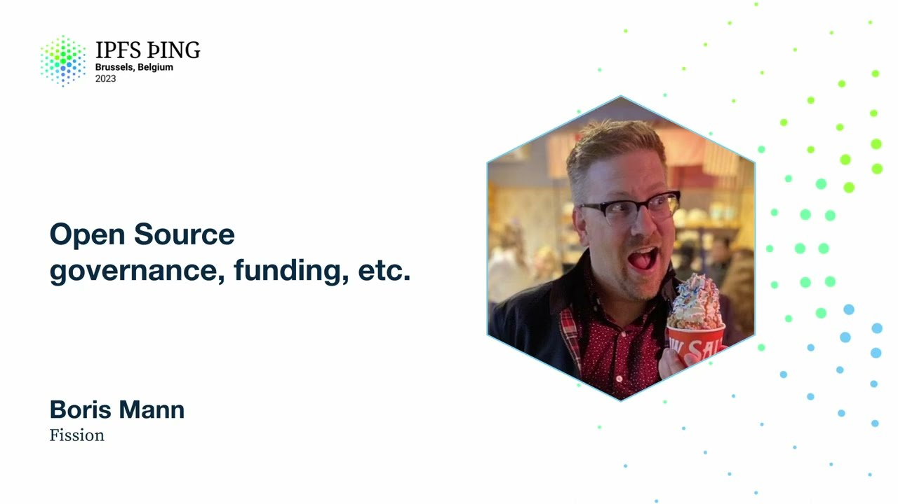

# Open Source governance, funding, etc. - Boris Mann

<https://youtube.com/watch?v=PysiACKo1dI>

## Content

Hello, my name is Boris Mann. I work for Fission. I have worked in open source for a really

long time. One of the things I like to say is that I worked in open source when that was still a radical act. We fought a lot against Microsoft FUD and other things like that.

Along with that, we practiced open source governance funding and etc. a lot. We were in the thick

of it and it was something that was much discussed because it was newer and people were figuring
it out and it felt like there was lots of camaraderie and someone to fight against in

big proprietary software. Now we're on the other side of that. We won. Woo! Amazing.

Lots and lots of software is licensed under an open source license of some kind. That
means it can be highly reused. Great. Super fantastic. A whole generation of developers

have grown up essentially with being like, yeah, I guess I put this on a code sharing

site and I just use one of these open source licenses that I don't think very much about
and there you go. That's open source. My three definitions of open source are one,

it's a legal innovation. In fact, those licenses were created using the tools of copyright.

Also, sometimes known the open source stuff as copy left to lock open the codes that could
be reused and shared. That was an innovation at the legal layer. The next one really is

the practice of peer-based co-production of software. It's a long word, but that's the

part of like, oh yeah, multiple people work on stuff and have some systems and go back and forth and have some sort of governance model, which often we mainly from open source

are familiar with classic ones like benevolent dictator for life or BDFL. Again, long time

open source will be like, ha ha, lol, right. If Joe who runs the project likes you, it's

always Joe and they're a middle-aged white guy, then your stuff gets in. This is no way

to form a system of government. We may as well use a system where ladies and lakes give
us swords to how decisions get made. The third one is ideology. I for one, believe that open

source software is very important. We have lots of big challenges and if we're constantly

having to license or rewrite software because it isn't open, it doesn't get us moving into

those big, bigger challenges. It offends me that basically there's a zero marginal cost

to copy source code. We can copy the bits. It doesn't cost anything. Go ahead, use the source code, except for a bunch of other things. I talked about this a little bit. Governance

in part, especially in the context of something that's sort of internet first, is the classic

thing of why was I not consulted? Whether it's a commercial platform or a piece of open

source software or a neighborhood block party, people will feel bad and get grumpy if it

feels like they weren't consulted in something that was happening. In this, IPFS Filecoin

cinematic universe, we've got some major pieces of software and how are we connecting stakeholders

broadly? Is doing pull requests the only way to get priorities changed? This slide I decided

to put in as kind of a placeholder because I think that we haven't really grappled with
this. I think there's some tools like star maps that might start helping us ask these

questions of who stakeholders actually are and that double-sided link of what the responsibilities

are on each side of that link and what sort of commitments are being made.

Let's get back to funding. Funding has a lot of power because it enables people to work

on things or perhaps choose to work on things. I came up in open source when mostly North

America and Western Europe was online and mostly relatively well-off white males had

free time that contributed to open source. It's something that I'm aware of. I benefited

from and I'm also now looking where the internet covers the entire world, how we can grow the

pool of people who can produce software and get paid for it and ideally in such a way that it remains open source in a path that doesn't require them to step one, work for

a company. What does it mean to work on open source? The way that funding works, a lot of this stuff looks like grants or one-off projects.

I call those more like consulting. You put together some things that you need to deliver
and that doesn't typically get us original research and it doesn't get us long-term maintenance.

What do I mean by long-term maintenance? Really what happens if you say, oh yeah, we're going

to put out a grant to get X built. You will get a 0.8 version of X that's been paid for

and it's open source. What's next? It's open source. It's cool. We're done, right?

Just like with products, that's where the work begins. Do you pay for marketing and

community work to get it adopted? Do you pay for the next year of maintenance and adoption?

Where do new features come from? Or does it just get dropped off in some sort of shipyard

and left there? What parts of projects are experiments or

proof of concepts that might be appropriate for that kind of grant approach? What is research?

We've talked about in this ecosystem of blue-green teams or work. Blue work being more research-oriented

that unlocks new capabilities. As research is, it might not work and it might be an initial

piece of code that isn't operationalized to say run at scale or other things like that. On the other end of things, how does important foundational libraries get built and maintained
so that many green products and companies can be built on top? These are the two things that I think we constantly have to grapple with, especially in areas where we're in these like web three distributed system spaces where it's like, yup, some of this is like new original work that is going to, in many cases, hit boundaries where you're like I need to go back to a blue team and get a solution because I'm stuck here.

I'm mostly going to have question marks throughout this thing. I don't actually have answers in this, just pointing to directions of what we might work on. This is one thing that's not just a question mark. I'm a huge fan of Open Collective. If you're not familiar with it, it's a platform where basically you can create a collective

and get a fiscal host. What this means is this unlocks the sort of thing where you have a single maintainer running funds through their bank account. It means that you can
immediately start at the repo project working group or event level, not need a full blown

organization and give out, take in funds and give out funds in a very, very flexible way.

It also has built in support for funding over time. People can subscribe to $5 a year, $5

a month or $500 a month if it's an organization. That's the kind of model that likely combines

with grants to actually fund that long term maintenance for more open source contributors.

The world I'd like to get to is that we might have a certain number of contributors around

the world, perhaps specifically not in North America or Western Europe, who make $500 or

$1,000 or $2,000 a month for which that would be very impactful. That would in fact be a

small business and it is maybe a fifth the cost of hiring a global North engineer at

a full time company. Very interesting. Et cetera. There's many, many other things that

go on from here. We are trying to do novel things in novel structures. I got involved

in part because I was very, very aligned with the ideas that Juan Benet has been thinking

about for a long time of how to build these networked organizations that work together in a network. How do you think about network level impact? One of those things is really

encouraging everyone to not target the team or the company, but target the ecosystem.

A lot of that is like, hey, let everyone know that you're about to do X. Gather commitments.
How can we pool some needs and resources? Those resources, that's always a funny word because in many cases it either boils down to cash or the typing fingers of N engineers.

I think there's a bunch more stuff in there around product design, adoption, promotion, those classic things that also mostly get mixed when you hear open source project. Let's

get more open source computers paid around the world. Let's practice governance and coordination.
So I recently participated, did anyone else in the room participate in the IPFS impact

of evaluate around? A couple of you folks. So it has an interesting interface to do quadratic

voting. Might we actually practice using those interfaces rather than just every six months?

Maybe we do them to prioritize features. Might engineering teams give out points to certain

stakeholders that they want to have involved in decision making and use quadratic voting to prioritize things? Might we use it in scheduling our unconference schedules so we can get a

sense of who's attending what or what might be popular ahead of time? And it goes on for

there, et cetera, et cetera, et cetera. So this is a big area. I think we're with things

like permanent full-time open source contributors who are paid by a non-organization that is

a website. These are some of the things, a lot of these things are also explored in more
web three contexts. And I'm saying we don't need to be blocked by waiting for cryptocurrency

or DAOs. We should experiment with those as well, but we should take these same patterns and start using tools like open collective and start doing these things today. That's

all I got for you. Questions, comments? Hi, thanks for having this talk. I think it

is super important, especially for the longterm health of something like an open standard

or open protocol. For open collective specifically, so one of the things that web three and DAOs

bring to this conversation is actually kind of similar to that impact evaluator workflow,

which is a voting mechanism. Does open collective have something like that, like a voting tool

for, or do you have to, is it just the kind of fiscal sponsorship aspect where somebody,

one email address somewhere has the key to unlocking the funds of the open collective? So how does, in that world where you're using open collective instead of dogfooding the web three DAO version, how do you connect that decision-making part from the community

to the budgetary part in open collective? Yeah, it's a really good question. There's a whole bunch of other things in there where I also think it's very important that we should be having conversations with users of software.

So like with a software library, this is usually organizations or other things like that. But

higher up that end users should also be like, oh man, I love this software and I want to
have it stick around and $5 a month is a vote. These other systems aren't built in yet. One

of the ways that I would build that is literally say, okay, great, guess what? You get to participate

in emoji voting on our next three features. Oh no, no, you don't get to make up new ones.

We're writing the software. We know what we're doing, but we're going to do a participatory process of saying which of these are higher priority in different ways. That's in some
ways again, like, oh damn, that's the et cetera part. That's hard, right? And in fact, it's

not built into GitHub and whether or not continuing to consolidate on one single platform of GitHub

is even a good idea. So you usually have multiple admins and everything is done transparently

already. So budgeting, like if someone says like, I did this thing, I'd like to get paid
five hours for this thing that I did. That's relatively transparent, but a lot of those

other things you're right, like happened like outside of the bounds of that at the, at the end of the day. So that's an area where, where we'd need to look at other things.
Does open collective happen in API? Yeah, the entire platform is open source. It's got
web hooks. Ian built, they have some event features that are like so-so, like they're

fine. And then you actually built a whole like event website that was driven off of
open collective, right? Yeah. So basically all of the data associated with any particular

open collective page, well, most of the important data is published as just JSON files that
you can pull. And so we built a whole front end on our website that like pulled the list
of registered attendees and like displayed them in the website from the people who had actually registered in open collective. To actually take them through the payment flow,

we were able to generate a specific page for each subscription tier and then just send people directly to that page from the button on our website. One of the ways I think it
could also work with a more sort of democratic or DAO based funding mechanism is if you had
it, like, I think that Boris is right that you want the orgs receiving the funding to,

you know, maybe not necessarily be run totally democratically as a DAO, but like have admins
who are responsible for the project actually administering things. But if protocol labs
are a larger organization that has access to a lot of funds is choosing which organizations
would get open collective donations that could be run as a more democratic participatory

web three process like get coin. And then those bounties could just be paid out to open collective orgs. And then those orgs like the thing that's great about open collective is it's open nature. You see exactly what the org is spending all of that money on.

And so, you know, we raised more money than we needed for our conference. And we just have a bunch of money sitting there in our fund that we've promised to use for certain things in the future. But like, you know, the actual accounting of hiring a different
organization to host our servers, we were able to pay them directly through open collective because they also had an open collective. Yeah, so this is this is a very, so there's

another tool related to open collective called back your stack. And what it does, you can

go in and put your GitHub details in and it will scan all of your dependencies and will
show you which of those orgs have open collectives. And so this is sort of this other model, right?

So Fission has already started making sure that we're like paying our dependencies. We

want them to stick around. We want them to be stable libraries. And we should, you know, put some money in the kitty to make that stuff happen. And of course, we can start thinking about whether it's a star maps model or an open collective model where you actually have very like local decision maker around like, oh, we should direct some funds over here.
And all of those flows end up being really interesting in a in a system.

Thanks Boris. Yes, just to help me get really concrete on this. We talked earlier about maybe we should have an open collective for star map and vision would like to put money towards that maybe PLN Drez wants to. So let's say people do who at the end of the day is
getting to decide, yes, we're going to reward this person in this part of the world $1,000

for that feature that they just produced. Yeah, yeah. So again, that that's that's the
like formation of like, like, what is the governance model of star maps is what you're
actually asking me. Okay. And so that's not built into to open collective, very roughly

the way that I've been thinking about it is we don't want to be in a situation that it actually just becomes consulting. There's the part of like finding some qualified individuals who are comfortable with the code base, right? So there should be a bunch of like starter grants that are very well defined that are basically like, hey, do this thing, do a PR,

do this, get it merged in, we'll give you 50 bucks, right? Just to like get people over
the over the bar, right? And then we've got this other tier of like fairly well scoped
it. Who does the scoping? How does that get reviewed code basically, like, this is the
same practice of doing this inside the company, one way or another, right with with with some
processes that ideally like scale, basically, where ideally, what you'd want to do is you'd

want to find a situation where someone has the time available and the interest available
sesie» outside of the bounds of our organization. Right, so either we fully staff some of these projects because we're doing them and they're crucial, which will cost 20 grand a month, or we see if we can actually turn them into even more broadly supported open source projects that get a much wider community outside the boundaries of our current network, right? So it's call for experimentation, is that fair? Yeah, that's fair. Cool, thank you. One of the challenges that I think IPFS specifically has in this area, and I know that this is really not specific to IPFS, you can apply it to like two star maps or something, but one of the challenges with IPFS is that like at this conference, there's not a lot of its biggest users represented. And many of its largest users might actually, we don't know who they are, even because they're pulling data through the gateway and publishing CIDs and then pulling data that way. I'm not sure I have a question there, other than I'm thinking about how to apply the system to where you don't have that strong relationship between that user base and the draw and the people who are investing in that. In our situation, clearly there's one major funder organization for a lot of it. But how do we get to that? I'm thinking a lot about that transition to a world where the funding of IPFS is more directly tied to its biggest users and how that might use some of these tools. I think that grants are also relatively opaque and are run by someone and it comes from the central, it doesn't matter what it is or what other web for you or whatever. And with this, to me this is like it's all out in the open.
You can see what the dollars are. It's all there. And there's these two parts. There's this invitation to have agency and be like, I'm in for five bucks a month, right, as an individual. As an organization, I would start looking around at organizations, stakeholders who use some of these things and be like, why is your logo not on this page
for $500 a month? And the network goods team is looking at some of this stuff with hyper certs and I'm like, cool, you can figure out your magic open certs. I think we can start prototyping this now. And I think that in fact we can turn that classic loop of almost like passing the hat, but passing the hat at the corporate level where it's 100 bucks a month or 500 bucks a month where you're like, well, that actually adds up pretty quickly. So I think that's some of the other dynamic of like, of course, if you don't literally put it out there and show like this is, there's not a tiny magic gnome we've got trapped in GitHub doing your issues for you, right, going like, oh, that's really great that you've come up. Are you a contributor? And I think that's where some of my thinking is these days in thinking about open source licensing. This is a whole other thing. I'm not sure. Various people have thought that we should tinker with open source licenses. There's a whole class of thing called fair licenses where like, oh, if you make money, you have to buy a license. What's being asked is to run that open source product, but that's a business. That may be a business model and that's totally great. I'd like to explore the solution space that is like, oh yeah, we actually won't look at your issue or answer your support questions other than in a broad community bucket that kind of comes last, unless you're a contributor, right? Everybody gets the code for free. The scarce resources that is the humans is in fact gated
by like, yeah, you have to be a contributor, not just cash. Oh, you did some documentation. Amazing, you're a contributor. We're happy to help.

Plus a thousand to that. One of the biggest challenges that I think, and I think one of the ways that we've been thinking about closing the gap in this specific challenge in IPFS implementations over time is something that, you know, we've talked about a bunch of times in this specific event and how the barrier to entry
and being a part of the decision-making entity around how the protocol actually functions and is implemented and run at scale is so high
that the users with the most needs are locked out of that process. And even the ones that are sufficiently technical and can at least be like, I think that needs to change over there. Like Fishit, for example, is very difficult to cross, to transition from that to actually being able to participate in making the change. And if you can run your open source community in the way that you just described, where people that need changes must participate in the making of them, you might end up in that world, but you also face that barrier to entry challenge if the project isn't starting from scratch. For projects in motion, and they've been around for already, almost a decade at this point, it's a little harder and you do have to invest in reducing those barriers. And I think that actually says something about your open source projects, culture and values as well, is the investment and how high or low those barriers to entry are for your users to be part of that maker community, I guess. Yeah, exactly. Continued topic, I'd love to do more about this. This is like intent to ship experiment and sounds like Molly was a plus one on let's try it with star maps. And it would be amazing to find two or three other projects that might be a good fit for this and really just like run some experiments. Maybe we can get some of them prepped and up and running and ahead of IPFS camp and use that as an in-person thing to onboard a bunch of people. Have a bunch of those like $50 tier ones to get everyone used to using that kind of thing in person. You in? I have like 10 more questions to ask you. Yeah, let's catch up later. I wanna make time for that. Thank you very much. Thank you.

