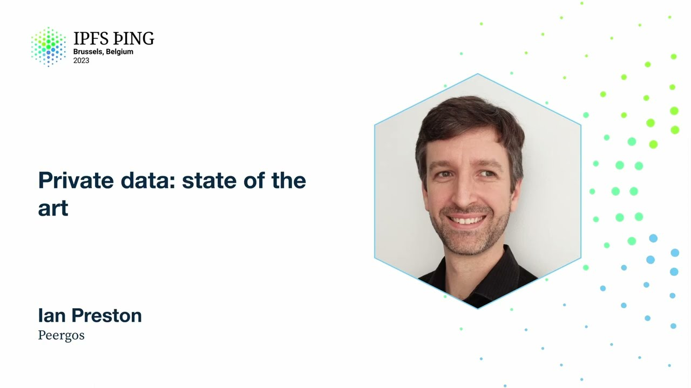

# Private data: state of the art - Ian Preston

<https://youtube.com/watch?v=HVyrVUI2-RA>

## Content

Hello, I'm Ian Preston. I'm going to talk to you about the state of the art of private

data on IPFS. So most services at the moment online choose one of either privacy or speed.

Is it possible to have both? We believe the answer is yes, and that's our guiding principle in Pyrgos. What is Pyrgos? It's a global private file system that I've given loads of talks

in the past, but that's the TLDR. The human readable paths map via IPFS and through signatures

to private data. So the first part of this talk I'm going to tell you about some of the
privacy features, so the capability-based access control. BATs, which are part of that,

which are a low-level block-level access control. Cryptree Plus and Application Sandbox. And

then I'm going to tell you about the speed, some of the speed improvements we've done, some of the cool stuff. Concurrent GC, fast-seeking and arbitrarily large files, and Direct S3

access. So let's start with capabilities. What is a CAP? So it's pure information. It's

not identity-based, so if you have this information through whatever means, you can use that capability.

There are three kinds of capabilities, mirror, read, and write. So the mirror capability
doesn't actually let you read anyone's data. It lets you duplicate or retrieve the encrypted

data. So that's a ciphertext-level access control. So a mirror capability has a bunch
of things in it. There's an owner and a writer, which are both public keys. There's a map
key, which is just a label, but it's 32 random bytes. And the BAT, which we'll talk more

about later, which is also 32 random bytes. So if you have a mirror key and you add a

symmetric key, that turns it into a read capability. And if you add one more symmetric key, then

it turns it into a write capability. So capabilities can be revoked, basically by key rotation.

Because it's pure information, they can work in things like secret links. So you can share them with anyone via a URL. So I'm going to take you through the process of, say I've given you a read capability to a file. What do you have to do to actually order the steps that happen to get the actual file contents? So in Pyrgos, there's a PKI,

which is basically a global mapping from username to signed claims of username, host peer ID,

and your identity public key. So two public keys, basically. One for your host, one for your identity. And normally you mirror that, so you can do private lookups locally. And

so you build a reverse index from identity to peer ID.

Once you've got the peer ID of the capability you're trying to retrieve, you do a peer-to-peer HTTP request to get what we call a mutable pointer for that writer. So all that is is

a signed thing. That thing is at the bottom here. You can see it has the previous root

CID, which that thing pointed to, if there was one, and the current CID, and a sequence

number, which is monotonically increasing. So once you've got this mutable pointer, you
verify the signature and the sequence, if you've ever seen it before, and then take
out the root CID. With the root CID, you do a second peer-to-peer HTTP request to the

peer ID, the owner. You don't have to do it this way. This is just the fastest way. You can do it totally locally using block-by-block lookups in the DHT, but that's obviously slower.

But if the host is offline, then you can fall back to that. So you do a champ.get. So champ is just a compressed hash-ray mapped prefix try. It's

a Merkle structure. You supply the root, the map key you're trying to look up, and the

bat. And that returns basically just a list of blocks. You then locally repeat the champ

lookup locally using those return blocks. So there's no trust relationship here. And

then you've finally got the thing that that map key maps to, the value. And then you can

decrypt that with the read key from the capability. And that gives you then the metadata for the
file. So things like file name, modification time, MIME type. And within that metadata,

there are also, if the file is less than 4K, you've actually already got the data. It's
inlined, which is a small optimization we do. But if it's more than 4K, then there'll

be some links to the blocks. So files, they're split into five megabyte chunks. Each chunk will have its own capability
and crypt tree node. So if you want to get the blocks for a chunk, there's at most five.

We go up to one megabyte blocks. And you just, you retrieve those using the CIDs and the
bats, which are in the metadata you just retrieved. And then concatenate them and decrypt it.

And that gives you then the first up to five megabytes of the file.
So to calculate the subsequent capabilities for the file, basically you just do some hashing.

So the map key, the label that you're looking up, you hash that with a secret that is in

the metadata that you decrypted. And that gives you the next map key. And the same thing applies to the bats. We'll spell that out later. And then you just repeat the previous
steps, 5 to 10, these guys. So the champ get, and then get the blocks. So that's how you

get a file. But I keep talking about these bat things. What are bats? So it stands for block access

token. So I've said there, there are 32 random bytes. But the sort of guiding principle here
is you shouldn't be putting encrypted data in the public DHT. Because you open yourself

up to attacks where someone can just store everything that's in the DHT and try and decrypt
it later or do offline attacks. Or maybe the encryption is broken at some point or something like that. So you want to have some kind of access control. So with the bats, we've created this post-quantum

ciphertext level access control. The idea is there are two bats per block. And if you

want to retrieve a block, then as well as sending the CID, you send an auth token. So

the auth token is an S3 v4 signature. It has nothing to do with S3. It's just the same signature algorithm, which ends up being 18,000 bytes, which you send with the CID. So it's

a small overhead in terms of bandwidth. And that signature critically is tied to the requesting peer ID. So you can broadcast this
auth token to the DHT and it doesn't matter. No one can replay it. And it's also limited in time as well, so something like five minutes. So the recipient will verify the signature, obviously against the requesting peer ID,

and the bat. Now, one of the properties we wanted to maintain for IPFS here is the kind

of auto-scaling property. So if there's some content in IPFS and it's popular, lots of people request it, they can then help to serve up the same content. So you get this supply
scaling with the demand. The other way around. Yeah, supply scaling with the demand kind of thing. And we wanted to maintain that. So the way we do that is one of the bats is in the block itself. So that means if you've

retrieved the block, you automatically have the bat. It's in the block. If you want to rotate access, you change the bat, that changes the CID. It's a new block. So that way you
get that auto-scaling property can be maintained and anyone who's authorized to request it

can then continue to apply the same authorization. So the inline bats. So the question is where do we put them? So we only have two kinds
of blocks. It's all DAG C-BOR, which is C-BOR or raw. So C-BOR, you can actually have different

top-level objects. You could have a list, but we don't actually care about those. All of the relevant objects that we care about have a map at the top level. So if it's a map, it's easy. You just pick a key. We picked bats. And then that maps to an inline C-BOR

list of two bats. Raw blocks are a little bit more difficult because there isn't really

any structure in a raw block. There is actually a little bit. There is a beginning. So what

we decided on here was there's an 8-byte magic prefix to basically say this is an access-controlled

block. And then after that, we just have the C-BOR list of the two bats after it, which

ends up being 8 bytes and 77 bytes. So in our case, the blocks we're trying to access

control, their minimum size is 8K, and they go up to 1 meg. So it's not a huge overhead.

So now, what is Cryptree Plus? So it's Cryptree plus bats that I've just mentioned plus improving

the design from a post-quantum perspective and protecting as much metadata as possible.
So I've said the Cryptree nodes are stored as values in a champ under the corresponding key. Your data host or storer, I mean, there might be more than one, but they can't link

the different chunks of the same file. So they can't see your file size. We also pad
the files to a multiple of 4K within that chunk size. So that gives you whatever it is, 5 meg divided by 4K, 1,280 possible sizes in the whole world for a chunk. And at the

same time, you can't tell the difference between a directory and a file because they look the

same. So yeah, in terms of other things, the metadata privacy protects in Cryptree, Cryptree

plus. So yeah, I've said file sizes, whether something is a file or directory, the file or folder names, the lengths of the names of the files or folders, the folder topology,
the social graph is not visible, who or how many have access to a file is also not visible.
Basically that comes down to it because the capabilities are pure information. We can't tell how many people you have told that information to, even with the in-band sharing mechanism.

So Cryptree node, this is the format, how it looks like on the block level. So there

are a bunch of, the bats I mentioned are there. They have to be readable by the server because
the server is enforcing that level of access control. And then there are three encrypted,

padded and encrypted sections. There's a link to a second symmetric key. So there are two

keys for each thing. I'll show you in a second. If you've granted write access to something there's also a symmetric link to the key pair, which you need to authorize those writes.

And there's a relative capability to the subsequent chunk. That's only actually really needed for
directories as I mentioned for the file thing. There's a parent section, which has an optional

parent link that's there, unless it's your root directory, basically that's always there. And then there's the file properties, which is a kind of extensible thing where you can just put stuff. So that has the file name, MIME type, file size, modification time, thumbnails.

And then finally there's the children or data. So if it's a directory, it's children. If it's file, it's data. You don't know until you decrypt it. And that could be inlined,
as I mentioned, if it's less than 4K, a small file or a medium-sized directory. Otherwise

it's got a list of CIDs and corresponding bats.
So this is how the read crypt tree looks like. So there are two symmetric keys for each file or directory. If you have a symmetric key, the idea is you can follow those arrows by decrypting links in the metadata you retrieve. You'll notice there's these backlinks going

back up the tree from the file. So everything has a well-defined path.

And the write crypt tree is a lot simpler. There's only one symmetric key per thing.

And most of the time that's not even there because it's only there if you need to grant write access to something. So in terms of a directory, what is a directory? So semantically it's a list of children.

So theoretically that should be a list of capabilities. But we want to be able to revoke

access quite fast. And if we have to change the entire subtree when we're revoking access
to something, then that's expensive. So we use a relative capability, which makes that

more efficient. And the other thing we care about is find by path, get by path. If you have a directory

and you have to retrieve all the things to find their name to go to the next level, that's obviously slow. So we duplicate the name in the parent directory. So you end up with named

relative capabilities or this thing at the bottom. So a directory is a list of things which have name, an optional writer, a map key, a bat, and a read key.

The application sandbox we have in Pyrgos is one of the most recent developments. So
the idea here is you can run untrusted code over private data. So an app shouldn't be

able to exfiltrate data or steal it. An app can't read anything that it's not been granted

access to. And it works in existing browsers without add-ons. Also works offline sometimes.

What is an application? It's just a folder of basically of HTML5 assets in Pyrgos. So

because it's just a folder in Pyrgos, the author controls the visibility. You can have private apps. You can share it with your friends. You can make it public. We've got a basic set of permissions you can give to apps. I gave a talk on this earlier, so I'm just going to summarize it here. But if you want more details, go watch that. Yeah, super easy publishing, drag and drop. We've got a bunch of example apps. You can

find these. There's an example-apps repo in Pyrgos on GitHub. Markdown, there's multiplayer

games, image editors, music players, office viewers and editors, spreadsheets, lots of

stuff. So the sandbox itself, how does this work?

It's quite difficult to stop exfiltration in browsers. So the idea is you've got the

main Pyrgos tab, which you log into. Now, this could be on localhost or some domain.

It works on both. And you then tell you, say you want to launch an app. We then load a

hash-based subdomain, which again also works on localhost. And what the server does for

that subdomain is it serves up a fixed static file for all subdomains. It's the same thing.

And all that does is set up a service worker, which then communicates with the main tab via post messages. And then sets another sub-iframe on its own domain to load the app. And the

app can then, it's a page basically, it can render its assets. So you've got the app permission enforcer is in the trusted context on the other side.

And the CSP, there's a couple of things here. The CSP firewall locks down the app so that

even if it escapes its own little iframe, it can't make any external requests to the web. So it shouldn't be able to exfiltrate data. And the other thing is the subdomain

context and the main context are run in different operating system processes to protect against
side channel attacks. But enough of that privacy. Let's talk about

speed. So concurrent GC has historically been a problem. So if you run Kuber with a one

terabyte block store in S3, a GC takes about 24 hours whilst holding a global write lock.

So that's obviously a problem. So we wrote our own GC while still using Kuber, but running

the GC externally. Version one of the GC on the same block store took two hours. And it's

fully concurrent with no locks. Version two takes seven minutes. So I'm going to tell
you how we did that. So first you have to understand how write is happening in Pyrgos. Whenever you're doing some modification, there's four steps. You
start a transaction with a server, which is it just returns you a transaction ID. And then you write your blocks. Doesn't matter what they are. But every block write is tagged
with a transaction ID. And the server just temporarily stores those pairs in a database,

basically. When you've done whatever it is you're going to do, you commit the new routes to the mutual pointers, the thing I mentioned at the start. So you sign your update and push it. And then you close the transaction. And that removes all those things from the database. So with that in mind, the GC algorithm is also quite simple. It's basically a mark

and sweep. So it lists the block store, it lists the GC routes, lists the uncommitted

writes, the ones I just mentioned. Those three steps are very fast, even with S3. Listing

can take, even on a terabyte, can take ten seconds. But that doesn't really matter.

The mark phase was historically the slowest phase. And delete, well, I guess it depends

how much garbage you have. The delete phase will scale with how many things you have to delete, obviously. But yeah, so we've done the mark reachable and the delete also in

parallel. And that was what got us down to the two-hour mark. And the magic for the final

version was basically...

to store a lookup from CID to the list of links in that block. We store the size as well because we also do other stuff with keeping track of how much space a user uses.

But with just the links, you can do that mark and sweep without touching S3 at all, basically.

Which is very cool. And the overhead in terms of size of this database, this extra database,

is very small, 0.05% of the total block store size. And you avoid having to retrieve and pass

all the blocks when you're doing your mark phase. So yeah, basically everyone should have this kind of metadata store

if you're doing anything to do with DAG traversal. And the final cool optimization we have, I can demo it if we will have time, I think,
is fast file seeking. So if you have a large file, I've mentioned how you retrieve a capability.

And once you've got the first chunk, or the first metadata of the first chunk,

you can then, just from hashing locally, retrieve, generate a capability to a later section of the file.

You know the size because that's in the metadata of the first chunk. And so then you can then do a bunch of hashing locally, and then do a single champ get.

So one round trip to retrieve the encrypted metadata. And then up to five block gets for the fragments.

So this means you can jump forward very, very quickly.
Which if you're doing something like streaming a movie, can be very useful.

The final cool optimization is to do with S3 block stores.
So normally the block store is an implementation detail of a server. It's not exposed in any way.
And this is the normal mode of operation. So the client always talks through your server,

and all the bandwidth and requests go through that, and that then talks to S3. But that's, if you have a lot of data, that's 100% of your bandwidth.
So what we've done is to allow direct S3 block store reads where the client talks directly.

Now you can actually make it public. That might not make sense depending on your pricing model for S3.
So we are on the side of caution and still require authorization. So you still do a request to your server, but then the server just returns a pre-auth URL to S3.

So then you can do the download directly. So that offloads something like 99% of the bandwidth.

But the cool part is doing it for uploads. So this is a... bear in mind this server is multi-tenant.
You can have as many users as you like. They're all using the same bucket in S3.
But because the block store is content addressed, there's no possibility for conflict.

And so when you author writes with your server, the pre-signed URL...

Well, so the path in S3 is the hash, basically. But you can get S3 to verify the SHA-256 of the thing that you're uploading,

which happens to be the only hash we use. So you can do direct uploads to S3, which is awesome.

So now I'm going to do a super quick demo of the file seeking thing.

So if we can find... let me just make this bigger. If we can find a video...

And my sound is off, I think, so it won't have any sound. But you can see it's playing.

And you can see the browser's buffered up to here kind of thing.
But if I want to seek some way later... there you go. That's pretty fast.

I can also go backwards. How does backwards work?
Obviously you can't reverse a hash. All we do there is we just keep the first capability around.

So we're always hashing forwards. We could do something slightly smarter, but that seems to be enough.

Coolio. Yeah, so you can self-host. You can sign up on pedagos.net or write apps.

Yeah. Any questions? So earlier when you were talking about the bats, you mentioned specifically that it was post-quantum

and that it couldn't be... that an attacker who wanted to just hold on to encrypted data on the network

couldn't decrypt it later. I wasn't sure I totally understood what made it post-quantum. So it's post... so where is it? So the reason it's post-quantum is the S3V4 signatures, they depend on HMAC SHA-256,

which is already post-quantum. So there's no asymmetric encryption or asymmetric signatures in there. So that's the auth scheme to retrieve a block, so that means that no one can retrieve the block in the first place.

How does Cryptree plus relate to systems like WNFS? You'll have to ask them about that. So the original Cryptree came from a group called Voila in 2008.

They had quite a cool system, and ours is very similar to theirs, but as I say, we've made a bunch of improvements, mainly around the metadata side and the post-quantum side.

Thank you very much. Cheers.
