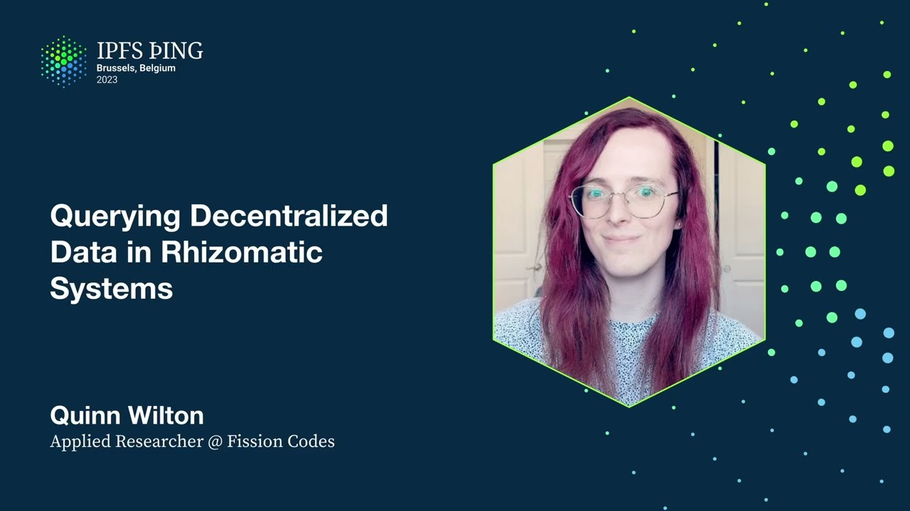

# Querying Decentralized Data in Rhizomatic Systems - Quinn Wilton

<https://youtube.com/watch?v=KgPCX7Bu4y4>

## Content

Hi everyone. ARIA is a 1958 composition by John Cage. The work consists of 20 pages of

abstract lines, colors, and disjoint lyrics, spread across languages like Armenian, French,

and Russian. The notation is as absurd as it is subjective, and the result is a piece
of music which no two performers will ever interpret in the same way. Included with the
sheet music are these instructions, and for every aspect of the song they specify, they intentionally leave just as many open and freely determined by the singer. With music like this, Cage pioneered an approach that he called indeterminacy, which he defined
as the ability of a piece to be performed in substantially different ways. For him, this often meant presenting the performer with the rules governing the creation of a score, and then allowing the performer the freedom to execute those rules in a multiplicity-producing
act of creativity. This approach shows up again in 1958, with a piece titled Variations

1, dedicated to a fellow musician named David Tudor. This was the first of a series of works
centered around the use of transparent sheets. By overlaying these sheets together and interpreting
the result according to the provided rules, new variants of the same piece could be constructed and performed by the musician. The space of possible music was still limited, though,
and a fixed number of valid configurations meant that only a relatively limited number of performances was possible. Cage responded to this limitation in 1961, with Variations

2. This time the transparent sheets could be arranged in any manner whatsoever, with
the new set of rules generating an infinite number of possible realizations of the score.
James Pritchett wrote that Variations 2 was a piece of music in which any series of actions in any order and combination whatsoever would lead to music. Cage's avant-garde approach
was wildly influential, and in 1959 Silvano Busotti composed five piano pieces for David
Tudor. Busotti was responding to a movement known as atonal serialism, a strict formalism

which severed musical elements from any continuous and meaningful context, instead seeking style
through mathematical purity. With Busotti's aserialism, he aimed to infuse the avant-garde

world with the intimacy and subjectivity which serialism had sought to avoid through impersonal
rationality. And David Tudor was the instrument he intended to use to do so. Rather than being

a dedication, the title of this piece referred to David Tudor as the instrument for which the piece was composed. Tudor was a talented improviser, and through him Busotti hoped

to bring about a type of music characterized by the joint participation of performer and composer in an effective inner subjective event. I'm Quinn, and I'm here to talk about

rhizomatic systems, decentralized data, and a local first database I've been working on named Rhizome. I'm an applied researcher at Vision, where I've been experimenting with new ways of building distributed systems. In my free time, I spend my nights tracing through the history of programming languages, trying to piece together the contexts that led to their development and how the ideas behind them have shifted and morphed over time. I have a confession, though. In putting together this talk, I eventually realized that I'd need to define rhizomatic. And I tried. I really did. I read so many books,
and I scoured so many papers looking for a clear and concise definition of the word. And I don't know if one exists. Deleuze and Katari introduced the word rhizome in A Thousand
Plateaus. They don't define it either, though. They let its meaning unfold over the course of almost 600 pages. That piano score by Busodi appears without explanation in the book. And

I think part of the reason why is the way it hybridizes two different mediums, painting and music, into something that isn't quite described by either. So I'm going to try to do the same thing with this talk. I'm going to discuss a lot of things, and most of them are going to seem unrelated. But I hope that in their entirety, you'll begin to understand, if only just a little bit, why I chose to name a local first database rhizome and what we're hoping to accomplish with it. But first, I'd be remiss not to attempt to define the
word. And so I'll start with the best definition I've been able to find. The rhizome is a model

of thought that defies the very idea of a model. It is an endless, haphazard multiplicity
of connections, not dominated by a single center or place, but rather decentralized
in plural. It is thought characterized by a radical openness to an outside. In this

way, to be rhizomatic is to be non-hierarchical, to be dynamic, to eschew totalizing ideas
and schemas, and to fully embrace heterogeneous connection. It was connections that Vannevar

Bush was concerned about in 1945, when As We May Think was published. With World War
II coming to a close, and with it, his involvement with the Manhattan Project, Vannevar Bush turned his attention toward knowledge itself. And in nine pages that must have rivaled the science fiction of the time, he painted the soundtrack of a future that must have rivaled

the science fiction of the time. Wow, sorry. It was a future inhabited by voters that could
synthesize human speech, mechanical stenographers called vocoders that could transcribe it, and cameras so tiny and so reliable that we'd begin chronicling everything. With so much
information available to us, though, Bush foresaw a problem. How could anyone ever sift through such astronomical quantities of data? Existing solutions, like automated telephone
exchanges, selected records in an essentially hierarchical manner by traversing down a tree
of relays using the digits of a phone number. And I'm reminded of a letter sent by the Library
of Congress to one Dr. Norbert Wiener in 1949. My dear Dr. Wiener, it begins, the publication

of your book on cybernetics has caused the editorial staff, which is in charge of the revision of the Dewey Decimal Classification, considerable difficulty. Generally speaking,

a book can only be assigned one number, and consequently we cannot take care of the many aspects that certain works cover. The problem must be simplified. Is your book such as to
place it in psychology? Does it belong in the field of electronic computation devices? Or does it belong in mathematics? If we were not somewhat desperate about this particular
problem, I should hesitate to bother you with it. As Vannevar Bush said four years earlier,
the human mind does not work that way. It operates by association. It jumps from one item to another, following complex trails of connections between disparate ideas and memories. If we were to augment our mind with machines, then, Bush thought we must mechanize
this process of following associative trails. And in his way, in his mind, the way to do
this was with something he called the memex. It's almost quaint the way it was illustrated
at the time. A desk filled with microfilm containing all the world's information, and
with mechanical levers meant for exploring the connections between it all. But I think looking at the ads this visionary piece of writing was printed alongside gives some valuable context. This was a world where men feared the touch of metal from their garters, where
Sir Walter Raleigh was no longer a fashion icon, where we had yet to discover a cure
for corns, and where people still thought you could make a business out of selling to-do apps. Some of this vision came to pass, and it's impossible not to see the memex in the Internet that we have today, but aspects of its design were lost along the way. First,
though, I want to talk about the opening sentence of As We May Think. This has not been a scientist's war. It has been a war in which all have had a part. It's obvious that he's referencing the atomic bomb here, but it's his allusion to the non-scientists that I find interesting.
He doesn't expand on this point, but my mind goes to the way the arts were repurposed towards the war effort. On one hand, there's the Ghost Army, made up of people from professions like acting, architecture, and law, and working in collaboration with Bell Labs to deceive the Germans with the improvised soundscapes of mock battles played in the night. But artists
across the Allied homefront were also pulled onto a virtual battlefield, and one of those was Frank Capra, the director behind some of the most recognizable films of the 1930s.
In 1941, after the attack on Pearl Harbor, Frank began working directly under the Chief of Staff for the United States Army, and was tasked with producing propaganda films to counter those being used by the Germans. What came out of that was Why We Fight, a series
of seven films dedicated to revealing the depths of evil incarnate in America's enemies.
How he did this is interesting, though. With no team behind him, he had very little resources at his disposal to produce material of his own, and so he turned the propaganda of the Germans against themselves. Acting in direct response to the horrifying Triumph of the
Will from 1935, Capra recontextualized its own footage into an attack on fascist ideology,

remixing films like it into something new entirely. So it's fitting that Capra's own works went on to experience a similar fate. In 1937, His Lost Horizon was released. The
film was a financial failure, and critics panned it as an incoherent mess. This wasn't
Capra's fault, though, and the film had been heavily censored, with critical scenes espousing pacifistic and utopian ideals being cut soon after release, and much of that footage
being lost, some thought forever. It wasn't until nearly 40 years later, in 1975, that
the film was restored, in a process that was described as doing a gigantic jigsaw puzzle, whose pieces were scattered all over the world. This same piece opens with a bold statement,
if you think you've seen Lost Horizon, you probably haven't. Again, it's fascinating
to me the way something so new can emerge out of the shuffling and remixing of largely what's already there. And Ted Nelson thought so, too. In 1981, in Literary Machines, he

wrote of the restoration process for Lost Horizon, using it as an example of what he considered to be a non-sequential editing process. These paragraphs appear alongside
a description of zippered lists, a data structure he designed for storing alternative versions
of documents. The idea was to support the horizontal linking of varyingly ordered sequences
of items together, such that the connections inherent to most compositions could be made explicit within their representations as data. Inspired by Vannevar Bush, these ideas grew

out of Ted Nelson's fascination with the problem of how to organize the world's information into one giant repository, equally accessible to all, a network he called Xanadu. One important

feature of this vision was the ability to construct multiple pathways through media, for readers of different backgrounds and with different needs, so as to facilitate a multiplicity amplifying form of publishing and curation. This is an abstract notion, but I've come
across shadows of the sort of ideas that Ted may have had in mind, and one of my favorites is Thomas Petracek's dissertation. His research was on a topic in programming language theory
called co-effects, concerned with making programming languages context-aware. The theory behind
his ideas is deeply mathematical, but he also experimented with the presentation of those ideas. And in his dissertation, he includes an interactive tutorial that presents the user with a number of pathways through his research. In one section, he briefly gives an overview of a structure called a comonad, quickly moving past the details. But for readers

who love theory, the session is expanded, diving into the math required to fully understand his application of the ideas and the foundations they build off of. The whole website follows
this design, and I think it's a brilliant way of demonstrating the type of plurality that Ted Nelson was enthused by. The analogy still isn't perfect, though, because while
Thomas Petracek is making visible different perspectives over his own writing, it's still just that, his own writing. And what Ted Nelson wanted was to enable the collaborative synthesis
of hypermedia, formed out of blocks from across the entire network, not just of writing, but
of every sort of media and knowledge that could be processed by a computer. To put a modern spin on Paul Klee, hypertext is an idea that's gone for a walk, and sometimes
the best walks involve leaving your neighborhood. Here's a video of Xanadu in use. Really, this

is an early video, because it doesn't even show off the ability to link to links themselves, which was an essential part of the entire endeavor that hasn't really carried through to the web that we have today. I don't think this is Ted's fault, though, and the fact
that Xanadu has such a reputation for seeming so complicated makes sense to me. In one chapter
where he describes how to organize an interplanetary document store, he opens with a quote from a Werner Herzog film. Our kingdom is already twice the size of Spain, and every day we drift makes it bigger. This quote is good, but if literary machines had come out a year
later, I like to imagine that there's another quote he might have used to discuss the scope of what it was that he was trying to do with Xanadu. And we have to become humble in front

of this overwhelming misery and overwhelming fornication, overwhelming growth, and overwhelming

lack of order. Even the stars up here in the sky look like a mess. There is no harmony

in the universe. We have to get acquainted to this idea that there is no real harmony
as we have conceived it. But when I say this, I say this all full of admiration for the

jungle. It is not that I hate it. I love it. I love it very much, but I love it against

my better judgment. This is really important, so I'm going to quote one part of that on
its own. There is no harmony in the universe. We have to get acquainted to this idea that
there is no real harmony as we have conceived it. This is a scary thought to a lot of people,
so I can understand why it sometimes feels like the entire history of computing has been a history of trying to paint over this fact. But I think it is a fact, and I think our tendency to force the world into strict categorizations and hierarchies is a rejection of this natural disorder of things that serves to limit not only the resiliency of our systems, but also
what we're able to accomplish with them. In one of my favorite books of 2021, Shannon
Madden said that algorithms and interfaces tend to bracket out those messy and disorderly concerns that simply do not compute. Christopher Mickeljohn makes a similar point, especially
as it relates to distributed systems. In 2018, he wrote that striving for distributed systems

that provide single-system image semantics is fundamentally flawed and at odds with how
systems operate in the physical world. Here, he's claiming that real-world systems are fundamentally eventually consistent. They perpetuate themselves through the exchange of information in the form of letters, telephone calls, and writing, and so they must be resilient to that information being dropped, delayed, or reordered. To aim for a stronger sense of consistency in distributed systems is to go against this nature. He proposes that rather
than targeting global consistency with some primary node, systems should instead be built
to treat the local knowledge recorded at each node as being an accurate reflection of that
node's view of the world. Here, it is that to do otherwise is inherently limiting, but
claims these designs are common because of the way they simplify the use of existing tooling. He then goes on to briefly acknowledge the incompatibility between the designs he's criticizing and the constraints of peer-to-peer networks and large-scale edge computation.

There rather than one globe-spanning network, we end up with a number of smaller, sometimes overlapping networks, computing over different slices of the total set of data, with no guarantee
of ever achieving or even desiring system convergence. Conceptualizing of systems in
this way fundamentally changes the assumptions we can rely on in building them. Rather than designing arborescent networks with static topologies routing through centralized services,
we end up with non-linear rhizomatic architectures, where nodes are born, form arbitrary connections
within the network as they live out their sometimes brief lives, and then die in often unpredictable ways. An engineering force such a world means giving into the harmony of overwhelming
and collective murder. With enough engineering effort, our existing tools and techniques
may allow us to survive in such a world, but if we're to truly thrive and build anti-fragile
systems that take advantage of the untapped potential available to us, then we need new ways of thinking about distributed and decentralized data. That's the idea behind disorderly programming,

a term that was coined by the team behind the Bloom programming language back in 2011. Bloom was an experimental language meant to explore the use of a high-level declarative programming language for building distributed systems. Under the hood, its semantics are
based on a deductive query language named Datalog that's historically been used for reasoning about relational query languages. It essentially works by traversing the associations
that exist between different entities in order to solve for logic variables and answer queries about the resulting trails. Bloom was named after Leopold Bloom from Joyce's Ulysses,
and I like to imagine the language as the personification of the memex, ambling through Dublin and following a stream of consciousness flow of associations linking the memories scattered throughout the city. But Bloom was preceded by an earlier language, named Daedalus.

Though also out of Ulysses, the name evokes the great maze builder of antiquity. In the idea of the labyrinth, Penelope Daube writes that what you see depends on where you stand.
And thus at one and at the same time, labyrinths are single and double. They simultaneously incorporate order and disorder, clarity and confusion, unity and multiplicity, artistry
and chaos. They are dynamic from a maze walker's perspective and static from a privileged onlooker's point of view. In a distributed system, though, there is no privileged position. The maze
is always dynamic, always changing, and every node's perspective is one formed out of incomplete
and local information. But it's this indeterminacy that Datalog can cut right through. The big

insight that makes this possible is the Kahn principle, consistency as logical monotonicity.

The Kahn principle gives a correspondence between the family of eventually consistent programs with coordination-free execution strategies and monotonic logic, Datalog. Informally,

not only is any program which can be expressed using a monotonic subset of Datalog guaranteed to be eventually consistent in a distributed setting, but there also exists an embedding of every eventually consistent program in monotonic Datalog. One simple correspondence

is able to capture the precise power and semantics of a distributed programming paradigm that
entirely avoids the use of distributed locks, consensus, and all of the other coordination protocols we rely on. It's sort of like Cage's variations, too. By changing the rules, he

was able to devise a game that wasn't susceptible to order, time, or conflict, and instead always
allowing music to bloom. It's these ideas that Rhizome builds off of, to expose a query
language that supports eventually consistent views over disparate data structures, like encrypted stores in IPFS. In Rhizome, data is persisted as four tuples, specifying an
entity, attribute, value, and some collection of causal links. These causal links denote

the provenance of data, and they reference other tuples using their SIDs. This is a little
hard to read like this, but because we use SIDs, these dependencies are guaranteed to be acyclic, so we can visualise the database in a form we should be a little bit more familiar with. A directed acyclic graph. Thanks to the com principle, by using a query language

inspired by Datalog, we can traverse this graph.

daddy ******* The industry iemand 3 plouse many, many mark. all my love has it I love circassia.

The 2003 drawing from the

patrimÿÿwagenusalemarrator360 implacamous quote on edge, stores, each potentially containing horizontally linked
tuples containing or spanning multiple stores. Due to the convergent nature of CRDTs, this means that different readers may subscribe to different writers, but in a way that guarantees monotonic progress towards some result. This is what enables us to provide every device on the planet with its own database and allowing those devices to collaborate in locally meaningful ways. In practice, I've been doing this by layering Rhizome on top of Fission's web-native file system and associating an append-only log of tuples with each device. Soon, this will happen directly over mercolized tamps, and an interesting research avenue would also be to explore the use of Parali trees for performing range queries over remote data. I haven't implemented it yet, but we also have a design for querying over encrypted data, where certain readers may only have access to certain other writers. In this example, the reader doesn't have the decryption key for the gray events, and so they're unable to satisfy the causal links for any of their downstream dependencies, and so the resulting set only contains the letter D. In a sense, we're treating encrypted data as a special case of network partition. Rather than some of the data being unreachable due to network failure, it's unreachable as a side effect of not having been granted the required decryption keys. What makes this design special, though, is the way the partition can be healed and convergence restored if the required keys are ever shared with the unprivileged reader. There's other reasons a reader may prune the resulting data, though, and in this case, they may choose to revoke all the blue events and end up with a CRTT, which is still consistent with respect to all of the other events. This is happening entirely at query time, though, which means that different readers may impose their own constraints over the data. Perhaps I don't trust some writer, and so I don't want to honor any rights that depend on his. Or maybe I subscribe to a fact-checking service that annotates news stories with a trustworthiness score that I can use to dynamically filter out non-reputable stories. Or maybe I subscribe to a feed of crowdsourced content warnings that I can filter and overlay onto the content that I engage with. By content addressing all of the data in the system, we gain the ability to extend all of that data in arbitrary ways. Just as Ted Nelson supported attaching links to links, we're able to associate facts with facts. And with that comes the capability of reshaping our understanding of that data in very metacircular ways. This goes so far as allowing for a total reinterpretation of that data. In the simplest case, this set can be reinterpreted as a counter by viewing additions and removals as increments and decrements. In this way, agents can repurpose pieces of a graph as different types of data, even annotating that data with additional fields or metadata for their needs. In the case of a collaborative text editor, that might mean prioritizing your own rights over another user's while still managing conflicts and allowing them to do the same. As in the case of Busati's composition, the interpretation of the data depends just as much on the reader as it does the agent who wrote it. This is only an idea we're beginning to explore now in software. With the sorts of bring your own algorithm approaches that protocols like Blue Sky are experimenting with. But I think it's one of the most exciting possibilities available to us in terms of shifting agency back into the hands of the people that we're building software for. And autonomy is one of the driving motivators behind Local First Software, a paradigm that was coined by Incan Switch in 2019. It defines a set of guiding principles for building software that prioritize user privacy, security, and agency. The vision of Local First Software is of a world that empowers people to take back ownership of their data, freeing it from the tyranny of the cloud and of the centralized services that comprise it. In Local First Software, a user's device is the central source of truth, with data all being stored locally and with a hard dependency on the network being severed. Instead, Local First Software embraces eventual consistency and emits use of techniques like conflict-free data types to synchronize data between devices. It's exactly this niche that Rhizome is being built for. And we currently have a working prototype implemented in Rust that compiles down to WebAssembly to run it in a browser or to native code for back-end and desktop deployments. It's still a work in progress, but we open-sourced the repository just a few days ago, and my immediate focus is going to be on making that early version more usable to anyone else. That means adding some docs, examples, and opening the door for community contributions. After that, the roadmap includes querying over encrypted data, building out a standard library of CRDTs, and integrating with some common front-end frameworks like React. I also have some early prototypes that demonstrate automatic incremental view maintenance for efficiently querying over dynamic streams of data. If any of this sounds like something that you're interested in helping out with, please come and find me later. I didn't just come up here to talk about Rhizome, though, because I think that the ideas we're pursuing go beyond Local First Software and permeate into how we should be thinking about decentralized and distributed systems. In 2002, David Weinberger wrote that the internet forms the only persistent world that accumulates value with every interaction. He described it as a world that we build simply by using it, where what is of worth stays and adds to the web's overall worth. I think that may have been true once. And I sometimes see traces of that early idealism showing through the cracks of what we have today. But when I look around now, I see a web that's largely one of decay, disempowerment, and fragility, where something as profoundly simple as a hyperlink can't be relied upon to work for longer than a few weeks, where whether we're allowed the dignity of 80 characters or 4,000 is at the discretion of a billionaire that we'll never meet, and where our access to critical information is gatekept behind APIs that can be pulled out from under us without warning. But when I say this, I say this full of admiration for the web. It's not that I hate it. I love it very much. But I love it against my better judgment, because I know just how much richer it can be if only it's able to fully respect and embrace the collective intelligence of the people it purports to serve by trusting in the stigmergic capabilities of those people to bring about a spontaneous network beyond anything anyone could ever design for themselves. Busotti's music wasn't merely a response to serialism, but also to a world that oppressed his homosexuality in the same decade that it killed Alan Turing for his. And Paul Klee's artwork wasn't simply an exploration in surrealism. It was also an anti-fascist critique of a world that he knew could be better. I'm not saying that Rhizome solves all the web's problems, but I think it chips away at some of them. And I think that all of us here in this room are uniquely positioned to chip away at some of the others, doing our part to reshape the web into a world that we're proud to inhabit as our own. I'm Quinn, and I'm looking forward to meeting you all throughout the week. You really blew my mind saying that unencryptable nodes are just like a form of things that have been filtered out by the subjective decision of the reader. I mean, that's just one of them. I guess, what APIs, how does that feel to a developer? How would you imagine that being easy and cheap than being easy to do? So I think it's actually fully transparent to them. As it currently is when we build distributed systems, network partitions are just a fact that we need to deal with. And those essentially correspond to loss in connectivity and time. And when we're dealing with loss of the required encryption key stats as a piece of data, if you never receive that encryption key, that's kind of like a network partition that never ends. So you're really just building for a case that you already needed to support, but now you're able to reconceptualize it in a way that also relates to user privacy and security. Does that answer your question? Well, I guess the rest of the question was, say I wanted to filter for only videos on. I see. I see. Is your question more about what that looks like as a developer or what it looks like as users using all these different remixed versions of these apps? Is subsetting so powerful that I might use it as a normal thing apps do to take advantage of it? I see. Honestly, I think so. Kind of the way that I imagine apps built using systems like these working is that rather than having these big monolithic apps put out by places like Spotify, for example, we have smaller libraries and frameworks and so on that are allowing us to engage with different types of media that we store and systems that we care about and perform in common operations over those. And what that means is that I kind of think that we're going to eventually end up in this world where people are kind of building the exact apps that they need for what they need them for. This is sort of something we see nowadays anyway. As developers, we try to build for these really simple, statically specified systems that don't really align with anyone's needs. And then what ends up happening is all of the users that we're building the software for end up layering on batch scripts and Excel spreadsheets and all this junk to try to massage what we're doing that doesn't actually serve their needs. And so I just kind of think that we need to cut that step out and make it possible for all of us to work together and kind of define what it is that we need from these tools directly. One of the problems that you end up needing to deal with in this sort of world where you don't have static schemas that are being specified and shared like what you see in RDF and more solid style spaces
is something that in some fields you see called an ontological crisis, where you have these different ontologies that don't necessarily align with each other. And you need to map values between them. And InkinSwitch has another project that I'm really excited about called Project Cambria. It was more of a proof of concept in the JavaScript world for defining schema translations between different JSON documents and then automatically generating bidirectional lenses between them so that you can go from a document of type A to a document of type Z by finding a path of translators between different schemas in this graph of schemas. But what you were saying about pushing the predicates into the B tree I think is something that's super interesting, especially where content addressing is concerned. I see my colleague Bjerke at the back, and Zeeshan's over there too. They're going to be talking a bit about IPVM tomorrow, I believe. And something that I'm really excited to explore is the idea of building almost like a virtual machine for bidirectional lenses that gets compiled down to WebAssembly, but that you can then invoke from this datalog-inspired language to essentially solve for those paths, those schema translators and then apply them to the data that you're processing and pulling down from IPFS. I want to be clear, none of this is built yet. It's mostly just like scaffolding and designs that we have on pieces of paper scattered all over the place. But in theory, it all works. I want to zoom out a little bit again. I wrote down a summary. I thought what I would be the gist of your talk. So I'm going to try to, and then you can maybe comment on it. Sure. So in general, today we're talking here about how to build distributed systems. And we really want to make sure that people can, and we and people can trust these systems. But you're arguing that the end result will be chaos and disharmony, however hard we try. Or none person can ever understand anything. To an extent. To an extent. There's different, OK, go ahead. But what makes us human is that we always strive for harmony and for order. And that part is the querying part, so that we, how we're going to look at the data, and we're going to create the data, and then we strive for our own personal and local harmony. Yeah, exactly. My point is less that it is impossible to find some locally meaningful definition of harmony or order, but that trying to do so across everyone in the world for every application of the data that you're operating over is not feasible. And that instead we need to find better ways of translating these locally meaningful views of data into ways that can be shared and collaboratively operated over.
Basically, that there's limits to the types and amounts of order that we can pull out of these systems that are kind of innately limited by causality and the speed of light and so on. Well, thank you. Yeah, thank you all for your time. Thank you.

