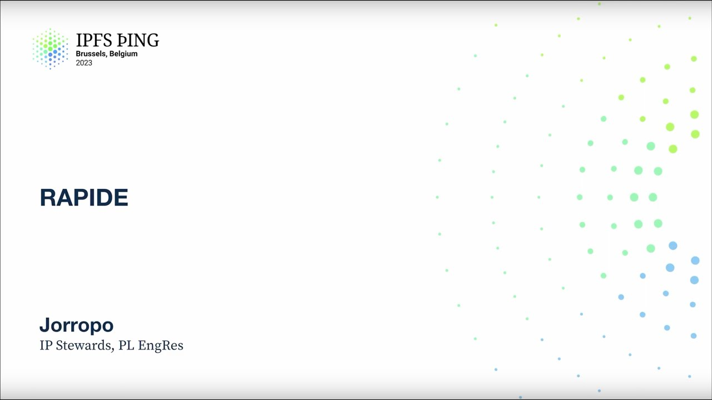

# RAPIDE - @Jorropo

<https://youtube.com/watch?v=Cv01ePa0G58>

## Content

Hi, I'm Jeropo, you can also call me Hugo if you want. I work at Protocol Labs in the

IP Stewards team and we mainly take care of Kubo and Boxo, which is a library that mostly

spin out of Kubo and the goal of Boxo is to help people that want to build applications

to build applications using the Kubo primitives. And so I want to show you what I've been working

on, one of the things, which is RAPID. So the first step is, oh, I first talked about

this at IPFS camp, so this might be a bit repetitive if you've already seen the talk,
but I will show pretty numbers. The first thing that's interesting to notice is that

Torrent is a peer-to-peer network and yet it's probably the fastest way to download files on the internet. Assuming you don't dedicate a huge amount of resources to your

problem, just having a thing and having work, Torrent is very good at that. It takes lots

of different computers and because everyone is providing the content, you can download
from lots of people in parallel and so even if each one is a small connection from a residential

thing with a small upload bandwidth, when you add all of them together, you can still download at multi-gigabit speed. We call that negative one scaling because the more users

you have, the faster your download goes because there are more users that are resharing the file. And so it's a question you might have whether we see that on IPFS. One way I wanted

to try this is we have this.ipfs.io, which is just a website that hosts binaries for

Kubo and other things. So you would guess that it's popular in the IPFS community. And so we see that at the time I've written the comment, we have 42 people that were hosting it. So if I try to download it, though, I'm using Kubo right now, and you can see it's

pretty slow. It's at three maybe bytes per second, which is, I mean, it's not that slow.
Some people have worse antennas than this, but I have an antenna that's a few hundred times faster, so I would expect something faster. And it's still not downloading very fast. So I'm going to show you what I've made with RAPID. This is a comment. It might look big. It's just because I'm listing a bunch of different gateways I want to download. And is there someone smart that realized that I'm downloading from localhost? It's because it's hard to find very fast gateways. And I use the TC

stream shaper, so it actually looks like localhost is far away. So I'm not just very fast because
I download from myself. I'm actually slowing down the connection. And so if I do that, yeah, 600 maybe bytes per second, which is about five gigabit per

second. I had to do download from localhost because I only have half of that, so when,

like, my fiber is the bottleneck, I think it's pretty good.
So that was the demo. Okay. So now I will quickly go over how it works and why it's
so fast. The main idea is just that we have lots of different nodes that have our content,
so why don't we just download from all of them at once? Now the hard question is, okay, so if I download the same file from everyone at once, I'll have the same data 42 times, or, like, how many times how many nodes are in the network, which doesn't help me, actually. So now we need a question of how do we want to download
different parts of the file from different nodes? And the slightly hard part is that in IPFS files or DAGs, so that means we have to start somewhere, so at the root, for example,

because it's the first hash you have, and then going from there, we will be able to download. So at the start, we only know about the root. So what we're going to do is we're going to take all of the people that we have, all of them are, so we have X, Y, and Z, which are people we're downloading from, and we're just going to add them to the first block three times, or, like, everyone adds the same block. And the point of doing this is to get the faster time to first byte. So we don't know, actually, here, like, we don't know the latency of this node yet, because we have not contacted them, so the question is, we just want the first, like, starting the baseline as fast
as possible, and so we raise them together. This is not ideal in the long run, because

we'll get duplicate data, but the goal is that quickly, let's say X is the first fast
node, and so X got the root node, so what we'll be able to do is to move other people
away from the root node to other parts of the DAG. So right here, for example, we have X that's downloading both Y, A, and E. Due to how the

underlying protocol works, which here is a car file from a gateway, we don't precisely
know where the file is going to be, so we kind of have to take a guess, but then that
allows us to, like, for example, Y, Z is downloading E, we see that X downloaded I, and so at this

point we have, like, double the throughput, or at least, like, we have X plus D throughput.
And so there is this notion of there's numbers on the graph, and the point of the number is something that I call the metric, and it's just to stay to, so, like, all of this is
running on the client, and so we want our client to decide where do we want to go. Like, Y right now doesn't know, doesn't have a peer to download from. And so the thing that we will use is the metric, and it's a number of how bad do we don't want
you to download from here, if that makes sense. Right now it's just counting how many nodes are maybe going to give us the file, and the point of doing this is that then Y can look at the metric and sees that A is not downloaded,

and it has a metric of one. So it's the best node here that we have access to, so Y is going to start downloading A. And so basically we just keep going down in the graph, and we search what is the blocks

that we don't have yet, and what are the blocks that have the lowest metric, because the lower the metric, the lower the competition for that block is.
Now we have something interesting that happens. It's kind of, so it's an issue of, sorry, different protocols allow you to do different

things. The particular protocol that is being used right now is Calvigateway, and it doesn't allow you to tell you, oh, I don't want a block. You tell it, oh, I want some blocks, with recent addition that Hannah has been talking earlier, we can guide it more precisely in the DAG, but it's still, you cannot send a
like a negative want. So it will happen sometime that we get duplicate data. Here X sends us E that Z already downloaded. And so at this point, we do a, I think, it's maybe a hack, but it works well. We just kill the connection, because when we kill the connection, then the, we'll stop

receiving data, and we'll restart somewhere else in the graph. So X just killed the connection, and it's going to do in the graph, we see that I have a metric of zero, so X started downloading I, and X continued to go down the graph.

And the last part about the algorithm is what happened when we fully download something.
So right now, X have been going down. Everyone has been going down in the graph, but like X is very fast, so it's going to download all the nodes below I, and now it just downloaded. So what happened is when a node cannot find work in the local space of the graph that it is, we're going to backtrack. So we just look at the graph, and we see that we removed I. X is back at the root, and so it would re-go down, and would select A in that case, probably.

So that was the algorithm, which is, it's mostly fine. So the good point is that it's actually very light to block, because we're moving a few pointers around, allocating a bit of memory. Now the other question is, one critical feature that we want to support is that we want to have more than one protocol, and so how do we do that?
The first protocol that's interesting, graphing, this is interesting because it's used by Filecoin, and it allows you to express very clearly where you want to go in a graph before
you even have received the graph. So in a single round trip, I can send you a CID, but also a selector, and a selector
will allow the server to run the traversal logic themselves, and they will reach the
same result as me, so I don't need to send a message every time I want a new block.
The server is going to do most of that work for me. And so that would be interesting to support, and I don't think it would be that hard. The API is mostly the same, like, the behavior is the same as downloading a car over a gateway. We just have some IPR work around, like, how do we pass detectors and how do we decode them. The other one which is very interesting for Kubo, precisely, is BitSwap, because currently
Kubo already used BitSwap for everything, and so if we stop supporting BitSwap, like, you cannot fetch your data, which is kind of sad. We want compatibility with older clients, at least for some time, and so BitSwap works

in a slightly different way. So we need to keep track of the metric, and here is the X that's BitSwap here, and so

to maintain the metric on BitSwap, okay, sorry, one thing. BitSwap, because it downloads block one by one, if I just ask you for one block and then I move around in the graph, I will have actually most of my connection will not be used, because

the speed of light is not that fast, so when I send you a request, you send me the answer,
and there's a bunch of delay where, like, you just don't have more things to send to me, so you don't send to me. So we need to ask for more than one block, and the way I'm doing this is using a snake, so I create a linked list, which is the dotted lines below X, that points to all the nodes
that X has traversed and is going to download, and basically by following where the snake

is going, you can, when the snake goes up, do plus one, no, do minus one, and then do plus one when it goes down, and so that maintains a metric, and again, the point of the metric is to allow the nodes to repartition themselves into that correctly, so they are able to download

different parts. I have written most of the code on the train. It doesn't work well, sadly, so I might do a demo by the end of IPFS thing if I finish

it. I'm not sure why I might not finish this next week.
The features that current RAPID is missing, right now it doesn't do content routing, so

basically at the start you hard code a bunch of providers, and it's going to try to use them. I want to do this with similar to congestion control, where basically we look at how fast
our consumer, so the code that's calling RAPID is consuming blocks, and if the consumer is always waiting, like, it can receive more blocks but not giving them, then we'll spot
a random worker that travels the graph until we find a node that's not downloaded, and then it will do either DHT, IPNI, whatever content router you want to use request, and

so basically that will have a similar behaviour of when we need more workers, we'll spot workers
at random in the graph when we find them in the content router you're using. This other thing is strongly order request. Right now it gives you the order, so it always starts from the root to the leaves, but between the leaves it doesn't have any preference, so that means that if you're downloading a video, you can do an incremental verification of the video, that's perfectly fine, but you might view the middle before you view the start, which is slightly annoying for some features. And the last one is block store caching. In Kubo we have a block store. We use a block store to not re-download the same blocks twice. You would like to, it would be nice if Rapid could also use a block store, so if you already
have a block, you don't download it again. This would be optional. If you're using Rapid, you don't have to use the block store, you could add a block store or run without one, and without one it will just download everything all the time. When hopefully in a Kubo node near you, 2023, at the start we're probably only going to
use it for IPFS get and IPFS spin, that's because in IPFS get we have a control over

the file system, and so we can do a smart thing where if I get the middle of the video before the start, I just go right in the middle, like Linux support features for seeking and

writing at arbitrary of type in files, so that means instead of, like, we don't need to stream in order, we can write the file as it comes. The second one is IPFS spin for the same reason. IPFS spin just downloads everything into your block store and makes your node re-share it, and so again we don't care about the order it arrives for the block store. And it will also be able, it will probably in box, so if you're building an application you want a fast download file, hopefully you could use it. Then there's more work that I would like to be, like, the ideal state for me. Multi-peer group is already really good, like I was saying, as we've seen in the demo, that was fast enough. Single peer group though is not very good. It depends a lot on the underlying protocol you're using. If you're using a call gateway it's somewhat fast, but that's basically limited by the underlying protocol. So if we continue to use bitswap for peer-to-peer connection in Kubo, we'll have to optimize

the bitswap server so it will be able to send blocks faster, because right now it's sending blocks quite slowly, so even if Rapid is asking you for a lot of data, you're going to give that lot of data slowly, so Rapid cannot make that faster, so that would be nice if the
server would be faster itself. Then I would like to have faster time to first byte than centralized services.

It's kind of hard, but basically, ideally in a content routing system, because we don't care about where we're downloading the data from, I don't have to connect to a centralized server somewhere that is being trusted. I can just connect to my neighbor if my neighbor has the data.
Your neighbor actually in an ISP sense is very wide because of how most ISP networks
work. So there is a somewhat big cost to going from, like, between two customers in the same ISP
is usually faster than going to another customer in the same city, but in a different ISP.

Another thing I would like is have it support in more places, because it seems useful to
have fast downloads. I want to try the GoWasm thing. I know the performance is not very good, but I kind of want to try it anyway. Maybe rewriting it in Rust or JavaScript. What I'll probably do for this is make a spec explaining how it works and how you can reimplement your own. If someone wants to make it in Rust, then we'll be able to use it in Chromium maybe. That would be awesome. So if you want to find the work, I have a fork here with a pull request, QR code.
That was it. If you have any questions. Thank you. If you have any swag, or just a question for anybody, let me know.

I'm here all the time.

