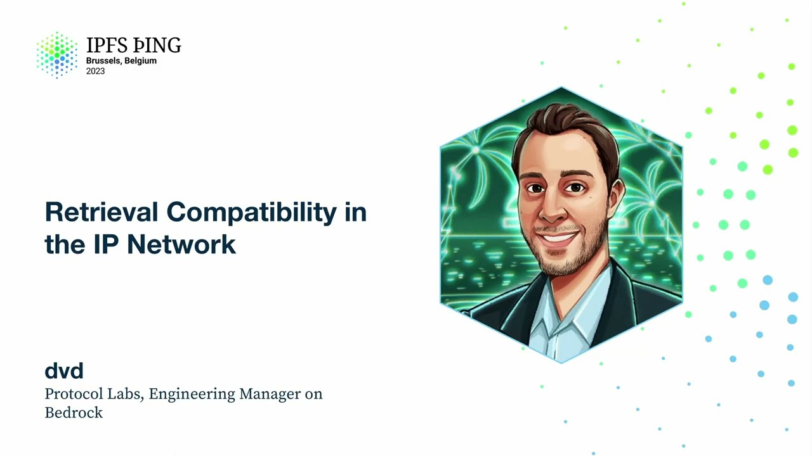

# Retrieval Compatibility in the IP Network - dvd

<https://youtube.com/watch?v=H0jw3jEjBMM>

## Content

All right, so, yes, my name is David Drogansky, I'm an engineering manager on the Bedrock

team at Protocol Labs, and today we're going to talk about retrieval compatibility in the
interplanetary network. Now, that's a bit of a mouthful, and so we're definitely going
to go through some terminology to find some of those terms, talk about why compatibility is important, and also some of the work the Bedrock team has done to improve that compatibility,
and at the end we'll do a recap, look at where we're at and what's coming next. And if there's
one thing to take away from this talk, it's that to realize the benefits of compatibility,
and I'll be trying to put in highlights throughout the slides of where we get some of those benefits that we've seen so far, even though it may be challenging. So, with that, let's dive
in. So what is the interplanetary network? Well, it's really comprised of IPFS and Filecoin.

Now, I think this was mentioned in one of the earlier talks, IPFS principles, that really

helps explain how Filecoin and IPFS are part of the same network. But they are still different.

And so, as most of you know, IPFS, pure peer-to-peer system, decentralized by nature, Filecoin,

built on top of blockchain technology, which gives it some of that persistence layer of

IPFS in terms of guaranteeing the data that you're storing on Filecoin is retrievable and is actually being stored. And IPFS tends to focus more on what I would call hotter
storage, hotter data, where you're accessing it more for applications. All of these each

have their own implementations of clients and node software, Kubo being the most popular one on IPFS, Lotus being the most popular node software on Filecoin. Now, Bedrock, as

a team, just to give you some context, we're kind of at this unique vantage point where we sit at the intersection of Filecoin and IPFS. And we try to make data storage, data

discovery, and data retrieval as performant and reliable as possible. And, in other words,
making the network that much more interoperable. And we think this is important because it makes it easier to build on the network as well as use the network.

So in that set of words that I mentioned, retrieval is the place we want to start. And
I'll get into the why in a second, but first let's define what I mean by retrieval compatibility. And I'm just going to read it from the slide. It means data clients and providers are agnostic to the underlying platforms and protocols so they can seamlessly send and receive data.
And this really boils down to two things. Data providers can send data to Filecoin or
IPFS nodes, and data clients can retrieve data from Filecoin or IPFS and the IPFS network.

Sounds simple, but it's a little challenging. Now, why is that important? We really believe
that retrievability closes the loop on the golden path of the Filecoin and IPFS user

experience where one half of the experience is storing data, the other half is getting that data back. And by getting that data, that is the best proxy we have for people
using the network. So the easier we can make retrieval, the easier it will be for people

to use the network and in turn grow the network. And we think that will create a lot of value
in the network. And again, we'll see as we increase compatibility how that takes place.

All right. Make sense so far? So Bedrock, again, this unique vantage point where maybe

the IPFS team is focused on making Kubo that much better, the Lotus team is making Lotus

that much better, we take a look at how can we improve the interoperability, and you quickly go down all the way to the stack, down to the data transfer protocol layer, which is, hey, BidSwap, primarily only used in IPFS, GraphSync primarily only used in Filecoin,

they do not talk to each other, how do we make this work? Okay? So I'm going to walk you down this journey that we've had on the Bedrock team to get
to some of this compatibility. And remember, we need to solve it for providers and we need to solve it for clients. But before we do that, I want everyone to close their eyes
and I'm going to send you guys a CID. It's BAFY834267. Okay. Open your eyes. How are

you going to get that information? Show of hands. Or just throw out a bunch of answers of like, what would you use to get that data? The gateway. Wonderful choice. Anything else?

Lassie. Lassie, okay. That is true. Yeah, Lassie's good. But what I'm trying to get at is that for a long time, it's actually pretty challenging.

What if the gateway is down? What if the DHT doesn't have that provider record? What if

you are not the one who made the Filecoin storage deal and you're trying to get that data back? Where do you even begin to look? Do you have to crawl the whole chain? That seems pretty cumbersome and slow. And so what the Bedrock team has done, the

IPNI team specifically has built an index for all that information. And we call it the Interplanetary Network Indexer. If you're interested in this topic, by the way, there's going to be a whole content routing talk. I encourage you to attend tomorrow. But the
IPNI does one very simple thing, which is a publisher can post content and the metadata

around that content as to who is providing that data so that at the end, an end user

can look up that CID to know where it is. Or I should say, who has that data and how
to get it. What protocols are supported by that provider to get that data.
Now this is pretty cool because now I know who's actually storing my data and how to get it. And in terms of the benefit to the network that we've seen so far, it's already
helped a bunch of aggregators on the network like Web3.storage as well as Estuary to be
able to scale and serve content to their end users because these aggregators tend to use a combination of IPFS and Filecoin as backup. And to be able to track where that content
is, they use IPNI to do that. Okay. So, okay. Now we know how to find where

the data is. Now we can get onto the meat and potatoes. Let's build a provider that
supports multiple, that speaks BitSwap and speaks GraphSync. So the Boost team on Bedrock

has built Boost, which is a storage provider piece of software that Filecoin storage providers
run that takes care of the storage deal-making marketplace in Filecoin. And what that means
is it boils down to storage providers can, sorry, Boost can make storage deals and also

make retrieval deals of the same, of the data within those storage deals. Now previously Lotus and Boost only supported GraphSync, but over the last few months the

Boost team has released Booster BitSwap, an extension that allows them to serve the same
content on Filecoin via BitSwap as a provider. Now this is really exciting. This is for the

first time ever an IPFS node can directly get Filecoin content from a storage provider

directly. And this is a big deal, not just because of that compatibility, but because
now all of the IPFS nodes in the world now have access to all of this amazing content that's on Filecoin that is now readily available by looking it up through IPNI and then going
to that storage provider and getting that access. So it unlocks this new set of data that's available for all the users of the IPFS network. Pretty cool. All right, so then the final step is the multi-protocol client. Now we've

all heard a lot about LASI already. Hannah gave I think three talks on it already so
far today. It's really awesome. I'm not going to go into as much detail, but what does LASI
really do? It abstracts away what protocol you're using to get that data from Filecoin
or IPFS. And this is awesome because as we've also talked about, we've been using it in

this Project Raya, the IPFS gateway, excuse me, that is retrieving content from Filecoin

and IPFS when it has a cache miss. And it's all using LASI under the hood, which again

unlocks more value for maybe you don't run an IPFS node, but you are a web user that

uses IPFS.io. Now you also have access to all this content on Filecoin as well.

I do want to dive into just one thing about LASI that I think often gets overlooked beyond

all the coolness that we've already seen with the demos, is that, okay, even if you didn't have LASI, but you had IPNI and Booster BitSwap, in order to actually get an arbitrary CID

and get the data back, you'd have to jump through some complex logic and probably use
three or four different pieces of software to actually retrieve any type of CID that comes across your path. And what LASI does in a really great way is abstracts that all
away, compresses it to one simple command, fetch, and it'll just get you that CID. And
this is powerful because you as a developer on the network, you don't have to worry about

something that should be simple. How do I get my data? You can just tell LASI to go do it. You don't have to worry about it. You can build your application and logic on top. So it really takes away a lot of the developer pain and duplication of effort that used to

occur. And so that is the superpower of LASI, in my opinion.

All right. So where are we now? So I've taken you through this whole journey, and now let's

see how we did. So we're a little bit closer. We're not fully there yet, but now we have

some adapters, some different pieces of software that can talk to each other across both of these protocols, which is pretty cool. And specifically, we've achieved what I've defined

as retrieval compatibility. You can see this awesome diagram that shows how this whole network works well together, talking to the IP and I to find out what boost storage provider to talk to. IPFS nodes can talk to each other and find content. LASI can get content from everywhere. Really exciting. Everything is interconnected. This is amazing.

It's all... But it's still early, though. So even though these pieces of software exist,

they're not fully adopted yet. So to keep us honest, I wanted to share some of the numbers
that we've seen from traction, all the metrics that we've been collecting. So for example,
LASI is a critical piece of the Rayya project or the Saturn gateway that we've been talking about. It's serving over 150 million retrievals per week, as mentioned previously. Again,

there's a whole HTTP gateway discussion or track on Monday, so I encourage you all to
attend that if you want to learn more. And about 40% of storage providers are running
boost. And 60% of IPFS nodes are using the IP and I content routing system as a default.

As of version 0.18 for Kubo, they run IP and I by default.
And in terms of content coverage, IP and I does a pretty good job. So with that level

of penetration on the storage provider market, we're seeing 45% of deal coverage, which is pretty good. And from all of the query traffic that we see from Rayya, we usually can resolve
96% of the queries that are incoming. Now, we obviously want to get all these numbers

to 100%, but it's a pretty good start. Okay. So let's review what we set out to do

in the beginning, which is retrieval compatibility. So can data providers send data to Filecoin
or IPFS nodes? Yes. Boost gives us that capability. Do we have data clients that can retrieve
data from Filecoin and IPFS? Yes. LASI solves that problem for us.

But in terms of making the network more interoperable, has it been easier to build on the network?
Well, we think it has because we've used LASI to really accelerate the efforts of Project
Rayya, and that alone has helped make a lot of progress in that Saturn CDN network. And

is it easier to use the network? Well, I think there's two cases here. One, with LASI, you

can actually use the CLI command and just do LASI fetch, as people said, to look up content. So that's really awesome. And then the second is IPFS nodes now have access to a lot much more data, specifically the Filecoin content. And so that makes the network easier
to use for all your data needs in the long run. So checkmark there as well.

So are we done? No. So this is only scratching the surface. There's way more different areas

that we could be adding compatibility. But these are some of the things that we're looking
at in the next few months and quarters. So for one, we want to continue to push on the adoption curve for Boost, LASI, and IPNI. Part of that starts with increasing awareness,
like talks at conferences like these, as well as blog posts. I believe the LASI blog post
went live yesterday. And we have plenty of blog posts across all those different teams

that I mentioned. So please check them out. And so that we can get feedback to to make the product better. Now, another way to increase adoption is to really focus on performance and reliability. We've seen that as these pieces of software

become critical parts of the network in terms of infrastructure, they have to perform at
a really high level in order for people to continue to use it. So the more we can make

LASI faster or make Boost faster, and the more reliable it is, the easier it is to attract
more people to use Filecoin and IPFS. But it doesn't stop on just performance. We

also want to extend the capabilities of Boost and LASI, make it more compatible with more
protocols. There's a lot of really awesome protocols that we talked about today, like BAU and CarMirror and stuff like that. But our team is really focused on HTTP at the

moment because we think that unlocks a whole other set of developers, primarily like your

typical web developer, that can now use the tools that they know and love on HTTP and

the web and apply that to their IPFS or Filecoin projects. So we think this will really accelerate
user adoption as well as enable new use cases like enterprise retrieval that, let's face
it, they're not using Web3 right now. So if we can do an HTTP plugin within LASI and they
don't have to change anything underlying, it just works, we think that's going to be super powerful. All right. So that's the end of my talk. I want to say that a lot of this

work, I want to give a round of applause to the Bedrock team because this is a lot of work over the last couple of quarters. So great job on the team. Thank you. And I've included the GitHub links to all those major projects and the Notion

page for the team. If you're curious about learning more or want to learn more, don't hesitate to reach out to me or anyone else on the Bedrock team. We're going to be here for the entire conference and then some. And yeah, open to any questions either on Slack

or in person or right now. So what work remains on the HTTP side that
is yet to be done or is it just about increasing the awareness of the work that has already been done? Yeah. Great question. So Booster HTTP exists.
Basically what Booster HTTP, well, actually this is slightly outdated. So Booster HTTP

traditionally was just doing full piece CID lookups. So you get a full piece back. It
wasn't the full trustless gateway API spec that has been discussed previously. So I believe

Booster HTTP recently pushed that compatibility, but now we have to do the work of actually

integrating it with Lassie and through the IP and I as well. So it's a protocol that

is basically a first class citizen just like BitSwap and GraphSync. So there's some more work there. Yeah. So that's one of our top projects that we really want to get out this quarter. And then as a plug, I believe the Booster HTTP folks are going to show off that

demo at either the show Intel or unconference. Yes. So check that out too, because that will

be super cool. I think there's a really cool demo where you can see all the files you're storing on Filecoin and it's like a website where you can like see the files in and of
themselves served by Boosters. Are there any plans to get some functionality
of Lassie as a library that you can use from, that we see bindings basically that you can
use from maybe from Rust or from Python or basically the lowest level that you can have

a Lassie.so that you can just use? Or is that not possible due to Golang?
I mean, everything's possible, but no Lassie right now is written primarily in Go. I think

we as Hannah described earlier, it is a library, a Go library that any Go application can use,

but we have limited resources. So we had to focus on Go primarily. I think if there's a big use case for C, like maybe, but I don't know if Hannah, you have thoughts on that.
So the current recommendation is that if you want to use another language with Lassie,
use it through the HTTP server, which, and just run it as a process on your machine, which is not the fastest by far. There's various other optimizations. Some people are like,
well, we'll ship gRPC. I mean, we could do an FFI thing. We could rewrite in Rust. I'm
sure somebody at Vision would give us a cookie if we did that. But that's the state of the

affairs. We'll see where things go. Yeah.

