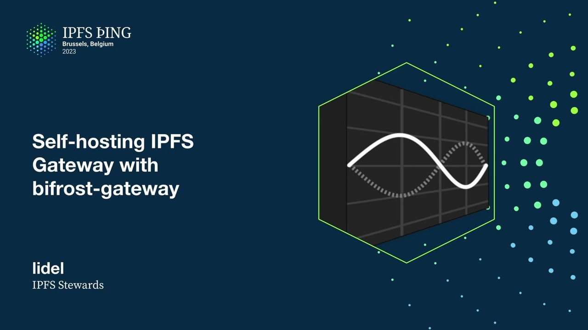

# Self-hosting IPFS Gateway with bifrost-gateway - lidel

<https://youtube.com/watch?v=xhJPz_efAQE>

## Content

Hi, I'm Lajdo, I'm part of IPFS stewards group at Protocol Labs. This talk will be different,

we've been talking about Project RIA and big gateways, I'll be talking about taking tools

and specs and libraries we've built, continue building for the Project RIA and using that
for self-hosting. So I started this talk with one slide and I was like thinking, could I

just stop here and then talk for 30 minutes and then I realized there's no point in showing

people, I mean if you don't have time, that's the gist of the talk, but then you don't understand

how important self-hosting is without some historical context. So majority of this talk
will be talking about what gateways are, what types of gateway we have, what types of gateway

functionalities exist on IPFS-IO and dweb.link gateways, those are public gateways provided
by Protocol Labs, and then what's the future of that specific infrastructure, what type
of services we are building to enable that, and then we'll zoom in to the Bifrost gateway,

which is the first element of those services, and at the end, with that knowledge, we'll

quickly go over how to do self-hosting and there will be a fake demo which will work.

What IPFS is, that's a question we don't want to answer and the lowest common denominator

that we all agreed on was that, oh yeah, we work with CIDs and we use them for operations

like retrieval in the case of gateways, and to say this is like IPFS implementation, you

need to actually verify the data you are making operations with is matching the CID. So what

gateway is, it's IPFS implementation itself, it works with CIDs, it verifies them and then

returns some sort of a representation to the client, and the client itself could be still

doing IPFS if it's using trustless gateways and verifying hashes, or it does just regular

HTTP, it no longer does IPFS, it's working with data that was loaded through IPFS, but

then it delegates trust to the gateway. And just maybe like other framing is that the

difference between trustless and trusted responses. If I want to load a cat picture from some

sub-directory under some CID route, if I'm using trusted responses in the browser, I

want the thing to render, I'm delegating trust to the gateway, I ask gateway for that path

and I get the bytes, they most likely are the cat, but the gateway could lie and return
something else. The trustless response is that I get all the blocks for entire path,

not only for all the blocks, entire DAG for the cat, but I also get blocks for the parent
directory and the top level CID, and we need all the blocks because I don't know what the CID of the directory or a cat, I need to learn that from the parent and I only have the top

level parent CID. So with that in mind, like the trusted responses are extremely important

because that's how the most prolific runtime on the planet works in web browsers. And there's

nothing wrong with using trusted responses as long as you trust the gateway. And like

depends on the person, I personally only trust the gateway that I run on my own machine on the local host. And you can see this is a Wikipedia mirror loaded from my local machine.

And it's renders in the browser, it's like the verification happened still on my machine,
but it's returned the serialized data to the browser and browser rendered that. And that's
how Brave works with a bit better UX. And now, a year after the last IPFS thing, we

no longer, we not only have just the serialized files, we also can request the serialized

arbitrary IPD data model objects as like JSON or like CBOR. You can also like fetch arbitrary

directory trees of UnixFS as a tar stream that was recently, that recently shipped.

And what changed since last IPFS thing when I talked about gateways is the trustless verifiable responses are now possible end to end. We not only have them, we had them for blocks and

cars, but now since Kubo 19, it's possible also to request a sign IPNS record from the

gateway and verify it on the client. And that gives us, if you are using IPNS records with
cryptographic identifiers, you get end to end verifiability across both immutable and immutable namespace as long as you don't use DNS link. Okay, so with that in mind, how

gateways on IPFS.io and dweb.link work today. It's Kubo based. So this is a very simplified

way of looking at the gateway at IPFS.io. Both IPFS.io and dweb.link are hosted on the

same infrastructure. The difference is the host header. So you can see at the very bottom of the left side, the subdomain on dweb.link, the only difference is that the request have
CID in the host header. The gateways are very powerful and they support multiple requests

and response types. Some are trusted, some are trustless, some are more or less expensive.

But at the end of the day, the request goes to our load balancers and DLS termination

and there's a get request for a specific content path. And all that goes to the Kubo, Kubo's

multiple Kubo instances and then Kubo either has the data in the local block store or it
will reach out to the IPFS swarm to retrieve that data. And that's a lot of work and it's

also a lot of challenges when it comes to scaling, adjusting costs. By the fact that

both HTTP, purely HTTP interface is on the left side, we attempted to use HTTP scaling

tools and best practices for scaling Kubo. At the same time, on the right side, we have peer-to-peer protocols which are not HTTP, mainly BitSwap. Majority of IPFS peers use

BitSwap and that poses challenges around scaling and trading costs. So often you have provider,

you are able to like deploy and optimize costs around HTTP as long as you don't use other
protocols. Here we are joined at the hip and we may have a good opportunity to reduce costs

around HTTP, but at the same time, we don't really control how much cost will be eaten by BitSwap. Often those two services could be potentially scaled to be like less expensive

even if we had like two services instead of one. So that's the direction we are moving

into towards compassible services. So Project RIA is an example of that and we are using

that as an opportunity to split Kubo into those separate services. So you can see in

the place where we had Kubo and the swarm, now we have Bifrost Gateway, which the rest
of the stock will be about, and then the Bifrost Gateway on both ends speaks HTTP. So that's

a very important takeaway from this talk is that the only thing you need to worry when
it comes to Bifrost Gateway is how to manage HTTP service, how to scale it. And there's

like a lot of people with expertise around that, a lot of services, very cost effective services for optimizing caching on both ends. You can put a load balancer, HTTP cache solutions

on both ends because you may be optimizing for content path caching or you may also be

caching or you may also want to leverage frequency of request for popular blocks. And then the

blocks are fetched from some trustless gateway, in this case it's Saturn, and then content

routing responsibilities, the data transfer are on the right side. And like the Project

CREA is still a work in progress, and in general the idea is that the data will slowly trickle
down towards the Bifrost Gateway. And we are still trying to understand what's happening

there, but in general we are trying to avoid cycles like that. But maybe just to zoom in

into the right side of the thing, you can see at the top there's a Kubo which did all
the things, and on the bottom we got Bifrost Gateway which takes over some responsibilities

while other responsibilities are moved down to the right. So for example, the request

for the HTTP content path is still handled by the service. It's actually using the same

code as Kubo because we extracted the gateway code into box.so.slash gateway library. So

the risk of divergence is very low because we have multiple compliance test suite, we are growing that. There's a talk later today I believe, or later, yeah, by Piotr about
gateway compliance test suite. Both Kubo and Bifrost Gateway run the same tests. And the

DAD and DAG verification and the serial, optional deserialization also happens on Bifrost Gateway.
But then the data transfer responsibilities, this like the biggest, the fattest arrow, now is moved to the trustless gateway, which in Project Rhea is Saturn CDN, but as you will see later in this talk, it could be something else. And content routing is pushed even further

beyond even that trustless gateway, because you may have like a multiple points of, you

may want to scale all those boxes here are just like a single box, but in reality, those
are like multiple machines and they may require different strategies for scaling. So running

the same, like running content routing for the same, the most popular CID over and over

again, traversing DHT, in the case when you effectively have a single gateway product

like IPFSIO, it's not very cost effective. And by introducing a caching layer in form
of IPNI in front of DHT and sharing that across all the trustless gateway instances, we do

that resolution only once and then subsequent requests don't need to wait for DHT results.

So we have additional, we have essentially like layers of proxy in front of the thing

that we had in the past. The trustless gateway takes care of retrieval and provides caching
for that. And IPNI, I would argue, provides the similar type of caching, but for content

routing results. And the difference here is also now we can use the best block DAG transfer

protocol for retrieving data from peers. Those could be Kubernetes nodes, but it could be
also like elastic IPFS. It could be something else, could be IRO with the new novel transfer
protocol. The backend, which is no longer part of Bypass Gateway can take care of retrieval.

And finally, going back to the Bypass Gateway itself. So we are like zooming into the very

first block on this infrastructure. The Bypass Gateway as a project has, we made certain

design decisions and identified responsibilities, which responsibilities should be local and

which ones should be delegated. So namely the main design decision was to not have peer-to-peer

stack, which may be controversial, but at the same time, you can still have that peer-to-peer stack. You just run it as a separate service, which you can scale independently. So what's

local? Essentially, HTTP daemon provides HTTP services. It's responsible for verifying that

blocks the data that it processes matches CID. And effectively, the only API that we

are committed to supporting in this project are the official HTTP gateway specs. And we

use that using the reference implementation in Boxer Gateway library. And to do that,

we also support mutable namespaces for DNS link and IPNS. For that, we reuse names from

Boxer as well. And we have a minimal set of IPLD for the most popular types of data in

the wild. And probably we'll evolve that approach, but for now, that's UnixFS. Some web things

which I'll describe later, and some Duxy support. And then content routing, we have IPIP and

there are other IPIPs to delegate even more content routing needs. It's delegated to the
routing V1 API, which is provided by IPNI. And the data transfer storage, that's provided

by some trustless gateway spec. In project, we have that starter. So I tried to draw the

boxes that are inside of Bifrost Gateway. And then I realized probably in a month or

two, those boxes will be different. We'll probably rename them and the stock will be
useless. So maybe I created a responsibility map, which is not the architectural design.

It's more about things that Bifrost Gateway has to do, to do its job. So you can see the

biggest one, probably the most complexity is around resolving content paths. Because
we have a request for a specific file on some path and we need to know how to traverse that.
If it's mutable, we need resolving through names. If it's DNS link, maybe it's DNS. If

it's, is it a single block or is it a directory? Going through XFS or maybe going through IPLD

data model. That, you would think that's the end, but no. When it comes to the gateway,

we also have things around web. And those things are, if I open a directory, it's not

a file, the gateway needs to generate, if it's a request comes from a browser, it needs to generate HTML directory listing. If there is a special CID or maybe DNS link name in
the host header, I also need to normalize that and update the content path. If I request a directory and there's index HTML, I return index HTML because that's how most of websites
work. If there's HTTP range request, I don't want to fetch entire Wikipedia archive, which

is 80 gigabytes. I want a specific sliver of that. And finally, like how do I handle
things like redirects? So all those things are provided by Boxo library, but I mentioned
it here because a majority of the work happened here. It lives in a Boxo gateway, but it was

part of this project to extract it and make it generic enough. And then this purple thing

on the right bottom, it's effectively the interface that the Boxo gateway requires a
Bifrost gateway to implement. And we have two implementations. The default is the block backend,
which will fetch things block by block. But we are working on graph backend, which will

reduce the number of round trips. The greenish branches are how we handle storage. There's

no physical storage in Bifrost gateway. We have in-memory ephemeral cache. And then we

have exchange backend, which is responsible for fetching blocks or bugs of blocks, either
using a single HTTP request for specific single gateway. Or in case of Saturn, we have Caboose,

which I believe the talk is right after mine. So you will hear more about that. So Caboose

is what we use for graph backend experimentation in Project Saturn. But for now, if you run

the default settings, that will be block backend with plain HTTP fetch. And finally, a lot

of work went into adding instrumentation around metrics and telemetry. And I have slides about

that later. So maybe like going from this, if you want to have what's the most important

part of this? I think the most important part is that the Bifrost gateway, if you want to like summarize it in one sentence, it's like a verifier service of an untrusted remote

block store. Everything else is like implementation detail. You may not want to use the serialized

responses and you may want to request block by block, or maybe you want to request a car stream and you only have a block store which supports block by block, and you don't want

to pay the verification cost on the client. The Bifrost gateway will act as a verifier
for you. And finally, that's where we get to the self-hosting. The self-hosting today,

I think this is the first slide, right? We provide the Docker images for Intel architecture

and ARM, so you can run it on the Raspberry Pi. There are tags for releases, and there

are also like developer builds for every stable commit in the main branch. And I suggest using the main latest for now, because it's a very early preview of this project. How the project

looks like? You run Bifrost gateway and you configure it by passing environment variables.

The only one that you actually need to pass is the URL of the block store. In this case,

I'm using something untrusted. Bifrost gateway will start, and it will expose the block store

etrusted endpoint, which will return you a verified responses. All the response types that currently are supported on IPSIO, those response types are supported here as well. And you've got some test links that you can click to verify it works as expected.

Yeah, so there's a demo which I totally pre-recorded using Screenshot Tool.

So I run the latest Bifrost gateway build against IPFS.io because IPFS.io supports trustless

responses. And I click the very first smoke test link for a single JPEG.

And that's a good test because it's a small file, so it's a single block.
There are no paths. So I effectively should... It should translate to a request for a single block. And that's what you see on the last line. The request to the local gateway got translated to a row block request to the gateway, remote gateway. The hash was verified. And then the response, the serverless response was returned and loaded in my browser.

Yeah, so it's local verifier of remote untrusted gateway.
And it goes beyond immutable identifiers because one of the...

The second example is a Wikipedia mirror, which is a very good test case. It has both DNS link, immutable pointer. It also has a very huge directory, which has 20 million of files. And there's an index HTML inside. So if you did not implement things correctly, it will not load immediately, right?

So it takes care of resolution. It takes care of verification. And then it takes care of deserialization. And at the end, you end up with a gateway on your local host machine.
And finally, for people who want to start thinking about running this, it's very, very

easy. For self-hosting, you have a very small set of things that you want to adjust.

Aside from the endpoint URL, you may want to adjust the size of the in-memory block cache. You may experiment with the graph backend. But right now, it's not supported on the public gateways yet.
And we are still writing the specification for it. So I think self-hosting and sections related to testing, tracing, and self-diagnostics

are the most important ones. If you are interested in Saturn CDN, and there will be a talk about Caboose after this one,

there's built-in support for Caboose. And you can opt in by using Saturn orchestrator URL instead of proxy.

And that will switch the backend into the Caboose.
So how to think about self-hosting? Well, one way of thinking this is if you already run Kubo in your gateway infrastructure, you
probably want to split Kubo and keep Kubo.
You essentially add the Bifrost gateway in front of Kubo. Kubo no longer provides the gateway functionality. It provides a trustless block store.
And you scale Bifrost gateway in front of Kubo. You can introduce caching layer in between them. And I think it's a nice property being able to slowly migrate your infrastructure from

this old Kubo-only setup into the new one.
Maybe you introduce Bifrost gateway as the first service, and then you can benchmark it against other things. You could introduce some LASI nodes, and then you compare, do A-B testing against Kubo versus

LASI without risking your traffic. You could do that with mirror traffic. That's what we are doing internally for the project RIA. And finally, when you do that, you will appreciate how much work went into IPFS Box or SDK.

The Box or gateway library has not only pretty good logging on different levels.

If you enable debug, as I did in my screen-shotted demo, you will see what happens for every

requested path, how it was translated to what request to the backend.
But then if you work at the scale, that's not enough. And you may look into tracing. So when you start Bifrost gateway, you get a Prometheus metrics exposed, and you can

build visualization. This is an example of Grafana board built and showing performance of some internals
from Box or gateway library. So actually, the same metrics in Kubo and in Bifrost gateway enable you to use the same

boards and monitoring tools to compare A-B performance in between them.
But then metrics are not always showing the full picture. Sometimes you see the problem, and then you want to zoom in into problems around a specific
request. And that's where tracing, and specifically trace context support comes handy.

So in the main branch of the project, we already support, I believe, trace parent header.

If you pass the trace ID with the request, we will enable tracing of that request, and

we also forward that header to all the backend services that are used.

So if we had to resolve IPNs record, your indexer will get information about that.

If you did not have that block cached and you had to fetch it from the remote block

store, be that Kubo, Lassie, Saturn, that HTTP endpoint will get a request with this

identifier, and that lets you trace the request across services. And that has to start on the incoming place where you essentially enable tracing for that

request. And then there are multiple exporters supported by Box or Gateway Library.

If you go to Box repository, there's a docs tracing document with details.

Probably the most useful one is Jaeger UI, which you can run locally.
And then in the top right, you can see I pasted the trace ID from here, and then I see how

long each stage of processing the request took. The one with red thing is when I made the request to remote system.
When I was making the screenshot, it did not give me visibility into that, but with this
tooling, you will be able to trace it across systems and see how long local versus delegated

tasks took. So I'll be wrapping up because I feel I'm running out of time, but finally, the self-hosting

aspect I wanted to convey with this talk is not about migrating your existing infrastructure.
It's more about leveraging the same tools for personal use.
And I would argue that the Bifrost Gateway could act as a user agent, not replacing Kubo,

but filling the niche where Kubo could not be run. Namely, there's a huge amount of users that were complaining that they would love to use
IPFS, but they are not able to use it on laptop. They are not able to use it on mobile or IoT because running peer-to-peer all the time is too expensive, and there was no linear alternative. And at the same time, they really want to have the integrity guarantee that come with content addressing. Then there are aspects of privacy and resiliency. When it's only HTTP, you can leverage all the tooling that provide more privacy and

resiliency around that. You could be using... There could be remote trustless gateway, something that just exposes a single block request for

a specific CID, nothing more, and you could be using that over Tor. Sure, someone can shut down DNS in your country, someone can tweak with BGP rules, but in many

cases you will still be able to browse resources that are on IPFS. Sure, they will be slower, but it will work. And finally, in cases where, like education or libraries, there's a bunch of light terminals

which were not able to run full-fledged node, and now in those cases you could have one

of the oldest Raspberry Pis, not the current ones which are pretty beefy, but the very old ones, you could still be running something lean like Bifrost gateway and have verification

on the same machine where the user agency should happen at the edge.
And have only reduced cost for your classroom or library by having a single, maybe single

cache for entire organization. Finally, some caveats, works in progress and future plans. It's an early preview. We are still working on performance. There are still many hard-coded configuration options. If there's something you would like to tweak, let us know, fill an issue. It's block by block by default. We have a small cache in memory. You can increase it, but we keep it default small so people can run it on low-powered
hardware. We are working on experimental car-based graph backend, and that's it. That's all I will say. It will save round trips. You will no longer, you will fetch multiple blocks at the same time, but there will be
an IPIP in IPFS specs repo about that after we are happy with the results.

Currently, if you want to use a pool of gateways, you need to use caboose, but we hope after

project 3 we will be able to uplift a bunch of generic code to the by-force gateway itself,

so you will be able to pass a pool and not have to introduce load balancer right after
it to route to multiple gateways. Currently, IPNS support, being able to verify signature of IPNS on the by-force gateway
itself requires kubar-pc. I mention it here just so people are not surprised, but there's IPIP to add IPNS resolution support
to routing v1 which will be provided by IPNI shortly.
And finally, many people who want to run something like public gateway or maybe gateway only for their own use want to have, like having the ability to accept or deny some specific

CADs or path, it's a very popular feature, and there is IPIP that we want to support

in both kubo, probably it will be supported in the box or library level.

That's it. I don't know how I look like with time, but if there are any questions, I'm happy to answer.

Awesome.

This is looking really great. Who do you see, you gave a couple examples, often when I hear the phrase self-hosting,

I also think of like one-click deployment. I tried to get it running on my phone just now and deploy it and it failed. I will file an issue. But do you have any thoughts on what hosts you might want to target to have people easily
run this in the cloud? It's a very good question. I think like it's very early. So our current focus is to give people, to not spend too much time on reaching a lot

of users, but get the biggest bang for our buck from the way we are providing by first

gateway to users, and that would be Docker. I think at the end of the day, a bunch of cloud services, we will see something similar.

In the past, we had Azure one-click deployments for Kubo clusters, for IPFS clusters.

I think there's also like IPFS Kubernetes, which was built with Kubo nodes and cluster.
I think we will see by first gateway trickling down to those places and people using it as

a component. But I think like the focus of this project will be to provide a single binary with a very strict set of responsibilities, and then if we are very strict about what this project
does and have HTTP on both ends, that makes it very easy to integrate with existing infrastructures.

Awesome. Thank you.

