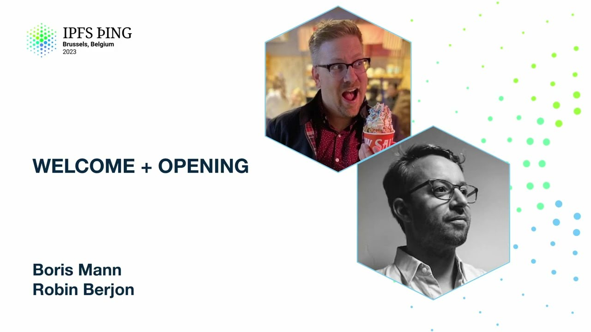

# Welcome & Opening, Community & Governance - Boris Mann, Robin Berjon

<https://youtube.com/watch?v=U2qvvQxIdws>

## Content

Welcome to the Boris and Robin Community and Governance show. We have a ton of short sessions

throughout the day. We're getting kicked off with this in to collect and share a bunch

of other things that fit into this incredibly broad topic of community and governance. It's

super awesome that we have a bunch of natural formation and interest in this area and want
to see more gathering around it and make it very clear that everything from this event
to the operations of the wider IPFS and Filecoin cinematic universe is up to all of us and

figuring out how to recruit more people to work on these topics.
We just finished these slides, so each one of them will be a bit of a surprise to us as well. But thankfully we made it look professional by color coordinating in the morning, so I hope you appreciate that touch at the very

least. So this is our schedule for the day. This is the opening discussion that you're in. At 10.50 Enrique will talk about interplanetary

specs, Lidl about specs repo and IPIPs. At 11.30 Bastien will talk about star maps. 11.50

Cade memory and uncertainty, IPFS and digital preservation in the multi-crisis present.

Is that a long way of saying we're fucked? With better words.

Yes, exactly. In the afternoon after lunch we're back in here again for some short talks. Open source governance, funding, etc. and the schedule

says bore us to figure out. It's 15 minutes. What I want to talk about there is actually just where are we at in this concept of open source, how do we do the funding and then like the etc. is actually where all the important stuff hides. So come to my talk. So you have figured it out. Yeah, totally. Robin is going to give an update on the decentralized data compliance working

group. Don't you love to have all these words together?
Exactly, yes, exactly. Uni wants to make it very clear that IPFS comp is coming. It's

in November which is basically tomorrow in event planning world. So if we want to work
on it, we got to start basically working on it now and almost like a kick off for participation in that. And after that we'll round out the day also guided by Uni which is basically

how do we spread the love of IPFS worldwide, what's our ground game and more events and

really decentralizing the way that we do events for having people participate in between larger

events like this one.
