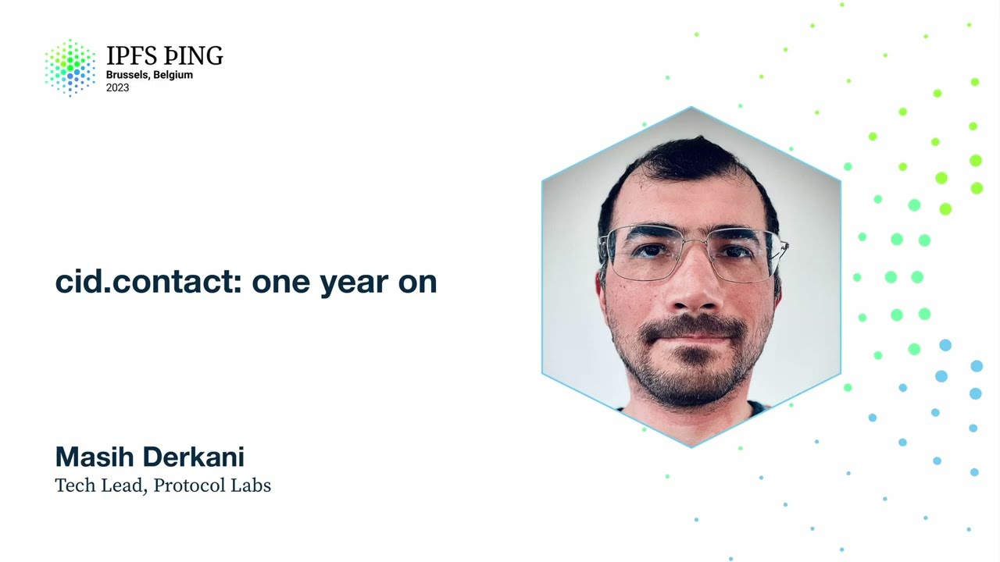

# cid.contact: one year on - Masih Derkani

<https://youtube.com/watch?v=CPlOdNqJ8og>

## Content

CID.contact really is a cluster of IP and I nodes. Is it really? Ah, it has fangs. This

thing is built to handle heavy load. It is the largest, most complete IP and I instance,

if you like, both in terms of the features, states to the latest, as well as the amount
of data that it has. But success for me is that it shouldn't be for long, hopefully.

A quick timeline of CID.contact. Started life in April last year. Was the only running IP

and I service. We got it integrated into Lotus 1.15. Since then, Lotus nodes have been native

IP and I providers. In August last year, at the previous IPFS thing, we talked about how

it's been growing. We had over 8 billion SIDs ingested by CID.contact. Entire NFT data storage

data was indexed by CID.contact. There's a talk on this that I highly recommend looking
up on a previous IPFS thing. And we had about 20% of Filecoin deals being indexed. Fast

forward October last year, IPFS camp. We had just about 800 billion SIDs ingested. Too

many zeros for my small brain. About 7 billion CIDs per week being ingested. This is more,

almost the same amount as what we totally had in August. And this is per week. We have
six partners running indexing instances. So CID.contact is not the only one. There's actually
six more out there. If you go to CID.contact, you can see the list. Collab clusters fully
indexed thanks to great work that was done by Ivan. And we had Hydra boosters hooked
up to CID.contact. This was when Kubo did not have default to CID.contact. So the way

by which content was being looked up on behalf of the clients was they have a high probability

of hitting one of the Hydra boosts in the DHT, and then Hydra boosters would do the
nice thing of also looking up content for them at CID.contact. So that was all done.

By December last year, we passed the threshold we've been striving for. 1 trillion CIDs.

That's 10 to 12. We made significant changes in the back end. We moved to a more performant

value store that was fitting the use case of network indexers called Pebble. This is

the data store that's used in CockroachDB. We had over 50% reduction in the running cost

of CID.contact. We are pretty proud of that, considering the rate of growth never slowed

down. So we are doing even more, but at half the cost. And in December 2022, the uptime

was 100% for the first time. For the first quarter, we had 100% uptime, which is amazing.

And this is credit to the work that the team's been doing in terms of stabilizing things and turning this really from an implementation into a IPNI itself, from an implementation

into a protocol and a stablished instance of a data set. Today, we have 1.3 trillion

CIDs, about 300 billion more. We have a lookup traffic of 250,000 requests per minute. This

actually reduced significantly over the last six months or so. We'll go into that, but

it was about four to five times that before. Again, this last quarter, we hit another 100%

uptime. Not going to jinx it, but really great to see. 46% of Filecoin deals are now covered

by CID.contact, so you've got the probability of 46% probability of finding your data that

you stored on Filecoin. And just to give you a little window, this number is actually a

lot better than you think it is, because we believe that we have over 96% of new deals

being indexed in IPNI. And that is a much more interesting number, because there's a

lot of historical deals and so on in Filecoin that never gets touched. So the probability
that you should really be taking away from this slide is 96%, and the chances are 96%

you can find your data if you have made a deal in Filecoin recently. CID.contact is
now the built-in default, one of the default delegated routing endpoints since KUBO 118

that was shipped in January. Thanks to the huge undertaking by both the IPNI team and

the IP stewards, it took a lot of doing. So honestly, fantastic to see this happening.

Brings the clients closer to the benefits of the sort of thing we're building, and this is just the beginning. We haven't even started scratching the surface. We're going to talk about the provider side too. CID.contact is also the default LASI content router. This

is how LASI separates the concern of the content discovery from content delivery. We have now

cascading rolled out into CID.contact, so you can try out the protocols that I bored
you with earlier on CID.contact, actually see it in action. And we have streaming rolled

out on CID.contact, which gives you five times faster lookup. The number five could fluctuate

between five to 500, I think, depending on the size of popularity of your content, because

the latency if you're doing it non-streaming is a factor of the number of providers found for that CID. So it's hard to quantify it, but it is much, much faster. If you're building applications that looks up content, streaming is the way to go full stop. If you have been

paying attention, CID.contact is now one year old. It was... Yeah! Amazing work. This is

today or it's not exactly today, but I think it was 22nd of April, that's probably the

birthday of CID.contact. So this little service of ours has been turning one. In October,

I presented the topology of CID.contact, which looked a bit like this. This was an IPFS camp,

pretty simple, typical setup in like a centralized sort of system. The only novelty there is

index star in the middle here, which does this scatter gather across multiple nodes.

So for every request, it asks all the nodes in the back end and collects the results. Wait for it. Now it looks a bit like this. It took me hours to make this document. So

a lot's been happening. I'm going to go through this very quickly. The first thing, we have

a signer service, which takes care of optimizing the right path. And when I say right path,

I mean the path by which the content is ingested by network indexes. And this is thanks to
the great work that Andrew's been doing. We now have a mechanism by which we handle announcements

that are made by the providers and explicitly assign it to a node. And that means that each
node now, rather than having the full records, it has a slice through the records. We have

been working on double hashing and reader privacy. This is largely the work that, a

nice work that Ivan has been working on. What we are actually doing right now is testing
this whole flow in production using canary requests that are hitting our production endpoint.

So we have built a service which is called DH find that does the encryption of requests

from unencrypted CIDs on your behalf and then looks the data up into a back end that is
only storing encrypted information. We have built a bespoke piece of software to store

this private encrypted information which is called DH store. And that is also backed by

Pebble. We have rolled out mirroring in production which helps us speed up re-ingestion of advertisements

for the purposes of double hashing and privacy, but as well as setting the stepping stones

in terms of having a federated IP network. That is the work that Andrew's been working on and he gives a presentation later on today. Moving on, Pebble... Sorry, go ahead.

Sure. Great question. So the question is what exactly is encrypted and why? This is an effort

to make the lookups private to the network itself. So it will stop me as a service provider

snooping on you that Martin is looking up CID whatever every two hours, for example.
I won't be able to do this type of thing. There's a whole talk on this later on today on privacy, both on the specification side that Guy's been working on, changes that it

incurs on the DHT side, as well as the changes in IP and I. So great question. Please keep
that in mind. We'll get back to it. You're getting the request in here and then

you're doing the encryption. Great question. So the question is we are doing the encryption
here on behalf of the client. Why? That is not secure, right? So the idea is that the

double hashing would require changes on the client side for them to do the encryption.

We have libraries built for the clients, but they need to adopt it, right? And also on
the server side, we want to test the whole thing to make sure that the encrypted data actually works, because once it's encrypted, you can't go back. So this is the idea behind
DHFind, to do the encryption on behalf of the client, and this is why we are canarying the connections just as a testing mechanism, to make sure everything is working. And then
eventually once everything is working, we're going to end up a period where we will have
both type of traffic, right? We have clients that are adopted, clients that are not. But in the back end, we don't want to deal with the complexity of having to store encrypted
and non-encrypted data, right? So in the future, what we see this service being useful as is

not only testing, but also reduce complexity in the back end by just us having to store encrypted data full stop, less responsibility on our side. Whenever clients are ready, we
just have one service to burn, not restructuring, right? Going back to the topology, the Pebble

data store is now the default. If you're running IP9 instances, go migrate today. There's never

been a better day. Save a lot on the running costs, faster lookup, and so on. And the main

thing here to point out is that the back end of Network Indexer deals with mutable data.
If you remember, you have multi-hashes that point to a key that then point to information that changes. The number of key, the multi-hash mapping to key is one to many, so this list

fluctuates. So you're dealing with dynamic data. And for that, you need a data store that is optimized for changing content, right? So that's why Pebble was a really good choice
for us. We have rollout cascading. So we have two new services, Cascade DHT for the cascading

over DHT and Cassette for the legacy stuff. Who remembers storing music on cassette off

the radio? I do. Great. That's why we call it the legacy thing, right? For the Cascade

DHT, I'll go over these a little bit deeper later today. And of course, if you look at

the fleet that's being looked up, we have so many things that are sitting behind this

poor little index star service that does the scatter gather. The main thing to point out

there is, yeah, that doesn't look like a fast service to me. There's a lot of lookups going

on. And the answer is we have rolled out streaming down to the core of the system. So regardless

of whether the request that is hitting index star is streaming or not, we turn it into
a streaming request and scatter it across all the nodes because all our back-end nodes support streaming and then return the first one that we find. And then if the client was

asking for a streaming request, great. We are good friends, right? We just return it as is. If not, then we just accumulate the information over a period of up to a number
of seconds and just return the information. But without a doubt, this has an effect on
the latency. And I'll get back to that later. Cache hit rates. If you have paid attention

right in front of this whole thing, there's a heavy cloud front cache that caches all

the success requests for up to an hour and as well as 404s for up to 10 minutes. This

is the thing that allows us to cope with the amount of traffic that is hitting us. The cache hit rate fluctuated significantly because of the events that happened end of last year,

like for example, Hydra drawdown. So the type of traffic pattern that we see is slightly different. There was a reduction also in the amount of requests that we're receiving because
of Hydra drawdown. Lots going on there. The main thing to point out here is just fluctuation

of the amount of requests. So I put the number 250,000 per minute earlier. You can see how

high it was before. And there's a blip on the end right there, which is where the real
testing started. So we are feeling reasonably confident in terms of being able to handle
the sort of traffic that looking up the entire content address data out there can throw at
us. But obviously, we need to get even more efficient to be able to not only reduce our

own costs, but also convince others in terms of traffic. The ratio of 404s. So this is

pretty high. When you look at it, the line that you see significant there is just changing

the specification from returning 200 to returning 404 instead. That's why it jumped up. But

the main thing to point out is that the ratio of 404s is pretty high. I'll dive deeper into that and rationale behind that. The long story there is that the requests that are hitting
us don't always have the cascade parameter set. And the IP and I network itself has a
proportion of the total stuff that's being looked up. That's why you get the 404s.

So if you look at the back end, the cache misses. The ratio of 404s is sort of 50-50
fluctuates. A few weeks back for the first time, we had twice as many 200s than we had
404s. But the really true number to look at in terms of 404s is what are the cache misses

on the back end and what do they result to. And that is sort of 50-50 right now.

Closing the gap. So we have been working on closing the gap. And this whole effort is
driven by project RIA and the LASI project that I mentioned, which is using IP and I
as a content routing system. Two projects rolled out, Cascade DHT. Right now, the implementation

lives there. It is using full RT client as a way of looking up information. It is running

over a cluster of five instances on pretty beefy machines. Lookup success of about 40%.

This is every time anybody looks up something that has Cascade equals IPFS DHT, we're going to forward to the service. And of those service lookups, we have to get 40%. This is getting hit about 80,000 requests per minute. The main thing to point out there is that

full RT or implementations of DHT clients, they're less suited for running as a long-running

service. They're perhaps CPU intensive. So there's a whole bunch of work going on there

in the IP and I team to see how we can scale that better and make a DHT client that could
be used as an efficient long-running service and fits that use case more. But plenty of

research to be done there. We hope to work closely with the folks at ProbeLab to experiment

with alternatives there. More to come. Time to first byte. Pretty fast. You know,

P99, about 200 milliseconds, which is good. Moving on to cassettes, this is a very, very

cherry picked implementation that speaks BitSwap. It uses the vanilla Boxo BitSwap implementation,

but with a twist. And I recommend you going to have a look at that repo. This is a service

that you could run yourself. All of this is open source, so you can run it if you really need to discover data only over BitSwap, available only over BitSwap with explicit peering. It

has a whole bunch of metrics that allow us to judge when to get rid of it, because we
are keen to reduce moving parts and focus on a new set of protocols that enable lookup.

So there's a whole bunch of metrics that allows you to see things like the rate of publication.
There's things like circuit breakers to fall back and not spam the network. The main concern
there is for us to build this while being a really good citizen to the content address

network. It's easy to write a system, write a BitSwap client that spams the world, and

that's not something that we want to encourage. So instead, this is bespokely written, very
careful decision making to reduce this noisiness. Traffic, same as Cascade DHT, and the reason

for that is I think there's only one client right now that is using those parameters, and that's Lassie. So that's why it's a fraction of the total traffic that you see. On cassette,

we get a little bit more higher lookup success, about 45%. and that's really just the result of the type of CIDs that's being looked up. Again, time to first byte. It is pretty fast when it's going, but it can fluctuate, and the fluctuation there you see is a result of peering clients basically redeploying or disconnecting, and then the circuit breaker is open and all these things happen in the background, but it is pretty choppy and it's just the nature of BitSop. This affects our upstream latency

significantly, so you can see when these requests, these services were rolled out. This

was before we rolled out streaming all the way to the backend, so from latency perspective

having these edges is not great, but what we were hoping for is to have a better way of just making that content available in IPNI full stop. In terms of success, I showed you

numbers on the lookup success. If we zoom in on the lookup success that RIA sees, for
example, Project RIA, this is metrics that are generated by a service called Lookout,

which gets a set of CIDs and repeatedly looks them up against a given endpoint to see lookup
success. The list of CIDs that is being looked up by this service, you can find the code
there. You can test your own IPNI instance, but these CIDs come from Saturn. There's an

endpoint that lists the top CIDs, and after rolling out this cascading, which BitSop was
the last one, you can see the lookup success increasing significantly, and right now we

are at parity with the existing IPFS gateway in terms of lookup success, so we can find

as many CIDs as the other BitSop nodes can find with the help of cascading over two networks,

DHT and the BitSop. And this is explicitly the lookup success of requests sent by LASI.

So the previous one was just testing a dataset. This one is live traffic that is hitting us

from RIA project via LASI to fill in the cache misses, and you can see the significant increase

in the lookup success there. Running costs. How much all this is costing us? A lot. We

want it to be free and we want it to run by others, but we are running it today. Half
of the cost right now goes on the storage, EBS volumes. 30% of that is just the caching.

We look to optimize that further. We have done a whole bunch of work in optimizing EBS volumes but not so much on the caching front, so we'll hit that later. 10% of that is just
spend on raw compute and miscellaneous VPC, sorry, egress and so on. 10% of that. So this

gives you a rough estimation of how much things would cost you relative to category. Takeaways.

Go use streaming ndjson now. If you want to take one line away, please use ndjson. We

don't want to see accept JSON anymore on the request side. Go switch to Pebble if you're

running an IP and IP and I node. Much, much cheaper and much faster. And cascading lookups.
Now IP and I or sit.contact is turning into a one-stop shop for looking things up. So
if you want to build stuff on top of it, there has never been a better time than now. You
have a single, simple REST API to look content address data up and not only look up who has

it but also have reasonable understanding of protocols over which you can query stuff, which is quite powerful. Feature work. Read path optimization. We have spent a lot of
time on the write path optimization. We're going to move to read path, make the lookups
even faster with the help of double hashing. Ivan will go into the whole double hashing

story later on today. We want to shift left from cascading. What does shift left mean?

If you have cascade on the right-hand side, an IP and I here which cascades to it, we
want to shift the content so that it's more available on the IP and I side so that you don't have to do the cascade at all. And that is a whole category of works in terms of reducing

barriers that I touched on earlier. More caching, because we want to reduce trust in sit.contact.

This is both caching on the edge where the data is being looked up, for example, on the closer to RIA side, as well as HTTP caching. It makes up a good chunk of our costs, and

I think we can be much, much more efficient there if we design a cache system that is built for the use case of sit.contact. And over the last two quarters or so, there has

been a tsunami of metrics that are being collected and engineered into sit.contact. There's a
whole bunch of really interesting information there. What we really want to do is to make that into a public dashboard so that you don't have to be bored by my talks, and you can

just go onto a website and see things straight up. That would be beautiful.

Thank you so much for listening. Please find us again at falcon.slack.ipni. There's a whole
team behind this, names there. There's a whole bunch of people across Bedrock that have the
patience to try the things that we're building, and even more patient people out there that are trying these things. I'm grateful to all of you. A bunch of links there for interesting repos to look at in terms of implementation and tools if you're looking at running IPNI. With that, I'll pass it over to you for questions. Thank you.

So why do you want to use NDJSON? Or why prefer the streaming NDJSON?

So as we add new ways by which providers could be discovered, we find that the list of discovered

providers is growing. There are stats on P90s of a number of providers that are found, and

this can go up to 150 provider records. Now, if you don't have the streaming mechanism,

in the back end we see that this information is being found, but because of the safeguards

of worst latency that we are willing to give back to clients, we have to cut this off.

So what is actually happening is that we're finding information that client wants, but
we are hitting the P99 latency that we absolutely have to return stuff, and yet we are not returning

that value that really exists in the back end. And that is basically the reason, you
know, because what we really want is to return that information, all that information to the user, and more importantly, what we really want is to not decide for the client how long
I'm willing to wait to collect the stuff for you. You just choose it. As long as you stay connected, you get results. If you get bored, if there's too much information, just cut off the connection, right? Obviously, there's room for improvement there in terms of how do you order the list of providers that are found. There's a whole other discussion, but
the main thing is to just give the power back to the users and avoid making application layer design decisions on IP and I, because that's not what we want to do.

What do you think the path is to decentralizing this, to getting other people taking up the
burden of some of this infrastructure in a decentralized way? And if that works out the

way you want, what is the rump? What is the stuff that you can imagine Protocol Labs

still running into the future? That is a great question. Why should you run this thing when SID.contact exists? Do you

remember I said we don't want to enable making out of the Google Analytics? There's another

thing that occurs to me, which is when I look stuff up on Google, it is free for me. I find
stuff, but the way that Google makes money is by ranking, advertisement, and whatever.
Obviously, we don't want to add ads into this, for sure. But then for me, still, there's
a lesson there, in that lookup or content routing is the gateway to the actual functionality

that people are looking for. And we already have systems, designs, implementations that

focus on incentivization of retrieval. Like Filecoin system, for example, we have ways

by which retrieval could be paid. You have paid retrieval, unpaid retrieval. This is
all in the making. So if you think about it, as somebody who is providing the lookup service,

you would be in an excellent position to then upsell or provide a whole ecosystem or market

for retrieval of the data that's being looked at. So this is one path that I see this in

terms of incentivization of a whole lookup mechanism. You touched on what the decentralized

thing would look like. I would love to see a reputation system that is giving multiple

clients information to choose their own instances. It's not just a completeness here. There's
other parameters like locality. If I want to look something up in Australia, I really don't want to connect to US West to look it up. So if there is an instance there that
could give me information much faster because I'm building a live editing app on top of
content address data, because why not? It shouldn't exist. So lookup matters there.

So the way that I see this working out is replications of information across multiple

nodes that are geographically distributed, a federation layer on top of that which guarantees

hard problems like eventual consistency across these, but it has to be optimized based on

flow of traffic. You really don't want to copy things very fast that are never touched and are only accessed on US West into Australia, for example. So there's a whole bunch of questions to be figured out there. And the next thing that I see this growing is really breaking

down the service by which we provide this lookup mechanism. There could be many, many tiers here. For example, the ranking of the way by which results are returned could be

optimized to provide a better service. The amount of information that's being ingested could be meters. So for example, if you have this much information, it's okay for each year. If you have more information, it's that much. Separation between hot and cold data, for example. So there could be a totally new paid version of sit.contact, for example,
that guarantees that once you publish something, it is discoverable within 20 milliseconds.

And you could build a system around that and charge people for that because content providers
are charging people for retrieval. So it would make sense for them to then pay for this.

How much of this would PL build? Success for me is that all of this is driven by the community

because I think it is very true that nobody in this room, in this community, knows what

the future of this decentralized web that we are building would look like, really. And
nobody knows the answer. So what can we do in the meantime? I would love to engineer
more of these tuning knobs into this whole ecosystem that enables experimentation. That

is the most important, most powerful thing that I see we can do as a community to just engineer swappable things that enables groups of independent people to experiment and then

in forums like this, share their experiences so that together we can build something that,

like I mentioned, not only matches the web too, but really smashes it because it has
to be much, much faster. So this is the path that I see in terms of growth. I hope that answers your question.

